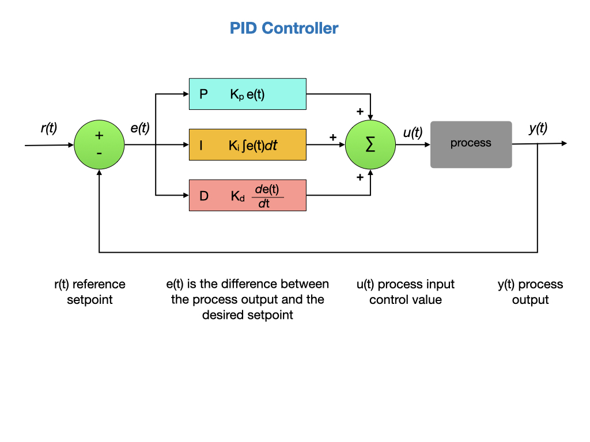

# Classical Control
Control Theory deals with the question of "How do we get a system to do what we want"?  For robotic systems that normally means how do we move it, or one of its subsystems, from one position to another?  In the [Geometry](../Dynamics/geometry.md) section we descibed the *Pose* of an object, which is the position and orientation of an object in 2D and 3D space.  For robotic systems we are concerned with how we can ensure a smooth transition from one pose to another.  Or more technically, how can we get the pose of the system to change as a function of time. Our primary mechanism for doing that is the PID Controller, which is a commonly used feedback controller.  For a good overview of PID control watch the video [Understanding PID Control - Part 1](https://www.youtube.com/watch?v=wkfEZmsQqiA&list=PLn8PRpmsu08pQBgjxYFXSsODEF3Jqmm-y&index=1&ab_channel=MATLAB) by Brian Douglas.

A detailed diagram of a PID controller is shown below.  To understand each of the components of this diagram read the [Introduction to PID](https://docs.wpilib.org/en/stable/docs/software/advanced-controls/introduction/introduction-to-pid.html) section of the FRC documentation.  

## The PIDController Class
With the above PID diagram in mind, let's take a look at the *PIDController* class supplied by the WPI library.  The key part of this class is the `calculate()` method that computes the PID value used to control the system.  You'll find this method at around line `312` of the *PIDController* class.  

Let's start on the left side of the above diagram.  The current measument of the the system is passed to the method and is subtracted from the setpoint to come up with the position error.  A check is made in case the measurement input wraps around such as in the case of gyro wrapping at 360 degrees.  The position error will be multiplied by the **Proportional** value.

    public double calculate(double measurement) {
      m_measurement = measurement;
      m_prevError = m_positionError;

      if (m_continuous) {
        m_positionError =
            MathUtil.inputModulus(m_setpoint - measurement, m_minimumInput, m_maximumInput);
      } else {
        m_positionError = m_setpoint - measurement;
      }

We now have to calculate the output, staring with the **Derivative** part.  A derivative is the rate of change of the system as a function of time, so we compute how much the error has changed since the last time the `calculate()` method was called.  The command is running within the robot's process loop, which cycles 50 times per second.

    m_velocityError = (m_positionError - m_prevError) / m_period;

Next, we move onto the **Integral** part.  An integral is an accumulator that adds up all of the positional errors.  This value is clamped to avoid an effect called "integral windup".  Watch the video [Understanding PID Control, Part 2](https://www.youtube.com/watch?v=NVLXCwc8HzM&list=PLn8PRpmsu08pQBgjxYFXSsODEF3Jqmm-y&index=2&ab_channel=MATLAB) to understand "integral windup".

    if (m_ki != 0) {
      m_totalError =
          MathUtil.clamp(
              m_totalError + m_positionError * m_period,
              m_minimumIntegral / m_ki,
              m_maximumIntegral / m_ki);
    }

Finally, we multiple all of the errors by their respective PID values and add the results.  This become our new PID output value that goes to power the motors:

    return m_kp * m_positionError + m_ki * m_totalError + m_kd * m_velocityError;

Here's the full `calculate()` method.

    public double calculate(double measurement) {
      m_measurement = measurement;
      m_prevError = m_positionError;

      if (m_continuous) {
        m_positionError =
            MathUtil.inputModulus(m_setpoint - measurement, m_minimumInput, m_maximumInput);
      } else {
        m_positionError = m_setpoint - measurement;
      }

      m_velocityError = (m_positionError - m_prevError) / m_period;

      if (m_ki != 0) {
        m_totalError =
            MathUtil.clamp(
                m_totalError + m_positionError * m_period,
                m_minimumIntegral / m_ki,
                m_maximumIntegral / m_ki);
      }

      return m_kp * m_positionError + m_ki * m_totalError + m_kd * m_velocityError;
    }

## Feedforward
<!-- Kelly 7.1.4.... -->
*Feedforward* is used to generate the control that would drive the robot to its reference setpoint if executed in *Open Loop*.  Compare this to *Feedback*, that is used to compensate for disturbances and is more of a reactionary measure.  With purely Feedback control the system won’t start applying control effort until the system is already behind. Feedforward tells the controller about the desired movement and required input beforehand, which makes the system react quicker and allows the Feedback controller to do less work. A controller that feeds information forward into the plant like this is called a *Feedforward controller*. 

There are two types of Feedforward, *model-based* feedforward and feedforward for *unmodeled dynamics*. 

- Model-based feedforward solves a mathematical model of the system for the inputs required to meet desired velocities and accelerations.  This is commonly done in [State Space Control](stateSpaceControl.md).

- Unmodeled dynamics compensates for unmodeled forces or behaviors directly so the feedback controller doesn’t have to.

*Feedforward* is measured in voltage. Specifically, we want to know how much voltage to apply to the motors to get it to move at a certain speed.  For example, if we want to move at 0.2 meters/sec then we may apply 4.7 volts.  A faster speed, say 0.5 meters/sec, may require 6.2 volts. The feedforward controller does this calculation for us. The feedforward controller is initialized with voltage gains:

- kS inertia gain volts
- kV velocity gain volts per (meter per second)
- kA acceleration gain volts per (meter per second squared)

These are obtained from running the robot characterization tool.

You may have noticed that we rarely use the *Integral* part of the PID controller.  The Integral part, which uses past information, can be replaced with FeedForward control.  Review the [Feedforward Control in WPILib](https://docs.wpilib.org/en/stable/docs/software/advanced-controls/controllers/feedforward.html#feedforward-control-in-wpilib) documentation for how to use Feedforward in you code. 

## References
- Video - [Everything You Need to Know About Control Theory](https://resourcium.org/journey/companion-resources-everything-you-need-know-about-control-theory) by Brian Douglas.

- Video Resource - [Control Theory](https://engineeringmedia.com/videos) by Brian Douglas.

- FRC Documentation - [Control Systems](https://docs.wpilib.org/en/stable/docs/software/advanced-controls/introduction/control-system-basics.html)

- FRC Documentation [PID Introduction Video by WPI](https://docs.wpilib.org/en/stable/docs/software/advanced-controls/introduction/pid-video.html)

- FRC Documentation - [PID Basics](https://docs.wpilib.org/en/stable/docs/software/advanced-controls/introduction/index.html)

- FRC Documentation - [PID Control through PIDSubsystems and PIDCommands](https://docs.wpilib.org/en/latest/docs/software/commandbased/pid-subsystems-commands.html#)

- Tyler Veness [Controls Engineering in the
FIRST Robotics Competition](https://file.tavsys.net/control/controls-engineering-in-frc.pdf) Chapter 6

- Alonzo Kelly [Mobile Robotics](https://www.cambridge.org/core/books/mobile-robotics/5BF238489F9BC337C0736432C87B3091) Chapter 7.1
