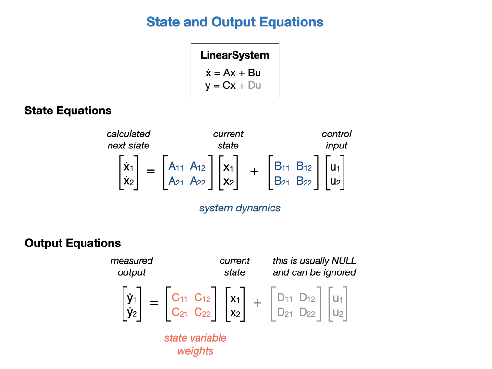

# State Space Control
*State Space Control* is based on the idea that if you know the internal physics of your system and can predict how it’ll react to a given input then you can tune the system in a way that’s similar to tuning PID controllers. State Space Control tries to control the system by developing an accurate model of the system that we are trying to control.  It can be an alternative to PID control and is more flexible.  PID control does not use any knowledge of the internal physics of the system and therefore allows only limited control.  State Space control does require an initial state of the system, which is not required with PID control.

State Space Control starts with a *State Space Model* that describes the relationship between input and output. This is also referred to as the *Dynamic Model*. The state of a dynamic system refers to a minimum set of variables, known as state variables, that fully describe the system and its response to any given set of inputs. The basic idea is that each distinct situation for the world is called a state, denoted by `x`, and the set of all possible states is called a State Space `X`.

<!-- 
In particular a state-determined system model has the characteristic that:

`A mathematical description of the system in terms of a minimum set of variables *xi(t)*, *i* = 1,..., *n*, together with knowledge of those variables at an initial time t0 and the system inputs for time *t ≥ t0*, are sufficient to predict the future system state and outputs for all time *t>t0*.` -->

<!-- This definition asserts that the dynamic behavior of a state-determined system is completely characterized by the response of the set of n variables *xi(t)*, where the number *n* is defined to be the order of the system. -->

Rather than use an arbitrary *Proportional* gain derived through testing, you'll need to develop an accurate physical model of the Drivetrain (system) and then use it to pick gains for the feedback controller.  This allows you not only to predict ahead of time how a system will react but also test the controllers without a physical robot.

WPILib provides code libraries used for state space control that are described in the [State Space Controllers](https://docs.wpilib.org/en/stable/docs/software/advanced-controls/state-space/state-space-intro.html) section of the FRC documentation.  As you can see from the above diagram, there are three main components for creating a State Space controlled system with WPILib, a *Linear System*, a *Kalman Filter*, and a *Linear Quadratic Regulator* LQR.  These components are placed in a *Linear System Loop* to drive the robot.

Refer to the references below for a more in-depth explaination of the topic.  The following brief overview should be enough to get you started on writing programs based on State Space.

## State and Output Equations
State equations are represented in a vector form, in which the set of *n* state variables is written as a state vector *x* , and the set of inputs is written as an input vector *u* . Each state variable is a time varying component of the column vector *x*.  The system dynamics are described by the **A** and **B** matricies.  The **A** matrix descibes how the system will act if no force is applied. The **B** matrix describes how our input will change the state.

A system output is defined to be any system variable of interest. A description of a physical system in terms of a set of state variables does not necessarily include all of the variables of direct engineering interest. In the output equation *y* is a column vector of the output variables, **C** is a matrix of the constant coefficients that weight the state variables, and **D** is a matrix of the constant coefficients that weight the system inputs. For many physical systems the matrix D is a null matrix, and the output equation reduces to just *y = Cx*.

An important property of the linear state equation description is that all system variables may be represented by a linear combination of the state variables **x** and the system inputs **u**.

## The LinearSystem Class
In control theory the system that we're modelling is called the *Plant* or *System*.  To setup a system with the WPI Libraries you create a *LinearSystem*.  In our case we're going to model a Drivetrain system that will have the left and right wheel velocities as its system dynamics, the **A** matrix.  The input to the system will be the voltage to the left and right motors and that will be descibed by the **B** matrix.  The **C** matrix weights our measured outputs *y*, which we'll just pass through unchanged so multiple by 1.  We won't use the **D** matrix at all so everything is set to zero.  The job of the *LinearSystem* class is to calculate the next state of the system.  This state can be measured by sensors as our observed outputs.  These measured outputs can be used as feedback to determine the next required inputs.

More information on the notation used can be found in the  [State Space Notation](https://docs.wpilib.org/en/stable/docs/software/advanced-controls/state-space/state-space-intro.html#what-is-state-space-notation) section of the FRC documetation.

## Kalman Filter
After creating a model of our Linear System we'll need to create a Kalman Filter.  There are entire books written on these filters but an overview of their use and function can be found in the [Kalman Filters](../../Concepts/OptimalEstimation/kalmanFilters.md) section of this training guide.

## Linear Quadratic Regulator (LQR)
Linear Quadratic Regulators work by finding trade-off that drives our system to its desired setpoint while using the minumum control effort. For example, a spaceship might want to minimize the fuel it expends to reach a given reference, while a high-speed robotic arm might need to react quickly to disturbances and reach the setpoint quickly.  To get an overview of [Linear Quadratic Regulators](https://docs.wpilib.org/en/stable/docs/software/advanced-controls/state-space/state-space-intro.html#the-linear-quadratic-regulator) see the FRC documentation or read the [LQR](../../Concepts/Control/LQR.md) section of this training guide.

## Linear System Loop
The *LinearSystemLoop* class constructs a state-space loop with the given plant, controller, and observer.

<!-- ## State Space Control Lab
Add a LinearSystem for the Drivetrain to the *Constants* file. 

    public static final LinearSystem<N2, N2, N2> kDrivetrainPlant =
            LinearSystemId.identifyDrivetrainSystem(kvVoltSecondsPerMeter, 
                                                    kaVoltSecondsSquaredPerMeter, 
                                                    kvVoltSecondsPerRadian, 
                                                    kaVoltSecondsSquaredPerRadian); -->

<!-- Document project *SimpleDifferentialDriveSimulation* project. Specifically, the *DifferentialDrivetrainSim* class.                                                     -->
<!--  -->

## References
- FRC Documentation [State Space Controllers](https://docs.wpilib.org/en/stable/docs/software/advanced-controls/state-space/state-space-intro.html)

- Tyler Veness [Controls Engineering in the
FIRST Robotics Competition](https://file.tavsys.net/control/controls-engineering-in-frc.pdf) Chapter 6.

- MIT [State-Space Representation of LTI Systems](http://web.mit.edu/2.14/www/Handouts/StateSpace.pdf)

- MATLAB [State Space Control](https://www.youtube.com/playlist?list=PLn8PRpmsu08podBgFw66-IavqU2SqPg_w)

- MATLAB [Robust Control](https://www.youtube.com/playlist?list=PLn8PRpmsu08qFLMfgTEzR8DxOPE7fBiin)

- FRC Documentation - [State-Space and Model Based Control with WPILib](https://docs.wpilib.org/en/stable/docs/software/advanced-controls/state-space/index.html)

- Alonzo Kelly [Mobile Robotics](https://www.cambridge.org/core/books/mobile-robotics/5BF238489F9BC337C0736432C87B3091) Chapter 7.2
