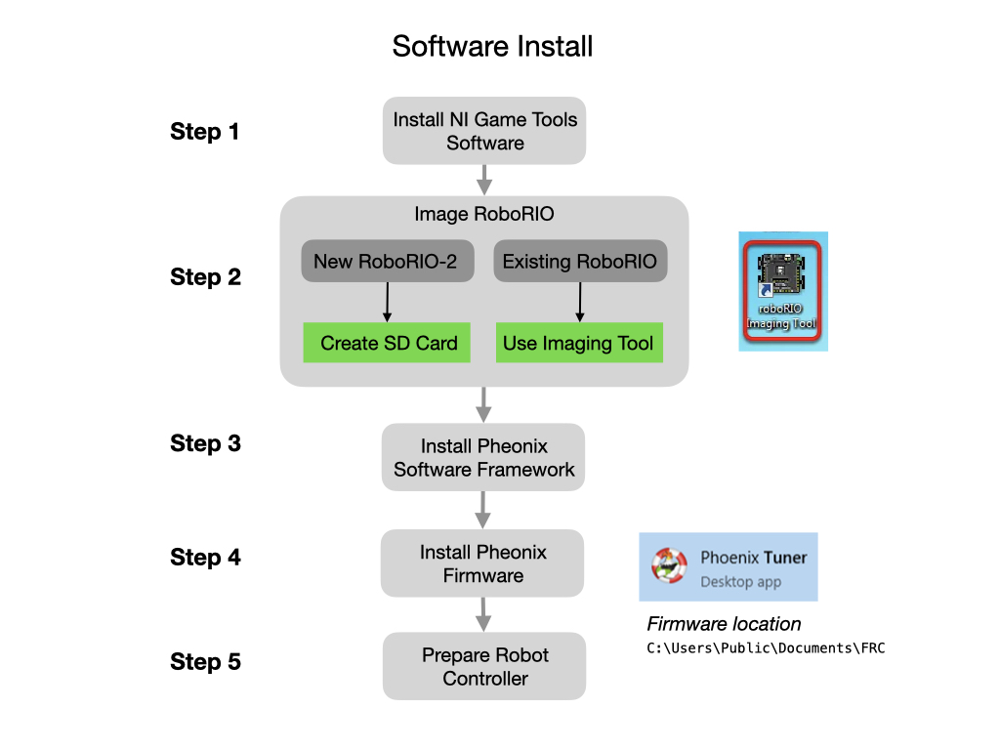

# Control Algorithms
Members of the programming team are primarily tasked with writing algorithms that control the robot.  This is the most heavily researched areas of robotics with a high demand of skilled programmers, especially those who understand robotic systems. To get an understanding of robot programming it's helpfull to try and categorize the algorithms into their functional areas.

A robot receives input from two sources; a **user interface** that sends it commands, and the **sensors** that perceive the environment around it.  Once the input is received the robot has to plan an action to perform and send **control** signals to it's actuators to carry out that action.  Input coming in from sensors must first be passed through the **perception** stack before it goes onto the **planning** algorithms. This is because sensors produce very large amounts of raw data that is coming in at a fast rate.  The robot has to make sense of that data in order to determine its state.  The **power management** stack monitors the battery status and current draw of the system.

A critical piece of information that a robot would get from its sensors is <i>"Where am I?"</i> and <i>"What is my orientation?"</i> the representation of this in robotics is called a <i>Pose</i>.  The process of determining the robots' <i>Pose</i> is called <i>**Localization**</i>. As the robot moves is needs to ensure that is <i>**Tracking**</i> on its intended path. Localization and tracking are the primary components that represent the robots' state.  

The perception algorithms can get vast amounts of raw data coming in from its sensors much of which may not be useful for determining its state.  The raw sensor data may need to be passed through **Filtering** routines to extract the pertinent information. Filtering is used to remove noise from the system and limit the rate of the data flow among other things. Another critical component of the perception stack is to **detect** objects and **classify** them in a meaningful way. 

**Prediction** takes in past and current information and predicts what will happen in the future.  This is done using <i>Kalman Filters</i>, which is a large subject area. There is more infomation about Kalman Filters and filters in general in the [WPI Documentation](https://docs.wpilib.org/en/latest/docs/software/advanced-controls/filters/introduction.html). **Path Planning** and **Trajectory Planning** is concerned with getting the robot from where it is now to where it needs to be.  A path is a set of waypoints from one location to another whereas a trajectory indicates the time at which the robot should reach each waypoint and the velocity at which it should be travelling. Similar to the real world, the robot may use a map to assist the path planning process. There may also be a set of **Recovery Routines** in order to account for unexpected situations that the robot may encounter on the way to its goal.

Finally, in order for the robot to communicate with a User Interface, and for the onboard devices to communicate with each other, there are a number of **Networking Protocols** that programmers will need to understand.  In <i>First Robotics</i>, the primary networking protocol between devices is <i>CAN</i>.

## Robot Software Design 
Robots generally implement the following design pattern where it receives external commands to control actuators that interact with the physical world.  They use sensors to provide feedback, or system state, that helps direct them towards their goal.  

The software code should be organized to reflect this design pattern.  All subsystems need to be initialized, a process sometimes referred to as *Bring-up*. The *Initialization* section will include the subsystem's class constructor.  The code can be further sectioned into *Input Control, Feedback Control*, and *System State* to implement the design pattern. Note that not all subsystems will include all of these sections. For instance, an IMU may only include the *Bring-up* and *System State* sections.  During the testing phase, prior to getting a physical robot, there's a lot of reliance on simulation, which can be provided its own section.

## FRC Control Hardware
The [NI-roboRIO](https://docs.wpilib.org/en/stable/docs/software/roborio-info/roborio-introduction.html#roborio-introduction) is the main robot controller used for FRC. The roboRIO serves as the “brain” for the robot running team-generated code that commands all of the other hardware.  Prior to using the **RoboRio** you have to install, or update, the software stack.  Here are the components that need to be installed.

Here is a step-by-step guide for accomplishing the install.

#### Step 1. Install the FRC Game Tools
The first step is to [Install the FRC Game Tools](https://docs.wpilib.org/en/stable/docs/zero-to-robot/step-2/frc-game-tools.html).  These can be down loaded from the [NI FRC Game Tools](https://www.ni.com/en-us/support/downloads/drivers/download.frc-game-tools.html#440024) releases site, and only supports Windows.  After the install it asks you to login to your **NI Activation** account and enter a serial number.  It's not clear why you need the account, but here's information on [getting the serial number](https://knowledge.ni.com/KnowledgeArticleDetails?id=kA00Z0000019OJTSA2&l=en-US).  Once you have the serial number you can use the [Activation Wizard](https://docs.wpilib.org/en/stable/docs/zero-to-robot/step-2/labview-setup.html#ni-activation-wizard).  

Installed tools include:
The RobiRIO Imaging Tool
FRC Driver Station
FRC Utilities

#### Step 2. Image the RoboRio
[Imaging the RoboRio](https://docs.wpilib.org/en/stable/docs/software/roborio-info/roborio2-imaging.html) involves installing the firmware and the equivalent of the operating system. The first time a roboRIO 2 is imaged (or if the microSD card is replaced with a new card), it must be imaged using the [roboRIO 2.0 microSD](https://docs.wpilib.org/en/stable/docs/software/roborio-info/roborio2-imaging.html) card imaging process. If the RoboRio has already been imaged from a previous year and already has an SD card inserted then proceed as follows.

This step sets up the [RoboRIO Web Dashboard](https://docs.wpilib.org/en/stable/docs/software/roborio-info/roborio-web-dashboard.html#roborio-web-dashboard), which is a webpage built into the roboRIO that can be used for checking status and updating settings of the roboRIO. 

Open the **RoboRIO Imaging Tool** and [follow these instructions](https://docs.wpilib.org/en/stable/docs/zero-to-robot/step-3/imaging-your-roborio.html#roborio-imaging-tool).  

#### Step 3. Install Phoenix Framework Software

Install the [Phoenix Framework Software](https://store.ctr-electronics.com/software/) onto your PC.  This framework is only supported on Windows and includes:
- The C++/Java Phoenix API.  These libraries get installed into the ~/wpilib/20XX directory. For Linux and MacOS the C++/Java API can be installed separatelly.  See [VSCode Installing Pheonix Software](../../Tools/vscode.md#pheonix).
- Device Firmware Files (that were tested with the release)
- CTRE Support of RobotBuilder
- Phoenix Tuner
- Installs Phoenix Diagnostics Server into the RoboRIO (needed for CAN diagnostics).
- Plotter/Control features
- Self-test Snapshot
- Device ID and field-upgrade

#### Step 4. Install Phoenix Firmware
Once you have the **Phoenix Tuner** installed you can install/update the firmware on the CTRE hardware devices.  The firmware can be found in `C:\Users\Public\Documents\FRC`.  Or can be downloaded from the [Phoenix Framework Software](https://store.ctr-electronics.com/software/) releases page.  The firmware is documented in the [Firmware Release Notes](https://docs.ctre-phoenix.com/en/stable/ch22_SoftReleaseNote.html#ch22-softreleasenote).

Start the [Phoenix Tuner](https://docs.ctre-phoenix.com/en/stable/ch05_PrepWorkstation.html#frc-windows-open-phoenix-tuner). Refer to the [Field Upgrade Devices](https://docs.ctre-phoenix.com/en/stable/ch08_BringUpCAN.html#field-upgrade-devices) section of the CTRE documentation.

#### Step 5. Prepare the Robot Controller

If no FRC Robot Application has been deployed to the RobiRIO then deploy the *Temporary Diagnostic Server* from the Phoenix Tuner.  Refer to [How to prepare Robot Controller](https://docs.ctre-phoenix.com/en/stable/ch06_PrepRobot.html#how-to-prepare-robot-controller).

## Joysticks
Information on [Joysticks](https://docs.wpilib.org/en/stable/docs/software/basic-programming/joystick.html)

## Programming the Radio
Information on [Programming your Radio](https://docs.wpilib.org/en/stable/docs/zero-to-robot/step-3/radio-programming.html)

<!-- ## Real Time Operating Systems (RTOS)
Explain a general purpose operating system...

Explain a typical micro processor operating system...

Explain a real time operating system...

 -->

## References
