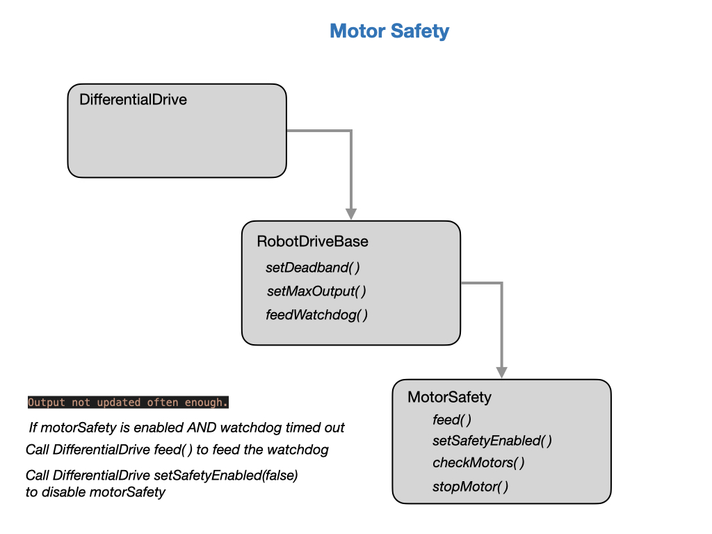

# Drivetrains

### Motor Safety
In FRC The class *MotorSafety* is called from the *DifferentialDrive* class to ensure the safe operation of the drivetrain. ...

`Output not updated often enough.`

- If motorSafety is enabled AND watchdog timed out
- Call DifferentialDrive feed( ) to feed the watchdog.
- Call DifferentialDrive setSafetyEnabled(false) to disable motorSafety

## References
