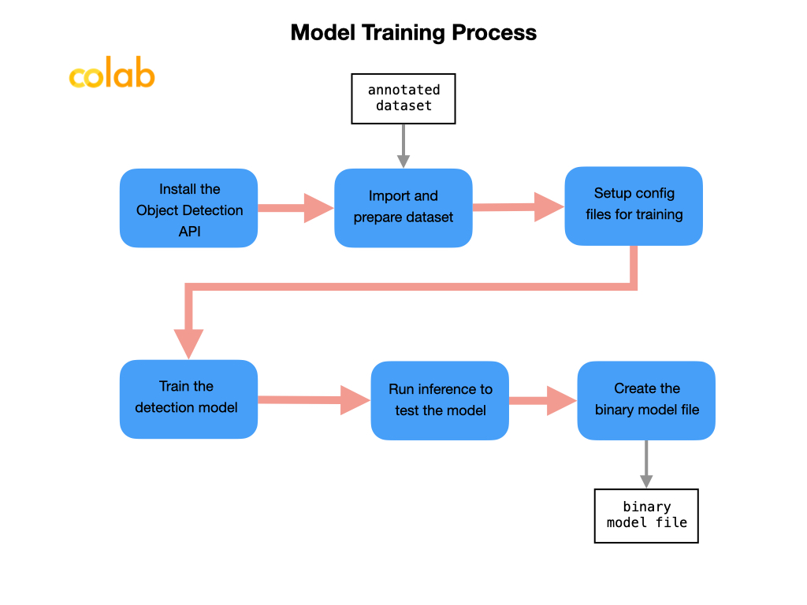
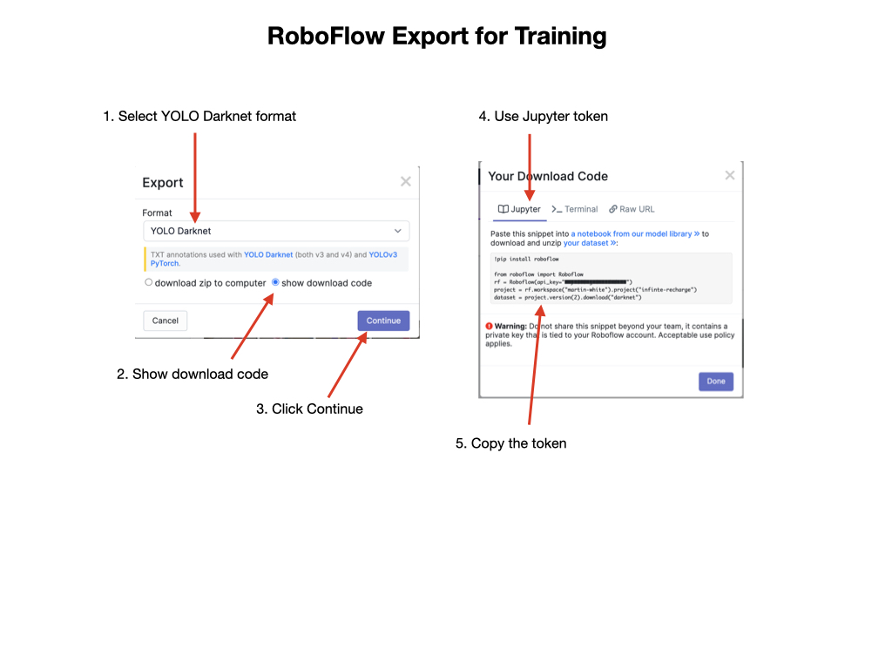
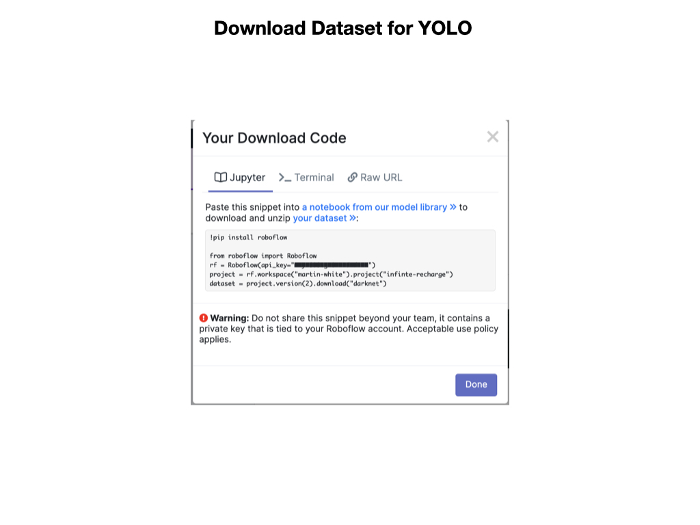

# Training a Model in Colab
Once you have a dataset of the images that you're happy with it can be used to train a detection model. A detection model is used to identify objects of interest in the field-of-view of the camera.  The model will be trained to recognize these objects, for example, the red and blue balls in the Rapid React competition.  The trained model will be deployed to *Single Board Computer (SBC)* such as a Raspberry Pi or Jetson Nano for competition.

In order to deploy a model on the competition robot it can be trained using *Google Colab*.  Google Colab uses Jupyter Notebooks that are run directly Google's online servers.  The Colab platform has GPU processors available that significantly speed up the training process.  Colab is free to use, which makes it a good option since it can be expensive to setup a comparable training environment on a PC.

Make sure that you're familiar with how Google Colab works. For a quick introduction watch this [Google Colab](https://www.youtube.com/watch?v=RLYoEyIHL6A&ab_channel=CodewithDogaOzgon) YouTube video. Also see the [Basic operations in Colaboratory notebook](https://colab.research.google.com/github/pycroscopy/AICrystallographer/blob/master/Tutorials/ColabNotebooks_BasicOperations.ipynb#scrollTo=hkcI78C4Sybk) tutorial page.

You can use various model types for training.  You need a model that's very fast at processing the streamed video coming from your robot's camera.  Two of the most popular models for this are *Yolo Darknet* and *SSD MobilNet*. During the training process you'll import your annotated dataset, train the model, and validate it.  The end result will be a binary file that you'll need to deploy to your target platform.

In order to train our models we use Jupyter Notebooks that are run on the Google Colab online server.  Here are the Roboflow notebooks that can be used to train each of the model types:

- [YoloV4 Tiny Darknet](https://colab.research.google.com/drive/1PWOwg038EOGNddf6SXDG5AsC8PIcAe-G#scrollTo=Cdj4tmT5Cmdl)

- [SSD MobileNet](https://colab.research.google.com/drive/1wTMIrJhYsQdq_u7ROOkf0Lu_fsX5Mu8a)

The first thing to do once the notebook loads in Colab is to save a copy of it into your Google Drive. At the top left of the Colab page go to **File -> Save a copy in Drive**.  Once the copy is created you should rename it, i.e. you might change `Copy of Roboflow-TensorFlow2-Object-Detection.ipynb` to `Rapid-React-Roboflow-TensorFlow2-Object-Detection.ipynb`.

When you execute the first cell it will allocate a GPU for you. You should try and complete all of the training steps in a single session.  If your page is inactive for more than an hour the session will disconnect and you will have to start over.  Once you have the Colab notebook loaded it will guide you through the steps to train, validate, and export the model.  The next sections will walk you through the training process for the *SSD MobileNet* and *Yolov4 Tiny Darknet* models.  

## Training an SSD MobileNet Model

### Installing the Tensorflow Models and API

- Install the Tensorflow models from the Model Zoo

- Install the Object Detection API

### Import the Annotated Dataset

### Setup Configuration Files for Training

### Train the Model

### Run Inference to Test the Model

### Save the Model
A SavedModel contains a complete TensorFlow program, including trained parameters (i.e, tf.Variables) and computation. It does not require the original model building code to run, which makes it useful for sharing or deploying with TFLite

## Training a Yolo Model

### Install the Darknet API 
This requires three steps:

- Configure a GPU environment on Google Colab

- Install the [Darknet](https://github.com/pjreddie/darknet) YOLOv4 training environment.  The darknet software is cloned from GitHub and then compiled.  After install you'll see the `darknet` directory structure in the *Files* sidebar menu.

- Download the YOLOv4 *Convolution Network* weights. These weights are the starting point for training the model.  We will be using [Transfer Learning](https://en.wikipedia.org/wiki/Transfer_learning), which is a machine learning method where a model developed for a task is reused as the starting point for a model on a related task.

### Import the Dataset
In order to train the dataset in Colab it has to be exported to a format compatible with the training model.  In our case, we'll be using the YoloV4 training model, so we'll export it in *YOLO Darknet* format. The export process generates a `.txt` file along with each image that describe the bounding boxes and the label identifier. The txt file will have the same name as the image and contains one line per bounding box.

Once the export is complete you will be displayed a token that can be used to import the dataset into Colab.

Download your custom dataset for YOLOv4 and set up directories. This is where you get your dataset from Roboflow into the Colab notebook.  Copy the export key from the Roboflow export and paste it into the notebook.  Your key should look something like this:

        !pip install roboflow

        from roboflow import Roboflow
        rf = Roboflow(api_key="yourkey")
        project = rf.workspace("your-name").project("rapid-react")
        dataset = project.version(2).download("darknet")

The next step sets up training file directories for your custom dataset.

### Setup Configuration Files for Training
The weights file for YoloV4-tiny is downloaded in order to generate a custom training configuration file for Darknet.

Next, we write a specialized training configuration file based on our type of an object detection model. The configuration file contains a set of parameters for the training process. These parameters are customized for your dataset that will contain good default values so there shouldn't be much need to change them.

### Train the Model
The next step is to train a custom YOLOv4 object detector.

As the training progresses files with the suffix `.weights` will show up in the `darknet/backup` directory.  As soon as you have a file with a name of `<dataset>_best.weights` you can stop the training process.

### Run Inference to Test the Model
The process of validating an image with a model is called *Inference*. This step will load the YOLOv4 trained weights and do inference on the validation image set. 

## Saving the Model
When you are satisfied with the model's testing results you can convert it to a file format that's suitable for your deployment platform. 

## Training Model in Roboflow
 During the testing phase you can train and validate your model in *Roboflow*. To train a model in Roboflow watch the [Training](https://www.youtube.com/watch?v=njWwmKLWVyE)  YouTube Video and read the [Train](https://docs.roboflow.com/train) documentation. Once you have a trained model it can be validated directly on the Roboflow site by uploading a test image. It's very important that the test image was never used in the training or validation set.  

To validate, go to the **Versions** section of your Roboflow account, select an image of the objects that you want to run inference on and upload it to the site.  If your model is properly trained you should see bounding boxes around the objects of interest.

See the next section on [Testing the Model](MLDesktopTesting.md) for more testing options.

## Next Steps

## Desktop Deployment

In order to make the training and validation workflow more efficient it's useful to have a desktop enviroment setup into which you can plug the OAK-D camera.  Here is a list of options that you can employ for that purpose.

[Desktop Deployment Options](MLDesktopDeployment.md)

## References
- Roboflow Blog [How to Train YOLOv4 on a Custom Dataset](https://blog.roboflow.com/training-yolov4-on-a-custom-dataset/)

- Roboflow [Training](https://www.youtube.com/watch?v=njWwmKLWVyE) - Youtube Video

- [Google Colab](https://www.youtube.com/watch?v=RLYoEyIHL6A&ab_channel=CodewithDogaOzgon) - YouTube Video

- Roboflow [Computer Vision Model Library](https://models.roboflow.com) - Colab Notebooks

- Thomas Gamauf - [Tensorflow Records? What they are and how to use them](https://medium.com/mostly-ai/tensorflow-records-what-they-are-and-how-to-use-them-c46bc4bbb564)

