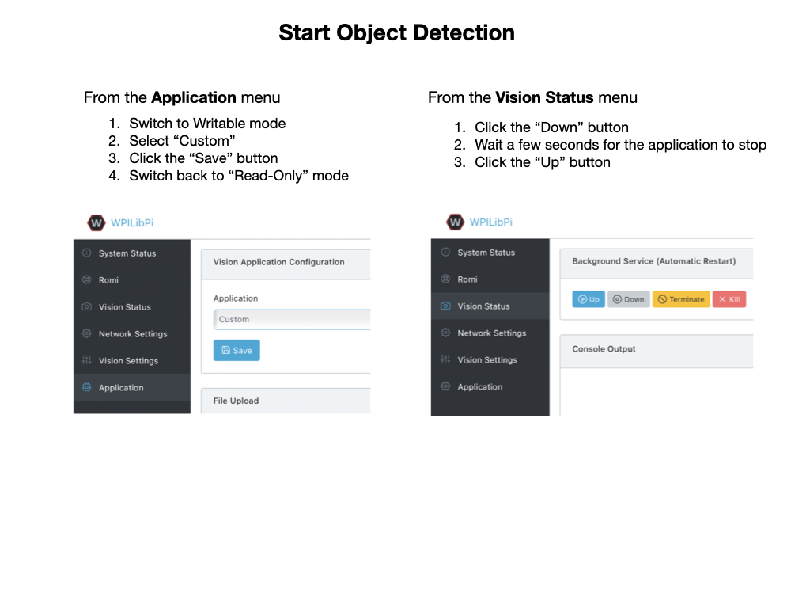

# Deploying the Model
This section shows how to deploy the detection model using an [OAK-D](https://shop.luxonis.com/products/1098obcenclosure) camera provided by [Luxonis](https://www.luxonis.com/).  Luxonis has detailed documentation for its [Depthai](https://docs.luxonis.com/en/latest/) software.  The OAK-D is a powerfull depth camera with an on-board processor that removes the need to have a **Coral TPU** attached to the Raspberry Pi.

The model will be deployed on a Raspberry Pi4 using the [WPILibPi](https://github.com/wpilibsuite/WPILibPi/releases) Romi image.  There are two images, one is used for *Vision* that you would use on a competition robot, and the other is for the *Romi* robot.  The Romi image has everyting that the Vision image has but also includes additional software to operate the Romi. For instructions on installing the Romi image go to [Imaging your Romi](https://docs.wpilib.org/en/stable/docs/romi-robot/imaging-romi.html) on the FRC Documentation site. I recommend that you use the Romi image since it is easier to install additional software on.  You can just login using `ssh pi@wpilibpi.local` with password `raspberry` as soon as the image boots up. 

Once the image is deployed you can proceed with the install of the OAK camera software that is required to do *Inference*.  We'll also deploy a python script to run the model and put the output into the *WPI Network Tables* and display the output to a Web URL.

## Installing the Depthai Software

The **Depthai** software is required in order to do inference on the Raspberry Pi.  The software must be installed natively (**don't** use the *pip virtualenv*) since the WPILib Network Tables are also used for the deployment.  

> Note: You'll require access to the internet to run the installation steps, so if your Romi is set up in Access mode then plug an ethernet cable into the Raspberry Pi. In Access mode you can login using `ssh pi@wpilibpi.local`.  If the Romi is set up in Bridge mode the an ethernet cable is not required. 

> Note: Make sure that the Romi file system is in Writable mode before running the installation.

Before installing the software make sure that `git` is installed using `git --version`.  The *Vision* image of `wpilibpi` does not include it by default.  To install git use `sudo apt install git`. Follow these steps to install the software:

- Install the dependencies: 

        sudo curl -fL https://docs.luxonis.com/install_dependencies.sh | bash

- Install the Depthai libraries:

        python3 -m pip install depthai

- Install the Depthai packages:

        git clone https://github.com/luxonis/depthai-python.git

- Install the Python package requirements:

        cd depthai-python/examples
        python3 install_requirements.py

- Create a script that triggers your computer to recognize the OAK camera when it's plugged in.

        echo 'SUBSYSTEM=="usb", ATTRS{idVendor}=="03e7", MODE="0666"' | sudo tee /etc/udev/rules.d/80-movidius.rules

- Run the device configuration script:

        sudo udevadm control --reload-rules && sudo udevadm trigger

- To test that the OAK-D camera is recognised, plug it in and run the following command.  You should get the output shown.  Make sure that you plug it into the USB3 input (blue port).

        lsusb | grep MyriadX
        Bus 003 Device 002: ID 03e7:2485 Intel Movidius MyriadX
      

        

## Deploying the Python Inferrence Script        
In order to run the OAK-D camera and display the detected objects you need to deploy a custom python script that is specific to the type of detection model that you want to deploy.  In our case, we're going to use the YoloV4 model.  The script will use a default model that detects various common objects and display the output to a Web URL. It'll also place information about objects that have been detected into Network Tables so a it can be used by your WPILib java program.

To deploy the script follow these steps:

- Clone the models and python scripts from GitHub:

        cd
        git clone https://github.com/FRC-2928/FRC-OAK-Deployment-Models.git

- Copy the runCamera script to the home directory.  This is used by the Romi WebUI to run the detection process:

        cp FRC-OAK-Deployment-Models/runCamera .

- Install the python package requirements:

        cd FRC-OAK-Deployment-Models/
        python3 -m pip install -r requirements.txt        

There is also a custom model that is supplied in the *FRC-OAK-Deployment-Models* package that detects the Rapid-React balls from the 2022 competition.  To use that model run the following commands:

        cd /home/pi
        cp FRC-OAK-Deployment-Models/custom.blog .
        cp FRC-OAK-Deployment-Models/custom_config.json .

The python script will first check in the user's home directory for a file named `custom.blob`, if it finds that file it will run that model instead of the default model.

## Run the Detection Script
You can now put the Romi back into Read-Only mode.  Plug the OAK-D camera into the USB 3 port (blue port).  It will need to be powered from the barrel jack, which will require an additional power source.

> Note: You must connect to the access point using the SSID and password of your Romi in order for the script to run and display the output. 

To start the object detection script go the the *Application* tab on the Romi WebUI, change the mode to *Writable*, and put the application in *Custom* mode.  Remember to click the *Save* button under the *Application* panel.  Then go to the *Vision Status* tab and click the *Down* button to stop any current running scripts.  Wait a few seconds and then click the *Up* button to start the object detection script.

The camera streamed output can be viewed from `10.0.0.2:8091`.  
> Note: The camera stream does not work from a Safari browser, use Chrome or Firefox.

### Start the Script from the Command Line
The inference python script can be run from the Raspberry Pi command line.  While connected to the Raspberry Pi access point, ssh pi@10.0.0.2 and then
from the `FRC-OAK-Deployment-Models` directory run:

        python3 tiny_yolo_wpi.py 

The output can be viewed at `10.0.0.2:8091`

## The Inference Script
This script connects to the OAK-D camera and streams images to the inference model.  If an object of interest is detected a bounding box is drawn on the image together with positional data.  The positional data is put into the Network Tables so as it can be made use of by your WPILib program.  The overlayed images can be viewed on a Web browser at `10.0.0.2:8091`.

The [python inference script](https://github.com/FRC-2928/FRC-OAK-Deployment-Models/blob/main/spacial_tiny_yolo_wpi.py) can be found on FRC-2928 GitHub account. 

## Desktop Deployment

In order to make the training and validation workflow more efficient it's useful to have a desktop enviroment setup into which you can plug the OAK-D camera.  Here is a list of options that you can employ for that purpose.

[Desktop Deployment Options](MLDesktopDeployment.md)

   

## References
- Luxonis [Depthai](https://docs.luxonis.com/en/latest/) software documentation
- Roboflow [Deployment](https://www.youtube.com/watch?v=f2d5YksgQsU) - Youtube Video