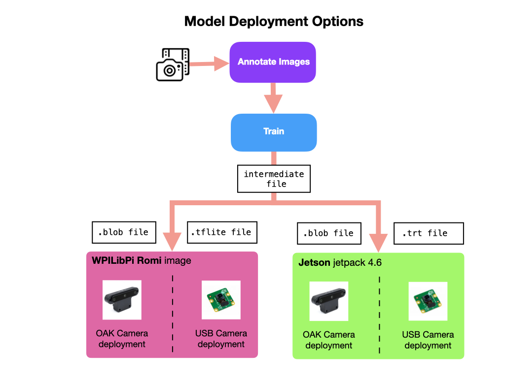

# Deploying the Model
Once you have trained a model you'll get an intermediate binary output file that represents the model's structure and its associated weights.  Binary data takes up less space and can be read much more efficiently from disk. This output file will need to be converted to another binary file format to further reduce its size making it more efficient to run on devices that have limited memory and GPU resources.  The final format depends on how the object detection application will be deployment.  The following sections will detail how to convert the intermediate file into the format required for each deployment scenario.

To run the model you'll need a python script to read the camera stream, employ the model, and out the results to a display. It also needs to put data into the FRC Network Tables for use by your WPI robot program.  This script is explained in the next section.

- [The Inference Script](MLRomiDeploymentScript.md)
- [OAK Camera Deployment for Raspberry Pi](MLRomiDeploymentOAK.md)
<!-- - [OAK Camera Deployment for Jetson Nano ](MLJetsonDeployment.md)
- [USB Camera Deployment for Raspberry Pi](MLRomiDeployment.md)
- [USB Camera Deployment for Jetson Nano](MLJetsonDeployment.md) -->

