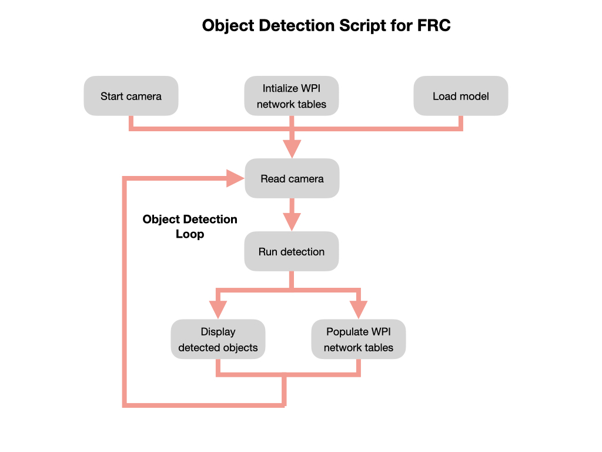
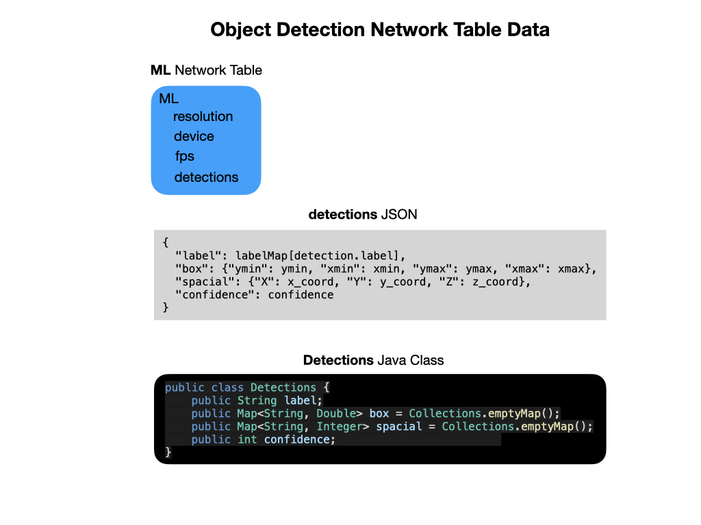

# The Inference Script Explained
Once we have an object detection model file for the target platform a python script must be deployed to run the inference.  The inference script follows the general flow pattern as seen in the next graphic.  The key addition is that we put data coming in from the inference pipeline into *Network Tables* for use in our WPI program.  The following sections will step you through each part of the script flow.

## Start the Camera
The cameras used for object detection fall into two broad categories.  There are simple USB cameras, which includes the Raspberry Pi camera. The Raspberry Pi camera is a *Camera Serial Interface (CSI)* device that defines an interface between a camera and a host processor. The purpose of this interface was to standardise the attachment of camera modules to processors for the mobile phone industry. This will sometimes be referred to as the *onboard* camera.  The USB camera is simply plugged into the USB port, as the name suggests.

The other category of cameras have intergrated CPUs and memory to process images prior to sending it to the host computer.  These will normally be depth cameras that are capable of providing spacial information about objects in their field-of-view (FOV). The most popular cameras in this category have included the *Kinect* and the *RealSense* devices.  However, both of these products are being discontinued so for this deployment we'll be using the  [OAK-D Stereo Depth Camera](https://shop.luxonis.com/products/1098obcenclosure) by Luxonis.

Depending on how you'll deploy object detection, the script must be capable of starting the appropriate camera.

## Intialize the Network Tables
We're going to want to do something with the data that comes in from the object detection pipeline, so we need a way to send it back to the robot.  For FRC, this is done using the Network Tables that are deployed on the camera connected host device, i.e. Raspberry Pi or Jetson Nano. The format of the data will be similar to the that shown in the following graphic.

## Load the Object Detection Model

## Run the Object Detection Loop

#### Displaying Output
Since we'll be running on the Raspberry Pi or Jetson Nano without a desktop GUI (headless mode) the data will need to be displayed via an MJPeg server. 

Running the MJPeg Server is the default mode of the script.  However, while testing you may also want to run the script on a PC or a the Jetson in desktop GUI mode.  For this purpose you can pass in the `--gui` parameter to display the output in a GUI window.

#### Populating the Network Tables
As mentioned above data coming in from the inference pipeline is put into the WPI Network Tables.  Most of this data is sent as a JSON string that must be parsed in by the WPI robot program.