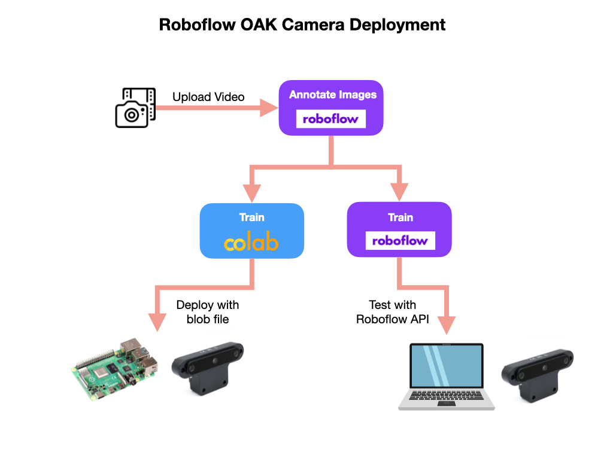

# Introduction to Machine Learning
**Machine Learning** is a powerful tool that can accomplish computational tasks that traditional algorithms cannot. In the FIRST Robotics Competition, machine learning can be used to detect game pieces, scoring locations, or even other robots.  In order to implement a machine learning model on an FRC robot you don't need to know a lot about the science behind it, but if you'd like to learn more a good starting point is Brendan Fortuner's [Machine Learning Glossary](https://ml-cheatsheet.readthedocs.io/en/latest/nn_concepts.html).  Also see an [Introduction to Machine Learning](https://docs.wpilib.org/en/stable/docs/software/wpilib-tools/axon/machine-learning.html) in the FRC Documentation. 

In order to implement a Machine Learning application we need to setup an efficient workflow. Creating a successful machine learning application is an iterative process that is continued until you have a satisfactory outcome.  This workflow will generally conform to the following set of processes:

- Collect and load images into an application for annotation.  The collection process will normally involve taking a video of the objects that you are interested in tracking.

- Annotating the images, which involves drawing bounding boxes around objects of interest and labelling them.

- Preprocessing and augmenting the images to increase the amount and variability of the training dataset.  

- Training a deep learning model and validating it against a validation dataset. Two commonly used deep learning models for object detection are *MobileNet* and *Yolo*.

- Placing the trained model in an environment where it can be easily tested using a camera stream or set of images.  

- Once we are satisfied with how the model performs it can be deployed to an edge device such as a robot.  The model is converted to format that has a small memory footprint that runs efficiently on the edge device.

- Finally we can use data coming from the trained model to control the robot.  

There are multiple ways to carry out the machine learning process.  FRC has a tool called [Axon](https://docs.wpilib.org/en/stable/docs/software/wpilib-tools/axon/introduction.html) that implements the training, testing, and exporting of the machine learning model. The model is then deployed to a Raspberry Pi using a [Coral USB Accelerator](https://coral.ai/products/accelerator) or a Jetson for real-time processing of the images. 

An alternative process, and the one that will be documented in the next sections, is to use the [Roboflow](https://roboflow.com) platform to upload video, annotate, preprocess, and augment the images in preparation for training. Once we have a good dataset of prepared images we'll use it to train a deep learning model.  For our example we'll a [Yolo](https://pjreddie.com/darknet/yolo/) model for training.  

We'll be using [Google Colab](https://colab.research.google.com/?utm_source=scs-index) to train the model.  The trained model can then be moved to a PC or your final deployment platform for testing.  At the end of the training process this document details the use of an [OAK-D Stereo Depth Camera](https://shop.luxonis.com/products/1098obcenclosure)  connected to a Raspberry Pi as our deployment platform.  This camera can be connected to your PC while testing.  The OAK-D camera has an onboard Tensor Processing Unit (TPU) that runs the model and processes the images before sending it to the Raspberry Pi. Most of these steps are still applicable if you have a different camera.  The only change will be the final model file format used for deployment.  For instance, if you're using a Raspberry Pi with a *Coral USB Accelerator* you will use a *Tensorflow Lite* model format.

The deployment process for *Roboflow*, *Google Colab*, with the *OAK-D Camera* and *Raspberry Pi* will be documented in the following sections.

- [Preparing the Image Dataset](MLProcessImages.md)
- [Training and Validating the Model](MLTraining.md)
- [Testing the Model](MLDesktopTesting.md)
- [OAK Camera Deployment for Raspberry Pi](MLRomiDeploymentOAK.md)
- [OAK Camera Deployment for Jetson Nano ](MLJetsonDeployment.md)
- [USB Camera Deployment for Raspberry Pi](MLRomiDeployment.md)
- [USB Camera Deployment for Jetson Nano](MLJetsonDeployment.md)
- [Machine Learning Based Control](MLControl.md)

## References
- FRC Documentation - [Axon](https://docs.wpilib.org/en/stable/docs/software/wpilib-tools/axon/introduction.html)

- Brendan Fortuner [ML Glossary](https://ml-cheatsheet.readthedocs.io/en/latest/nn_concepts.html)

- Deep Learning - [Video Playlist](https://www.youtube.com/playlist?list=PLZbbT5o_s2xq7LwI2y8_QtvuXZedL6tQU) - deeplizard

- Roboflow [OpenCV AI Kit Training Course](https://roboflow.com/course)

- OAK-D Camera [Luxonis](https://www.luxonis.com)

<!-- - Zebra Labs [ZebraVision 7.0](https://drive.google.com/file/d/1a6TjJwKlH-76vkAthQSiNZgopLMd_BW_/view) -->