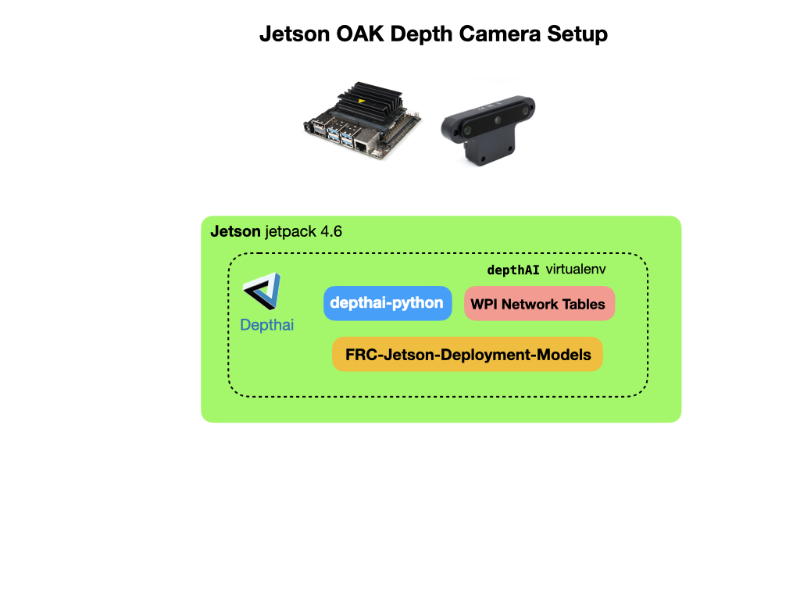
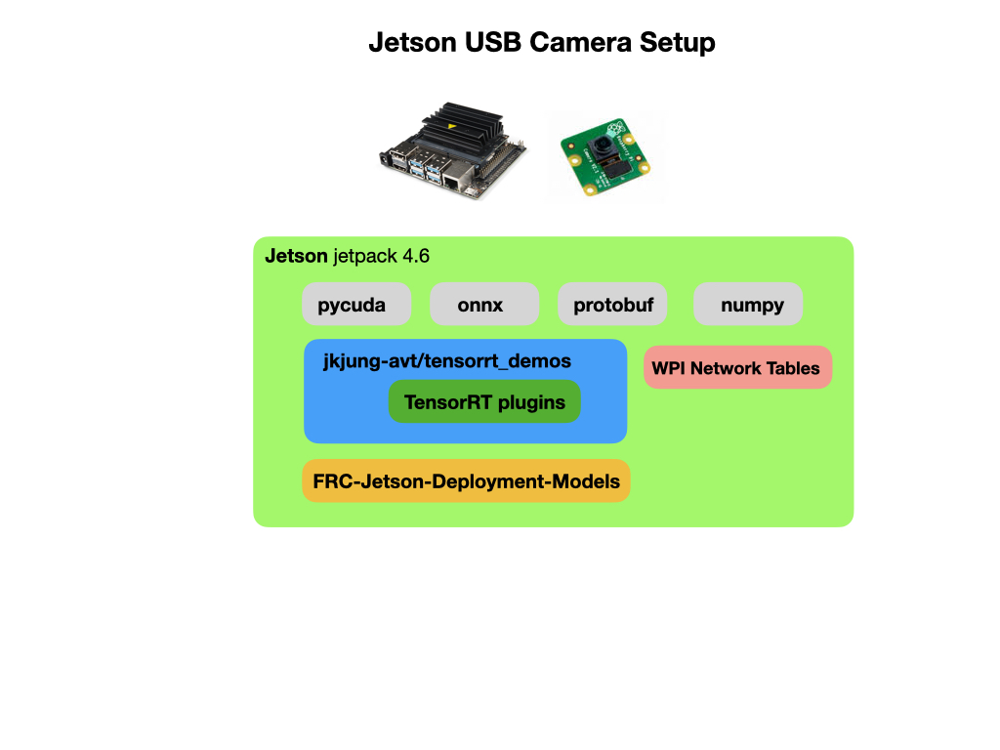

# Deploying to the Jetson Nano
This section shows two ways to run the Yolo model on the Jetson.  The first option uses the OAK camera with the Depthai software libraries.  The second option uses a raspberry Pi or USB camera.  Since the Jetson comes with a GPU this option has reasonable object detection speed.

## OAK Camera Deployment
This section details how to deploy the Yolo model on a Jetson Nano using the OAK camera with the Depthai software. 

To prepare for the install read the [Depthai Jetson Install](https://docs.luxonis.com/projects/api/en/latest/install/#jetson) on the Luxonis site.  This documentation shows you how to configure a 4GB swap space on your Jetson Nano and setup a python pip `virtualenv`.  If you already have your device setup with those options you can just follow the next steps.

Create a virtual environment.  The following command will create and put you into the virtual environment.  

    mkvirtualenv depthAI -p python3

Download and install the dependency package for the Depthai software:

    sudo wget -qO- https://docs.luxonis.com/install_dependencies.sh | bash

Clone the `depthai` github repository.  This example clones it in your $HOME directory:

    git clone https://github.com/luxonis/depthai-python.git
    cd ${HOME}/depthai-python

Edit your `.bashrc` with the following line:

    echo "export OPENBLAS_CORETYPE=ARMV8" >> ~/.bashrc

Install requirements:

    cd ${HOME}/depthai-python/examples
    python install_requirements.py    

Since we'll be using the Jetson with our program the WPI Network Table will need to be installed. 

    pip3 install pynetworktables    

### Installing the Detection Script        
In order to run the OAK-D camera and display the detected objects you need to deploy a custom python script that is specific to the type of detection model that you want to deploy.  In our case, we're going to use the `YoloV4-Tiny` model.  The script will use a default model that detects various common objects and display the output to a Web URL. It'll also place information about objects that have been detected into Network Tables so a it can be used by your WPILib java program.

To deploy the script follow these steps:

- Clone the models and python scripts from GitHub:

        cd ${HOME}/depthai-python/examples
        git lfs clone https://github.com/FRC-2928/FRC-OAK-Deployment-Models.git

- Install the python package requirements:

        cd ${HOME}/depthai-python/examples/FRC-OAK-Deployment-Models
        python3 -m pip install -r requirements.txt        

There is also a custom model that is supplied in the *FRC-OAK-Deployment-Models* package that detects the Rapid-React balls from the 2022 competition.  To use that model run the following commands:

        cd ${HOME}/depthai-python/examples
        cp FRC-OAK-Deployment-Models/custom.blog .
        cp FRC-OAK-Deployment-Models/custom_config.json .

The python script will first check in the user's home directory for a file named `custom.blob`, if it finds that file it will run that model instead of the default model.

### Running Inference
To run the demo package:

    cd ${HOME}/depthai-python/examples/FRC-OAK-Deployment-Models
    python spacial_tiny_yolo_wpi.py

The camera streamed output can be viewed from `<Your server IP address>:8091`.  
> Note: The camera stream does not work from a Safari browser, use Chrome or Firefox.

## USB/Pi Camera Deployment
Since the Jetson has a GPU we can use a regular Pi or USB camera to detect the objects of interest.  The deployment below uses Jetpack 4.6 as the base Jetson installation.  In order to run on the Jetson's CUDA GPU you need to convert the weights file, that was created when you trained the Yolo model, into a TensorRT file.  To setup the environment 

There are a few packages required to 

### Installing Required Packages
Install tensorrt_demos.  This set of demos is maintained by JK Jung.  See his [TensorRT YOLO For Custom Trained Models](https://jkjung-avt.github.io/trt-yolo-custom-updated/) blog post for more information.

    git clone https://github.com/jkjung-avt/tensorrt_demos.git
    cd ${HOME}/tensorrt_demos

Install pycuda:

    cd ${HOME}/tensorrt_demos/yolo
    ./install_pycuda.sh

Install protobuf by running this installation [script](https://github.com/jkjung-avt/jetson_nano/blob/master/install_protobuf-3.8.0.sh) or installing with pip:

    sudo pip3 install protobuf

Install onnx version "1.4.1" (not the latest version) of python3 "onnx" module. Note that the "onnx" module would depend on "protobuf". 

    sudo pip3 install onnx==1.4.1

Go to the "plugins/" subdirectory and build the "yolo_layer" plugin. When done, a "libyolo_layer.so" would be generated.

    cd ${HOME}/project/tensorrt_demos/plugins
    make

### Doing the Conversion

Convert weights file to ONNX:

    python3 yolo_to_onnx.py -m yolov4

Convert ONNX file to TensorRT:

    python3 onnx_to_tensorrt.py -m yolov4-416

### Running Inference
To run the inference using an attached Raspberry Pi camera.  

    cd ${HOME}/project/tensorrt_demos
    python3 trt_yolo.py --onboard 0 -m rapid-react -c 2

The `-c` parameter specifies the number of classes, in our case 2 (blueball, redball). To use a USB camera:

    python3 trt_yolo.py --usb 1 -m rapid-react -c 2

You could run trt_yolo_mjpeg.py headless like this:  

    python3 trt_yolo_mjpeg.py --usb 0 --copy_frame -m rapid-react

## References

- [Depthai Jetson Install](https://docs.luxonis.com/projects/api/en/latest/install/#jetson)

- [Tensorrt Demos](https://github.com/jkjung-avt/tensorrt_demos) - JK Jung Blog
