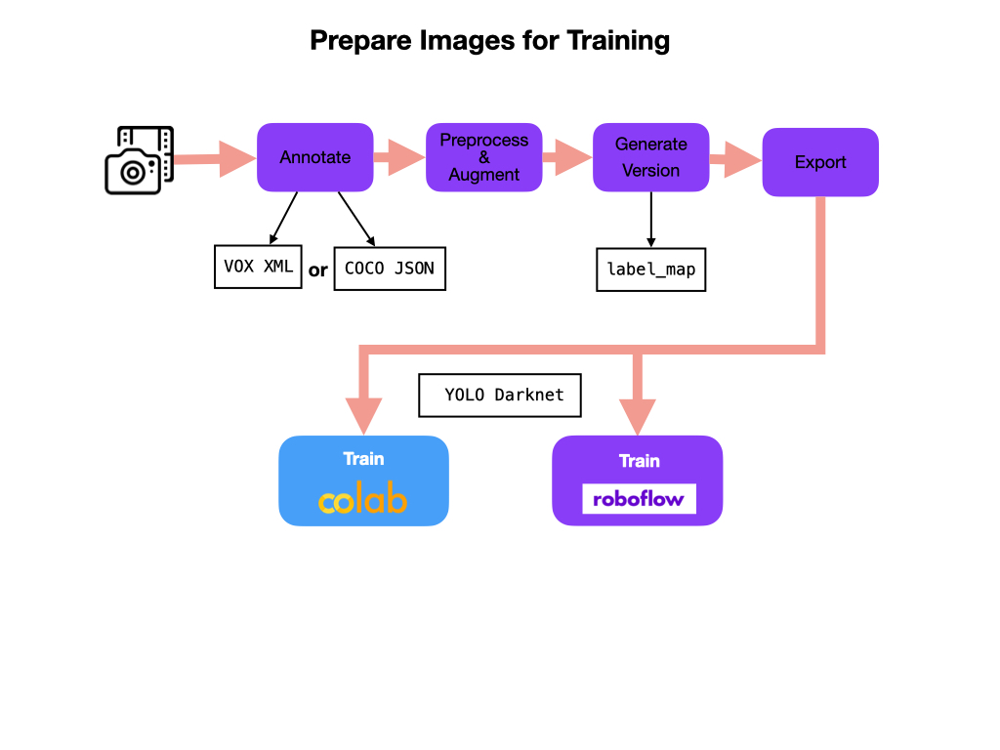
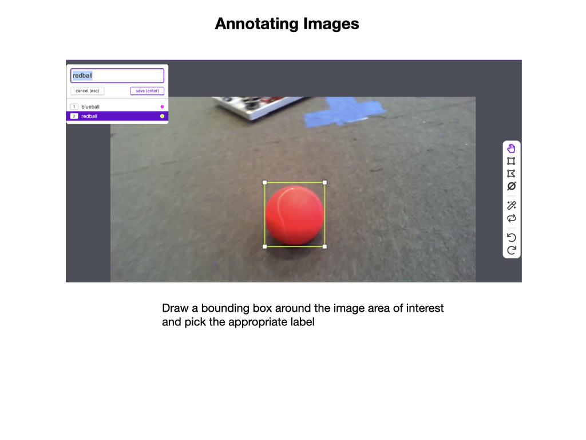
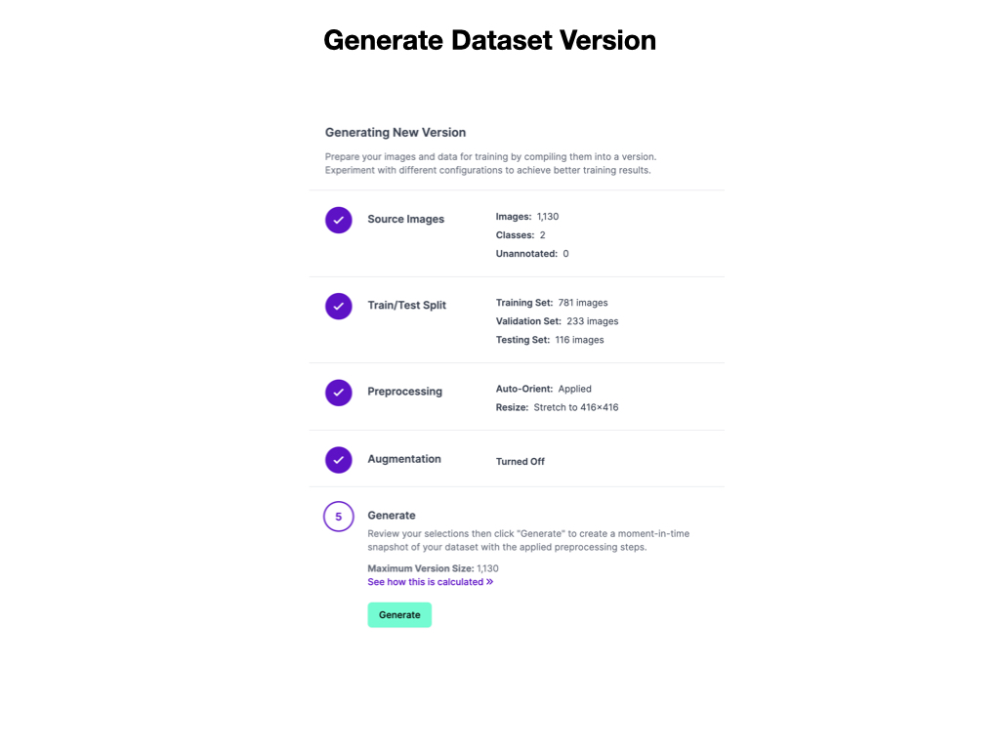

# Preparing Images
Before a *Neural Network Model* can be trained we need a lot of prepared images of the objects that we want to detect.  Preparing images involves:
- **Annotating**, which involves drawing bounding boxes around objects of interest. 
- **Preprocessing**, where the images get oriented and resized. 
- **Augmenting**, which increases the number and variablity of image samples. 
- **Versioning**, so as you can keep multiple versioned copies of your prepared image datasets.

Finally, the images must be exported in preparation for training the neural network model.

## Image Collection & Upload
The best way to get multiple images is to take a video of the objects.  In our case, it would most likely be a video of the game pieces used in the competition.  It's best to take the video under the same conditions that would be encountered on the game field. If this is not possible then take images in your school hallway.  Try to get lighting conditions that are similar to that of the game arena.

Once you have the video upload it to the Roboflow Website.  You will need to create an account, which you can do by using your GitHub account login.  Watch this Roboflow [Image Upload](https://www.youtube.com/watch?v=ZspfrPd4IKo) YouTube Video for how to do this.  Also read about [Adding Data](https://docs.roboflow.com/adding-data) in the Roboflow documentation.

## Annotating Images
Once you have the images uploaded they need to be annotated.  This involves drawing bounding boxes around objects of interest.  In our case, we will draw a bounding box around the game pieces.  There may be one or more game pieces in a single image.  Once the bounding box is drawn is has to have a label assigned.  For the FIRST 2022 competition you might only have two labels, e.g. *blueball, redball*. 

For an overview of annotating images you can watch the Roboflow [Annotate](https://www.youtube.com/watch?v=oCqd3oXp_HU) YouTube Video.  You should also read the Roboflow [Annotate](https://docs.roboflow.com/annotate) documentation.

## Preprocessing and Augmenting the Images
The next step is to *Preprocess* and *Augment* the images.   For information on preprocessing see Roboflow [Preprocessing](https://docs.roboflow.com/image-transformations/image-preprocessing), and more details on augmentation see the [Augmentation](https://docs.roboflow.com/image-transformations/image-augmentation) documentation. Augmenting is only done on the training images.

After this is done we can create a version of the dataset in preparation for training.  The *Train/Test Split* is done during image upload.  Give your dataset version a meaningful name so as you know what it contains.

When you satisfied with the number of annotated images and have created a dataset version it can be *Exported* for training.  This process is shown in the following *Training and Validation* section.

## References
- Roboflow [Image Upload](https://www.youtube.com/watch?v=ZspfrPd4IKo) - Youtube Video

- Roboflow [Annotate](https://www.youtube.com/watch?v=oCqd3oXp_HU) - Youtube Video

- Roboflow [Organize](https://www.youtube.com/watch?v=VyJ5HyaneuA) - Youtube Video