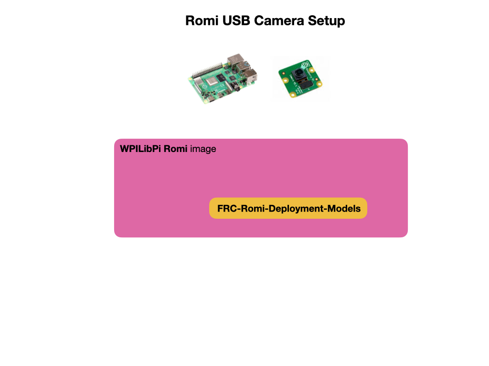

# USB Camera Deployment for Raspberry Pi
This section shows you how to deploy object detection models onto the Raspberry Pi using a USB camera.  The Pi must be pre-installed with the [WPILibPi](https://github.com/wpilibsuite/WPILibPi/releases) Romi image.  We'll show two methods for running object detection.  You can use the OpenCV [Deep Neural Networks Module](https://docs.opencv.org/4.x/d2/d58/tutorial_table_of_content_dnn.html) (DNN module), or you can deploy using a [Tensorflow Lite](https://www.tensorflow.org/lite/guide/python) model file.  In both cases you'll need to have a TPU accelerator, such as the [Coral USB Accelerator](https://coral.ai/products/accelerator), connected to the Pi in order to run inference  at an exceptable speed for competition.  However, you can still test without an accelerator.

## Installing the FRC Detection Package  
To facilitate the deployment the package [FRC-Romi-Detection-Models](https://github.com/FRC-2928/FRC-Romi-Deployment-Models) can be used.  This package contains the python inference scripts and example model files that detect the *Rapid-React* balls from the 2022 competition. It also contains the `runCamera` script to start inference via the Romi Web UI.

To install the detection package:

        cd ${HOME}
        git clone https://github.com/FRC-2928/FRC-Romi-Deployment-Models.git

Install the addition python requirements for the FRC scripts. The requirements are `Pillow`, `argparse`, and `tflite-support`.

        cd ${HOME}/FRC-Romi-Deployment-Models
        python3 -m pip install -r requirements.txt   

## Run Inference using OpenCV DNN
The OpenCV DNN module uses the `.weights` file that's generated from the training process.  There's no need to convert this file to another format, such as a tflite file.  You'll also need the configuration `.cfg` and the class labels `.names` file that you used for training.  All three of these files should have been saved from the training process. Examples of these files are included in the *FRC-Romi-Detection-Models* package.

To run the script for the OpenCV DNN module:

        python3 dnn_yolo_wpi.py --model rapid-react

where the `--model` parameter is used to pass in the file path and name of your model files.  See [The Inference Script Explained](MLDeploymentScript.md) for more information on the script used for inference.     

## Deploy using a TFLite Model File

Use the [Colab Notebook](https://colab.research.google.com/drive/15Kv8v8JIQlj6VDDwYgwCL9pQQ2jt5BVv#scrollTo=BlNzQriZ5q9H) to convert a YOLOv4 `.pb` file to a `.tflite` file. You'll need to upload the weights file that you created during the training process to your Google Drive.  

## References

- [Tensorflow Hub](https://tfhub.dev/s?deployment-format=lite&module-type=image-object-detection)