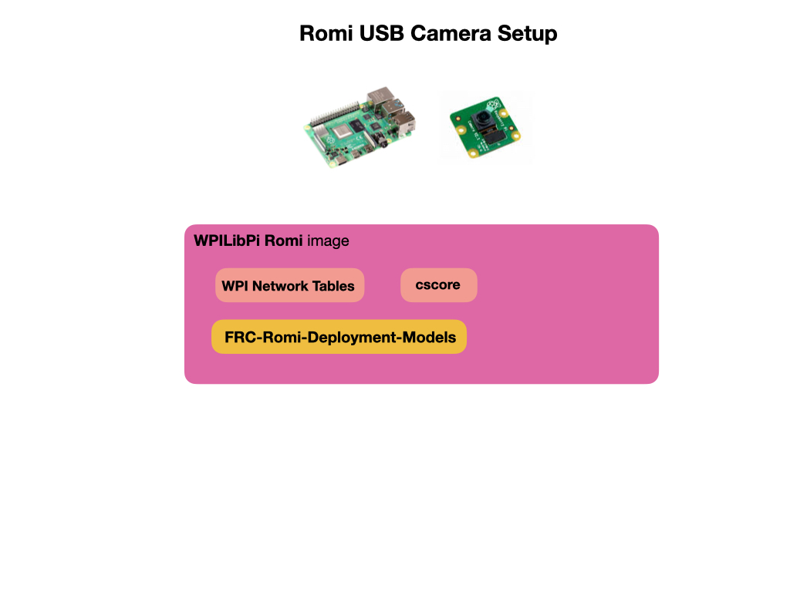

# USB Camera Deployment for Raspberry Pi
This section details how to deploy the Yolo detection model to the Raspberry Pi.  The Pi must be pre-installed with the [WPILibPi](https://github.com/wpilibsuite/WPILibPi/releases) Romi image.  To facilitate the deployment the package [FRC-Romi-Detection-Models](https://github.com/FRC-2928/FRC-Romi-Deployment-Models) can be used.  This package contains the python inference script, an example TFLite model file that detects the *Rapid-React* balls from the 2022 competition, and a `runCamera` script to run the inference script.

The deployment shows you how deploy and run the script, and how to create a custom TFLite model file.

## Create a TFLite Model File

Use the [Colab Notebook](https://colab.research.google.com/drive/15Kv8v8JIQlj6VDDwYgwCL9pQQ2jt5BVv#scrollTo=BlNzQriZ5q9H) to convert a YOLOv4 `.pb` file to a `.tflite` file. You'll need to upload the weights file that you created during the training process to your Google Drive.  

## References