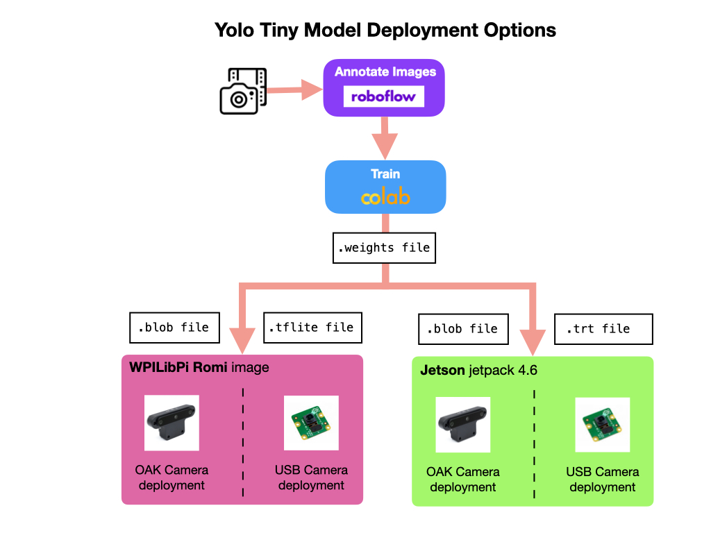
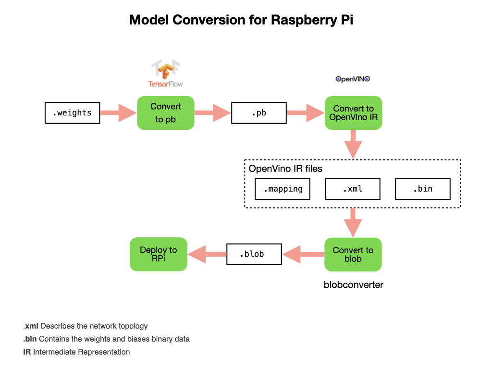
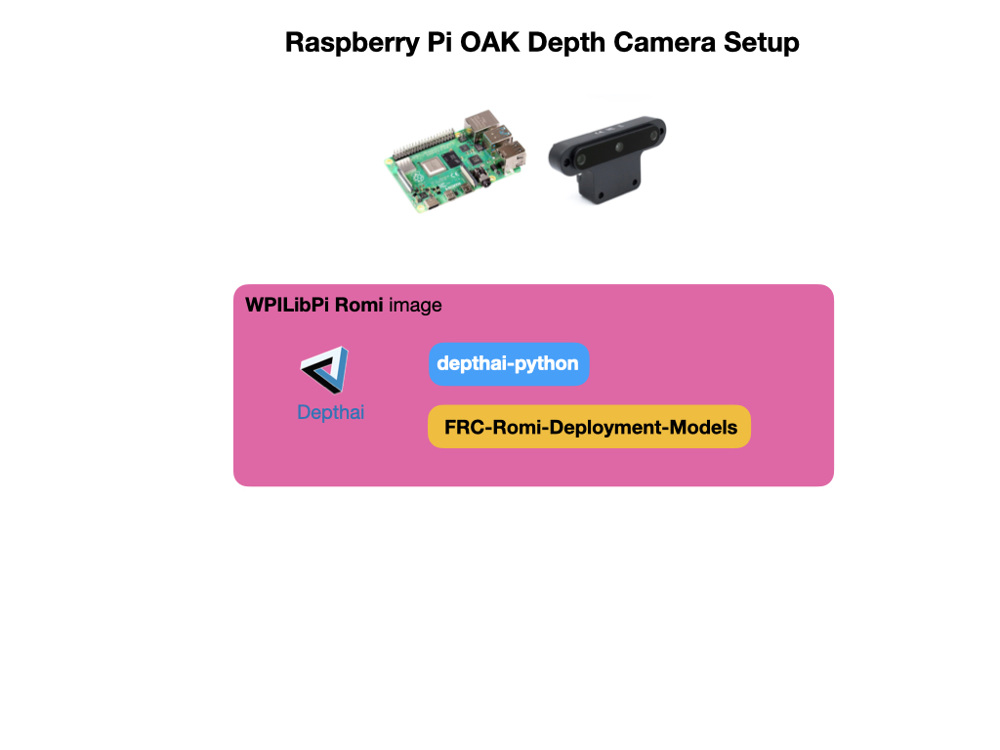

# OAK Camera Deployment for Raspberry Pi

Intro...

## Converting the Model
When you are satisfied with the model's testing results you can convert it to a file format that's suitable for your deployment platform.  The next sections will show how to convert the Yolo Tiny model to run in various environments as illustrated in the following graphic.

### Convert to OpenVino Blob File
To convert to a format that runs on the OAK-D camera. This model file format can be moved to a PC for further testing or directly to the Raspberry Pi for deployment. A small microprocessor such as a Raspberry, Jetson Nano, or cell phone is referred to as an *edge* device. In order to deploy to an edge device we must use a model file that has a small memory footprint that can be run efficiently on a device that has limited storage and compute capacity.  Save and download the `.weights` file that was created in *Train Detector Model* step.  This file can be converted to other formats suitable for deployment.

Before creating the *blob* file you need to convert the `.weights` file to a *protobuf* `.pb`format.  In TensorFlow, the protbuf file contains the graph definition as well as the weights of the model. This step requires the installation of Tensorflow and `numpy` into Colab. 

After conversion the `.pb` file will appear under the `yolo2openvino` directory.  If you want to create a *TFLite* file at a later time, right click the file and download it.

The next step is to install the [yolo2openvino](https://github.com/luxonis/yolo2openvino) library into the Colab environment.  This library will convert the `.pb` file into the OpenVINO *Intermediate Representation* IR format. A JSON configuration file is required for the conversion. The most important parameter to check in the configuration file is the number of classes.  This should match the number of object types that you're tracking, for example, if you have *Blueballs* and *Redballs* then the number of classes should be 2.

        [
                {
                        "id": "TFYOLOV3",
                        "match_kind": "general",
                        "custom_attributes": {
                        "classes": 2,
                        "anchors": [10, 14, 23, 27, 37, 58, 81, 82, 135, 169, 344, 319],
                        "coords": 4,
                        "num": 6,
                        "masks": [[3, 4, 5], [0, 1, 2]],
                        "entry_points": ["detector/yolo-v4-tiny/Reshape", "detector/yolo-v4-tiny/Reshape_4"]
                        }
                }
        ]

Once conversion to OpenVINO IR is successful we can install the *blobconverter* library and use it to convert the IR files to a blob format that can be run on OAK devices. After this step is complete the *IR* and *blob* files can be downloaded to your PC.

> There is also a [Web App](https://blobconverter.luxonis.com/) where you can convert the model using the *blobconverter*. Select OpenVINO 2021.3 > OpenVINO Model > Continue, upload .xml and .bin, and convert.

The full weights file to OAK blob file conversion process is shown below.

This section shows how to deploy the detection model using an [OAK-D](https://shop.luxonis.com/products/1098obcenclosure) camera provided by [Luxonis](https://www.luxonis.com/).  Luxonis has detailed documentation for its [Depthai](https://docs.luxonis.com/en/latest/) software.  The OAK-D is a powerfull depth camera with an on-board processor that removes the need to have a **Coral TPU** attached to the Raspberry Pi.

The model will be deployed on a Raspberry Pi4 using the [WPILibPi](https://github.com/wpilibsuite/WPILibPi/releases) Romi image.  There are two images, one is used for *Vision* that you would use on a competition robot, and the other is for the *Romi* robot.  The Romi image has everyting that the Vision image has but also includes additional software to operate the Romi. For instructions on installing the Romi image go to [Imaging your Romi](https://docs.wpilib.org/en/stable/docs/romi-robot/imaging-romi.html) on the FRC Documentation site. I recommend that you use the Romi image since it is easier to install additional software on.  You can just login using `ssh pi@wpilibpi.local` with password `raspberry` as soon as the image boots up. 

Once the image is deployed you can proceed with the install of the OAK camera software that is required to do *Inference*.  We'll also deploy a python script to run the model and put the output into the *WPI Network Tables* and display the output to a Web URL.

## Installing the Depthai Software

The **Depthai** software is required in order to do inference on the Raspberry Pi.  The software must be installed natively (**don't** use the *pip virtualenv*) since the WPILib Network Tables are also used for the deployment.  

> Note: You'll require access to the internet to run the installation steps, so if your Romi is set up in Access mode then plug an ethernet cable into the Raspberry Pi. In Access mode you can login using `ssh pi@wpilibpi.local`.  If the Romi is set up in Bridge mode the an ethernet cable is not required. 

> Note: Make sure that the Romi file system is in Writable mode before running the installation.

Before installing the software make sure that `git` is installed using `git --version`.  The *Vision* image of `wpilibpi` does not include it by default.  To install git use `sudo apt install git`. Follow these steps to install the software:

- Install the dependencies: 

        sudo curl -fL https://docs.luxonis.com/install_dependencies.sh | bash

- Install the Depthai libraries:

        python3 -m pip install depthai

- Install the Depthai packages:

        git clone https://github.com/luxonis/depthai-python.git

- Install the Python package requirements:

        cd depthai-python/examples
        python3 install_requirements.py

## Configuring the OAK Camera
The Raspberry Pi needs to recognize that the OAK camera has been plugged in.  To enable this run the following steps:

- Create a script that triggers your computer to recognize the OAK camera when it's plugged in.

        echo 'SUBSYSTEM=="usb", ATTRS{idVendor}=="03e7", MODE="0666"' | sudo tee /etc/udev/rules.d/80-movidius.rules

- Run the device configuration script:

        sudo udevadm control --reload-rules && sudo udevadm trigger

- To test that the OAK-D camera is recognised, plug it in and run the following command.  You should get the output shown.  Make sure that you plug it into the USB3 input (blue port).

        lsusb | grep MyriadX
        Bus 003 Device 002: ID 03e7:2485 Intel Movidius MyriadX      

## Deploying the Python Detection Script        
In order to run the OAK-D camera and display the detected objects you need to deploy a custom python script that is specific to the type of detection model that you want to deploy.  In our case, we're going to use the YoloV4 model.  The script will use a default model that detects the Rapid-React balls from the 2022 competition and displays the output to a Web URL. It'll also place information about objects that have been detected into Network Tables so a it can be used by your WPILib robot program.

To deploy the script follow these steps:

- Clone the models and python scripts from GitHub:

        cd ${HOME}
        git clone https://github.com/FRC-2928/FRC-OAK-Deployment-Models.git

- Copy the runCamera script to the home directory.  This is used by the Romi WebUI to run the detection process:

        cp FRC-OAK-Deployment-Models/runCamera .

- Install the python package requirements.  This installs the python `Pillow` and `av` packages into your environment.  `av` is used to record videos:

        cd FRC-OAK-Deployment-Models/
        python3 -m pip install -r requirements.txt        

## Run the Detection Script
You can now put the Romi back into Read-Only mode.  Plug the OAK-D camera into the USB 3 port (blue port).  It will need to be powered from the barrel jack, which will require an additional power source.

#### Run the Script from the Command Line
To test that the inference script is properly deployed it can be run from the Raspberry Pi command line.  If you have an internet cable connected you can login using `ssh pi@wpilibpi.local`. Then:

    cd ${HOME}/FRC-OAK-Deployment-Models
    python3 oak_yolo_spacial.py -m rapid-react

The camera streamed output can be viewed from `http://wpilibpi.local:8080`.

> If not using an internet cable then connect to the access point and login using `ssh pi@10.0.0.2`. The camera streamed output can be viewed from `http://10.0.0.2:8080`.

#### Run the Script from the Web UI
There's a custom model that is supplied in the *FRC-OAK-Deployment-Models* package that detects the *Rapid-React* balls from the 2022 competition.  To use that model via the Web UI execute the following commands:

        cd ${HOME}
        cp FRC-OAK-Deployment-Models/runCameraRapidReact runCamera

To start the object detection script from the Web UI go the the *Application* tab on the Romi WebUI, change the mode to *Writable*, and put the application in *Custom* mode.  Remember to click the *Save* button under the *Application* panel.  Then go to the *Vision Status* tab and click the *Down* button to stop any current running scripts.  Wait a few seconds and then click the *Up* button to start the object detection script. 

> To ensure that there are no errors you can view the script output by enabling the Console Output.

The camera streamed output can be viewed from `http://10.0.0.2:8080` or `http://wpilibpi.local:8080` depending on how you are connected to the Romi. 

> Note: The camera stream does not work from a Safari browser, use Chrome or Firefox.

## The Inference Script
This script connects to the OAK-D camera and passes images to the inference model.  If an object-of-interest is detected a bounding box is drawn on the image together with positional data.  The positional data is put into the Network Tables so as it can be made use of by the WPILib robot program.  The overlayed images can be viewed in a Web browser.

The [python inference script](https://github.com/FRC-2928/FRC-OAK-Deployment-Models/blob/main/oak_yolo_spacial.py) can be found on FRC-2928 GitHub account. For a descripton of how this script works see [The Inference Script Explained](MLDeploymentScript.md).

## References
- Luxonis [Depthai](https://docs.luxonis.com/en/latest/) software documentation
- Roboflow [Deployment](https://www.youtube.com/watch?v=f2d5YksgQsU) - Youtube Video