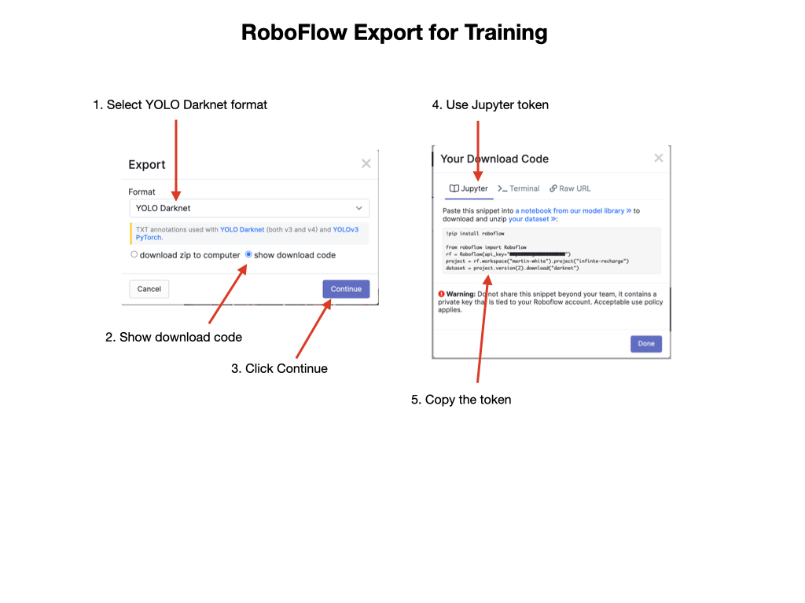
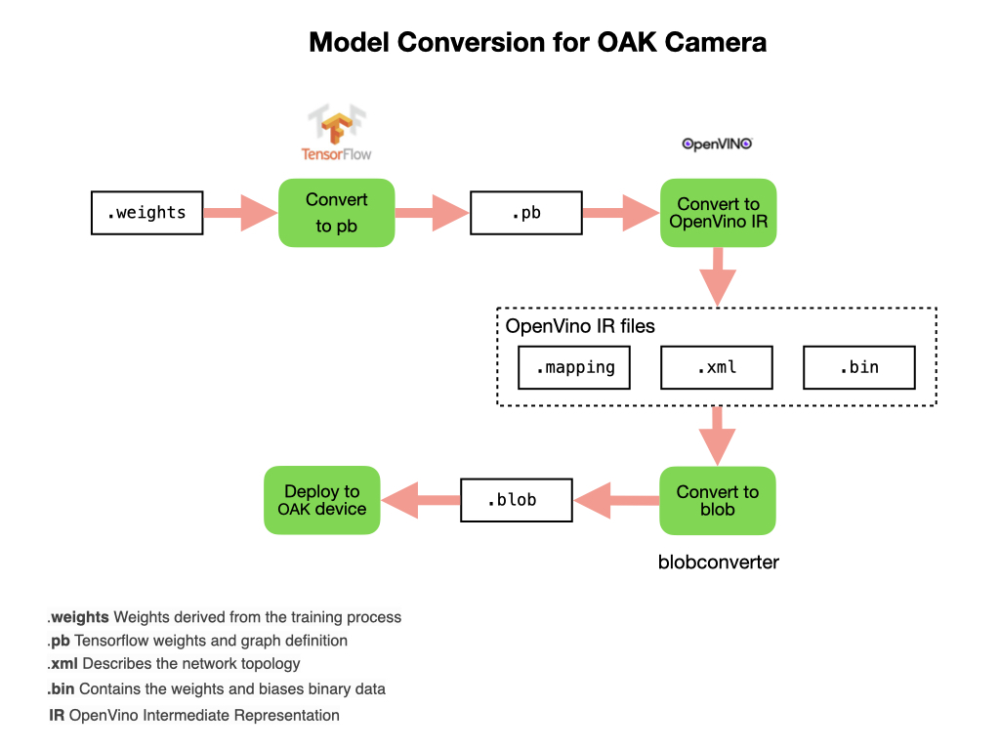

# Training a Model
There are options that we have to train our model.  It can be trained in Roboflow or we can export it for training in Google Colab.  To train in Roboflow watch the [Training](https://www.youtube.com/watch?v=njWwmKLWVyE)  YouTube Video and read the [Train](https://docs.roboflow.com/train) documentation.  To train in Colab follow the next steps.

## Exporting the Dataset
In order to train the dataset in Colab it has to be exported to a format compatible with the training model.  In our case, we'll use the YoloV4 training model so we'll export it in *YOLO Darknet* format.  The format process will give you a token that will be used to import the dataset into Colab.

## Training YoloV4 Model
Make sure that you're familiar with how Colab works.  
Use the [Roboflow-YOLOv3-tiny-Darknet-to-OAK.ipynb](https://colab.research.google.com/drive/1Sc6B-clNJZ3OBxCxIoddhLFxIYoJJzRT#scrollTo=JlPEcD7UkE4Q)  Colab Notebook to train the model.  Once the Colab page loads save a copy of the notebook in your Google Drive.  When you start the first step by executing the first cell it will allocate a GPU for you. There are quite a few steps to the training process that you must do in a single session.  This is because Colab will 

### Setup the Colab Notebook for Training

- Configure our GPU environment on Google Colab
- Install the Darknet YOLOv4 training environment.  This will create the `darknet` directory structure in the *Files* sidebar.
- Download custom dataset for YOLOv4 and set up directories. This is where you get your dataset from Roboflow into the Colab notebook.  Copy the export key from the Roboflow export and paste it into the notebook.  Your key should look something like this:

        !pip install roboflow

        from roboflow import Roboflow
        rf = Roboflow(api_key="yourkey")
        project = rf.workspace("martin-white").project("infinte-recharge")
        dataset = project.version(2).download("darknet")

- Configure a custom YOLOv4 training config file for Darknet

### Train Detector Model
The next step is to train a custom YOLOv4 object detector.

As the training progresses files with the suffix `.weights` will show up in the `darknet/backup` directory.

### Test the Model
- Reload YOLOv4 trained weights and make inference on test images

### Convert to OpenVino Blob File
When you are satisfied with the model's testing results you can convert it to a file format that runs on the OAK-D camera.  During this process **TensorFlow** and **OpenVino** will get installed into the Colab environment.  The conversion process is shown below.

Save and download the `.weights` file that was created in *Train Detector Model* step.  This file can be converted to other formats suitable for deployment.

Convert `.weights` file to a `.pb`

Convert the `.pb` file to the OpenVino *Intermediate Representation* (IR) file.

Install the *blobconverter* and use it to convert IR files to OpenVino to blob that can be run on OAK devices. After this step is complete the *IR* and *blob* files are downloaded to your PC.

## References
- Roboflow [Training](https://www.youtube.com/watch?v=njWwmKLWVyE) - Youtube Video