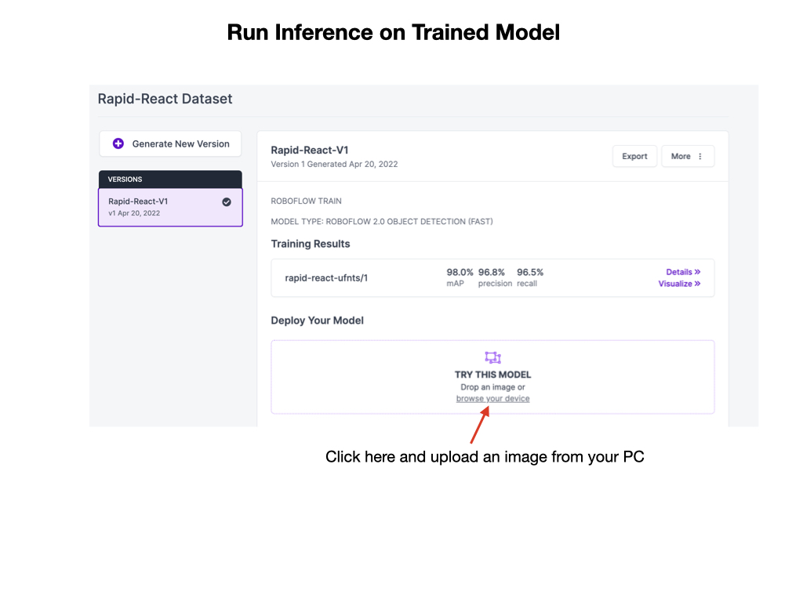
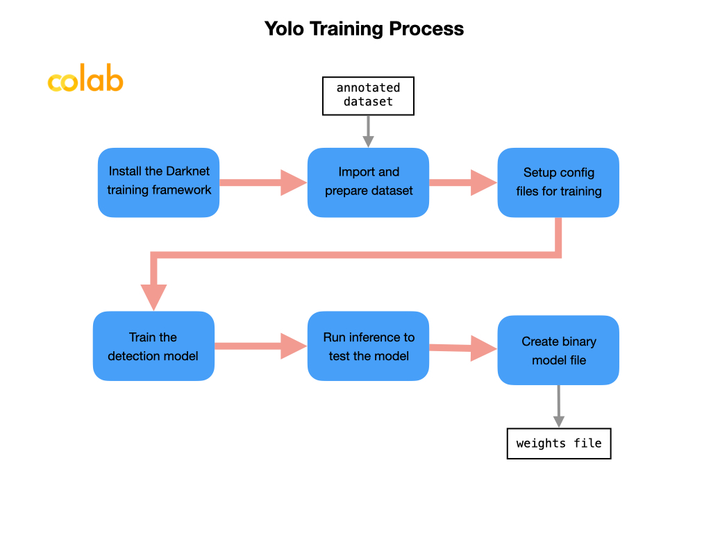

# Training and Validating the Model
Once you have a dataset of the images that you're happy with it can be used to train and validate a model. For the training and validation process you have two options.  You can train and validate in *Roboflow* or you can export it for training and validation in *Google Colab*.  In order to deploy a model to the competition robot it must be trained using Colab since you'll need to have a model file that can be used offline.  However, during the testing phase you can also use Roboflow.

## Training Model in Roboflow
To train a model in Roboflow watch the [Training](https://www.youtube.com/watch?v=njWwmKLWVyE)  YouTube Video and read the [Train](https://docs.roboflow.com/train) documentation. Once you have a trained model it can be validated directly on the Roboflow site by uploading a test image. It's very important that the test image was never used in the training or validation set.  

To validate, go to the **Versions** section of your Roboflow account, select an image of the objects that you want to run inference on and upload it to the site.  If your model is properly trained you should see bounding boxes around the objects of interest.

See the next section on [Testing the Model](MLDesktopTesting.md) for more testing options.

## Training Model in Colab
This process will show how to train a [Yolo](https://pjreddie.com/darknet/yolo/) model for deployment on a Raspberry Pi with a connected [Luxonis OAK](https://shop.luxonis.com/collections/usb) camera.   The training process in Google Colab follows these steps.

Make sure that you're familiar with how Colab works. For a quick introduction watch this [Google Colab](https://www.youtube.com/watch?v=RLYoEyIHL6A&ab_channel=CodewithDogaOzgon) YouTube video. 

Use the [Roboflow-YOLOv3-tiny-Darknet-to-OAK.ipynb](https://colab.research.google.com/drive/1Sc6B-clNJZ3OBxCxIoddhLFxIYoJJzRT#scrollTo=JlPEcD7UkE4Q) Colab Notebook to train the model.  Once the Colab notebook loads save a copy of the it in your Google Drive.  When you execute the first cell it will allocate a GPU for you. You should try and complete all of the training steps in a single session.  If your page is inactive for more than an hour the session will disconnect and you will have to start over.  Once you have the Colab notebook loaded it will guide you through the following steps to train, validate, and export the model.

### Setup the Colab Notebook for Training

- Configure our GPU environment on Google Colab

- Install the [Darknet](https://github.com/pjreddie/darknet) YOLOv4 training environment.  The darknet software is cloned from GitHub and then compiled.  After install you'll see the `darknet` directory structure in the *Files* sidebar menu.

### Importing the Dataset
In order to train the dataset in Colab it has to be exported to a format compatible with the training model.  In our case, we'll be using the YoloV4 training model, so we'll export it in *YOLO Darknet* format. The export process generates a `.txt` file along with each image that describe the bounding boxes and the label identifier. The txt file will have the same name as the image and contains one line per bounding box.

Once the export is complete you will be displayed a token that can be used to import the dataset into Colab.

- Download custom dataset for YOLOv4 and set up directories. This is where you get your dataset from Roboflow into the Colab notebook.  Copy the export key from the Roboflow export and paste it into the notebook.  Your key should look something like this:

        !pip install roboflow

        from roboflow import Roboflow
        rf = Roboflow(api_key="yourkey")
        project = rf.workspace("martin-white").project("infinte-recharge")
        dataset = project.version(2).download("darknet")

Set up training file directories for custom dataset

### Setup Configuration Files for Training
The weights file for YoloV4-tiny is downloaded in order to generate a custom training configuration file for Darknet.  The configuration file contains a set of parameters for the training process. These parameters are customized for your dataset will contain good default values so there shouldn't be much need to change them.

### Train Detector Model
The next step is to train a custom YOLOv4 object detector.

As the training progresses files with the suffix `.weights` will show up in the `darknet/backup` directory.  As soon as you have a file with a name of `<dataset>_best.weights` you can stop the training process.

### Run Inference to Test the Model
The process of validating an image with a model is called *Inference*. This step will load the YOLOv4 trained weights and do inference on the validation image set.  

### Convert to OpenVino Blob File
When you are satisfied with the model's testing results you can convert it to a file format that runs on the OAK-D camera. This model file format can be moved to a PC for further testing or directly to the Raspberry Pi for deployment. A small microprocessor such as a Raspberry, Jetson Nano, or cell phone is referred to as an *edge* device. In order to deploy to an edge device we must use a model file that has a small memory footprint that can be run efficiently on a device that has limited storage and compute capacity.  Save and download the `.weights` file that was created in *Train Detector Model* step.  This file can be converted to other formats suitable for deployment.

Before creating the *blob* file you need to convert the `.weights` file to a `.pb`.  `pb` stands for *protobuf*. In TensorFlow, the protbuf file contains the graph definition as well as the weights of the model. This step requires the installation of Tensorflow into Colab.

The next step is to install the [yolo2openvino](https://github.com/luxonis/yolo2openvino) library into the Colab environment.  This library will convert the `.pb` file into the OpenVINO *Intermediate Representation* IR format. A JSON configuration file is required for the conversion. The most important parameter to check in the configuration file is the number of classes.  This should match the number of object types that you're tracking, for example, if you have *Blueballs* and *Redballs* then the number of classes should be 2.

        [
                {
                        "id": "TFYOLOV3",
                        "match_kind": "general",
                        "custom_attributes": {
                        "classes": 2,
                        "anchors": [10, 14, 23, 27, 37, 58, 81, 82, 135, 169, 344, 319],
                        "coords": 4,
                        "num": 6,
                        "masks": [[3, 4, 5], [0, 1, 2]],
                        "entry_points": ["detector/yolo-v4-tiny/Reshape", "detector/yolo-v4-tiny/Reshape_4"]
                        }
                }
        ]

Once conversion to OpenVINO IR is successful we can install the *blobconverter* library and use it to convert the IR files to a blob format that can be run on OAK devices. After this step is complete the *IR* and *blob* files can be downloaded to your PC.

> There is also a [Web App](https://blobconverter.luxonis.com/) where you can convert the model using the *blobconverter*. Select OpenVINO 2021.3 > OpenVINO Model > Continue, upload .xml and .bin, and convert.

The full weights file to OAK blob file conversion process is shown below.

## References
- Roboflow [Training](https://www.youtube.com/watch?v=njWwmKLWVyE) - Youtube Video

- [Google Colab](https://www.youtube.com/watch?v=RLYoEyIHL6A&ab_channel=CodewithDogaOzgon) - YouTube Video