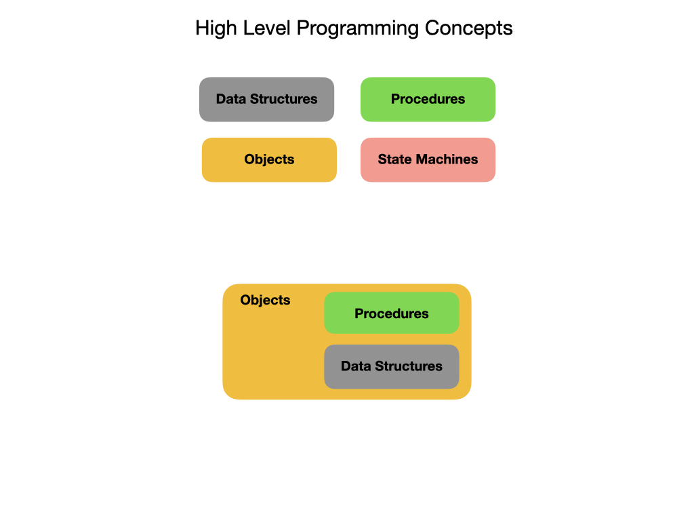

# Introduction to Programming
This is a general introduction to programming.  It covers concepts that apply to almost all [Object Oriented Languages(OLL)](https://en.wikipedia.org/wiki/Object-oriented_programming) although it will use Java examples to illustrate some concepts.  The goal is to understand programming at a higher conceptual level, especially in the context of programming robots.

When programming in most modern languages you can break it down into four main categories; **Data Structures, Procedures, Objects,** and **State Machines**.  Data Structures describe the physical attributes of a system and what its current state is.  Procedures are blocks of code that perform tasks when they called.  Objects are created to represent physical things or ideas in the real world.  Objects encapsulate Data Structures and Procedures to describe its attributes and the tasks that it can perform.  

State Machines represent the state of a system at any point in time.  As time passes a state machine usually transitions from one state to another.  

Let's go over each of these categories in detail. 

- [Data Structures](dataStructures.md)
- [Procedures](procedures.md)
- [Objects](objects.md)
- [State Machines](stateMachines.md)

## Program Files
Most programs will be composed of multiple files that separate the various components of the program.  This makes it much easier to work on specific parts of the program without scrolling through a single large file.  It also allows the project to be worked on by a team of programmers since you would not all be working on the same file. When the program is compiled all of the files are combined, or linked, together to form a single executable file.  In order to associate all of the files that are part of the same project we use an `import` statement as shown below. 

<!-- <h3>
<a href="../index">Home</a>

<a href="dataStructures">Next</a></h3> -->
<!-- [Home](../index)     [Next](dataStructures) -->
