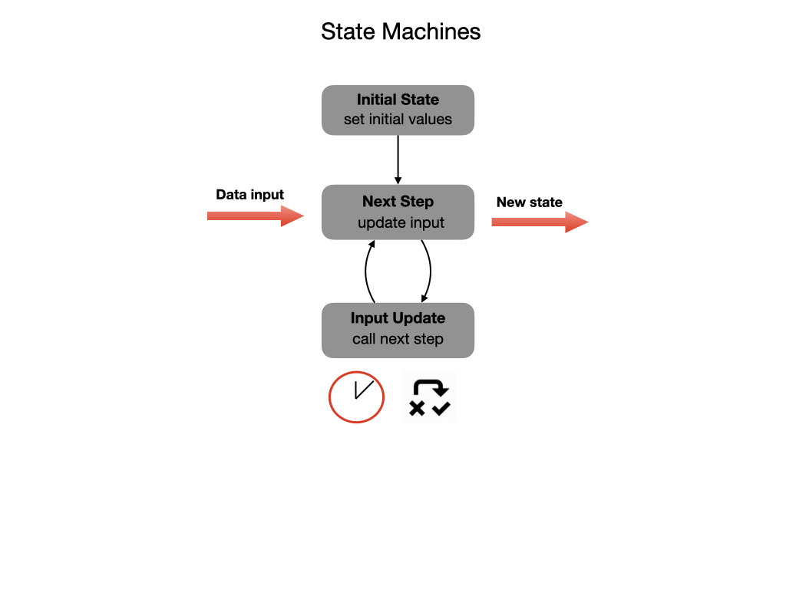

# State Machines
State Machines represent the state of a system at any point in time.  As time passes a state machine usually transitions from one state to another.  Its state can change based on inputs to the system or as a result of a specific period of time passing. In programming it usually consists of a finite number of states and is therefore called a Finite State Machine (FSM).

A State Machine operates in the following manner:

1. **Initial State** - This where inputs to the system are often zero'ed out or saved to data structure for later comparison.  Timers are either reset or saved to a timestamp.  In code, this is often carried out in an initialization routine.

2. **Next Step** - Receives and processes new input to the system. It takes the current state applies new input data and produces a new state.  This incremental change of state maybe done via some kind of summation of integration function.  Eventually it may cause the system to a transition to new major state, such as a terminal or idle state, when some threshold is met. 

3. **Input Update** - This is the process of making repeated calls to the next step.  This will often be carried out by using a programmatic timer.  In an FRC program the input update step will be carried out by the [Command Scheduler](https://docs.wpilib.org/en/latest/docs/software/commandbased/command-scheduler.html) that runs every 20 milliseconds.  The Input process would be responsible for checking on the transitioning event.

## State Machine Example
Let's look at code from the Romi project to see an example of a State Machine.  This code is from a **Command** object.  It starts in the `initialize()` state that runs procedures to stop the motors and zero out the encoder values.  Stopping the motors ensures that we are at some initially known state.  After initialization it transitions to the `execute()` state that performs the **Next Step**.  It'll continue in that state, driven by the **Input Update** process (CommandScheduler) until it reaches some threshold, at which point is transitions into the state controlled by the `end()` method.  The threshold is defined and triggered by the `isFinished()` method.

    // Called when the command is initially scheduled.
      public void initialize() {
        m_drive.arcadeDrive(0, 0);
        m_drive.resetEncoders();
      }

    // Called every time the scheduler runs while the command is scheduled.
    public void execute() {
      m_drive.arcadeDrive(m_speed, 0);
    }

    // Called once the command ends or is interrupted.
    public void end(boolean interrupted) {
      m_drive.arcadeDrive(0, 0);
    }

    // Returns true when the command should end.
    public boolean isFinished() {
      // Compare distance travelled from start to desired distance
      return Math.abs(m_drive.getAverageDistanceInch()) >= m_distance;
    }

Other prime examples of State Machines are [PID Controllers](../Romi/Control/romiPID.md) used for motion control or [Kalman Filters](../Concepts/OptimalEstimation/kalmanFilters.md) used for *Robot Localization*.

<!-- [Robot Localization](../Concepts/LocalizationMapping/localization.md). -->

## References

- Wikipedia [Finite State Machines](https://en.wikipedia.org/wiki/Finite-state_machine)

- FRC Documentation - [The Command Scheduler](https://docs.wpilib.org/en/latest/docs/software/commandbased/command-scheduler.html)
