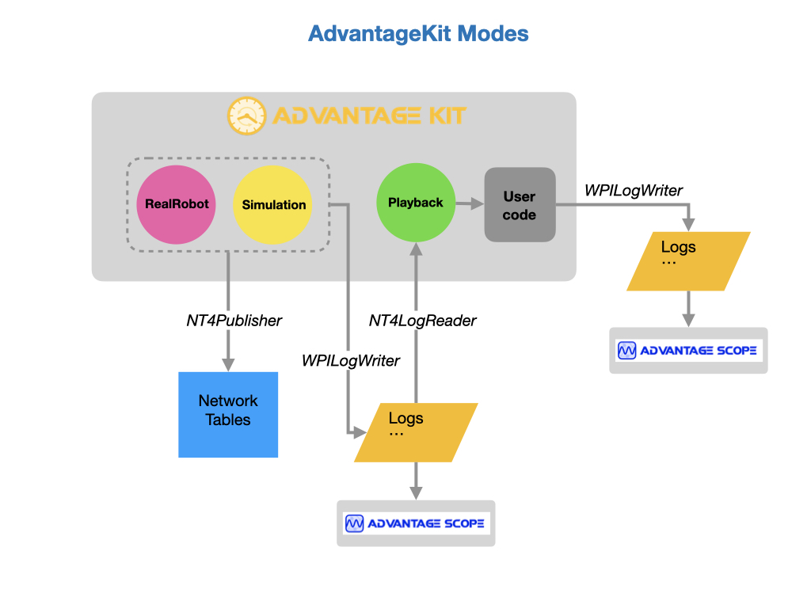
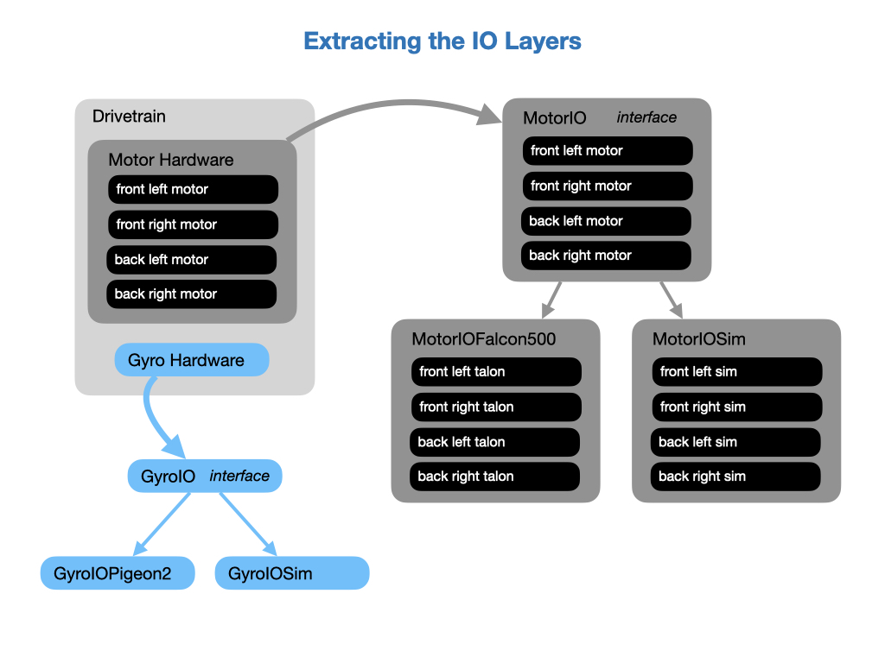
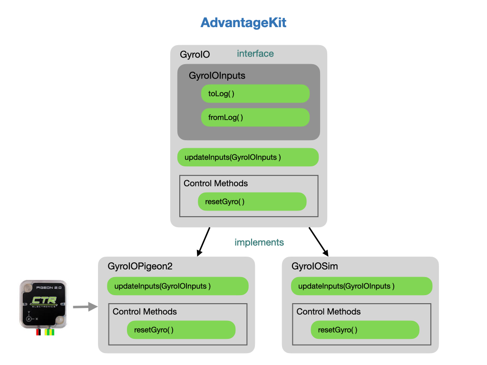
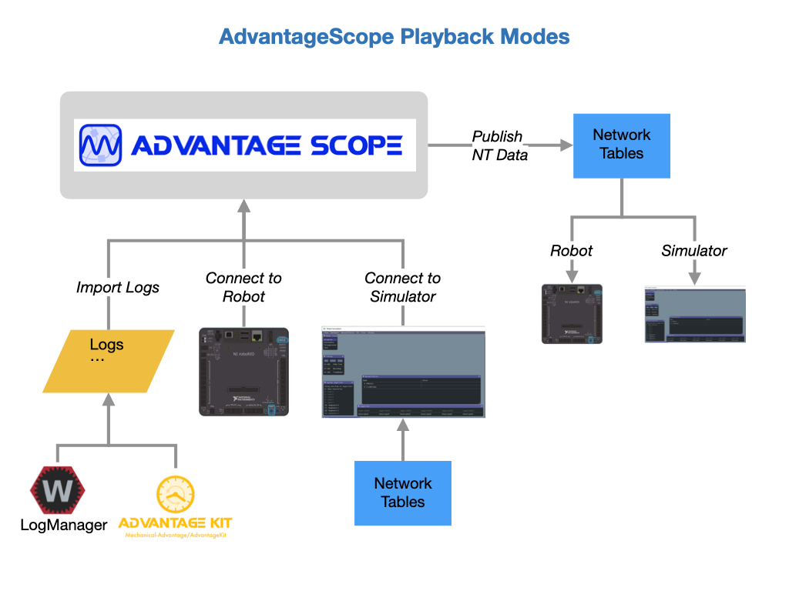
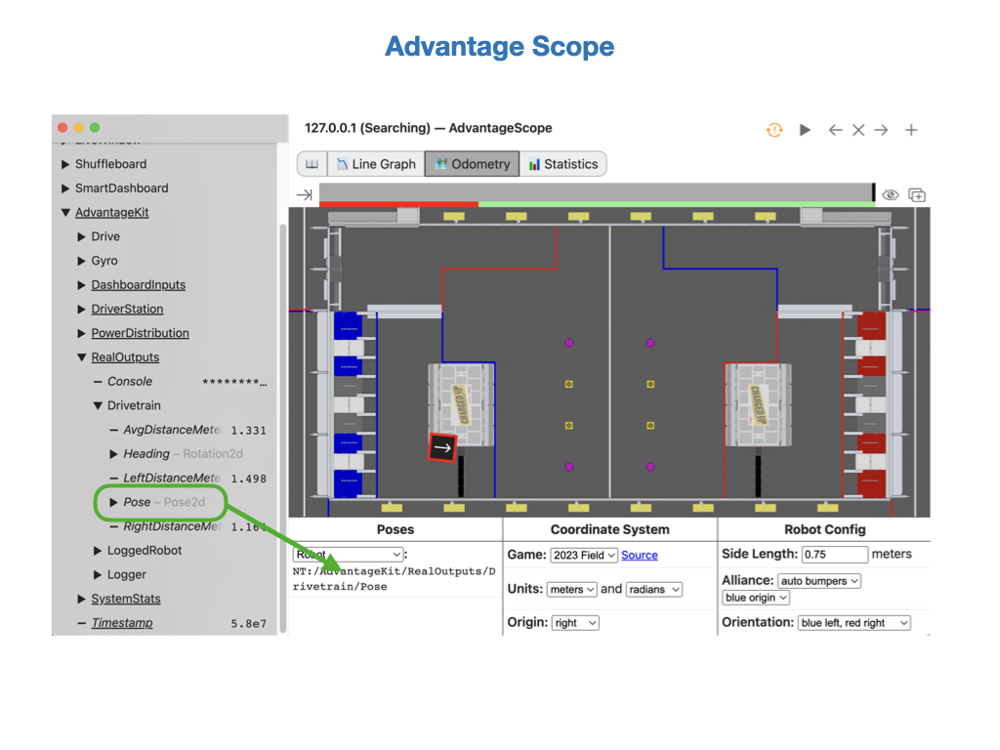
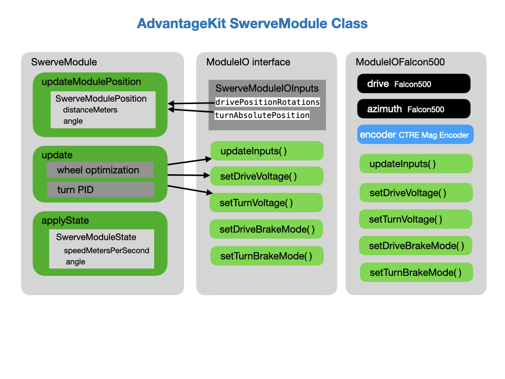

# Advantage Kit
AdvantageKit is a logging framework that records all of the data flowing into the robot code. After a match, these values can be replayed to the robot code in a simulator. The log needs to be replayed using the same version of code that generated the log. See [What is Advantage Kit](https://github.com/Mechanical-Advantage/AdvantageKit/blob/main/docs/WHAT-IS-ADVANTAGEKIT.md) for more information.

## Installation
To install the *Advantage Kit* libraries into your project go to [Advantage Kit Installation Page](https://github.com/Mechanical-Advantage/AdvantageKit/blob/main/docs/INSTALLATION.md#new-projects).  Follow the instructions on that page for setting up a project. Commands need to be added to the `build.gradle` file, and to the *Robot* class. You should also add the *Gversion Plugin (Git Metadata)*, as documented on the installation page. This ensures that you can match the logfiles with the correct version of the code that generated them. 

## AdvantageKit Modes
*AdvantageKit* runs in two modes, **Record** or **Playback**. 

Record mode happens by running the real robot or by running a *WPI Robot Simulator*.  While running on the real robot it's set to write out to log files on the RoboRio and can also publish to the Network Tables.  It's recommended that you use a thumb drive on the RoboRio to hold the log files. When running the WPI Simulator the log files are written to the project directory under the top level `logs` folder. Data can also be written to the Network Tables and viewed live in *AdvantageScope*.

Once you have a log file you can simply play it back in *AdvantageScope*.  If you want to make changes, such as collecting more data, then you can use *AdvantageKit*'s playback mode to create a new logfile containing the additional data.

In playback mode it reads the log file previously written during a match or in simulation and plays it back to the robot code. You start the playback by running the **Simulate Robot Code** option in VSCode. When the playback runs it can create a new logfile that includes any new data that was collected.  Note that the code will run as fast as possible in the WPI Simulator and then exit, so the review must be done from *AdvantageScope*.

Here's an example of how these modes can be enabled.  This code goes in the `initRobot()` function of the *Robot* class.  Log generation takes place when running the real robot or in simulation.  Once the data is collected it can be played back using the same user program that generated it.

    Logger.recordMetadata("ProjectName", "MyProject"); // Set a metadata value

    // Set up data receivers & replay source
    switch (Constants.currentMode) {
      case REAL:
        // Running on a real robot, log to a USB stick ("/U/logs")
        Logger.addDataReceiver(new WPILOGWriter());
        Logger.addDataReceiver(new NT4Publisher());
        break;

      case SIM:
        // Running a physics simulator, log to NT
        Logger.addDataReceiver(new NT4Publisher());
        Logger.addDataReceiver(new WPILOGWriter());
        break;

      case REPLAY:
        // Replaying a log, set up replay source
        setUseTiming(false); // Run as fast as possible
        String logPath = LogFileUtil.findReplayLog();
        Logger.setReplaySource(new WPILOGReader(logPath));
        Logger.addDataReceiver(new WPILOGWriter(LogFileUtil.addPathSuffix(logPath, "_sim")));
        break;
    }

    Logger.start();

### Configure the Robot
After installing *AdvantageKit* you need to configure the robot code in order to use the framework.  See [Configuring the Robot](https://github.com/Mechanical-Advantage/AdvantageKit/blob/main/docs/INSTALLATION.md#robot-configuration) in the *AdvantageKit* documentation.  There are two steps to this:

- Open the *Robot* class and extend *LoggedRobot*.

- Add code into `robotInit()` in the *Robot* class.  Make sure that you import the *AdvantageKit* logger NOT the system logger.

### Setting up the IO Layers
By necessity, any interaction with external hardware must be isolated such that all input data is logged and can be replayed in *AdvantageScope* where that hardware is not present. It's recommended to restructure the subsystem such that hardware interfacing occurs in a separate object called the *IO Layer*. The IO layer includes an interface defining all methods used for interacting with the hardware along with one or more implementations that make use of vendor libraries to carry out commands and read data.

The following section shows how to set up an IO Layer for the gyro and implement it in the *Drivetrain* subsystem.

### Setting up the GyroIO Interface
Each hardware system should have an interface class that defines the input/output data that should be logged, and methods used to control the hardware. Specific hardware classes can then be created that implement the IO interface.  The example diagram the real Pigeon2 hardware and a simulation of it.

Create an `interface` class that can use to implement different types of hardware. In our case we'll implement the *Pideon2* gyro, but we can also implement simulation class.

Inside of this interface we define a class to to get the inputs from the hardware. This class implements *LoggableInputs*, which is a set of values which can be logged and replayed (for example, the hardware inputs for a subsystem). The data is stored in *LogTable* objects.  We'll only get the gyro yaw data in this example.

Finally, we update the set of loggable inputs in the `updateInputs()` method.

    public interface GyroIO { }

        public static class GyroIOInputs implements LoggableInputs {

            public double gyroYawPosition;

            public void toLog(LogTable table) {
                table.put("GyroYawPosition", gyroYawPosition);
            }

            public void fromLog(LogTable table) {
                gyroYawPosition = table.getDouble("GyroYawPosition", gyroYawPosition);
            }

        } 

        public default void updateInputs(GyroIOInputs inputs) {}

    }

### Implementing the GyroIO Interface
We're going to use the *Pigeon2* hardware so create a class called *GyroIOPigeon2*.  We can name the hardware that's being implemented.  This is where the actual hardware is accessed so we define the *Pigeon2* with its port ID.  

    public class GyroIOPigeon2 implements GyroIO {

        public Pigeon2 pigeon = new Pigeon2(Constants.CANBusIDs.kPigeonIMU);
        
        public GyroIOPideon2() {            
        }
            // Updates the set of loggable inputs. 
            public void updateInputs(GyroIOInputs inputs) {
                inputs.gyroYawPosition = this.pigeon.getAccumGyroZ().getValue();
        }
    }

### Implementing Control Inputs
Since any interaction with the hardware now goes through the IO Layer, any control inputs must be defined in the interface class and implemented in the hardware specific class.  To define in the interface class:

    public default void resetGyro() {}
    
And to implement in the hardware specific *GyroIOPigeon2* class:

    @Override
    public void resetGyro() {
        this.pigeon.reset();
    }

See [Recording Inputs](https://github.com/Mechanical-Advantage/AdvantageKit/blob/main/docs/RECORDING-INPUTS.md) in the AdvantageKit documentation for more information.

### Subsystem Setup
With the IO layers created they can now be used by the subsystem.  The example Gyro IO Layer can be used by the Drivetrain class.  We would also define an IO layer for the drive train motors so the example below shows how they would both be used.

    private final DrivetrainIO io;
    private final DrivetrainIOInputs inputs = new DrivetrainIOInputs();
    private final GyroIO gyroIO; 
    private final GyroIOInputs gyroInputs = new GyroIOInputs();

The hardware interface gets passed into the *Drivetrain*'s constructor.

    public Drivetrain(GyroIO gyroIO,
                    DrivetrainIO drivetrainIO) {
        this.io = drivetrainIO;
        this.gyroIO = gyroIO;
    }

In the `periodic()` routine the input data gets updated from the IO layer, and then get sent to the logging framework (or updates from the log during replay).

    periodic() {
        io.updateInputs(inputs);
        Logger.getInstance().processInputs("Drive/" + name + "Module", inputs);
    }    

In the subsystem methods the data from the IO layer is used.

    public Rotation2d getHeading() {
        return gyroInputs.gyroYaw;
    }

The logging framework supports recording this output data on the real robot and during replay. 

    Logger.getInstance().recordOutput("Drive/Angle", getHeading());   

See [Recording Outputs](https://github.com/Mechanical-Advantage/AdvantageKit/blob/main/docs/RECORDING-OUTPUTS.md) in the AdvantageKit documentation for more information.

### Passing the IO Layer to the Subsystem
Here's an example of how the IO Layer would get passed to the subsystem during its creation.  This code would go into the constructor of the *RobotContainer* class.  On the real robot we would use the actual hardware, otherwise the simulation IO layer would be used.  In playback mode we want to disable the IO layer since the data is coming from the previously generated log files.

    if (Robot.isReal()) {
      // Instantiate IO implementations to talk to real hardware
      m_drivetrain = new Drivetrain(new GyroIOPideon2(),
                                    new DrivetrainIOFalcon500(), 
                                    m_transmission::getGearState);
    } else {
      
      switch (Constants.currentMode) {     
        case SIM:
          // Use anonymous classes to create "dummy" IO implementations
          DrivetrainIOSim drivetrainSim = new DrivetrainIOSim();
          m_drivetrain = new Drivetrain(new GyroIOSim(drivetrainSim),
                                        drivetrainSim, 
                                        m_transmission::getGearState);
          break;

        default:
          // Replayed robot, disable IO implementations
          m_drivetrain = new Drivetrain(new GyroIOSim(null) {},
                                        new DrivetrainIOSim() {}, 
                                        null);
          break;
      }
    }

See the [Differential Drive example project](https://github.com/Mechanical-Advantage/AdvantageKit/tree/main/example_projects/diff_drive/src/main) for a full implementation.  For an example of a swerve drive implementation see the [Swerve Drive example](https://github.com/Mechanical-Advantage/AdvantageKit/tree/main/example_projects/swerve_drive/src/main).

## Advantage Scope
AdvantageScope is a robot diagnostics, log review/analysis, and data visualization application for FIRST Robotics Competition teams. It reads logs in WPILOG, DS log, and RLOG file formats, plus live robot data viewing using NT4 or RLOG streaming. AdvantageScope can be used with any WPILib project, but is also optimized for use with our AdvantageKit logging framework. Here's the online documentation of [AdvantageScope](https://github.com/Mechanical-Advantage/AdvantageScope/blob/main/docs/INDEX.md).

To install *Advantage Scope* go to the [releases page](https://github.com/Mechanical-Advantage/AdvantageScope/releases/tag/v3.0.0-beta-5) and download the package for you operation system.  

Standard WPILib data logging can be used with *AdvantageScope*.  This provides a lot of data and may be sufficient without using *AdvantageKit*.  See [On-Robot Telemetry Recording Into Data Logs](https://docs.wpilib.org/en/stable/docs/software/telemetry/datalog.html) in the FRC documentation.

### Running Live Simulator Streams
If you run your robot code in simulator mode using **Simulate Robot Code** from VSCode, then you can connect it to a running simulator in *AdvantageScope* via **File->Connect to Simulator**.  In the example below the robot pose has been dropped into the *Odometry* tab.  As you move the robot in the WPI Simulator it should also move in the AdvantageScope view.

## AdvantageKit Changes for SwerveDrive
Branch the *Hotpants* code and call it *AdvantageKit*.

Clone the [AdvantageKit](https://github.com/Mechanical-Advantage/AdvantageKit/tree/main) example projects so as we can do copy and paste.

Rename the *Drive* command to *JoystickDrive*.

Add the IO classes from the AdvantageKit simple swerve example.  These go in `subsystems` *ModuleIO*, *ModuleIOFalconFX*, *GyroIO*, *GyroIOPigeon2*.

### Constants File Changes
Add new constants.

    public static final Mode currentMode = Mode.REAL;
	public static enum Mode {
		/** Running on a real robot. */
		REAL,

		/** Running a physics simulator. */
		SIM,

		/** Replaying from a log file. */
		REPLAY
	}

### Robot Changes

Add the following to `robotInit()` just before the `Logger.start()` command.

    // Set up data receivers & replay source
    switch (Constants.currentMode) {
      case REAL:
        // Running on a real robot, log to a USB stick
        Logger.addDataReceiver(new WPILOGWriter("/U"));
        Logger.addDataReceiver(new NT4Publisher());
        break;

      case SIM:
        // Running a physics simulator, log to NT
        Logger.addDataReceiver(new NT4Publisher());
        break;

      case REPLAY:
        // Replaying a log, set up replay source
        setUseTiming(false); // Run as fast as possible
        String logPath = LogFileUtil.findReplayLog();
        Logger.setReplaySource(new WPILOGReader(logPath));
        Logger.addDataReceiver(new WPILOGWriter(LogFileUtil.addPathSuffix(logPath, "_sim")));
        break;
    }
### GyroIOPigeon2 Changes
Change the configuration.

    private final Pigeon2 pigeon = new Pigeon2(Constants.CAN.pigeon, "canivore");

Add the function to *GyroIO* and here in *GyroIOPigeon2*.

    @Override
    public void resetGyro() {
        pigeon.reset();
    }

Add a new input.

    inputs.rotations = pigeon.getRotation2d().unaryMinus().getRotations();

### ModuleIOFalconFX Changes
Configure devices in *ModuleIOFalconFX*, e.g.

    driveTalon = new TalonFX(Constants.CAN.swerveFrontLeftAzimuth, "canivore");
    turnTalon = new TalonFX(Constants.CAN.swerveFrontLeftDrive, "canivore");
    cancoder = new CANcoder(Constants.CAN.swerveFrontLeftEncoder, "canivore");
    absoluteEncoderOffset = Constants.CAN.swerveFrontLeftOffset;

Change `absoluteEncoderOffset` to a `double` and use it to configure the encoder instead of tracking the offset.

    CANcoderConfiguration encoderConfig = new CANcoderConfiguration();
    encoderConfig.MagnetSensor.MagnetOffset = absoluteEncoderOffset;
    cancoder.getConfigurator().apply(encoderConfig);

Add a new variable to get `drivePositionRotations`.

    private final StatusSignal<Double> driveRotorPosition;

    inputs.drivePositionRotations = driveRotorPosition.getValueAsDouble();

### SwerveModule Changes

In the *SwerveModule* the `azimuth`, `drive`, and `encoder` variables will get removed and replaced with `io`.

    private final ModuleIO io;
    private final ModuleIOInputsAutoLogged inputs = new ModuleIOInputsAutoLogged();

All device configuration gets done in *ModuleIOFalconFX* so the constructor should now look like this:

    public SwerveModule(final ModuleIO io,final Place place) 
    {
        this.io = io;
        this.place = place;
        this.pid.enableContinuousInput(-180, 180);
        setBrakeMode(true);
    }

Create the `setBrakeMode()` function:

    /** Sets whether brake mode is enabled. */
    public void setBrakeMode(boolean enabled) {
        io.setDriveBrakeMode(enabled);
        io.setTurnBrakeMode(enabled);
    }

Rename the `pos()` function to `updateModulePosition()` since that's what it does.  Update the `updateModulePosition()` function to get the inputs from the IO Layer:

Change `this.drive.getRotorPosition().getValue()` to `this.inputs.drivePositionRotations`, which is represented by `driveTalon.getRotorPosition().getValueAsDouble()`.

Change `this.encoder.getAbsolutePosition().getValue()` to `this.inputs.turnAbsolutePosition`, which is represented by `cancoder.getAbsolutePosition().getValueAsDouble()`

    public SwerveModulePosition updateModulePosition() {
        return new SwerveModulePosition(
            Constants.Drivetrain.driveGearMotorToWheel
                .forward(
                    // Constants.Drivetrain.motorEncoderToRotations.forward(this.drive.getRotorPosition().getValue())
                    Constants.Drivetrain.motorEncoderToRotations.forward(this.inputs.drivePositionRotations)
                ),
            // Rotation2d.fromRotations(this.encoder.getAbsolutePosition().getValue())
            this.inputs.turnAbsolutePosition
        );
    }

Changes to the `update()` function.  Update the devices inputs from the IO Layer:

    io.updateInputs(inputs);
    Logger.processInputs("Drive/Module" + Integer.toString(this.place.index), inputs);

Set the power from the IO Layer:

    // this.azimuth.set(Constants.Drivetrain.azimuthGearMotorToWheel.forward(MathUtil.clamp(-turn, -90, 90)));
    io.setTurnVoltage(Constants.Drivetrain.azimuthGearMotorToWheel.forward(MathUtil.clamp(-turn, -90, 90)));
        
    // this.drive.set(this.backwards ? -this.targetVelocity : this.targetVelocity);
    io.setDriveVoltage(this.backwards ? -this.targetVelocity : this.targetVelocity);

Replace the `halt()` function with:

    public void stop() { 
        io.setTurnVoltage(0.0);
        io.setDriveVoltage(0.0);
    }

### Drivetrain Changes
Rename `est()` to `poseEstimator()`.

Add member variables and remove the motors and gyro.

    private final GyroIO gyroIO;
    private final GyroIOInputsAutoLogged gyroInputs = new GyroIOInputsAutoLogged();
    private final SwerveModule[] modules = new SwerveModule[4]; // FL, FR, BL, BR

Change the constructor

    public Drivetrain(
        GyroIO gyroIO,
        ModuleIO flModuleIO,
        ModuleIO frModuleIO,
        ModuleIO blModuleIO,
        ModuleIO brModuleIO) {
        this.gyroIO = gyroIO;
        modules[0] = new SwerveModule(flModuleIO, Place.FrontLeft);
        modules[1] = new SwerveModule(frModuleIO, Place.FrontRight);
        modules[2] = new SwerveModule(blModuleIO, Place.BackLeft);
        modules[3] = new SwerveModule(brModuleIO, Place.BackRight);
	}

Add the functions.

    public void resetGyro() {
        gyroIO.resetGyro();
    }

    public double getGyroRotations() {
        return gyroInputs.rotations;
    }

Update the `periodic()` function.  At the beginning put.

    gyroIO.updateInputs(gyroInputs);
    Logger.processInputs("Drive/Gyro", gyroInputs);

After doing the serve update.

    // Stop moving when disabled
    if (DriverStation.isDisabled()) {
      for (var module : modules) {
        module.stop();
      }
    }

    // Log empty setpoint states when disabled
    if (DriverStation.isDisabled()) {
      Logger.recordOutput("SwerveStates/Setpoints", new SwerveModuleState[] {});
      Logger.recordOutput("SwerveStates/SetpointsOptimized", new SwerveModuleState[] {});
    }

Finally.

    this.poseEstimator.update(this.gyroInputs.yawPosition, this.getModulePositions());

### RobotContainer Changes
Add the following to *RobotContainer*.

    switch (Constants.currentMode) {
		case REAL:
			// Real robot, instantiate hardware IO implementations		
			drivetrain = new Drivetrain(
				new GyroIOPigeon2(),
				new ModuleIOTalonFX(0),
				new ModuleIOTalonFX(1),
				new ModuleIOTalonFX(2),
				new ModuleIOTalonFX(3));
			break;

		case SIM:
			// Sim robot, instantiate physics sim IO implementations
			drivetrain =
				new Drivetrain(
					new GyroIO() {},
					new ModuleIOSim(),
					new ModuleIOSim(),
					new ModuleIOSim(),
					new ModuleIOSim());
			break;

		default:
			// Replayed robot, disable IO implementations
			drivetrain =
				new Drivetrain(
					new GyroIO() {},
					new ModuleIO() {},
					new ModuleIO() {},
					new ModuleIO() {},
					new ModuleIO() {});
			break;
		}

Change.

    this.driverOI.resetFOD.whileTrue(new RunCommand(() -> this.drivetrain.resetGyro()));

## References

- [AdvantageKit](https://github.com/Mechanical-Advantage/AdvantageKit/blob/main/docs/WHAT-IS-ADVANTAGEKIT.md) documentation.

- [AdvantageKit](https://github.com/Mechanical-Advantage/AdvantageKit/tree/main/example_projects) example projects

- [AdvantageScope](https://github.com/Mechanical-Advantage/AdvantageScope/blob/main/docs/INDEX.md) documentation

- [AdvantageScope](https://github.com/Mechanical-Advantage/AdvantageScope/releases) releases