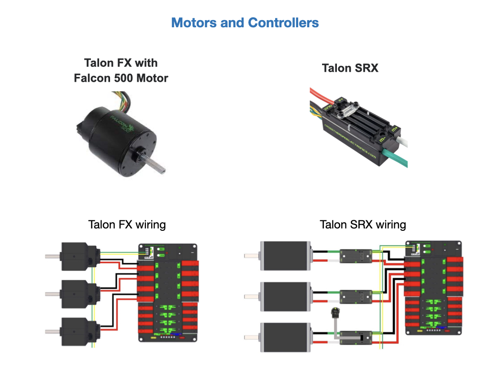
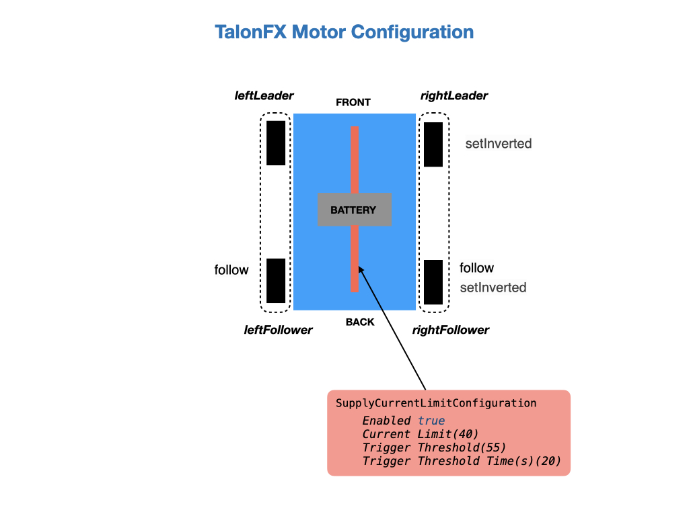

# Configuring Motors and Feedback Sensors
Our team primarily uses the **Falcon 500** motors with integrated **Talon FX** controllers and the **Talon SRX** controllers.  The Falcon 500 is a brushless motor, custom designed specifically for the FIRST Robotics Competition. The Talon SRX controller can be used with **CIM** or **775pro** motors.  The Falcon 500 motors are more compact and require less wiring.

These motors have a lot of features that need to be configured. This can be done using the [Phoenix6 Tuner](https://pro.docs.ctr-electronics.com/en/latest/docs/tuner/index.html) or from the your program code.  Although you can set them up in the Tuner during testing, it's highly recommended to ultimately set them via the program code. This way, in the event a device is replaced, you can rely on your software to properly configure the new device, without having to remember to use Tuner to apply the correct values.

The code segment below shows how the motors are configured for our DifferentialDrive drivetrain.  Some of the same configuration is done on the SwerveDrive robot.  To configure the motors we create a configuration object of a class called *TalonFXConfiguration* that is then applied to each motor.  

    /* Configure the devices */
    var leftConfiguration = new TalonFXConfiguration();
    var rightConfiguration = new TalonFXConfiguration();

We first apply a new *TalonFXConfiguration* object to each motor controller to ensure that it is restored to a known state, thus allowing you to only configure the settings that you intend to change. There are four motors to configure so we can apply the default within a parameterized loop so as not to duplicate code.   

    for (TalonFX fx : new TalonFX[] { this.leftLeader, this.leftFollower, this.rightLeader, this.rightFollower }) {    
      // Apply default configuration
      fx.getConfigurator().apply(new TalonFXConfiguration());     
    }

The `OpenLoopRamps.DutyCycleOpenLoopRampPeriod` prevents instantaneous changes in throttle.  See [Ramping](https://docs.ctre-phoenix.com/en/latest/ch13_MC.html?highlight=configopenloopramp#ramping) for more information.

    leftConfiguration.OpenLoopRamps.DutyCycleOpenLoopRampPeriod = 0.1;  
    rightConfiguration.OpenLoopRamps.DutyCycleOpenLoopRampPeriod = 0.1; 

The `Feedback.FeedbackSensorSource` parameter is used to select the encoder that's used with the motor.  The Talon FX has a sensor integrated into the controller. This is necessary for the brushless commutation and allows the user to use the Talon FX with a high resolution sensor without attaching any extra hardware. The default is *RotorSensor*, which uses the internal rotor sensor in the Talon FX.

    leftConfiguration.Feedback.FeedbackSensorSource = FeedbackSensorSourceValue.RotorSensor;
    rightConfiguration.Feedback.FeedbackSensorSource = FeedbackSensorSourceValue.RotorSensor;

To determine the state of the motor controller bridge when output is neutral or disabled.    

    leftConfiguration.MotorOutput.NeutralMode = NeutralModeValue.Brake;
    rightConfiguration.MotorOutput.NeutralMode = NeutralModeValue.Brake;

Each motor will play a different roll depending on its position in the drivetrain.  For a differential drive robot the motors on the left side of the drivetrain would need to be going in the opposite direction of those on the right. To invert the motors on one side of the drivetrain we use the *MotorOutput.Inverted* configuration parameter. A class called *InvertedValue* is provided to specify the direction of the wheels.

    // Have the wheels on each side of the drivetrain run in opposite directions
    leftConfiguration.MotorOutput.Inverted = InvertedValue.CounterClockwise_Positive;
    rightConfiguration.MotorOutput.Inverted = InvertedValue.Clockwise_Positive;    

Apply the configuration to the wheels.

    this.leftLeader.getConfigurator().apply(leftConfiguration);
    this.leftFollower.getConfigurator().apply(leftConfiguration);
    this.rightLeader.getConfigurator().apply(rightConfiguration);
    this.rightFollower.getConfigurator().apply(rightConfiguration);

To get the rear motors to follow the commands sent to the front motors we use the *Follower* class and the `setControl()` function.  The rear motor is sent the device ID of the motor to follow.  This is set to `false`.  

    // Set up followers to follow leaders
    this.leftFollower.setControl(new Follower(leftLeader.getDeviceID(), false));
    this.rightFollower.setControl(new Follower(rightLeader.getDeviceID(), false));
  
The Talon FX has a new set of inverts that are specific to it, see [Talon FX Specific Inverts](https://docs.ctre-phoenix.com/en/latest/ch13_MC.html?highlight=talonfxinverttype#talon-fx-specific-inverts).

Implement motor safety via `setSafetyEnabled()`.  See [Motor Safety](https://pro.docs.ctr-electronics.com/en/latest/docs/api-reference/wpilib-integration/motorcontroller-integration.html#motor-safety) in the Phoenix6 documentation.

    // Enable safety
    this.leftLeader.setSafetyEnabled(true);
    this.rightLeader.setSafetyEnabled(true);

## Feedback Sensors
In order to do any Close-Loop control (Position, MotionMagic, Velocity, MotionProfile) you will need to have a sensor attached to the motor. There are several sensor types that can be used depending on the application.

#### Rotor Sensor
The TalonFX  has a sensor integrated into the controller. This is necessary for the brushless commutation and allows the user to use the Talon FX with a high resolution sensor without attaching any extra hardware. The selected Feedback Device defaults to *Rotor Sensor*, previously *Integrated Sensor*, for the Talon FX, but you can set it explicitly in code with the following code API statement. 

    driveMotor.Feedback.FeedbackSensorSource = FeedbackSensorSourceValue.RotorSensor;

#### Remote CANcoder
To use another CANcoder on the same CAN bus choose *RemoteCANcoder*.  The TalonFX will update its position and velocity whenever CANcoder publishes its information on CAN bus.  This requires setting the *FeedbackRemoteSensorID*.  A typical use for this would be to control the angle of an arm that is being measured by an absolute encoder.

See [Remote CANcoder](https://pro.docs.ctr-electronics.com/en/latest/docs/api-reference/device-specific/talonfx/remote-sensors.html#remotecancoder) in the Phoenix documentation on how to set it up.

#### Fused CANcoder
The *FusedCANcoder* and Talon FX will fuse another CANcoder's information with the internal rotor, which provides the best possible position and velocity for accuracy and bandwidth.  FusedCANcoder was developed for applications such as swerve-azimuth.

See [Fused CANcoder](https://pro.docs.ctr-electronics.com/en/latest/docs/api-reference/device-specific/talonfx/remote-sensors.html#fusedcancoder) in the Phoenix documentation.

#### Pigeon2 Gyro 
You can use a Pigeon2 on the same CAN bus, picking any one of the three axises (Yaw, Pitch, or Roll). The Talon FX will update its position to match the selected value whenever Pigeon2 publishes its information on CAN bus. Note that the Talon FX position will be in rotations and not degrees.  Here's an example of the setup using the Yaw axis.

    var motorConfig = new TalonFXConfiguration();
    motorConfig.Feedback.FeedbackRemoteSensorID = m_cancoder.getDeviceID();
    motorConfig.Feedback.FeedbackSensorSource = FeedbackSensorSourceValue.RemotePigeon2_Yaw;
    talonMotor.getConfigurator().apply(motorConfig);
 
#### SyncCANcoder

Choose SyncCANcoder (requires Phoenix Pro) and Talon FX will synchronize its internal rotor position against another CANcoder, then continue to use the rotor sensor for closed loop control (note this requires setting FeedbackRemoteSensorID).  The TalonFX will report if its internal position differs significantly from the reported CANcoder position.  SyncCANcoder was developed for mechanisms where there is a risk of the CANcoder failing in such a way that it reports a position that does not match the mechanism, such as the sensor mounting assembly breaking off. 

## Actuator Limit Switches
CTR Electronics actuators, such as the TalonFX, support various kinds of hardware and software limits. See
[Actuator Limit Switches](https://pro.docs.ctr-electronics.com/en/latest/docs/api-reference/api-usage/actuator-limits.html) for details.

<!-- ## Lab - Configure Motors -->
<!-- In this lab your task is to research some of the motor configuration parameters.  Go to the [Phoenix Documentation Website](https://docs.ctre-phoenix.com/en/latest/index.html).  Use the search field to find results for the `setNeutralMode()`, `configSupplyCurrentLimit()`, `configSelectedFeedbackSensor()` motor configuration parameters and read the information provided.  You may have to do a page search after clicking on the result to find the parameter.  After doing your research consider the following questions.

1. What are the two Netural Modes set by `setNeutralMode()` and what is the difference between them?  Switch the Netural Mode from **Coast** to **Brake** and observe the difference while driving the robot.

2. What condition does the `configSupplyCurrentLimit()` setting try to prevent?

3. What does the `configSelectedFeedbackSensor()` configuration do?  What are the default sensors for the TalonFX and TalonSRX?  See [Talon FX/SRX Sensors](https://docs.ctre-phoenix.com/en/latest/ch14_MCSensor.html?highlight=configSelectedFeedbackSensor#bring-up-talon-fx-srx-sensors) in the Phoenix documentation.

Once you understand the configuration parameters you're done with this task! -->

## References

- CTRE - [Phoenix6](https://pro.docs.ctr-electronics.com/en/latest/) documentation.

- CTRE - [Bring Up: Talon FX/SRX and Victor SPX](https://docs.ctre-phoenix.com/en/latest/ch13_MC.html)

- CTRE - [Phoenix Tuner X](https://pro.docs.ctr-electronics.com/en/latest/docs/tuner/index.html)

- FRC Documentation [Motors APIs](https://docs.wpilib.org/en/stable/docs/software/hardware-apis/motors/index.html)

- CTRE - [Falcon 500 Motor User Guide](https://robotics.choate.edu/wp-content/uploads/2020/01/Falcon500UserGuide-20191101.pdf)

- CTRE - [Talon SRX - User’s Guide](https://store.ctr-electronics.com/content/user-manual/Talon%20SRX%20User's%20Guide.pdf)