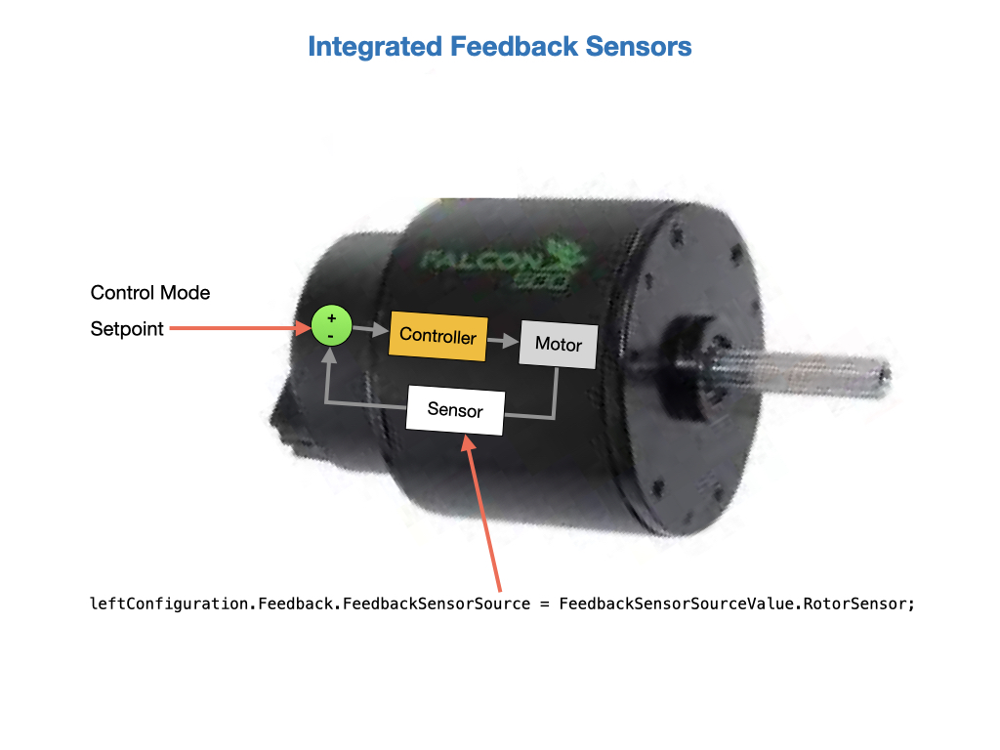

# Motor Control
There are several control modes used to drive a motor. The control mode used will depend on the application.  The modes fall into two larger categories *Open-Loop* and *Closed-Loop*.  Open-Loop control is often used with feedforward to set an arbitrary amount of power to drive the motor.  Closed-Loop modes will alter the motor power based on sensor feedback.

## Open Loop Modes
Open-Loop modes are usually used in combination with a game controller.  The setup is very simple since there's no feedback sensor required.  Here's an example of sending a percentage power output to each motor using the *DutyCycleOut* class.  

    public void tankDriveVolts(double leftVolts, double rightVolts) {
        var leftVoltsRequest = new DutyCycleOut(leftVolts / 12);
        this.leftLeader.setControl(leftVoltsRequest);

        var rightVoltsRequest = new DutyCycleOut(rightVolts / 12);
        this.rightLeader.setControl(rightVoltsRequest);
    }

See [Open Loop Control](https://pro.docs.ctr-electronics.com/en/latest/docs/api-reference/device-specific/talonfx/open-loop-requests.html#open-loop-control) in the Phoenix6 documentation.

## Closed Loop Modes
On the roboRIO robot the motor controllers will implement the necessary PID loops, so we don't have to use the WPILib PID controllers as we did on the Romi.  We still have to write a few lines of code to specify the control mode and a setpoint target, but the motor controller will mostly do the rest.  The following Closed-Loop modes can be used with the Talon FX and SPX motors. For more details see the Phoenix6 [Closed Loop Control](https://pro.docs.ctr-electronics.com/en/latest/docs/api-reference/device-specific/talonfx/closed-loop-requests.html#closed-loop-control) documentation.

- **Position** - The Position Closed-Loop control mode can be used to abruptly servo to and maintain a target position.  Mainly used for mechanisms like elevators and arms that are subject to gravitational forces. See [Position Closed-Loop Control](https://pro.docs.ctr-electronics.com/en/latest/docs/api-reference/device-specific/talonfx/closed-loop-requests.html#position-control) in the Phoenix6 documentation.

- **Velocity** - Velocity Closed-Loop logic is used to maintain a target velocity. Often used for mechanisms like flywheels that need to be kept at a constant speed.  It's also used for the drivetrain where a continuous stream of velocity setpoints are sent drive a desired trajectory. In this mode the controller will try and maintain the velocity regardless of the torque put on the motor.  See [Velocity Closed-Loop Control](https://pro.docs.ctr-electronics.com/en/latest/docs/api-reference/device-specific/talonfx/closed-loop-requests.html#velocity-control) in the Phoenix6 documentation.

- **Motion Magic** - Motion Magic is a control mode for Talon SRX that provides the benefits of Motion Profiling without needing to generate motion profile trajectory points. When using Motion Magic, Talon SRX / Victor SPX will move to a set target position using a motion profile, while honoring the user specified acceleration, maximum velocity (cruise velocity), and optional S-Curve smoothing.  See [Motion Magic](https://pro.docs.ctr-electronics.com/en/latest/docs/api-reference/device-specific/talonfx/closed-loop-requests.html#motion-magic) in the Phoenix6 documentation.

- **Continuous Mechanism Wrap** - A continuous mechanism is a mechanism with unlimited travel in any direction, and whose rotational position can be represented with multiple unique position values. Some examples of continuous mechanisms are swerve drive steer mechanisms or turrets (without cable management). See [Continuous Mechanism Wrap](https://pro.docs.ctr-electronics.com/en/latest/docs/api-reference/device-specific/talonfx/closed-loop-requests.html#continuous-mechanism-wrap) in the Phoenix6 documentation.

The sensors used for closed-loop control are designated during motor configuration.  The most common sensor used with the FalconFX/SRX controller is the *RotorSensor*, formally referred to as the *Integrated Sensor*, which is an encoder that is physically attached to the motor.  We only need to pass in the Control-Mode and setpoint in order to run our closed loop.  

#### Setting PID Gain Values
The Talon FX/SRX can run two PID loops simultaneously, *PID[0]* and *PID[1]*.  You can set up multiple PID gain values and put them into memory slots within the Talon's motor controller.  You can then write code to assign the gain values from a selected slot for each of the PID loops. There are four slots to choose from, so you can configure up to four sets of PID gain values.

The following code sets up the PID values for Slot0 of the drivetrain's front wheels.  The PID values should be determined by experimentation. See [Closed-Loop Gain Slots](https://pro.docs.ctr-electronics.com/en/latest/docs/api-reference/device-specific/talonfx/closed-loop-requests.html#gain-slots) in the Phoenix6 documentation for details.

    for (TalonFX fx : new TalonFX[] { this.leftLeader, this.rightLeader }) {
      // in init function, set slot 0 gains
      var slot0Configs = new Slot0Configs();
      slot0Configs.kS = 0.05; // Add 0.05 V output to overcome static friction
      slot0Configs.kV = 0.12; // A velocity target of 1 rps results in 0.12 V output
      slot0Configs.kP = 0.11; // An error of 1 rps results in 0.11 V output
      slot0Configs.kI = 0.5; // An error of 1 rps increases output by 0.5 V each second
      slot0Configs.kD = 0.01; // An acceleration of 1 rps/s results in 0.01 V output

      fx.getConfigurator().apply(slot0Configs);
    }

We can switch between the PID slots in our code when we make the velocity request to the motor.

    // create a velocity closed-loop request, voltage output, slot 0 configs
    var request = new VelocityVoltage(0).withSlot(0);

    // set velocity to 8 rps, add 0.5 V to overcome gravity
    m_talonFX.setControl(request.withVelocity(8).withFeedForward(0.5));

## Sensors
In order to do any Close-Loop control (Position, MotionMagic, Velocity, MotionProfile) you will need to have a sensor attached to the motor. There are several sensor types used in FRC.
Our team mainly uses the **Talon FX Integrated Sensor** and the **CTRE Magnetic Encoder**.

#### Talon FX Rotory Sensor
    RemoteCANcoder(1),
    RemoteCANcoder(1),
As the name suggests, the [Talon FX Integrated Sensor](https://docs.ctre-phoenix.com/en/latest/ch14_MCSensor.html?highlight=configSelectedFeedbackSensor#talon-fx-integrated-sensor) has a sensor integrated into the controller. This is necessary for the brushless commutation and allows the user to use the Talon FX with a high resolution sensor without attaching any extra hardware. The selected Feedback Device defaults to *Rotor Sensor*, previously *Integrated Sensor*, for the Talon FX, but you can set it explicitly in code with the following API statement.  Other options are RemoteCANcoder and FusedCANcoder.

    Feedback.FeedbackSensorSource = FeedbackSensorSourceValue.RotorSensor;

This sensor has a resolution of `2048` ticks per revolution, so you should place a reference for this in the *Constants* file:

    public static final int kEncoderCPR = 2048;

<!-- Talon FX supports multiple (cascaded) PID loops.     -->

#### CTRE Magnetic Encoder
The [Cross The Road Electronics Magnetic Encoder](https://docs.ctre-phoenix.com/en/latest/ch14_MCSensor.html?highlight=configSelectedFeedbackSensor#cross-the-road-electronics-magnetic-encoder-absolute-and-relative) is actually two sensor interfaces packaged into one ([Quadrature](https://docs.ctre-phoenix.com/en/latest/ch14_MCSensor.html?highlight=configSelectedFeedbackSensor#quadrature) and [Pulse Width](https://docs.ctre-phoenix.com/en/latest/ch14_MCSensor.html?highlight=configSelectedFeedbackSensor#pulse-width-decoder) encoder). Therefore the sensor provides two modes of use: *Absolute* and *Relative*. 

To select feedback sensor use the Phoenix API, call `configSelectedFeedbackSensor()`. The selected “Feedback Device” defaults to Quadrature Encoder for Talon SRX, which puts the sensor in Relative Mode. 

    var fx_cfg = new TalonFXConfiguration();
    fx_cfg.Feedback.FeedbackRemoteSensorID = m_cancoder.getDeviceID();
    fx_cfg.Feedback.FeedbackSensorSource = FeedbackSensorSourceValue.RemoteCANcoder;

    m_talonFX.getConfigurator().apply(fx_cfg);

<!-- m_turretMotor.configSelectedFeedbackSensor(FeedbackDevice.CTRE_MagEncoder_Relative);

To put the sensor in Absolute mode, which uses the Pulse Width Encoder:

m_turretMotor.configSelectedFeedbackSensor(FeedbackDevice.CTRE_MagEncoder_Absolute); -->

<!-- Use `setSensorPhase()` to set the phase of the sensor. A positive PercentOutput yields a positive change in sensor. Sensor phase is not the same as sensor direction. When `setInverted()` is called on a motor controller, the values reported by the selected sensor are also inverted. As a result, changing the SetInverted input does not require changing the sensor phase.

    // Put the motor and sensor going in the same direction
    m_turretMotor.setSensorPhase(true);

    // The motor and sensor are both inverted since they are "in-phase".
    m_turretMotor.setInverted(true);

See the Phoenix documentation for more information about the [Sensor Phase](https://docs.ctre-phoenix.com/en/latest/ch14_MCSensor.html?highlight=configSelectedFeedbackSensor#sensor-check-with-motor-drive). -->

<!-- Both modes of this sensor (Relative and Absolute) have a resolution of `4096` ticks per revolution, so you should place a reference for this in the Constants file:

    public static final int kEncoderCPR = 4096; -->

See [Remote Sensors](https://pro.docs.ctr-electronics.com/en/latest/docs/api-reference/device-specific/talonfx/remote-sensors.html#talonfx-remote-sensors) in the Phoenix6 documentation for each of the remote sensor options.

### Fused Sensor
New in Phoenix 6 is a feedback sensor type called *FusedCANcoder*. *FusedCANcoder* will fuse another CANcoder’s information with the motor’s internal rotor, which provides the best possible position and velocity for accuracy and bandwidth. This is useful in applications such as swerve azimuth. See [FusedCANcoder](https://pro.docs.ctr-electronics.com/en/latest/docs/api-reference/device-specific/talonfx/remote-sensors.html#fusedcancoder) in the Phoenix6 documentation.

<!-- ### Soft Limits
- Soft limits (auto neutral motor if out of range) -->

<!-- Measure distance driven on a drivetrain - Use a Falcon 500 on a single speed drivetrain and get accurate distance measurement without the need of an external encoder. For 2-speed drivetrains, teams should still use an external encoder and an encoder, as the motor can’t measure the difference in wheel speed between high and low gear. -->

## Lab - Motor Control

- Run drivetrain motors using Velocity control. Tune feedforward.

- Drive using MotionMagic. 

- Run drivetrain motors using Position control from a Gyro.

### Drive using Velocity Control
Velocity control is used to drive a mechanism at a set velocity.  In this mode the controller will try and maintain the velocity regardless of the torque put on the motor.  In this task we'll use velocity control to drive each wheel of a drivetrain at a specified velocity.  The controller should maintain this velocity regardless of the mass of the robot or the friction against the wheels.  However, this will be constrained by the battery power or the motor's capabilities.

The velocity will be controlled with the TalonFX controller's built in PID loop, that uses the wheel encoders as feedback sensors.  The loop only needs to know how many encoder ticks that it should maintain every 100 milliseconds. It has no knowledge of the speed of the drivetrain.  Therefore, we'll need to convert our required meters per second into encoder ticks per second.  This will require information about the drivetrain gearing and the diameter of the wheels.

The TalonFX's *ControlMode.Velocity* requires PIDF values to be set.  These values can be placed in one of the PID slots as explained in [Setting PID Gain Values](#pidSlots) above.  The following values seem to work well for our roboRIO training robot.

    public void setWheelPIDF() {

        // set the PID values for each individual wheel
        for(TalonFX fx : new TalonFX[] {leftLeader, rightLeader}){           
            fx.config_kP(0, 0.16, 0);
            fx.config_kI(0, 0.0, 0);
            fx.config_kD(0, 0.0, 0);
            fx.config_kF(0, 0.0, 0);
        }
    }

In order to lessen the work done by the PID loop we'll use *Feedforward* control.  See [Feedforward Control](../Concepts/Control/classicalControl.md#feedforward) for more information.  The whole process is illustrated in the following diagram.

The first thing is to setup the feedforward.  The WPILib *SimpleMotorFeedforward* is used for this.  It takes in measurements obtained during [System Identification](../Romi/Control/romiSystemId.md) and uses them to calculate the motor power required at each speed. This is placed in the constructor.

    // Feedforward contraints          
    public static final SimpleMotorFeedforward kFeedForward = 
        new SimpleMotorFeedforward(ksVolts, kvVoltSecondsPerMeter, kaVoltSecondsSquaredPerMeter);

Since the TalonFX/SRX controllers work in encoder ticks, we'll also need to convert the velocity in  meters per second to encoder ticks per second.  The following functions facilitate this conversion.  Notice, that the drivetrain's wheel diameter and gearing are brought into this calculation.

    public double metersToWheelRotations(double metersPerSecond) {
        return metersPerSecond / (DrivetrainConstants.kWheelDiameterMeters * Math.PI);
    }

    public double wheelRotationsToEncoderTicks(double wheelRotations, Transmission.GearState gearState) {
        if (gearState == Transmission.GearState.HIGH) {
            return wheelRotations * DrivetrainConstants.kEncoderCPR * DrivetrainConstants.kHighGearRatio;
        }
        return wheelRotations * DrivetrainConstants.kEncoderCPR * DrivetrainConstants.kLowGearRatio;
    }

Now we use both methods to convert velocity meters per second to encoder ticks.

    public double metersToEncoderTicks(double metersPerSecond) {
		GearState gearState = this.gearStateSupplier.get();
		double encoderTicks = this.wheelRotationsToEncoderTicks(
			this.metersToWheelRotations(metersPerSecond),
			gearState
		);
		return encoderTicks;
	}

We're now ready to create a method called `setOutputMetersPerSecond()` that accepts the meters per second for each wheel.  It calculates the values required for the velocity control loop.  The `set()` function of the motor controller is set to *ControlMode.Velocity*. The required velocity (in encoder ticks per 100ms) is then passed into the function for each wheel. The parameter values are set separately for each wheel, since we may want them to go at different speeds in order to drive a curved path. 

A demand type of *ArbitraryFeedForward* is used to enable the feedforward control.  Units for the arbitrary feedforward term are a value between `[-1,+1]`. See [Arbitrary Feed Forward](https://docs.ctre-phoenix.com/en/stable/ch16_ClosedLoop.html?highlight=DemandType.ArbitraryFeedForward#arbitrary-feed-forward) in the Phoenix documentation for more details.

 Once the power requirements are set they are sent to the motors using the *DifferentialDrive* `feed()` function.

    public void setOutputMetersPerSecond(double leftMetersPerSecond, double rightMetersPerSecond) {
        
        // Calculate feedforward for the left and right wheels.
        double leftFeedForward = m_feedForward.calculate(leftMetersPerSecond);
        double rightFeedForward = m_feedForward.calculate(rightMetersPerSecond);

        // Convert meters per second to encoder ticks per second
        double leftVelocityTicksPerSec = metersToEncoderTicks(leftMetersPerSecond);
		double rightVelocityTicksPerSec = metersToEncoderTicks(rightMetersPerSecond);

        // Set the power for each wheel. Convert TicksPerSec to ticks per 100ms
        m_leftLeader.set(ControlMode.Velocity, 
                        leftVelocityTicksPerSec/10.0, 
                        DemandType.ArbitraryFeedForward, 
                        leftFeedForward / DrivetrainConstants.k_MaxVolts);
        m_rightLeader.set(ControlMode.Velocity, 
                        rightVelocityTicksPerSec/10.0, 
                        DemandType.ArbitraryFeedForward, 
                        rightFeedForward / DrivetrainConstants.k_MaxVolts);

        // Feed the motors
        m_differentialDrive.feed();
    }

#### Testing Velocity Control
We'll need some telemetry in order to do the testing, so create the `publishTelemetry()` function to put the wheel speeds out to *SmartDashboard*.  Don't forget to call it from the `periodic()` function. Here we're converting encoder ticks back to meters per second.

    public void publishTelemetry() {
        double leftEncoderVelocity = m_leftLeader.getSelectedSensorVelocity();
        double rightEncoderVelocity = m_rightLeader.getSelectedSensorVelocity();
        double leftVelocity = ((encoderTicksToMeters(leftEncoderVelocity)) * 10);
        double rightVelocity = ((encoderTicksToMeters(rightEncoderVelocity)) * 10);

        SmartDashboard.putNumber("Left Wheel Speed", leftVelocity);
        SmartDashboard.putNumber("Right Wheel Speed", rightVelocity);
    }

Create a command.

### Drive using MotionMagic
Currently no lab for this task.
<!-- remember that you have really switched to a position control loop once you select Motion Magic.

You then tune P, I, D just like you would for a normal position loop. 

Cruise will determine your max speed while the motor runs toward the target. Accel sets the ramp rate on motor acceleration and then slowdown.

Use the feedforward from previous task.
select a starting point for Accel, Cruise, and P.
        _rightConfig.motionAcceleration = 2000; //(distance units per 100 ms) per second
		_rightConfig.motionCruiseVelocity = 2000; //distance units per 100 ms

[Setting Motion Magic Cruise Velocity And Acceleration](https://docs.ctre-phoenix.com/en/latest/ch16_ClosedLoop.html?highlight=motionacceleration#setting-motion-magic-cruise-velocity-and-acceleration)        

Memorize blink codes.

The outer PID controller will control the distance and the inner PID controllers will control the motor speeds. It's a velocity loop inside of a position loop. Essentially, the outer position loop tells the inner velocity loop what to do.   -->

<!-- #### Testing Motion Magic
- Put the Talon in velocity mode
- Set the current limit to protect the motor and mechanics.
- Zero out F, P, I, D

        public void setWheelPIDF() {
            // set the PID values for each individual wheel
            for(TalonFX fx : new TalonFX[] {m_leftLeader, m_rightLeader}){           
                fx.config_kP(0, 0, 0);
                fx.config_kI(0, 0, 0);
                fx.config_kD(0, 0, 0);
                fx.config_kF(0, 0, 0);
            }
        }

- Command a midrange velocity (remember you are in velocity mode)
- Start increasing F until the motor runs about the commanded speed (with all the values set at zero, nothing will move until you start increasing F)
- Once you get F set to a level where the motor runs about the commanded speed, you then command the motor to run several different speeds. Pick a low, mid, high depending on the intended speed range you plan to use. Look at the error on all three speeds and decide if you need to tweak F a little. The goal it to get the motor to run approximately the commanded speed. It won’t be exact. It is a “best fit” given the range of motor speeds you plan to use. -->

<!-- [ChiefDelphi post](https://www.chiefdelphi.com/t/some-questions-about-motion-magic/400422) -->

### Drive using Position Control
In this task you'll control the drivetrain motors in order to keep the robot level.  For this we'll need to use a Gyro as the feedback sensor.

Create a control output function in the Drivetrain.

    public void tankDriveVolts(double leftVolts, double rightVolts) {
        this.leftLeader.set(ControlMode.PercentOutput, leftVolts / 12);
        this.rightLeader.set(ControlMode.PercentOutput, rightVolts / 12);
        this.diffDrive.feed();
    }
    
Create a command to balance the robot.  The constructor should look like this.

    public Balance(Drivetrain drivetrain)
        super(
            // The controller that the command will use
            new PIDController(0.018, 0, 0.001),
            // This should return the measurement
            () -> drivetrain.getPitch(),
            // This should return the setpoint (can also be a constant)
            () -> 0,
            // This uses the output
            output -> {
                // Use the output here
                drivetrain.tankDriveVolts(output, output);
                });

        // Use addRequirements() here to declare subsystem dependencies.
        addRequirements(drivetrain);
        m_drivetrain = drivetrain;
        
        // Configure additional PID options by calling `getController` here.
    }

    public void initialize() {
        super.initialize();  
        m_drivetrain.tankDriveVolts(0,0);
        m_drivetrain.disableMotorSafety();   
    }

    // Returns true when the command should end.
    @Override
    public boolean isFinished() {
        return false;
    }

    public void end(boolean interrupted) {
        super.end(interrupted);
        m_drivetrain.tankDriveVolts(0,0);
        m_drivetrain.enableMotorSafety();   
    }

### Balance Robot 
[Viking Wiki](https://github.com/FRC-2928/VikingRobot2023/wiki#balance-robot)

These go in the *Balance* command. We set the gyro pitch as a sensor and start the position loop with a setpoint of zero degrees. Once started it will just keep balancing until another command requiring the drivetrain gets executed.  The motors will switch back to use the encoders when the command gets interrupted.

    public Balance(Drivetrain drivetrain) {
        this.addRequirements(drivetrain);
        m_drivetrain = drivetrain;
    }
    
    // Switch over to gyro pitch as a sensor and start the loop
    @Override
    public void initialize() {
        super.initialize();       
        m_drivetrain.setPIDSlot(0);
        m_drivetrain.setPigeonSensors();
        m_drivetrain.disableMotorSafety(); 
        m_drivetrain.setPosition(0);   
    }

    // Keep this command running until it gets overridden
    @Override
    public boolean isFinished() {
        return false;
    }

    // Set everything back
    public void end(boolean interrupted) {
        super.end(interrupted);
        m_drivetrain.setPIDSlot(1);
        m_drivetrain.setIntegratedSensors();
        m_drivetrain.enableMotorSafety();   
    }    

These go in the Drivetrain.

    // Revert back to the integrated sensors (encoders)
    public void setIntegratedSensors() {
        // Configure the motors
        for (TalonFX fx : new TalonFX[] { m_leftLeader, m_leftFollower, m_rightLeader, m_rightFollower }) {    
        // Use 1-to-1 coefficient for the encoders.
        fx.configSelectedFeedbackCoefficient(1);
        fx.configSelectedFeedbackSensor(FeedbackDevice.IntegratedSensor); 
        }
    }

    // Use Gyro Pitch as the sensor
    public void setPigeonSensors() {
        // Configure the motors
        for (TalonFX fx : new TalonFX[] { m_leftLeader, m_rightLeader}) {    
        // Configure the RemoteSensor0 and set it to the Pigeon pitch source
        fx.configRemoteFeedbackFilter(m_pigeon.getDeviceID(), 
                                        RemoteSensorSource.Pigeon_Pitch, 
                                        0);
        // Convert Yaw to tenths of a degree
        fx.configSelectedFeedbackCoefficient(3600.0 / DrivetrainConstants.kPigeonUnitsPerRotation);                              
        fx.configSelectedFeedbackSensor(FeedbackDevice.RemoteSensor0); 
        }
    }

    public void setPIDSlot(int slot) {
        int PID_PRIMARY = 0;
        m_leftLeader.selectProfileSlot(slot, PID_PRIMARY);
        m_rightLeader.selectProfileSlot(slot, PID_PRIMARY);
    }

    // Controls to the setpoint using the internal feedback sensor
    public void setPosition(double setpoint) {
        this.leftLeader.set(ControlMode.Position, setpoint);
        this.rightLeader.set(ControlMode.Position, setpoint);
        this.diffDrive.feed();
    }

## References

- [Phoenix6 Control](https://pro.docs.ctr-electronics.com/en/latest/docs/api-reference/device-specific/talonfx/index.html)

- [Pheonix6 Examples](https://github.com/CrossTheRoadElec/Phoenix6-Examples/tree/main/java)    

<!-- - [Pheonix Documentation](https://docs.ctre-phoenix.com/en/stable/) -->

- [Talon FX/SRX Sensors](https://docs.ctre-phoenix.com/en/latest/ch14_MCSensor.html?highlight=configSelectedFeedbackSensor#bring-up-talon-fx-srx-sensors) - Phoenix documentation.

- [Pheonix6 Tuner](https://pro.docs.ctr-electronics.com/en/latest/docs/tuner/index.html)

- [Talon FX/Falcon 500 Motor User Guide](https://store.ctr-electronics.com/content/user-manual/Falcon%20500%20User%20Guide.pdf)

- [Talon SRX - User’s Guide](https://store.ctr-electronics.com/content/user-manual/Talon%20SRX%20User's%20Guide.pdf)