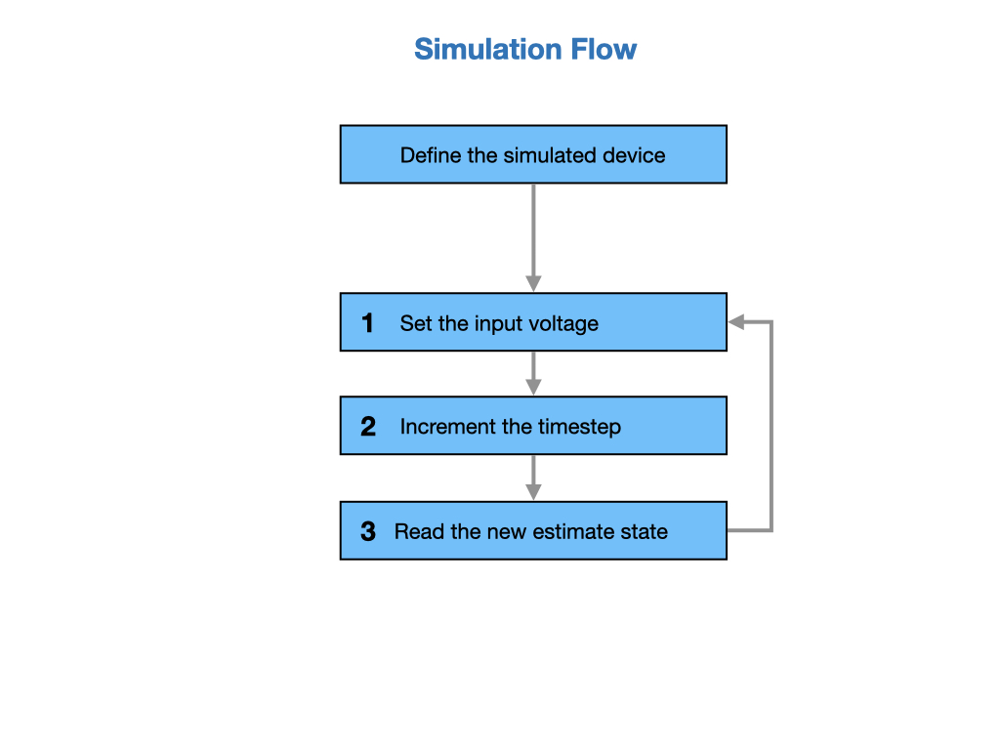
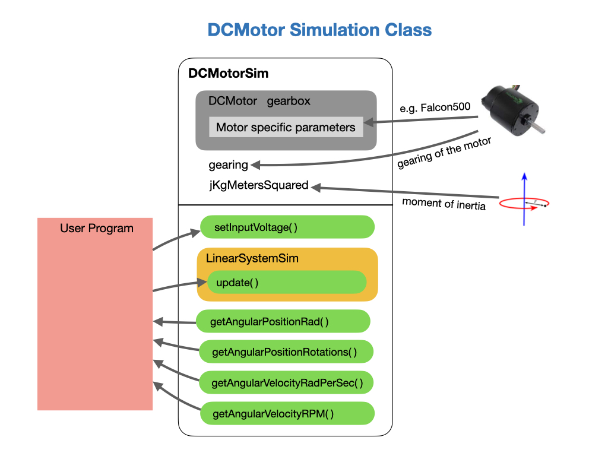

# Robot Simulation
Often a team may want to test their code without having an actual robot available. WPILib provides teams with the ability to simulate various robot features using simple gradle commands. To enable and run simulation in VSCode see [Introduction to Robot Simulation](https://docs.wpilib.org/en/stable/docs/software/wpilib-tools/robot-simulation/introduction.html).

## Simulation Program Flow
The flow of a robot simulation is similar to that of a real robot.  An input voltage is applied to the device, such as a motor, that causes it to move.  Since the simulated robot has no actual device attached the movement needs to be predicted. This is done by advancing a timestamp by a small amount and predicting how far the device would have moved during that time period. The input voltage and dynamics of the system are used in order to make the prediction. 

The prediction is done using a simulation class called a *LinearSystem*. The *LinearSystem* models a real system and calculates the new position of a device, such as a motor, via an `update()` function. See [State Space Control](../Concepts/Control/stateSpaceControl.md) in this guide for more details on how linear system models work. 

The last step is to read the predicted positions of the system and use them to show the robot's location in a simulation tool.

A full example of how a simulation is implemented can be found in this [SwerveDrive Example](https://github.com/Mechanical-Advantage/AdvantageKit/tree/main/example_projects/advanced_swerve_drive/src/main).  Refer to the *ModuleIOSim* class.

## The *DCMotorSim* Class
*DCMotorSim* is probably the most important simulation class that we'll use.  This class requires a definition of the motor that you'll be using together with it's gearing and moment of inertia. The user program sets an input voltage value to simulate the robot.  The *DCMotorSim* class builds a Linear System model internally in order to calculate the new position of the system via an `update()` function. (see [State Space Control](../Concepts/Control/stateSpaceControl.md) in this guide). 

There are a number of parameters that need to be supplied when defining a DCMotor, such as *Torque when stalled* or *Angular velocity under no load*. Fortunatelly, these are all provided for us in the Phoenix API.  Just select the motor that you're using and the number of motors in a gearbox (usually 1).  For example.

	private DCMotorSim driveSim = new DCMotorSim(DCMotor.getFalcon500(1), 6.75, 0.025);

The *gearing* and *moment of inertia* of the DC motor must also be provided.  These can be obtained from simulation examples. Use the ones shown above as a starting point.	

As the program runs the `setInputVoltage()` is usually called from the `simulationPeriodic()` loop of the subsystem, or from the `execute()` phase of a command, using:

	driveSim.setInputVoltage(driveAppliedVolts);

The Linear System model	is then updated to compute the new positions of the system.  This would again be done in the `simulationPeriodic()` loop every `0.02`seconds.

	driveSim.update(0.02);

Finally, the predicted positions of the system can be read and used to show the robot's location in a simulation tool.

	drivePositionRad = driveSim.getAngularPositionRad();

<!-- ## Lab - Robot Simulation
Create the simulated objects for the drive and turn motors of a swerve drive chassis.

    private DCMotorSim driveSim = new DCMotorSim(DCMotor.getFalcon500Foc(1), 6.75, 0.025);
	private DCMotorSim turnSim = new DCMotorSim(DCMotor.getFalcon500Foc(1), 150.0 / 7.0, 0.004);

Create functions to set the voltages on the motors.

	public void setDriveVoltage(double volts) {
		driveAppliedVolts = MathUtil.clamp(volts, -12.0, 12.0);
		driveSim.setInputVoltage(driveAppliedVolts);
	}

	public void setTurnVoltage(double volts) {
		turnAppliedVolts = MathUtil.clamp(volts, -12.0, 12.0);
		turnSim.setInputVoltage(turnAppliedVolts);
	}

Run `update` on the motors to progress them forward one timestamp.  This would be done in the `simulationPeriodic()` loop every `0.02`seconds.

	driveSim.update(0.02);
    turnSim.update(0.02);

The drive and turn motors can then be read.

	inputs.drivePositionRad = driveSim.getAngularPositionRad();
	inputs.turnPosition = new Rotation2d(turnSim.getAngularPositionRad());

And be used to update odometry.

	inputs.odometryDrivePositionsRad = new double[] {inputs.drivePositionRad};
    inputs.odometryTurnPositions = new Rotation2d[] {inputs.turnPosition}; -->

## CANivore Hardware Attached Simulation
CANivore supports hardware-attached simulation when used in an FRC robot program. This allows a CANivore to be used with real devices on supported host operating systems, see [CANivore Hardware Attached Simulation](https://pro.docs.ctr-electronics.com/en/latest/docs/canivore/canivore-hardware-attached.html).

## References

- FRC Documentation [Device Simulation](https://docs.wpilib.org/en/stable/docs/software/wpilib-tools/robot-simulation/device-sim.html) 

- Phoenix Documentation [Simulation](https://docs.ctre-phoenix.com/en/latest/ch15a_Simulation.html#simulation)

- Phoenix [Simulation Code Example](https://github.com/CrossTheRoadElec/Phoenix6-Examples/blob/main/java/Simulation/src/main/java/frc/robot/Robot.java)

- AdvantageKit [SwerveDrive Example](https://github.com/Mechanical-Advantage/AdvantageKit/tree/main/example_projects/advanced_swerve_drive/src/main) with Simulation