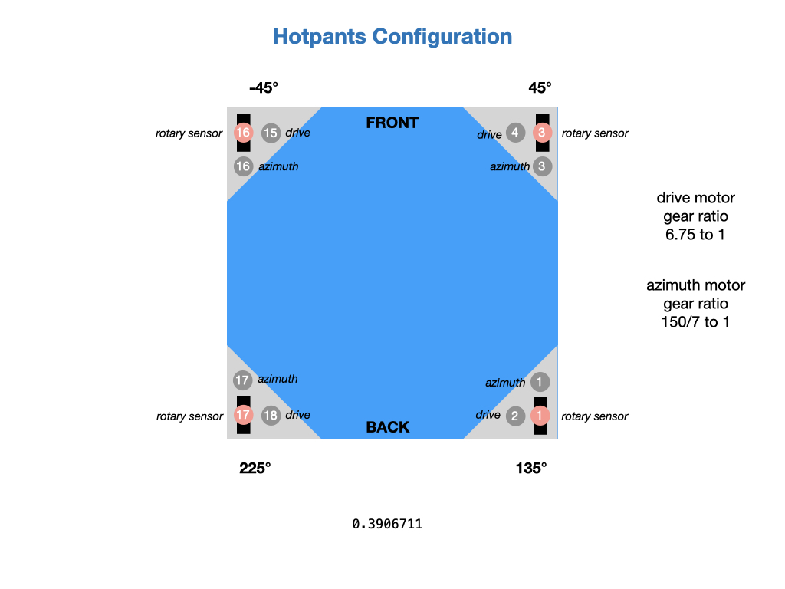
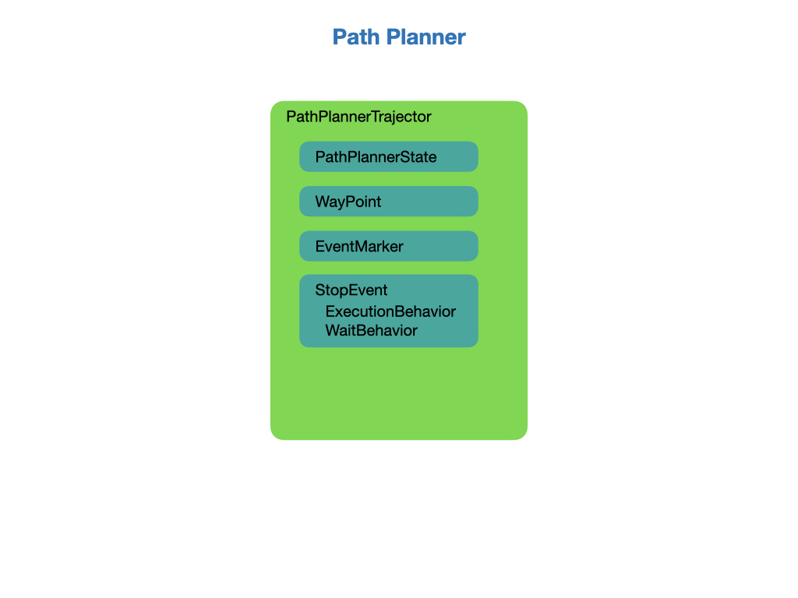
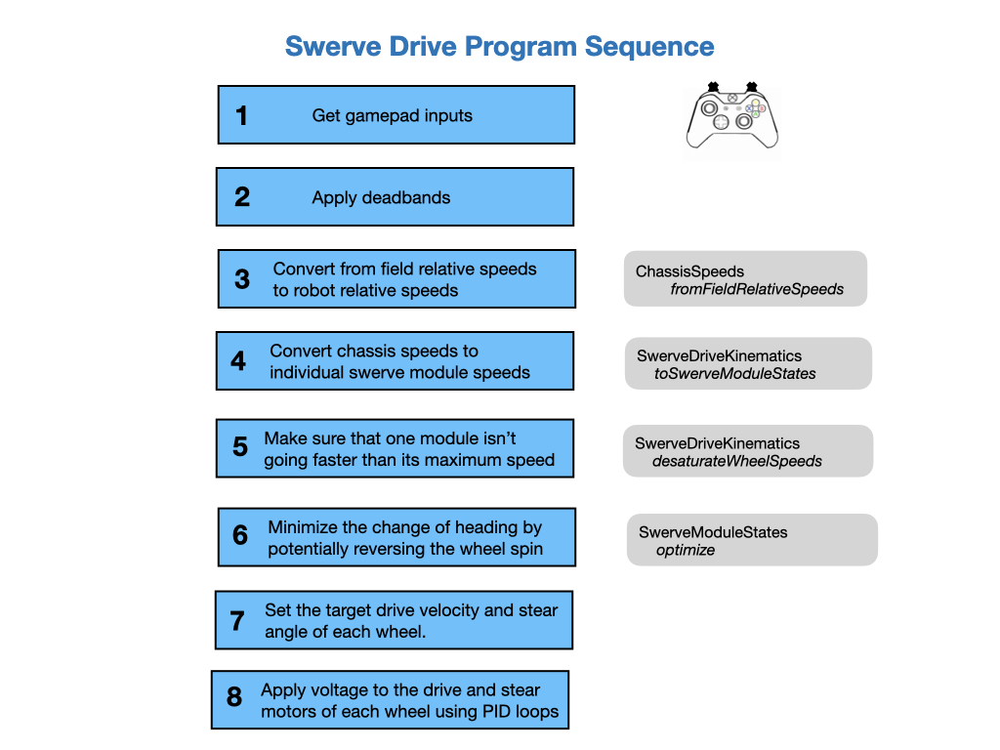
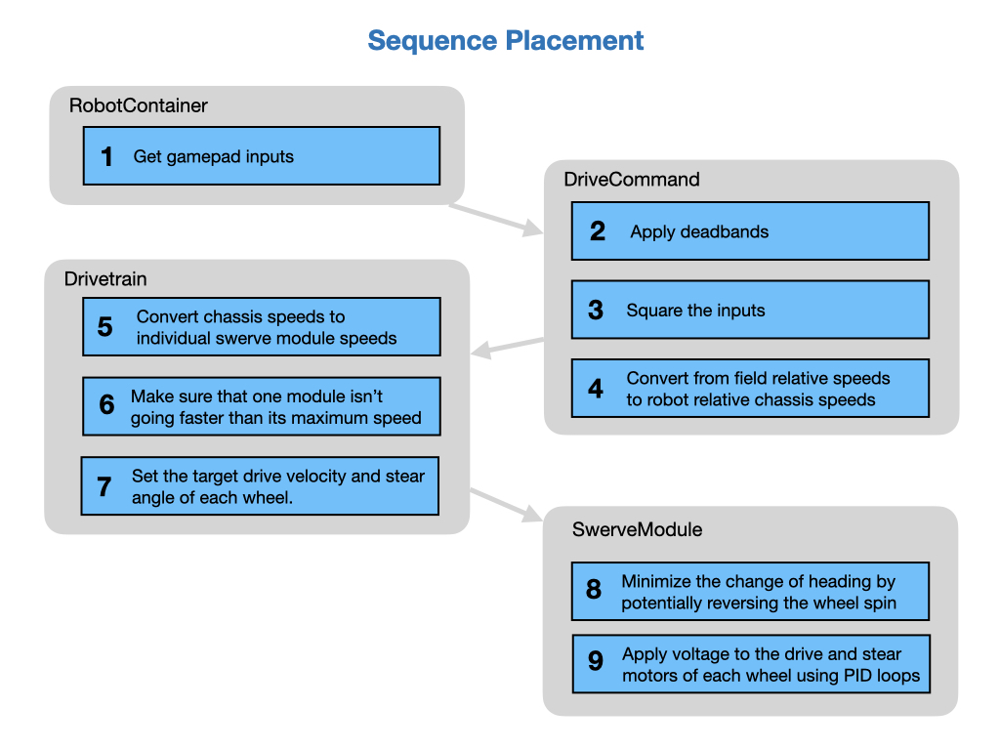
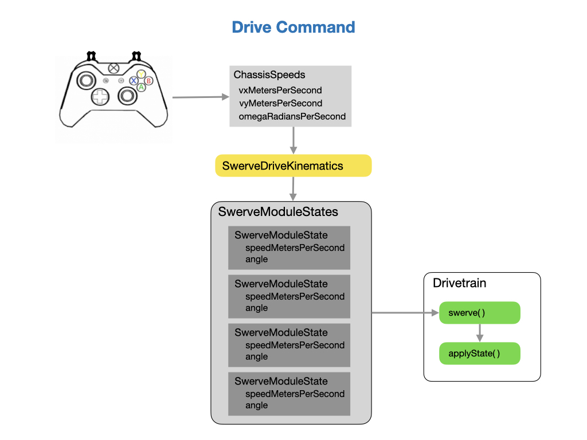
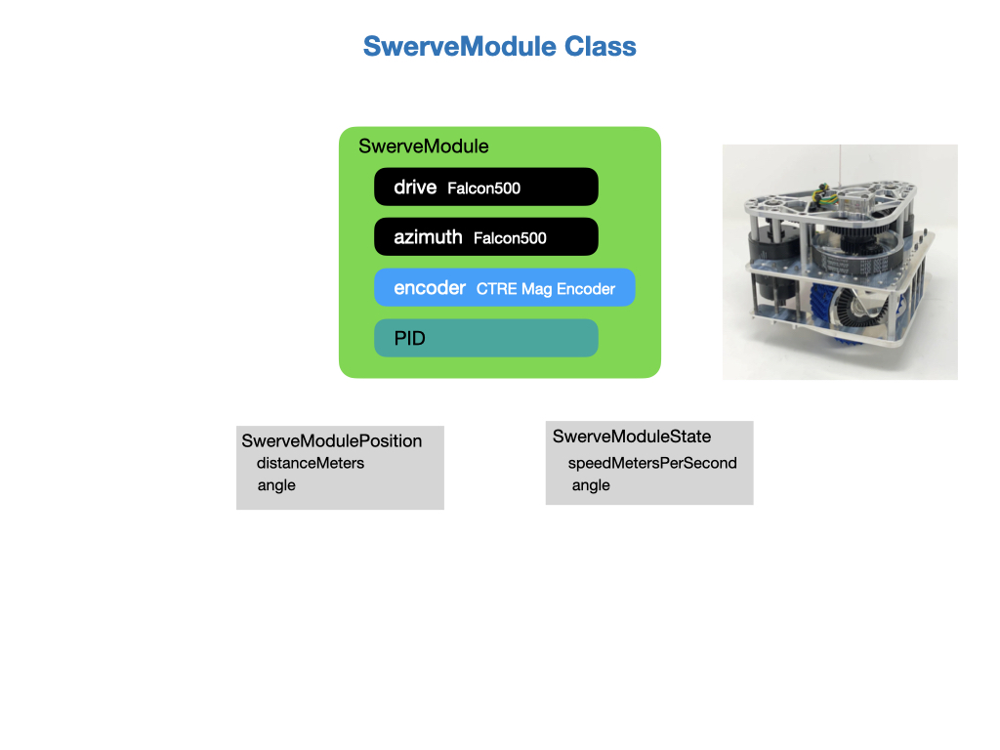

# Swerve Drive
This section describes how the *Swerve Drive* drivetrain works.  Swerve drive, also known as holonomic or omnidirectional drive, is a unique drive system used in the FIRST Robotics Competition (FRC). It allows for precise control of both translational and rotational movement. This precision is valuable for tasks that require accurate positioning, such as aligning to score game pieces or navigating in tight spaces.

The programming team has a dedicated robot for learning and for preparing our code for competition.  The hardware configuration for this robot is shown below.

For a full code example of a Swerve Drive chassis see this [Advanced SwerveDrive Example](https://github.com/Mechanical-Advantage/AdvantageKit/tree/main/example_projects/advanced_swerve_drive/src/main). This example also incorporates [AdvantageKit](https://github.com/Mechanical-Advantage/AdvantageKit/blob/main/docs/WHAT-IS-ADVANTAGEKIT.md), which is an advanced logging and simulation framework.

## Configuring Swerve Drive in the Phoenix Tuner X 
Before running any robot code the Swerve Drive chassis can be configured and verified in the *Phoenix6 Tuner X*.  The tuner gives you a view of the entire Swerve Drive chassis and ensures that all of the modules work together as a single unit.  Under the Mechanisms page in Tuner X is the *Swerve Project Generator*. This utility guides the user through configuring their modules, verifying their drivetrain, encoder inverts, drivetrain inverts and more.

Setting Offsets

- For finding the offsets, use a piece of 1x1 metal that is straight against the forks of the front and back modules (on the left and right side) to ensure that the modules are straight.

- Point the bevel gears of all the wheels in the same direction (either facing left or right), where a postive input to the drive motor drives the robot forward (you can use phoenix tuner to test this). If for some reason you set the offsets with the wheels backwards, you can change the driveMotorInvert value to fix.

- Open smartdashboard (or shuffleboard and go to the smartdashboard tab), you will see 4 printouts called "Mod 0 Cancoder", "Mod 1 Cancoder", etc. 

- If you have already straightened the modules, copy those 4 numbers exactly (to 2 decimal places) to their respective angleOffset variable in constants. 

Note: The CANcoder values printed to smartdashboard are in degrees, when copying the values to angleOffset you must use Rotation2d.fromDegrees("copied value").

See the [Swerve Project Generator](https://pro.docs.ctr-electronics.com/en/latest/docs/tuner/tuner-swerve/index.html) for detailed instructions on running the configuration and verification of the drive train.

## Hardware API Configuration
The swerve drive robot uses four modules that are represented by the *SwerveModule* class in our code.  Each module consists of two Falcon500 motors.  One motor drives the wheel linearly and the other rotates the wheel in the desired direction.  There's a [CTRE CANcoder](https://store.ctr-electronics.com/cancoder/), which is a rotary sensor, that determines the angle of the wheel with respect to the robot chassis.

Each module is assembled onto the chassis to implement the robot.  The drive motors will provide linear motion whereas the azimuth motor will rotate the wheel to the desired angle.  The numbering relates to the CANbus port of each device.  Since the rotary sensor is a different device from the motor it's allowed to have the same port number.  The port mappings are listed in the *Contants* file of the code.

Program code objects need to implemented to represent each of the hardware components and their functionality.  The *Drivetrain* object encapsulates the all of the drive train components and coordinates their activity.  The *SwerveModule* represents each swerve drive hardware module together with its functionality.  Each swerve module comprises two motors, one for lateral movement and the other to control the steer angle.  A rotary encoder is used to track the steer angle.

## Swerve Drive Program Sequence
Programming a Swerve Drive robot is a little more complicated than programming a Differential Drive robot.  The general flow is documented in the following diagram that shows the programming steps required to translate commands sent in from a game controller to the point at which power is sent to each of the eight motors that make up the Swerve Drive chassis. 

The decision on where to place each of these steps is left up to the implementer. A possible implementation is shown below.  Steps 7 and 8 must be done in the *SwerveModule*.  You could also do step 6 in the *SwerveModule* instead of the *Drivetrain*.  Some implementations might do step 2 in *RobotContainer*.

## Drivetrain Class
The drivetrain requires an object for each of the four swerve modules.  There needs to be a way to translate the required speed and direction of the drivetrain chassis into the individual speed and direction of each of the four wheel modules.  This is the job of the *SwerveDriveKinematics* class, which takes in the locations of the wheels relative to the physical center of the robot in order to compute the required control input for each wheel. These control inputs tell the wheel how fast it should be going and what angle it should be at.

After the wheel control inputs have been calculated by the *SwerveDriveKinematics* class the *Drivetrain* sets the wheel velocities.

A gyro is required to track the orientation of the robot with respect to the game field.

## SwerveModule Class
The following picture shows the [MK4i Swerve Module](https://www.swervedrivespecialties.com/products/mk4i-swerve-module) that we use and it's representation by the *SwerveModule* class in the code.  The current distance travelled by the wheel and its current angle is given by the *SwerveModulePosition* data structure.  The *SwerveModuleState* data structure holds the current wheel speed and angle.

The wheel is turned to the required angle by a PID controller that is driven off of the rotary sensor.  This sensor will boot to it's absolute position, meaning that it will maintain its angle between startups.  The absolute position is initially set to zero when all wheels are pointed forwards. 

## Drive Command
The objective of the *Drive* command is to convert a user provided field-relative set of speeds into a *ChassisSpeeds* data structure that represents the required speeds and direction of the robot chassis.  

Prior to creating the *ChassisSpeeds* structure it might apply deadbands to the game controller inputs.

<!-- This data structure is sent to the *SwerveDriveKinematics* class that can translate the required chassis speeds into instructions for each of the four wheel modules.  These instructions will tell the module how fast it should be going and what angle it should be at.  The instructions are carried out by the `swerve()` method of the *Drivetrain* class.  This method first ensures that none of the wheels exceed their max speed and then applies the state (speed and direction) to each motor in order to obtain the required chassis speeds.  An important thing to note is that the applied states are from the robots frame of reference not field frame of reference. -->

<!-- *CTREModuleState* `optimize()` - Accepts the desired state and the current module angle. Minimize the change in heading the desired swerve module state would require by potentially reversing the direction the wheel spins.  

Button to switch robot from field centric to robot centric. 

Need position to encoder counts, and meters per/sec to encoder counts per/100 milliseconds.  Look at BaseFalconSwerve Conversions.java 

Check CTREConfigs for motor and encoder. -->

<!-- Azimuth motor should be *Position* in open and closed loop mode. Drive motor is *PercentOutput* in open loop and *Velocity* or *Position* in closed loop.  -->

<!--  -->

<!-- The drive command will use a PID controller to control the orientation of the robot relative to the game field.  The controller uses the Pigeon gyro as the sensor input. The robot's angle is considered to be zero when it is facing directly away from your alliance station wall. -->

## Odometry and Pose Estimation
It's important to keep track of the robot's position and heading on the game field during the course of the match. This is especially useful during the autonomous period for complex tasks like path following.  This is function is performed by the *SwerveDriveOdometry* class that takes readings from your swerve drive encoders and swerve azimuth encoders.  

During the course of the match the odometry may become less accurate, perhaps as a result of collisions with other robots. To mitigate this we can use the *SwerveDrivePoseEstimator* class, which is a wrapper for the *SwerveDriveOdometry* class, and provides the additional functionality of fusing camera data to come up with a more accurate estimate of the where the robot is.

Update the position of each module.  This must be done from somewhere in the `periodic()` routine.

    public SwerveModulePosition updateModulePosition() {
        return new SwerveModulePosition(getPositionMeters(), getAngle());
    }

    public double getPositionMeters() {
        return 
            Constants.Drivetrain.driveGearMotorToWheel
                .forward(
                    // Constants.Drivetrain.motorEncoderToRotations.forward(this.drive.getRotorPosition().getValue())
                    Constants.Drivetrain.motorEncoderToRotations.forward(this.inputs.drivePositionRotations)
                );
    }

    public Rotation2d getAngle() {
        // Rotation2d.fromRotations(this.encoder.getAbsolutePosition().getValue())
        return  this.inputs.turnAbsolutePosition;
    }

    public SwerveModulePosition getPositionDelta() {
        var delta = new SwerveModulePosition(getPositionMeters() - lastPositionMeters, getAngle());
        SmartDashboard.putNumber(this.place.name() + " Position Meters", getPositionMeters());
        SmartDashboard.putNumber(this.place.name() + " Delta", delta.distanceMeters);
        lastPositionMeters = getPositionMeters();
        return delta;
    }
### Phoenix SwerveDrive API
Phoenix software provides some [Swerve API](https://pro.docs.ctr-electronics.com/en/latest/docs/api-reference/api-usage/swerve/swerve-overview.html) libraries that may be a useful resource.  This would be difficult to intergrate into a project using *AdvantageKit*, so may only be useful for code ideas at this time.

## References

- AdvantageKit [SwerveDrive Example](https://github.com/Mechanical-Advantage/AdvantageKit/tree/main/example_projects/advanced_swerve_drive/src/main)

- [MK4i Module](https://www.swervedrivespecialties.com/products/mk4i-swerve-module)

- [CTRE CANcoder](https://store.ctr-electronics.com/cancoder/)

- [CTRE CANcoder User Guide](https://store.ctr-electronics.com/content/user-manual/CANCoder%20User's%20Guide.pdf)