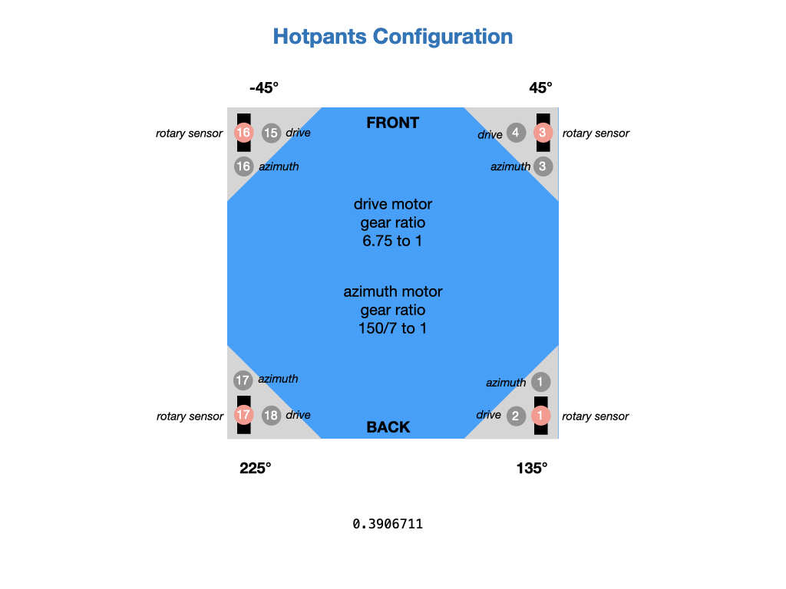
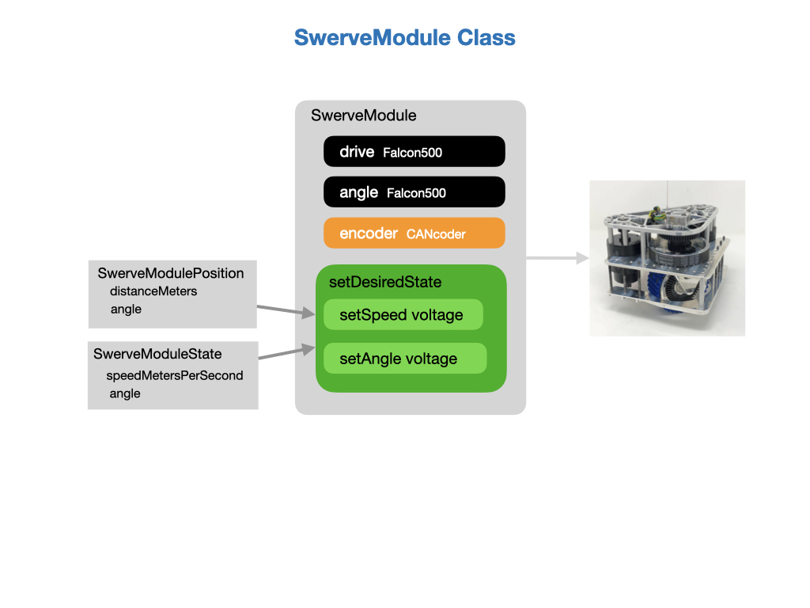

# Swerve Drive
This section describes how the *Swerve Drive* drivetrain works.  Swerve drive, also known as holonomic or omnidirectional drive, is a unique drive system used in the FIRST Robotics Competition (FRC). It allows for precise control of both translational and rotational movement. This precision is valuable for tasks that require accurate positioning, such as aligning to score game pieces or navigating in tight spaces.

The programming team has a dedicated robot for learning and for preparing our code for competition.  We call this robot *Hotpants*, the configuration of which is shown below.

## Hardware Configuration
The swerve drive robot uses four modules that are represented by the *SwerveModule* class in our code.  Each module consists of two Falcon500 motors.  One motor drives the wheel linearly and the other rotates the wheel in the desired direction.  There's a [CTRE CANcoder](https://store.ctr-electronics.com/cancoder/), which is a rotary sensor, that determines the angle of the wheel with respect to the robot chassis.

Each module is assembled onto the chassis to implement the robot.  The drive motors will provide linear motion whereas the azimuth motor will rotate the wheel to the desired angle.  The numbering relates to the CANbus port of each device.  Since the rotary sensor is a different device from the motor it's allowed to have the same port number.  The port mappings are listed in the *Contants* file of the code.

## SwerveModule Class
The following picture shows the [MK4i Swerve Module](https://www.swervedrivespecialties.com/products/mk4i-swerve-module) that we use and it's representation by the *SwerveModule* class in our code.  The current distance travelled by the wheel and its current angle is given by the *SwerveModulePosition* class.  The *SwerveModuleState* data class holds the current wheel speed and angle.

The wheel is turned to the required angle by a PID controller that is driven off of the rotary sensor.  This sensor will boot to it's absolute position, meaning that it will maintain its angle between startups.  The absolute position is initially set to zero when all wheels are pointed forwards. 

## Drivetrain
The drivetrain requires an object for each of the four swerve modules.  These are contained in an array so as they can be efficiently processed together.  There needs to be a way to translate the required speed and direction of the drivetrain chassis into the individual speed and direction of each of the four wheel modules.  This is the job of the *SwerveDriveKinematics* class, which takes in the locations of the wheels relative to the physical center of the robot in order to compute the required wheel control inputs.  The SwerveDriveKinematics class also performs forward kinematics to return the resulting chassis state from the given module states. This method is used for odometry, determining the robot's position on the field using data from the real-world speed and angle of each swerve module on the robot.

There are two data classes to identify where each swerve module is positioned on the robot and to keep track of the current state of each module (speed and direction). 

A gyro is required to track the orientation of the robot within the game field.

## Drive Command
The objective of the *Drive* command is to take input from the game controller and create a data structure that represents the required speeds and direction of the robot chassis.  This data structure is sent to the *SwerveDriveKinematics* class that can translate the required chassis speeds into instructions for each of the four wheel modules.  These instructions will tell the module how fast it should be going and what angle it should be at.  The instructions are carried out by the `swerve()` method of the *Drivetrain* class.  This method first ensures that none of the wheels exceed their max speed and then applies the state (speed and direction) to each motor in order to obtain the required chassis speeds.  An important thing to note is that the applied states are from the robots frame of reference not field frame of reference.

The drive command will use a PID controller to control the orientation of the robot relative to the game field.  The controller uses the Pigeon gyro as the sensor input. The robot's angle is considered to be zero when it is facing directly away from your alliance station wall.

## Odometry and Pose Estimation
It's important to keep track of the robot's position and heading on the game field during the course of the match. This is especially useful during the autonomous period for complex tasks like path following.  This is function is performed by the *SwerveDriveOdometry* class that takes readings from your swerve drive encoders and swerve azimuth encoders.  

During the course of the match the odometry may become less accurate, perhaps as a result of collisions with other robots. To mitigate this we can use the *SwerveDrivePoseEstimator* class, which is a wrapper for the *SwerveDriveOdometry* class, and provides the additional functionality of fusing camera data to come up with a more accurate estimate of the where the robot is.
          
## References

- [MK4i Module](https://www.swervedrivespecialties.com/products/mk4i-swerve-module)

- [CTRE CANcoder](https://store.ctr-electronics.com/cancoder/)

- [CTRE CANcoder User Guide](https://store.ctr-electronics.com/content/user-manual/CANCoder%20User's%20Guide.pdf)