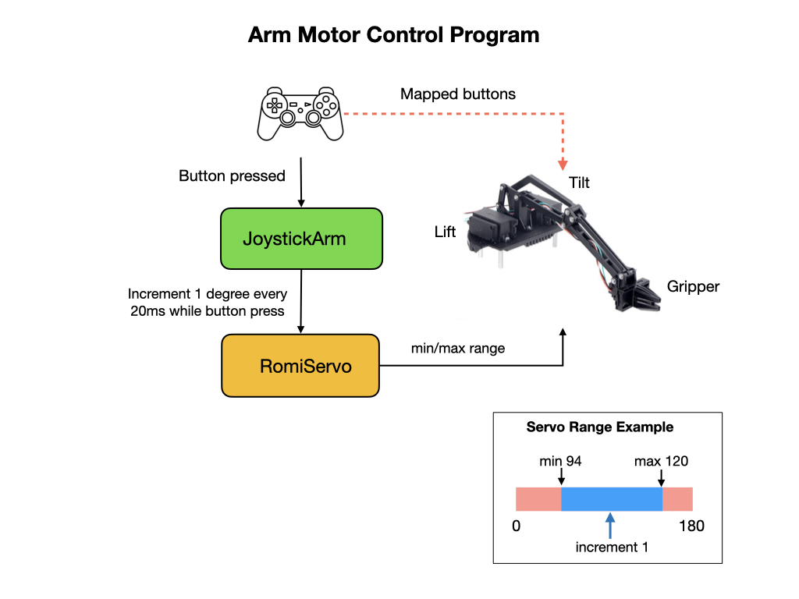

# Romi Robot Arm
In this module we'll be creating code to control the [Robot Arm kit for Romi](https://www.pololu.com/product/3550) from Pololu. This project will be called [BasicArm](https://github.com/FRC-2928/RomiExamples/tree/main/BasicArm) which will include the following updates to the **RomiReference** project.

Before reading this section please review the [SimpleArm documentation](https://github.com/bb-frc-workshops/romi-examples/tree/main/simpleArm) on the BB FRC Workshops site.  This will be our starting point but we'll use the [RomiServo](romiServos.md) class for our project.

## Controlling the Robot Arm
This is a diagram of the end-to-end software stack required to operate the robot arm.  As with all of our projects communication with the Romi will take place via the Simulator that connects to the NodeJS application running on the Raspberry Pi. This in turn sends messages to the microcontroller that is responsible for directly controlling the arm's servos using PWM.

In order to control the arm within our java project, we'll create a subsystem called *Arm* that brings together three servos that make up the arm.  The servos will control the Gripper, Lift, and Tilt components of the arm using methods of the *Arm* class.  Later we can assign a joystick or Simulator button  to each of the three arm components via a command and every time the button is pressed the related arm component is moved.  This is done incrementally in the [RomiServo](romiServos.md) class.  

    private final RomiServo m_gripper = new RomiServo(ArmConstants.GRIPPER_PORT);
    private final RomiServo m_tilt = new RomiServo(ArmConstants.TILT_PORT);
    private final RomiServo m_lift = new RomiServo(ArmConstants.LIFT_PORT);

Method used to increment the tilt component.

    public void tilt(double delta) {
      m_tilt.incrementServo(delta);
    }

There are minimum and maximum limits to the range of motion of the arm.  The range of the servo is 0 to 180 degrees but that is too large a range for the arm. We've already setup a method in *RomiServo* to restrict the servo range so we can use that to setup the ranges for our arm components.  The min and max values for your Romi Arm may be slightly different.  We can also set a default angle for the arm components.

    public Arm() {
      // Set the min/max range for each component
      m_gripper.setAngleRange(ArmConstants.GRIPPER_MIN, ArmConstants.GRIPPER_MAX);
      m_tilt.setAngleRange(ArmConstants.TILT_MIN, ArmConstants.TILT_MAX);
      m_lift.setAngleRange(ArmConstants.LIFT_MIN, ArmConstants.LIFT_MAX);

      // Set the default angle position
      m_tilt.setDefaultAngle(ArmConstants.TILT_MIN);
      m_lift.setDefaultAngle(ArmConstants.LIFT_MIN);
    }

## Robot Arm Startup
There's an issue with the robot arm when it's attached to the Romi with the FRC software stack installed.  The microcontroller will initiate prior to you starting your java program and it will activate the arm servos outside of their safe operating ranges.  This results in the arm crashing down onto the ground if the Romi Arm is built according to the instructions.  To prevent this the firmware on the Romi has to be updated.  

The problem is illustrated in the diagram below. The microcontroller gets the PWM signals for the servos from the *external IO buffers*.  See [Romi Onboard and External IO](../SC/romiGPIO.md) for a description of these. Whenever your java program is not running, or is *Disabled*, the `rPiLink.buffer.extIoValues` are set to zero. This translates to a servo position of 90 degrees, which is outside of the safe range of the servo.  Unfortunatelly, there's no way to control this from your java program since it's no longer connected to the microcontroller.  The only way to resolve this problem is to modify the microcontroller firmware.

The firmware has been updated to prevent the servos from going outside of their safe ranges and includes three new functions: `initializeArm(), incrementWrites()`, and `doWritesForArm()`.  In order to use those functions you must press the **A Button** on the microcontroller to switch it into *Arm Mode*.  The modified [firmware program](https://github.com/mjwhite8119/wpilib-ws-robot-romi/blob/main/firmware/src/main.cpp) can be viewed on Github. To install this version of the firmware follow the instructions in the [Romi Firmware](../../SoftwareInstall/romiFirmware.md) module.

Follow this startup procedure.

1. Make sure that the power to the arm servos is disconnected when you switch on the Romi.  

2. Press the **A Button** on the microcontroller.

3. Connect the power to the servos.

4. Start your java program. 

Currently, the Romi will remain in *Arm Mode* until it is restarted.

## The JoystickArm Command
The JoystickArm command incrementally moves the robot arm components as you press buttons on the joystick...   

Before filling out these methods with code let's think about what subsystems and components we'll need to create this command.  We'll certainly need the Arm subsystem.  The Arm will move in response to a button pressed on the Joystick so we'll also need to get a reference to that.

Import the *Arm* class at the top of the file and create a private variable it.  

    public final Arm m_arm = new Arm();

Pass the Arm and Joysick into the constructor and set the Arm as a requirement.  Also assign the private arm and joystick variables to the parameters that you just passed in.

    m_arm.setDefaultCommand( new JoystickArm(m_arm, m_joystickIO));

## Positioning the Arm
It would be useful to have a command that move the arm to the fully up or down position with a single button press.
This section documents positioning the arm in the fully up and down position... 

## Testing the Arm Command
We can test the Arm command either by using the joystick or from Shuffleboard.  We'll setup our program to use both methods.  
To use the joystick

To use Shuffleboard add the following code to the `RobotContainer` class.

## References
[Robot Arm kit for Romi](https://www.pololu.com/product/3550)

[Romi Arm example - github](https://github.com/Pearadox/Romi/tree/master/src/main/java/frc/robot)

<h3>
<a href="romiCode7">Previous</a>

<a href="colorSensor">Next</a></h3>