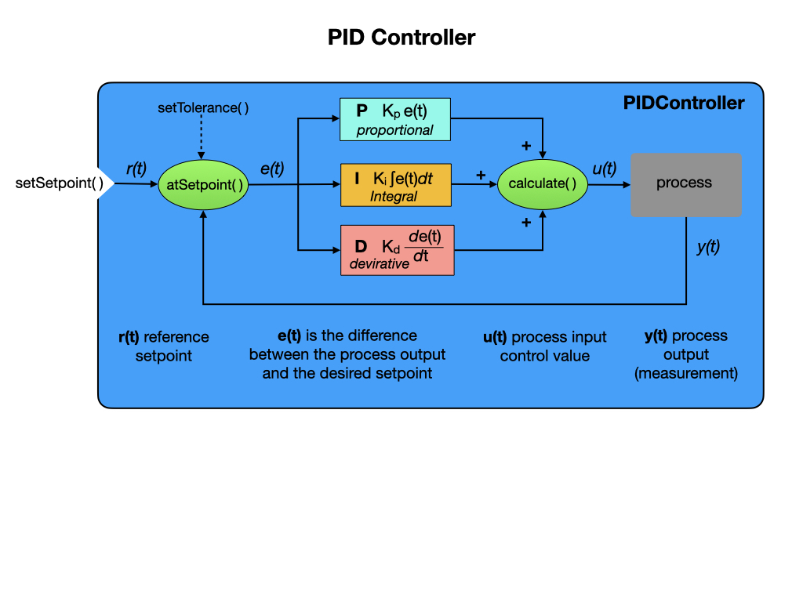

# Motion PID Control
Now that our robot has some basic functionality we're going to add some new commands that'll give us more control over how it moves.  We'll be using a *PID Controller* that enables the robot to constantly monitor its current state and adjust its motor speeds as it drives towards its goal. We can think of this as *Motion PID Control*, the *PID* stands for **P**roportional, **I**ntegral, and **D**erivative.  For a more in-depth explaination refer to [Classical Control](../../Concepts/Control/classicalControl.md) module of this training guide. 

Motion PID Control allows our robot to move autonmously.  In this module we'll create two new commands that we'll test in Autonomous Mode from the SendableChooser dropdown menu.

- *DriveDistancePID* that will drive the robot in a straight line.

- *TurnToAnglePID* that will allow the robot to turn to a specified angle.  

## PID Controller
Before looking at the PID controller supplied by the WPI library, it would be useful to get an understanding of what PID control is by watching the [PID Introduction Video by WPI](https://docs.wpilib.org/en/stable/docs/software/advanced-controls/introduction/pid-video.html). A schematic of WPIlib PIDController is shown below with a detailed explaination found in the [Introduction to PID](https://docs.wpilib.org/en/stable/docs/software/advanced-controls/introduction/introduction-to-pid.html) section of the FRC documentation.

### Tuning the PID Controller
To get the PID controller to perform properly it will will most likely need to be tuned.  The [Tuning a PID Controller](https://docs.wpilib.org/en/stable/docs/software/advanced-controls/introduction/tuning-pid-controller.html) documentation gives some information on the process.

Tuning the PID controller can be done in the Simulator or Shuffleboard. The PID Controller parameters *setpoint, P, I*, and *D* can be found under *LiveWindow*.  In the Simulator you can find the PID tuning parameters under *NetworkTables->Shuffleboard->Drivetrain*. Prior to re-running each test you have to reset the odometry.  You created the *ResetOdometry* command in a previous lab, so you can run it by selecting it from the *SendableChooser* menu and running **Autonomous**.

<!-- We would want to change the PID values from Shuffleboard and see the results without restarting our program.  To do this we will add in the Network Tables instance and table to our program:

    private static NetworkTableInstance inst = NetworkTableInstance.getDefault();
    private static NetworkTable table = inst.getTable("Shuffleboard/Drivetrain");

Then override the PID command's `initialize()` method to update the *P* and *D* parameters:

    public void initialize() {
      super.initialize();
      // Override PID parameters from Shuffleboard
      getController().setP(table.getEntry("kP").getDouble(1.0));
      getController().setD(table.getEntry("kD").getDouble(0.0));
    }

You can also override the `execute()` method to add Shuffleboard diagnostics.

    public void execute() {
      super.execute();
      SmartDashboard.putNumber("Pos. Error", getController().getPositionError());
      SmartDashboard.putBoolean("atGoal", getController().atGoal());
    } -->

View [Testing and Tuning PID Loops](https://docs.wpilib.org/en/stable/docs/software/wpilib-tools/shuffleboard/advanced-usage/shuffleboard-tuning-pid.html) for more information.

### Setting up the Gyro    
We have already setup the getHeading() method in the [Subsystems](romiSubsystems#heading) module but there are a few of things we need to do in order to setup the gyro as a measurement source.  

- Ensure that the gyro is calibrated, which is done on the Romi Website.  Follow the [IMU Calibration](https://docs.wpilib.org/en/stable/docs/romi-robot/web-ui.html#imu-calibration) instructions.

- Set `enableContinuousInput(-180, 180)` in your PID turn commands. Rather then using the max and min input range as constraints, it considers them to be the same point and automatically calculates the shortest route to the setpoint.

- Reset the gyro angles each time we start the program.  This is done in the *Drivetrain* constructor where is calls its own `resetGyro()` method.

## Lab - Motion Control PID
This lab builds on the code that you wrote in the [Telemetry](romiTelemetry.md) section of the training guide.  In this lab you'll learn about the following Java programming concepts:

- [Java Lambdas](https://www.w3schools.com/java/java_lambda.asp) A lambda expression is a short block of code which takes in parameters and returns a value. Lambda expressions are similar to methods, but they do not need a name and they can be implemented right in the body of a method.

- *Consumer interface* is a functional interface; it takes an argument and returns nothing.
Java Consumer is a functional interface which represents an operation that accepts a single input argument and returns no result. Unlike most other functional interfaces, Consumer is expected to operate via side-effects.  The Consumer's functional method is accept(Object). It can be used as the assignment target for a lambda expression or method reference.

- *Supplier interface* which represents a function which does not take in any argument but produces a value of type T. The lambda expression assigned to an object of Supplier type is used to define its `get()` which eventually produces a value. Suppliers are useful when we don’t need to supply any value and obtain a result at the same time.  The Supplier interface consists of only one function `get()`.

There are two tasks for this lab:

- *DriveDistancePID* that will drive the robot in a straight line.

- *TurnToAnglePID* that will allow the robot to turn to a specified angle.  

### The DriveDistancePID Command
To create a *PIDCommand* in VSCode right click under the commands folder and select *Create a new class/command*.  Then select **PIDCommand (new)** from the drop down list.  Call the command *DriveDistancePID*.  The constructor of the new *DriveDistancePID* command is shown below.  

We're going to modify this command to adapt it to our specific need of driving the robot in a straight line.  Here's a pictorial representation of how we need to setup our PID controller.

Notice that the PIDCommand is instantiating a PIDController, which is an algorithm that implements the control of our robot.  The *PIDController* class requires to know what its **P**roportional, **I**ntegral, and **D**erivative values are.  We're going to start with the **P**  value set to `1.2` and the **I**, and **D** values set to zero.  Since these values are constants they should be put in the *Constants* file.  Here's how they should be defined:

    // For distances PID
    public static final double kPDriveVel = 1.1;
    public static final double kIDriveVel = 0.0;
    public static final double kDDriveVel = 0.0;

The values are passed into the PIDController as parameters.  You'll need to import the *Constants* class:

    new PIDController(Constants.kPDriveVel,
                      Constants.kIDriveVel,
                      Constants.kDDriveVel),

We need to pass in the target distance to tell the command how far to drive together with the *Drivetrain* class. These two parameters are passed in when the *DriveDistancePID* constructor is called and the Command object is created. We'll add the *Drivetrain* as a requirement.  

    public DriveDistancePID(double targetDistance, Drivetrain drivetrain) {

The `targetDistance` that you passed in becomes the *setpoint* for the PID controller, so you can replace the setpoint value `() -> 0` with `targetDistance`.  Like so:

    // This should return the setpoint (can also be a constant)
    () -> targetDistance,

The `() -> 0` is a [lambda](https://www.w3schools.com/java/java_lambda.asp) expression, which is a short block of code which takes in parameters and returns a value. Lambda expressions are similar to methods, but they do not need a name and they can be implemented right in the body of a method.

Next, we're going to add in the feedback part of our PID control loop, which in this case is the current distance that the robot has travelled.  Remember, that we have a method in the *Drivetrain* class called `getAverageDistanceMeters()`.  We'll used this as our measurement source for our PID Controller. Use the `getAverageDistanceMeters()` method in our lambda expression, like this:

    // This returns the measurement from the encoders
    () -> drivetrain.getAverageDistanceMeters(),

Once the controller has calculated how much power is required for the motors the value is output to the *DriveTrain*'s `arcadeDrive()` method.  It provides linear speed and no rotation.

    output -> {
      // Use the output here
      drivetrain.arcadeDrive(output, 0);
    }

The *measurementSource* and *output* setup a looping arrangement which moves the robot towards the *setpoint*.  In our case, the measurement source are the encoders, that a measuring distance, and the output is sent to the motors in order to move the robot. Once the setpoint is reached the command will finish.

The full constructor for our **DriveDistancePID** command is listed below.

    public DriveDistancePID(double targetDistance, Drivetrain drivetrain) {
    super(
      // The controller that the command will use
      new PIDController(Constants.kPDriveVel,
                        Constants.kIDriveVel,
                        Constants.kDDriveVel),
      // This should return the measurement
      () -> drivetrain.getAverageDistanceMeters(),
      // drivetrain::getAverageDistanceMeters,
      // This should return the setpoint (can also be a constant)
      () -> targetDistance,
      // This uses the output
      output -> {
        // Use the output here
        drivetrain.arcadeDrive(output, 0);
      });

      // Use addRequirements() here to declare subsystem dependencies.
      addRequirements(drivetrain);

      // Configure additional PID options by calling `getController` here.
    }

The last thing we need to do is tell the command to finish once it has reached the setpoint.  The PID controller has a method called `atSetpoint()` that returns the boolean value `true` if the setpoint has been reached.  Remember, that our setpoint is the `targetDistance` that we assigned in the PIDCommand.  This value is returned in the `isFinished()` method of our *DriveDistancePID* command.

    public boolean isFinished() {
      return getController().atSetpoint();
    }

In order to run the command you'll need to add it to the SendableChooser in the *RobotContainer* class.  Have the robot travel for distance of 0.5 meters.

    m_chooser.addOption("Drive Distance PID", new DriveDistancePID(0.5, m_drivetrain));

#### Testing the DriveDistancePID Command
Now connect your laptop to a Romi and test your code.  When the Simulator starts we'll need to pull some components onto the dashboard in order to see how the command is functioning.  First make sure that you have the dropdown list of commands by selecting *NetworkTables->SmartDashboard->SendableChooser*.  Then from *NetworkTables->LiveWindow* select the two components shown on the picture below.  When you're done your dashboard should show the following four components:

Select the *DriveDistancePID* command and run it in Autonomous mode.  You should see your robot move forward.  However, there may be a problem!  If you look at the */LiveWindow/Drivetrain* component you may find that the command is still running.  Somehow it didn't finish.  Checking the distance travelled you see that it hasn't reached `0.5` meters, it never gets to the setpoint.  This is because with just the **P** parameter set the output value gets so small that it can no longer drive the motors.  In order to have it complete you would need to add a value to the **I** parameter.  Try assigning a value of `0.2` to see if the command to finishes.

Another thing that we might want to consider is how close to the setpoint is "good enough"?  Maybe if we're within a certain percentage of the setpoint then that would be acceptable.  The `setTolerance()` method sets the position and velocity error which is considered tolerable for use with the setpoint. Place this just after `addRequirements()` statement.

    // Configure additional PID options by calling `getController` here.
    getController().setTolerance(0.05, 0.06);

Now test the command again.  If the command still doesn't finish try changing the **P** and **I** parameters together with the `setTolerance()` values.  This is part where you learn to do PID tuning.

For more details on what we've just done read the [PID Control through PIDSubsystems and PIDCommands](https://docs.wpilib.org/en/latest/docs/software/commandbased/pid-subsystems-commands.html#) section of the FRC documentation.

### The TurnToAnglePID Command
The process for creating this command will be very similar to the DriveDistancePID command.  This command will rotate the robot to a specified angle.  

Create a new PIDCommand using the method in the previous lab and call it *TurnToAnglePID*.  We again need a *PIDController* with the **P**roportional, **I**ntegral, and **D**erivative values.  For turning we'll start with the **P** set to `0.05` and **I**, **D** set to zero.  These values will be different from the ones used to drive distance so create a new set of constants in the *Constants* file.  

    // For turns PID
    public static final double kPTurnVel = 0.05;
    public static final double kITurnVel = 0.0;
    public static final double kDTurnVel = 0.0;

We add the *Drivetrain* as a requirement and tell the command what angle we want to rotate to.  This angle becomes the *setpoint* for the PID controller.  These two parameters are passed in when the *TurnToAnglePID* constructor is called and our command object is created.

The *measurementSource* and *output* setup a looping arrangement which rotates the robot towards the *setpoint*.  In our case, the measurement source is a gyro, so we'll use `getHeading()`.  The output is sent to the motors in order to turn the robot. Turning the robot is facilitated by the `zaxisRotate` parameter of `arcadeDrive()`, which is in the second position.

    drivetrain.arcadeDrive(0, output);

One thing we can be certain about is that we're very unlikely to hit our setpoint.  A single degree of turn is a very hard target to hit, so lets add some tolerance in from the start.  Let's say `5.0` degrees:

    getController().setTolerance(5.0, 10.0);

One other optimization is that we want -180 and 180 to be considered the same point so as the controller automatically calculates the shortest route to the setpoint.

    getController().enableContinuousInput(-180, 180);

The full constructor for our **TurnToAngle** command is listed below.

    /** Creates a new TurnToAnglePID. */
    public TurnToAnglePID(double targetAngleDegrees, Drivetrain drivetrain) {
      super(
          // The controller that the command will use
          new PIDController(Constants.kPTurnVel,
                            Constants.kITurnVel, 
                            Constants.kDTurnVel),
          // This should return the measurement
          () -> drivetrain.getHeading(),
          // This should return the setpoint (can also be a constant)
          () -> targetAngleDegrees,
          // This uses the output
          output -> {
            // Use the output here
            drivetrain.arcadeDrive(0, output);
          });

      // Use addRequirements() here to declare subsystem dependencies.
      addRequirements(drivetrain);

      // Configure additional PID options by calling `getController` here.
      getController().enableContinuousInput(-180, 180);
      getController().setTolerance(5.0, 10.0);
    }

Once the setpoint is reached we need the command to finish, so don't forget to check the setpoint in the `isFinished()` method.

    public boolean isFinished() {
      return getController().atSetpoint();
    }    

#### Testing the TurnToAnglePID Command

The command tends to overshoot the target angle by about 10 degrees.  To improve that result you can try adding a very small amount to the **D** parameter.  Try a value of `0.005` to begin with.

## References

- Video resource - [Everything You Need to Know About Control Theory](https://resourcium.org/journey/companion-resources-everything-you-need-know-about-control-theory) by Brian Douglas.

- FRC Documentation - [PID Basics](https://docs.wpilib.org/en/stable/docs/software/advanced-controls/introduction/index.html)

- FRC Documentation - [PID Control through PIDSubsystems and PIDCommands](https://docs.wpilib.org/en/latest/docs/software/commandbased/pid-subsystems-commands.html#)

- FRC  Documentation - [PID Control in WPILib](https://docs.wpilib.org/en/stable/docs/software/advanced-controls/controllers/pidcontroller.html)

- Code Example - [BasicPID](https://github.com/FRC-2928/RomiExamples/tree/main/BasicPID)

- FRC Programming Done Right -[PID Control](https://frc-pdr.readthedocs.io/en/latest/control/pid_control.html)

- TexasRobots - [Motion Magic Video](https://www.youtube.com/watch?v=xlQW8vGJWEs&ab_channel=texasRobots) YouTube