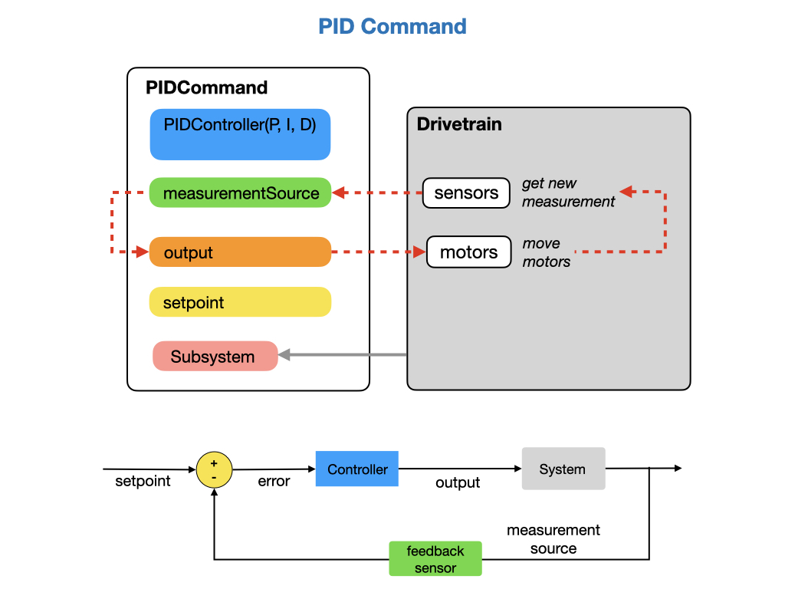
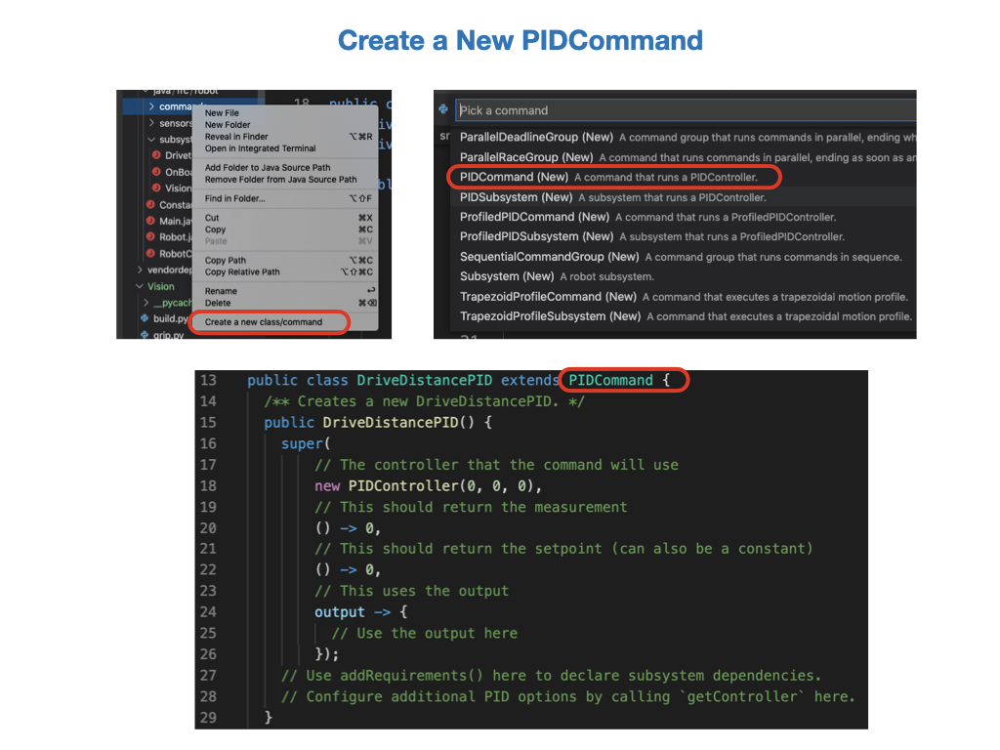
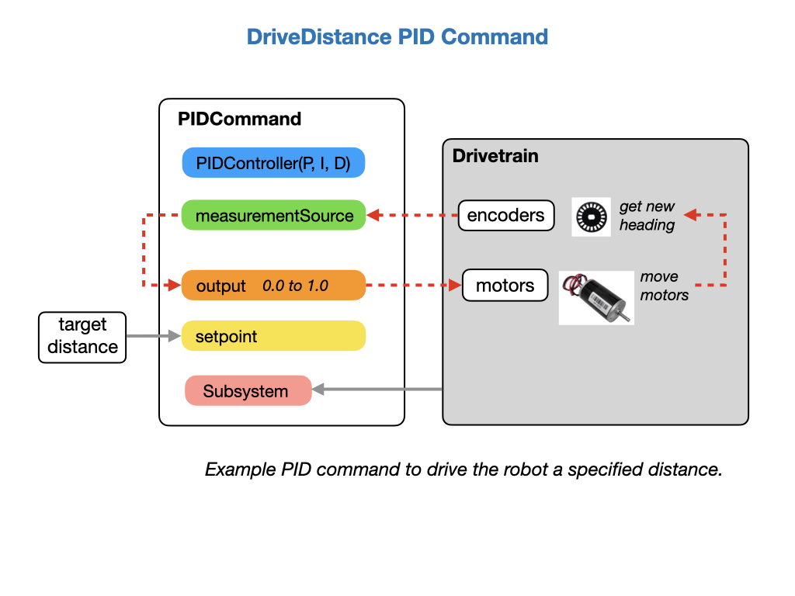
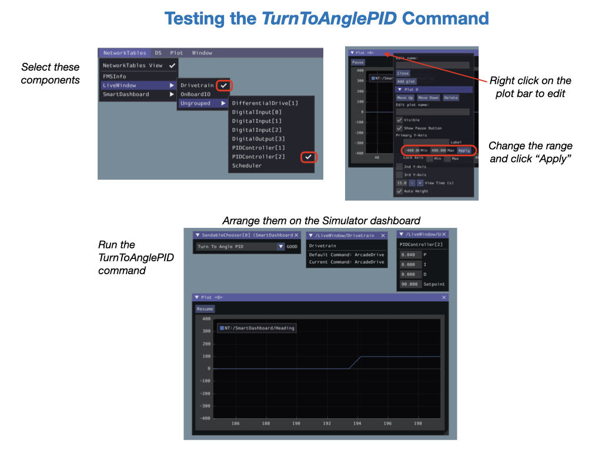

# Motion PID Control
Now that our robot has some basic functionality we're going to add some new commands that'll give us more control over how it moves.  We'll be using a *PID Controller* that enables the robot to constantly monitor its current state and adjust its motor speeds as it drives towards its goal. Since we're using PID to control motion we'll refer to this as *Motion PID Control*, the *PID* stands for **P**roportional, **I**ntegral, and **D**erivative.  PID control is expained in-depth in the [Classical Control](../../Concepts/Control/classicalControl.md) module of this training guide. You should read that module before moving on.

Motion PID Control allows our robot to move autonmously.  In this module we'll create two new commands that we will test in **Autonomous** mode from the SendableChooser dropdown menu.

- *DriveDistancePID* that will drive the robot a specified distance.

- *TurnToAnglePID* that will allow the robot to turn to a specified angle.  

## PID Controller
A PID controller has been implemented by the WPI library.  The controller is used by a PID command to autonomously move the robot from one position to another.  The command sets up a feedback loop where it reads the robot's sensors to find its current position and then applies power to each of the motors driving it towards its setpoint.  The power output is calculated by the PID controller using the P, I, and D values passed in at the start of the procedure.  The measurement source is a function provided by the Drivetrain that constantly measures to robot's current position. The output is another Drivetrain function that sends power to the motors.

### Tuning the PID Controller
To get the PID controller to perform properly it will will most likely need to be tuned.  The [Tuning a PID Controller](https://docs.wpilib.org/en/stable/docs/software/advanced-controls/introduction/tuning-pid-controller.html) documentation gives some information on the process.  Tuning the PID controller can be done in the Simulator or Shuffleboard. More information can be found in [Testing and Tuning PID Loops](https://docs.wpilib.org/en/stable/docs/software/wpilib-tools/shuffleboard/advanced-usage/shuffleboard-tuning-pid.html).

<!-- Tuning the PID controller can be done in the Simulator or Shuffleboard. The PID Controller parameters *setpoint, P, I*, and *D* can be found under *LiveWindow*.  In the Simulator you can find the PID tuning parameters under *NetworkTables->Shuffleboard->Drivetrain*. Prior to re-running each test you have to reset the odometry.  You created the *ResetOdometry* command in a previous lab, so you can run it by selecting it from the *SendableChooser* menu and running **Autonomous**.

 -->

### Setting up the Gyro    
We have already setup the `getHeading()` method in the [Subsystems](romiSubsystems#heading) module but there are a few of things we need to do in order to setup the gyro as a measurement source.  

- Ensure that the gyro is calibrated, which is done on the Romi Website.  Follow the [IMU Calibration](https://docs.wpilib.org/en/stable/docs/romi-robot/web-ui.html#imu-calibration) instructions.

- Set `enableContinuousInput(-180, 180)` in your PID turn commands. Rather then using the max and min input range as constraints, it considers them to be the same point and automatically calculates the shortest route to the setpoint.

- Reset the gyro angles each time we start the program.  This is done in the *Drivetrain* constructor where is calls its own `resetGyro()` method.

## The Java Supplier/Consumer Interface
Normally, you'll be passing parameter values to a function, such as `double`, and that function will perform some operation on them. Java also provides parameter types of *Supplier* and *Consumer*, which are used in a more advanced Java programming paradigm called *Functional Interfaces*.  With Functional Interfaces you do "behavior parameterization" instead of "value parameterization".  In other words, you can pass around functionality (i.e. behavior). Let's look at *Suppliers* and *Consumers* in more detail and see why we would want to use them.

A *Supplier* is a method that returns some value. That could be a simple value like a `double`, but more usefully it's going to be a function that returns a value. This is very useful for supplying a continuous stream of data.  Let's say that we want to continuously track where a robot is, then you would assign a function to return its current position.  The function that supplies the values is assigned using a [lambda](https://www.w3schools.com/java/java_lambda.asp) expression `() ->`.  A *Supplier* has only a single method called `get()`, which "gets" the value from the assigned function when it's invoked.

A *Consumer* is a method that consumes some value and does some operations on them.  In Java terms, a *Consumer* is similar to a `void` method. This is useful for doing operations on a continuous stream of data.  An example of this could be a motor "consuming" a continuous stream of power inputs.  The *Consumer*'s functional method is `accept(Object)`. It can be used as the assignment target for a [lambda](https://www.w3schools.com/java/java_lambda.asp) expression or method reference.

In the above diagram a *Supplier* is providing a continuous stream of data from the measurement method `distanceMeters()`.  The method `arcadeDrive()` is consuming the calculated power output since it's setup as a *Consumer*.  The two methods are assigned in the PID command's constructor.

## Lab - Motion Control PID
This lab builds on the code that you wrote in the [Telemetry](romiTelemetry.md) section of the training guide.  In this lab you'll learn about the following Java programming concepts:

- [Java Lambdas](https://www.w3schools.com/java/java_lambda.asp) A lambda expression is a short block of code which takes in parameters and returns a value. Lambda expressions are similar to functions, but they do not need a name and they can be implemented right in the body of a method.

- *Functional Interfaces* specifically the *Supplier* and *Consumer* interfaces.

- The Java keyword [super](https://www.w3schools.com/java/ref_keyword_super.asp) to call superclass (parent) class methods.

There are three tasks for this lab:

- *DriveDistancePID* that will drive the robot a specified distance.

- *TurnToAnglePID* that will allow the robot to turn to a specified angle. 

- Change the PID gains from the Simulator or Shuffleboard to make PID tuning more efficient.

### Drive Robot a Specified Distance
To create a *PIDCommand* in VSCode right click under the commands folder and select *Create a new class/command*.  Then select **PIDCommand (New)** from the drop down list.  Call the command *DriveDistancePID*.  The constructor of the new command is shown in the diagram.  

We're going to modify this command to adapt it to our specific need of driving the robot a specified distance.  Here's a pictorial representation of how we need to setup our PID controller.

Notice that the PIDCommand is instantiating a PIDController, which is an algorithm that implements the control of our robot.  The *PIDController* class needs to know what its **P**roportional, **I**ntegral, and **D**erivative values are.  We're going to start with the **P**  value set to `1.2` and the **I**, and **D** values set to zero.  Since these values are constants they should be put in the *Constants* file.  Here's how they should be defined:

    // For distances PID
    public static final double kPDriveVel = 1.1;
    public static final double kIDriveVel = 0.0;
    public static final double kDDriveVel = 0.0;

Go back to the *DriveDistancePID* command and passed these values into the PIDController as parameters.  You'll need to import the *Constants* class:

    new PIDController(Constants.kPDriveVel,
                      Constants.kIDriveVel,
                      Constants.kDDriveVel),

We need to pass in the target distance to tell the command how far to drive together with the *Drivetrain* class. These two parameters are passed in when the *DriveDistancePID* constructor is called and the Command object is created. We'll add the *Drivetrain* as a requirement.  

    public DriveDistancePID(double targetDistance, Drivetrain drivetrain) {

The `targetDistance` that you passed in becomes the *setpoint* for the PID controller, so you can replace the setpoint value `0` with `targetDistance`.  Like so:

    // This should return the setpoint (can also be a constant)
    () -> targetDistance,

Next, we're going to add in the feedback part of our PID control loop, which in this case is the current distance that the robot has travelled.  Remember, that we have a method in the *Drivetrain* class called `getAverageDistanceMeters()`.  We'll used this as our measurement source for our PID Controller. Use the `getAverageDistanceMeters()` method in the lambda expression, like this:

    // This returns the measurement from the encoders
    () -> drivetrain.getAverageDistanceMeters(),

This parameter of the PIDCommand is defined as type *Supplier*.  We're assigning the `getAverageDistanceMeters()` function to that *Supplier*, which it will invoke whenever the PID controller needs it.  See the [The Java Supplier/Consumer Interface](romiPID.md#interface) section of this module.

Once the controller has calculated how much power is required for the motors the value is output to the *DriveTrain*'s `arcadeDrive()` method.  The output parameter is defined as a *Consumer* and is assigned to the `arcadeDrive()` method.  Therefore, `arcadeDrive()` will "consume" the calculated value.

    output -> {
      // Use the output here
      drivetrain.arcadeDrive(output, 0);
    }

The *measurementSource* and *output* setup a looping arrangement which moves the robot towards the *setpoint*.  In our case, the measurement source are the encoders, that are measuring distance, and the output is a power value between `0.0` and `1.0` that is sent to the motors in order to move the robot. Once the setpoint is reached the command will finish.

The full constructor for our *DriveDistancePID* command is listed below.

    public DriveDistancePID(double targetDistance, Drivetrain drivetrain) {
    super(
      // The controller that the command will use
      new PIDController(Constants.kPDriveVel,
                        Constants.kIDriveVel,
                        Constants.kDDriveVel),
      // This should return the measurement
      () -> drivetrain.getAverageDistanceMeters(),
      // drivetrain::getAverageDistanceMeters,
      // This should return the setpoint (can also be a constant)
      () -> targetDistance,
      // This uses the output
      output -> {
        // Use the output here
        drivetrain.arcadeDrive(output, 0);
      });

      // Use addRequirements() here to declare subsystem dependencies.
      addRequirements(drivetrain);

      // Configure additional PID options by calling `getController` here.
    }

The last thing we need to do is tell the command to finish once it has reached the setpoint.  The PID controller has a method called `atSetpoint()` that returns the boolean value `true` if the setpoint has been reached.  Remember, that our setpoint is the `targetDistance` that we assigned in the PIDCommand's constructor.  This value is returned in the `isFinished()` method of our *DriveDistancePID* command.

    public boolean isFinished() {
      return getController().atSetpoint();
    }

In order to run the command you'll need to add it to the SendableChooser in the *RobotContainer* class.  Have the robot travel for distance of 0.5 meters.

    m_chooser.addOption("Drive Distance PID", new DriveDistancePID(0.5, m_drivetrain));

#### Testing the DriveDistancePID Command
Now connect your laptop to a Romi and test your code.  When the Simulator starts we'll need to pull some components onto the dashboard in order to see how the command is functioning.  First make sure that you have the dropdown list of commands by selecting *NetworkTables->SmartDashboard->SendableChooser*.  Then from *NetworkTables->LiveWindow* select the two components shown on the picture below.  When you're done your dashboard should show the following four components:

Select the *DriveDistancePID* command and run it in Autonomous mode.  You should see your robot move forward.  However, there may be a problem!  If you look at the */LiveWindow/Drivetrain* component you may find that the command is still running.  Somehow it didn't finish.  Checking the distance travelled you see that it hasn't reached `0.5` meters, it never gets to the setpoint.  This is because with just the **P** parameter set the output value gets so small that it can no longer drive the motors.  In order to have it complete you would need to add a value to the **I** parameter.  Try assigning a value of `0.2` to see if the command to finishes.

Another thing that we might want to consider is how close to the setpoint is "good enough"?  Maybe if we're within a certain percentage of the setpoint then that would be acceptable.  The `setTolerance()` method sets the position and velocity error which is considered tolerable for use with the setpoint. Place this just after `addRequirements()` statement.

    // Configure additional PID options by calling `getController` here.
    getController().setTolerance(0.05, 0.06);

Now test the command again.  If the command still doesn't finish try changing the **P** and **I** parameters together with the `setTolerance()` values.  This is part where you learn to do PID tuning.  Keep on tuning the parameters until you're happy with the results.

For more details on what we've just done read the [PID Control through PIDSubsystems and PIDCommands](https://docs.wpilib.org/en/latest/docs/software/commandbased/pid-subsystems-commands.html#) section of the FRC documentation.

When you're happy with how the robot is moving you've now completed this task!

### Rotate the Robot to a Specified Angle
The process for creating this command will be very similar to the DriveDistancePID command.  This command will rotate the robot to a specified angle.  

Create a new PIDCommand using the method in the previous lab and call it *TurnToAnglePID*.  We again need a *PIDController* with the **P**roportional, **I**ntegral, and **D**erivative values.  We'll start with the **P** set to `0.04` and **I**, **D** set to zero.  These values will be very different from the ones used to drive distance so create a new set of constants in the *Constants* file.  

    // For turns PID
    public static final double kPTurnVel = 0.04;
    public static final double kITurnVel = 0.0;
    public static final double kDTurnVel = 0.0;

We add the *Drivetrain* as a requirement and tell the command what angle we want to rotate to.  This angle becomes the *setpoint* for the PID controller.  These two parameters are passed in when the *TurnToAnglePID* constructor is called and our command object is created.

The *measurementSource* and *output* setup a looping arrangement which rotates the robot towards the *setpoint*.  In our case, the measurement source is a gyro, so we'll use `getHeading()`.  The output is sent to the motors in order to turn the robot. Turning the robot is facilitated by the `zaxisRotate` parameter of `arcadeDrive()`, which is in the second position.  Notice that the output value is negated. We need a negative output because by default the robot turns in a clockwise direction. In order to get to 90 degrees however, we need to turn anticlockwise.

    drivetrain.arcadeDrive(0, -output);

One thing we can be certain about is that we're very unlikely to hit our setpoint.  A single degree of turn is a very hard target to hit, so lets add some tolerance in from the start.  Let's say `5.0` degrees:

    getController().setTolerance(5.0, 10.0);

One other optimization is that we want -180 and 180 to be considered the same point so as the controller automatically calculates the shortest route to the setpoint.

    getController().enableContinuousInput(-180, 180);

The full constructor for our **TurnToAngle** command is listed below.

    /** Creates a new TurnToAnglePID. */
    public TurnToAnglePID(double targetAngleDegrees, Drivetrain drivetrain) {
      super(
          // The controller that the command will use
          new PIDController(Constants.kPTurnVel,
                            Constants.kITurnVel, 
                            Constants.kDTurnVel),
          // This should return the measurement
          () -> drivetrain.getHeading(),
          // This should return the setpoint (can also be a constant)
          () -> targetAngleDegrees,
          // This uses the output
          output -> {
            // Use the output here
            drivetrain.arcadeDrive(0, -output);
          });

      // Use addRequirements() here to declare subsystem dependencies.
      addRequirements(drivetrain);

      // Configure additional PID options by calling `getController` here.
      getController().enableContinuousInput(-180, 180);
      getController().setTolerance(5.0, 10.0);
    }

Once the setpoint is reached we need the command to finish, so don't forget to check the setpoint in the `isFinished()` method.

    public boolean isFinished() {
      return getController().atSetpoint();
    }    

Before testing the command add it to the SendableChooser in the *RobotContainer* class.  Have the robot turn 90 degrees.

        m_chooser.addOption("Turn To Angle PID", new TurnToAnglePID(90, m_drivetrain));

#### Testing the TurnToAnglePID Command
Ensure that you have the *SendableChooser* and *LiveWindow/Drivetrain* components are displayed on your Simulator, as in the previous test.  For this test you'll select *PIDController[2]* instead of *PIDController[1]*.  This time, we're going to use a plot to track the heading of the robot as it turns.  From the topbar click **Plot** and then **Add plot**.  Drag the **Heading Deg.** value into the plot window.  Next, edit the plot by right clicking on the plot window topbar and change the range values to `-400` and `400`.  This will show the full range of the robot heading.

 

When you run the *TurnToAnglePID* command you'll find that it moves very abruptly to it's setpoint and may  start to oscillate.  It's may even keep oscillating and never stop!  In that case, you'll need to **disable** the robot.  Looks like there's quite a lot of tuning to do.  

Let's start by slowing things down a bit.  When the command starts out we're going to be a long way from the setpoint, 90 degrees in fact.  That's going to produce a very large value from the **P**roportional part of our PID calculation, giving us a maximum power output of `1.0` from the start.  We can clamp that output to `0.5` in either direction by using the `MathUtil.clamp` function.  Our output value will now look like this:

        // Use the output here
        drivetrain.arcadeDrive(0, MathUtil.clamp(-output, -0.5, 5.0));

Now, test the command again.  You should find some improvement.  The command may tend to overshoot the target angle by about 10 degrees.  To improve that result you can try reducing the **P** value slightly, or adding a very small amount to the **D** parameter.  Try a value of `0.002` to begin with.

Keep tuning until you're happy with the results, each robot will react differently so your parameter settings may be different from someone else's.

Once you've finishied tuning you're done with this task!

### Changing the PID Gains from the Simulator
While we're tuning the PID gain values we are constantly having to recompile the program and restart the Simulator in order to check the results.  It would be useful if we could change PID gains from the Simulator or Shuffleboard without restarting the program.  We can do this by adding the values to Shuffleboard.  These values need to be available prior to running the commands, so add them to the `setupShuffleboard()` method in the *Drivetrain*.  The following code sample adds the PID gains for the *DriveDistancePID* command. They'll be added to the *Drivetrain* tab. You should also add the PID gains for the *TurnToAnglePID* command.  Make sure that you give them a different name and position on Shuffleboard.

    // Add PID tuning parameters (distance)
    m_distanceP = m_driveTab.add("DistancekP", Constants.kPDriveVel)
      .withPosition(0, 3)
      .getEntry();  

    m_distanceI = m_driveTab.add("DistancekI", Constants.kIDriveVel)
      .withPosition(0, 4)
      .getEntry();  

    m_distanceD = m_driveTab.add("DistancekD", Constants.kDDriveVel)
      .withPosition(0, 5)
      .getEntry();    

We need to add Network Tables to each of our PID commands in order to communicate with the robot. Create a member variable called `m_table` to each of the commands where you need to tune PID.  The following lines are placed within the class above the constructor.  You'll need to import the Network Table classes.  The values will be retrieved from the *Drivetrain* tab in Shuffleboard.  You can get more detailed information on [Network Tables](https://docs.wpilib.org/en/stable/docs/software/networktables/index.html) in the FRC documentation.

    private static NetworkTableInstance inst = NetworkTableInstance.getDefault();
    private static NetworkTable m_table = inst.getTable("Shuffleboard/Drivetrain");

Now create a new `initialize()` method in your command.  This method is inherited (extended) from *PIDCommand* class.  You must call the superclass's `initialize()` method since it resets the PID controller prior to each run of the command.  You do this by using the Java keyword [super](https://www.w3schools.com/java/ref_keyword_super.asp). The `initialize()` method calls `getController()` from the *PIDCommand* class to set the PID gains prior to executing the command.  The following code example sets the `DriveVel` gains that would be placed in the *DriveDistancePID* command.

    public void initialize() {
        super.initialize();
        // Override PID parameters from Shuffleboard
        getController().setSetpoint(m_table.getEntry("Distance").getDouble(0.0));
        getController().setP(m_table.getEntry("DistancekP").getDouble(Constants.kPDriveVel));
        getController().setI(m_table.getEntry("DistancekI").getDouble(Constants.kIDriveVel));
        getController().setD(m_table.getEntry("DistancekD").getDouble(Constants.kDDriveVel));
    }

Run the Simulator to test your change.  The new PID gain values will show up under the *NetworkTables->Shuffleboard->Drivetrain* window.  You can change these values and rerun your PID command without having to restart the Simulator.  Prior to re-running each test you have to reset the odometry.  You created the *ResetOdometry* command in a previous lab, so you can run it by selecting it from the *SendableChooser* menu and running **Autonomous**.

You can also change the PID gains from Shuffleboard.  Once you move to the competition robot you won't be using the Simulator so you'll only be able to change these values from Shuffleboard.

Run the commands several times testing the new PID gain values.  Try tuning it to run on the floor carpet and the desktop.  You may find that the PID gain values are different.

You're now done with the Basic PID command tasks!

## References

- Video - [Everything You Need to Know About Control Theory](https://resourcium.org/journey/companion-resources-everything-you-need-know-about-control-theory) by Brian Douglas.

- Video Resource - [Control Theory](https://engineeringmedia.com/videos) by Brian Douglas.

- FRC Documentation - [PID Basics](https://docs.wpilib.org/en/stable/docs/software/advanced-controls/introduction/index.html)

- FRC Documentation - [PID Control through PIDSubsystems and PIDCommands](https://docs.wpilib.org/en/latest/docs/software/commandbased/pid-subsystems-commands.html#)

- FRC  Documentation - [PID Control in WPILib](https://docs.wpilib.org/en/stable/docs/software/advanced-controls/controllers/pidcontroller.html)

- Code Example - [BasicPID](https://github.com/FRC-2928/RomiExamples/tree/main/BasicPID)

- FRC Programming Done Right -[PID Control](https://frc-pdr.readthedocs.io/en/latest/control/pid_control.html)

- TexasRobots - [Motion Magic Video](https://www.youtube.com/watch?v=xlQW8vGJWEs&ab_channel=texasRobots) YouTube