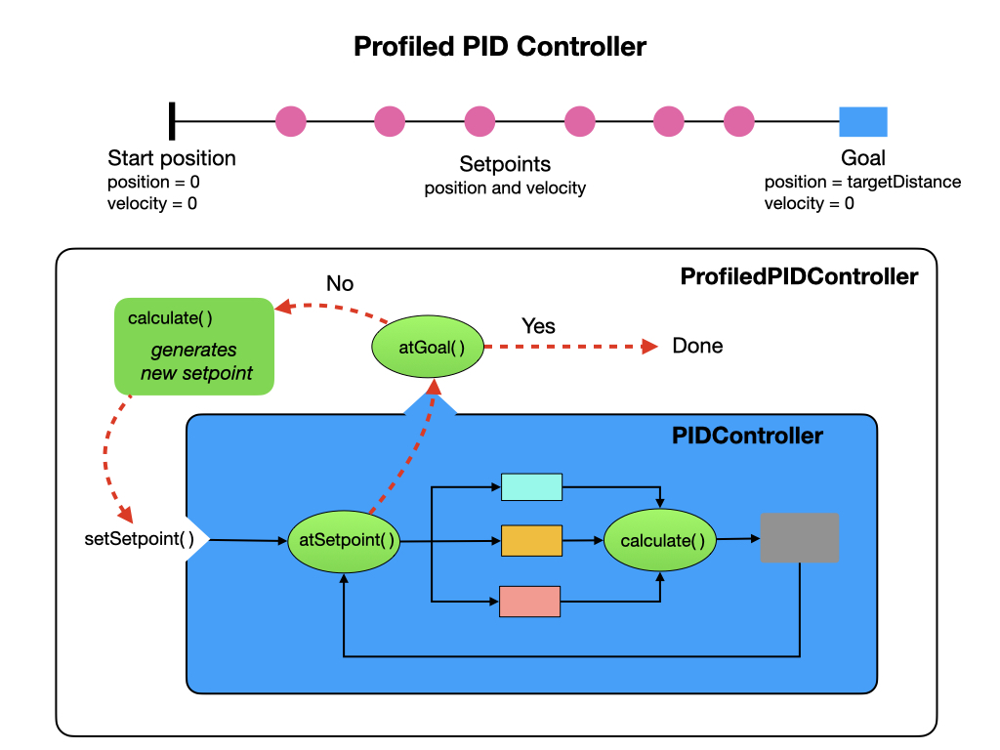
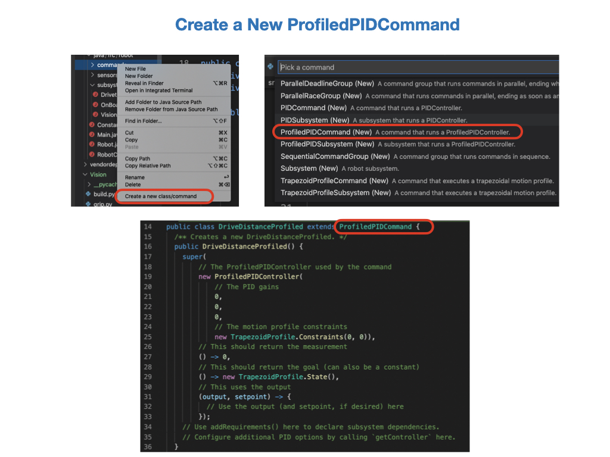

# Motion Profiled PID Control 
With the *DriveDistancePID* command there's no way to avoid the sudden changes in velocity at the start and end of the motion path.  This makes it difficult to tune the PID controller to precisely arrive at the requested setpoint.  It would be better if we can move more smoothly to the setpoint by gradually accelerating at the beginning of the motion and decelerating at the end. To do this we need to bring in the additional parameter of velocity. So instead of just specifying the final position of the robot we need to specify both a position and velocity.  This turns our path, which is only defined by position, into a trajectory. Remember, a trajectory has both direction and speed.

This is where the *ProfiledPIDController* comes in.  This controller sets up a trajectory where the position and velocity is recomputed at multiple points along the path.  Although the direction may be a straight line, the velocity will change at various points throughout the trajectory.  The command accepts a *TrapezoidProfile* class to help implement the trajectory.  We'll look at [Trapezoid Motion Profiles](romiProfiledPID.md#trapezoidProfile) below.

The *ProfiledPIDController* works in the following manner. With the regular PIDController the setpoint represents the final position of the robot, its target distance.  With the *ProfiledPIDController* instead of using the setpoint as its final position it uses a *goal* to determine when the robot has reached its destination.  Multiple setpoints are created at various points along the motion path that not only designate a position but also a velocity.  The controller keeps generating position/velocity setpoints until the final goal has been reached.

## Trapezoid Motion Profile
<!-- Controller Hierarchy Kelly Ch 7.1.1.3 create diagram... -->
As mentioned above, one way of obtaining a smooth transition between the robot's current state and its desired *goal* is to provide a sequence of setpoints.  Each setpoint will reflect the robot's desired position and velocity throughout its entire motion.  The trajectory, or motion profile, will have three phases:

- **Acceleration Phase** - where the robot speeds up to its coast velocity.
- **Coast Phase** - in which the robot maintains a constant speed.
- **Deceleration Phase** - where the robot is slowing down as it nears its goal.

This motion profile looks like a trapezoid giving it its name.

In order to create a *Trapezoidal Motion Profile*, we must first impose some constraints on the desired motion. Namely, we must specify a maximum velocity and acceleration that the robot can achieve during the motion. To do this, we create an instance of the *TrapezoidProfile.Constraints* class.  

We must also specify the desired starting and ending states for our robot using the *TrapezoidProfile.State* class. Each state has a position and a velocity. The starting state usually has position and velocity set to zero.  The ending state will have the position set to the target distance with the velocity often set to zero.

See [Trapezoidal Motion Profiles in WPILib](https://docs.wpilib.org/en/stable/docs/software/advanced-controls/controllers/trapezoidal-profiles.html) in the FRC documentation for more details.

## Lab - Motion Control Profiled PID
This lab builds on the code that you wrote in the [Motion PID Control](romiPID.md) section of the training guide.  You'll learn about the following Java programming concepts:

- [Java Inner Classes](https://www.w3schools.com/java/java_inner_classes.asp) also referred to as Nested Classes.

There are three tasks for this lab:

- Create a profiled command called *DriveDistanceProfiled* to drive the robot a specified distance.  The robot should acheive a smooth acceleration and deceleration at the beginning and end of the motion path.

- Create a profiled command called *TurnToAngleProfiled* to turn the robot to a specified angle.  This profiled command should make smooth turns as opposed to the *TurnToAnglePID* command where the turns are very abrupt.

- Use the *TurnToAngleProfiled* command to make the robot drive in a square path.  This task will require the use of a Group Command.

## Drive Robot a Specified Distance
To create a *ProfiledPIDCommand* in VSCode right click under the commands folder and select *Create a new class/command*.  Then select **ProfiledPIDCommand (New)** from the drop down list.  Call the command *DriveDistanceProfiled*.  The constructor of the new command is shown in the diagram.  

We're going to modify this command to smoothly drive the robot for a specified distance.  Here's a pictorial representation of how we need to setup our *ProfiledPIDController*.  We still need to specify the **P, I**, and **D** values, but in addition we provide the robot with some constraints, together with a starting and ending position.

 Create some new PID constants for our profiled command.  Start with the **P** parameter set to `1.2` and the **I** and **D** parameters set to zero:

    // For profiled distances PID
    public static final double kPDriveProfiled = 1.2;
    public static final double kIDriveProfiled = 0.0;
    public static final double kDDriveProfiled = 0.0;

 The *TrapezoidProfile.Constraints* specifies the maximum velocity and acceleration that the robot is capable of.  For the Romi you can set these constraints to `0.5` and `0.5` respectively. We obtained these values by doing *System Identification* on the Romi. We'll look at *System Identification* in the next module.  These constraints will remain constant throughout the motion command, so you can put them in the *Constants* file:

    // Max speed and acceleration of the robot
    public static final double kMaxSpeedMetersPerSecond = 0.5;
    public static final double kMaxAccelMetersPerSecondSquared = 0.5;

We now have all of the parameters that we need for the controller.
Pass in the PID values and create an instance of *TrapezoidProfile.Constraints*, which is parameterized by the velocity and acceleration.  If you're curious about the syntax for *TrapezoidProfile.Constraints* look at the *TrapezoidProfile* class, you'll find that it has two [Java Inner Classes](https://www.w3schools.com/java/java_inner_classes.asp) called *Constraints* and *State*. The construction of the controller should look like this:

    new ProfiledPIDController(
      // The PID gains
      Constants.kPDriveProfiled,
      Constants.kIDriveProfiled,
      Constants.kDDriveProfiled,
      // The motion profile constraints
      new TrapezoidProfile.Constraints(Constants.kMaxSpeedMetersPerSecond, 
                                        Constants.kMaxAccelMetersPerSecondSquared)),

We'll again pass the *Drivetrain* and *targetDistance* parameters to the constructor.  However, this time the *targetDistance* will be passed into the command as a *TrapezoidProfile.State* that specifies its final position and velocity.  The final velocity is usually set to zero, since we assume that we want the robot to stop at that point, the end position will be our target distance. We refer to the end position as the *goal*, since we are setting multiple setpoints along our path and we want to be explicit that this is the final target distance.  

The `initialize()` method of the *ProfiledPIDCommand* uses the measurement source to set the starting position and velocity of the system.  Therefore, it's important that the measurement source starts out at zero.

    // This should return the goal (can also be a constant)
    () -> new TrapezoidProfile.State(targetDistance,0),

We'll use the encoders as the measurement source, so use `getAverageDistanceMeters()` from the *Drivetrain* class.

    // This should return the measurement
    () -> drivetrain.getAverageDistanceMeters(),

Now we have to set the output from the controller that's used to drive our motors.  We'll use the same *Drivetrain* method `arcadeDrive()` as in previous PID control labs, sending the `output` to the first parameter and zero to the second:

    // Use the calculated velocity at each setpoint
    (output, setpoint) -> {
      drivetrain.arcadeDrive(output, 0);
    }

Add the *Drivetrain* as a requirement, and set the tolerance for the command as in the previous PID command labs.  The final constructor should look like this:

    /** Creates a new DriveDistanceProfiled. */
    public DriveDistanceProfiled(double targetDistance, Drivetrain drivetrain) {
      super(
          // The ProfiledPIDController used by the command
          new ProfiledPIDController(
              // The PID gains
              Constants.kPDriveProfiled,
              Constants.kIDriveProfiled,
              Constants.kDDriveProfiled,
              // The motion profile constraints
              new TrapezoidProfile.Constraints(Constants.kMaxSpeedMetersPerSecond, 
                                              Constants.kMaxAccelMetersPerSecondSquared)),

          // This should return the measurement
          () -> drivetrain.getAverageDistanceMeters(),

          // This should return the goal (can also be a constant)
          () -> new TrapezoidProfile.State(targetDistance,0),

          // Use the calculated velocity at each setpoint
          (output, setpoint) -> {
            drivetrain.arcadeDrive(output, 0);
          });

      // Use addRequirements() here to declare subsystem dependencies.
      addRequirements(drivetrain);    

      // Configure additional PID options by calling `getController` here.
      getController().setTolerance(0.05, 0.06);
    }

The `isFinished()` method will return a different value from our previous PID commands.  Instead of returning `atSetpoint()` we need to return `atGoal()`.  Remember, that we are setting multiple setpoints as we progress along our motion path.  If we returned `atSetpoint()` the the command would finish almost as soon as it started.  Therefore, we need to return `atGoal()`, which tests if we have reached our target distance. 

    public boolean isFinished() {
      return getController().atGoal();
    }

Before testing, add the command to the SendableChooser in the *RobotContainer* class.  Have the robot travel for distance of `1.0` meter.  This should be enough distance to see the three phases of the trapezoid profile; acceleration, coast, and deceleration.

    m_chooser.addOption("Profiled Distance PID", new DriveDistanceProfiled(1.0, m_drivetrain));

That should be all, so go ahead and test the command.

#### Testing the *DriveDistanceProfiled* Command

Setup the Simulator in the same way that you did to test the [DriveDistancePID](romiPID.md#driveDistance) command.

Select the *DriveDistanceProfiled* command and run it in Autonomous mode.  You should see the robot accelerate smoothly, move forward at a constant speed, and then slow down to a stop.  If you see that the *DriveDistanceProfiled* command is still running after the robot has stopped, then it most likely hasn't reached its goal of `0.5` meters.  This is because with just the **P** parameter set the output value gets so small that it can no longer drive the motors.  In order to have it complete you would need to add a value to the **I** parameter.  Try assigning a value of `0.2` to see if the robot reaches its goal.

Keep on tuning until the command finishes and you are happy with the results.  Other things to try would be increasing the *P* parameter or adjusting the tolerance.  Make sure that you only change one parameter at a time, otherwise you won't know which one made a difference.

Once you've finished tuning you're done with this task!

### Rotate the Robot to a Specified Angle
This is very similar to the *DriveDistanceProfiled* command in that it uses a *TrapezoidProfile* to make the turn.  To create a *ProfiledPIDCommand* in VSCode right click under the commands folder and select *Create a new class/command*.  Then select **ProfiledPIDCommand (New)** from the drop down list.  Call the command *TurnToAngleProfiled*. We'll modify this command to smoothly turn the robot to a specified angle.  Here's a pictorial representation of how we need to setup our *ProfiledPIDController*. 

Create some new PID constants for our profiled turn command.  Start with the **P** parameter set to `0.05` and the **I** and **D** parameters set to zero.

    // For profiled turns PID
    public static final double kPTurnProfiled = 0.05;
    public static final double kITurnProfiled = 0;
    public static final double kDTurnProfiled = 0;

The *TrapezoidProfile.Constraints* specifies the maximum velocity and acceleration that the robot is capable of.  For the Romi you can set these constraints to `360` and `200` respectively. The maximum turn rate and acceleration used with *TrapezoidProfile* constraint must be specified in degrees.  For the Romi, values of 360 for turn rate and 250 for acceleration seem to work. These constraints will remain constant for the duration of the motion, so you can put them in the *Constants* file:

    public static final double kMaxTurnRateDegPerS = 360;
    public static final double kMaxTurnAccelDegPerSSquared = 200;

We can now setup the *ProfiledPIDController*. Pass in the PID values and create an instance of *TrapezoidProfile.Constraints*, which is parameterized by the turn rate and turn acceleration .  
    
    new ProfiledPIDController(
      // The PID gains
      Constants.kPTurnProfiled,
      Constants.kITurnProfiled,
      Constants.kDTurnProfiled,
      // The motion profile constraints
      new TrapezoidProfile.Constraints(Constants.kMaxTurnRateDegPerS, 
                                        Constants.kMaxTurnAccelDegPerSSquared)),

This time we'll name our goal `targetAngleDegrees` to be descriptive of what's being passed into the constructor.  We again have to pass in the *Drivetrain* class.  

    public TurnToAngleProfiled(double targetAngleDegrees, Drivetrain drivetrain) {

The *targetAngleDegrees* will be passed into the command as a *TrapezoidProfile.State* that's used to specify the final position and velocity of the robot.  The final velocity is usually set to zero, since we assume that we want the robot to stop at that point, the end state is our target position. We call this target position the *goal*, since we are setting multiple setpoints along our path and we want to be explicit that this is the final target distance.  The `initialize()` method of the command sets the starting position and velocity of the system to zero.

    // This should return the goal (can also be a constant)
    () -> new TrapezoidProfile.State(targetAngleDegrees,0),

Since we're rotating the robot we'll use the gyro as our measurement source, so use `getHeading()` from the *Drivetrain* class.

    // This should return the measurement
    () -> drivetrain.getHeading(),

Now we have to set the output from the controller that's used to drive our motors.  We'll use the same *Drivetrain* method `arcadeDrive()` as in previous PID control labs. We send the output to the second parameter and clamp it to `0.5` in either direction by using the `MathUtil.clamp` function.  Notice that the output value is negated. We need a negative output because by default the robot turns in a clockwise direction. In order to get to 180 degrees however, we need to turn anticlockwise. Our output value will now look like this:

    // This uses the output
    (output, setpoint) -> {
      // Use the output (and setpoint, if desired) here
      drivetrain.arcadeDrive(0, MathUtil.clamp(-output, -0.5, 5.0));
    }

Add the *Drivetrain* as a requirement, and set the tolerance for the command as in the previous PID command labs.  The final constructor should look like this:

    /** Creates a new TurnToAngleProfiled. */
    public TurnToAngleProfiled(double targetAngleDegrees, Drivetrain drivetrain) {
      super(
          // The ProfiledPIDController used by the command
          new ProfiledPIDController(
              // The PID gains
              Constants.kPTurnProfiled,
              Constants.kITurnProfiled,
              Constants.kDTurnProfiled,
              // The motion profile constraints
              new TrapezoidProfile.Constraints(Constants.kMaxTurnRateDegPerS, 
                                              Constants.kMaxTurnAccelDegPerSSquared)),

          // This should return the measurement
          () -> drivetrain.getHeading(),

          // This should return the goal (can also be a constant)
          () -> new TrapezoidProfile.State(targetAngleDegrees,0),

          // This uses the output
          (output, setpoint) -> {
            // Use the output (and setpoint, if desired) here
            drivetrain.arcadeDrive(0, MathUtil.clamp(-output, -0.5, 5.0));
          });
      // Use addRequirements() here to declare subsystem dependencies.
      addRequirements(drivetrain);

      // Configure additional PID options by calling `getController` here.
      getController().setTolerance(5.0, 10.0);
    }

The `isFinished()` method will return `atGoal()`, which tests if we have reached our target degree rotation. 

    public boolean isFinished() {
      return getController().atGoal();
    }

Before testing, add the command to the SendableChooser in the *RobotContainer* class.  Have the robot turn 180 degrees.

       m_chooser.addOption("Profiled Turn Angle PID", new TurnToAngleProfiled(180, m_drivetrain));

That should be all, so go ahead and test the command.

#### Testing the *TurnToAngleProfiled* Command

Setup the Simulator in the same way that you did to test the [TurnToAnglePID](romiPID.md#turnToAngle) command.

Adjust the PID parameters and tolerance until you have a satisfactory result.

Once you're happy with the results you're done with this task!

### Bonus Task - Drive a Square Path

This lab still to be written.

## References

- FRC Documentation - [Motion Profiling through TrapezoidProfileSubsystems and TrapezoidProfileCommands](https://docs.wpilib.org/en/latest/docs/software/commandbased/profile-subsystems-commands.html)

- FRC Documentation - [Combining Motion Profiling and PID in Command-Based](https://docs.wpilib.org/en/latest/docs/software/commandbased/profilepid-subsystems-commands.html)