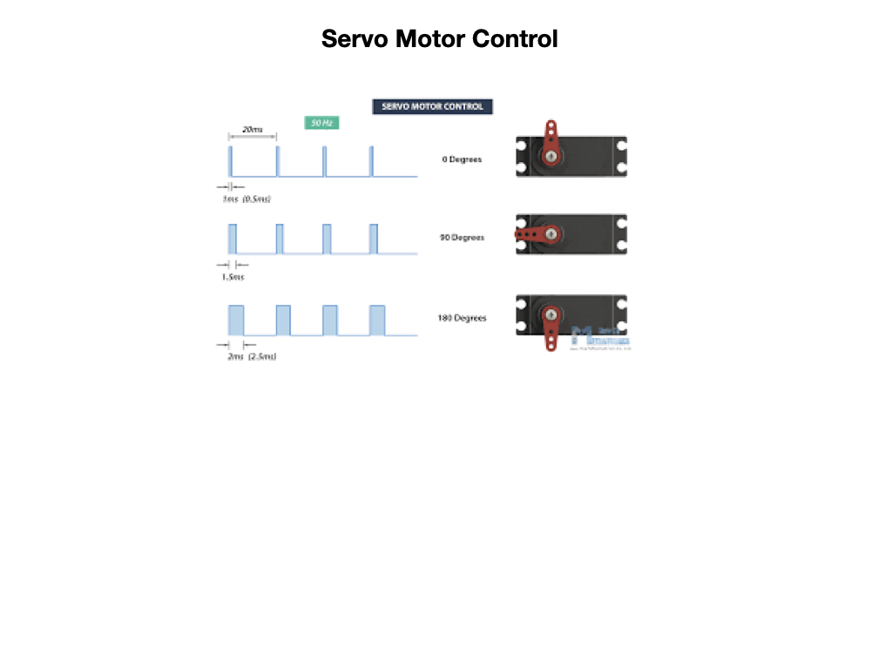
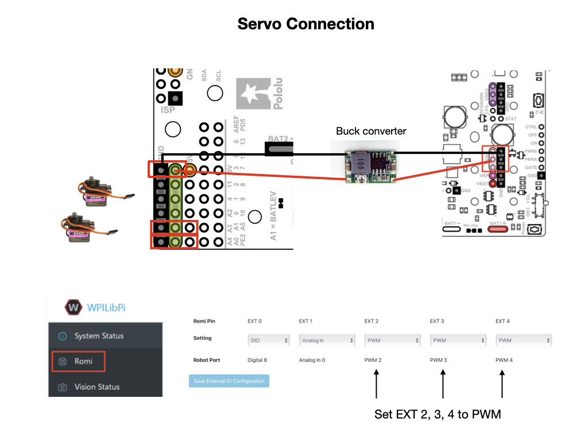
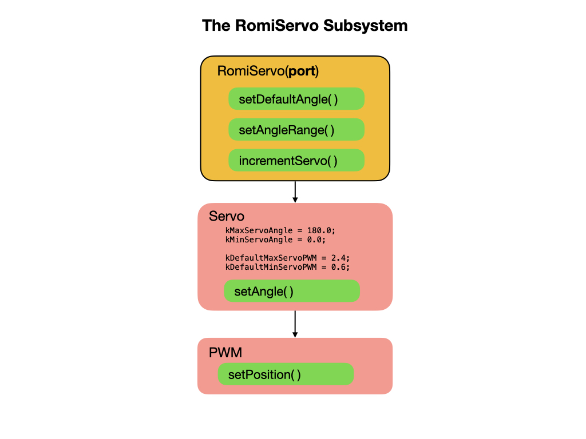

# Programming Servos
In this lesson we'll create a program to control servos that are attached to the Romi.  The program is called [BasicServo](https://github.com/mjwhite8119/romi-examples/tree/main/BasicServo) and can be found on Github.

## How Servos Work
Servos work using a Pulse Width Modulation (PWM) signal that is passed to the servo every 20 milliseconds.  The pulse width is between 1 and 2 m/s where 1 m/s moves the servo to the 0 degree position and 2 m/s moves it a full 180 degrees.  Values in between those two time values move it to degrees in between 0 and 180 degrees.  

One of many places where you can find information on [How Servos Work](https://howtomechatronics.com/how-it-works/how-servo-motors-work-how-to-control-servos-using-arduino/) can be found on the **How to Mechatronics** site.

## Servo Connection
The following diagram shows how to connect the power, and where to connect the servos to the Romi's GPIO pins. In order to supply enough power for the servos you will need to connect to the VSW pin on the Romi board.  For this you'll need a buck converter to drop the battery voltage down from ~7.5V to ~5V.  After connecting the power you can plug in the servos. The ground wire (black or brown) goes towards the outside of the board. 

Next, go to the **Romi** section of the Romi Web UI and ensure that the ports are set to PWM. To be compatible with the example programs you must set EXT2, EXT3, and EXT4 to PWM as shown in the diagram.  

The servos can be controlled via buttons on the gamepad.  Your WPI based program runs on the laptop and launches the Robot Simulator tool.  The simulator communicates with the NodeJS application that runs on the Raspberry Pi. This application passes requests onto the microcontroller to control the GPIO ports that the servos are connected to.

## Servo Control Program

In order to control the servos we'll create a Subsystem that we can use from commands.  The WPILib supplies a *Servo* class that uses the *PWM* class to communicate with the servos via the Simulator.  On the competition robot this communication would be direct. The WPILib *Servo* class restricts the range of the servo to between 0 and 180 degrees.  We can leverage this class to create our own servo class for the Romi that will include additional functionality.  Here are some to the additional features that may be useful:

- Slow down the speed of the servo to avoid sudden movements.
- Set a default angle for the servo.
- Restrict the range through which the servo can move.

The diagram below shows the key features of our new *RomiServo* class and its dependencies.

One of the key features of the *RomiServo* program is to increment the movement of the servo to prevent sudden sharp motions.  The `delta` value passed into the `incrementServo()` method controls how quickly we want the servo to move.

    public void incrementServo(double delta) {
      m_servoAngle = saturateLimit(m_servoAngle + delta, m_minAngle, m_maxAngle);
      m_servo.setAngle(m_servoAngle);
    }

And here's the `saturateLimit()` method to restrict the range of the servo.

    public double saturateLimit(double val, double min_angle, double max_angle) {
      double outval = val;
      if(val > max_angle) {
        outval =  max_angle;
      } else if (val < min_angle) {
        outval = min_angle;
      }
      return outval;
    }

There are additional methods to set the min/max range through which the servo can move, and also to set a default angle.  Here's the full code for the [RomiServo](https://github.com/mjwhite8119/romi-examples/blob/main/BasicServo/src/main/java/frc/robot/subsystems/RomiServo.java) subsystem.

## The ServoCommand
The *ServoCommand* accepts the *RomiServo* subsystem and the joystick to control the movement of the servo.

Here's the full code for the [ServoCommand](https://github.com/mjwhite8119/romi-examples/blob/main/BasicServo/src/main/java/frc/robot/commands/ServoCommand.java).

## Add Servo to the RobotContainer.
Now that we have a Servo subsystem and command we need to add it to the robot structure via the *RobotContainer* class.  We first need to import it, so open the RobotContainer.java file and the import near the top.

    import frc.robot.subsystems.RomiServo;

Create a varible to point to the RomiServo class. You must supply the port number that the servo is connected to.

    private final RomiServo m_servo = new RomiServo(ExtIOConstants.PWM4_PORT);

Inside the `configureButtonBindings()` method create a default command for the servo.  Remember that the default command is run whenever there is no other command using the subsystem.  The joystick will be used to control the servo so that also needs to passed to the *ServoCommand*.

    m_servo.setDefaultCommand( new ServoCommand(m_servo, m_joystickIO));

## References
- Adafruit - [Servos and Feedback](https://learn.adafruit.com/analog-feedback-servos)

- How to Mechatronics - [How Servos Work](https://howtomechatronics.com/how-it-works/how-servo-motors-work-how-to-control-servos-using-arduino/)

<!-- <h3>
<a href="romiPID">Previous</a>

<a href="romiArm">Next</a></h3> -->
