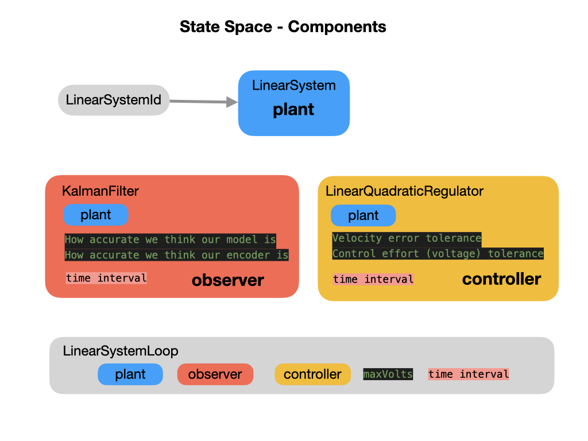

# State Space Controllers
So far we have been using classical control theory and methods, such as PID, that are based on a simple input-output description of the system. These are called single-input single-output (SISO) systems.  **State Space** control is an alternative to PID control.  State Space control is based on the idea that if you know the internal physics of the system and can predict how it’ll react to a given input then you can tune the system in a way that’s similar to tuning PID controllers.  The basic idea is that each distinct situation for the world is called a state, denoted by *x*, and the set of all possible states is called a State Space, X. State Space control is more flexible than PID control. 

In this module we'll use State Space Control to drive the Romi at a specified velocity for a short period of time.  Rather than use an arbitrary *Proportional* gain derived through testing, we'll first try to develop an accurate physical model of our Drivetrain (system) and then use it to help us pick gains for the feedback controller.  This allows us not only to predict ahead of time how a system will react, but also test our controllers without a physical robot.

The code libraries used for this project is described in the [State Space Controllers](https://docs.wpilib.org/en/stable/docs/software/advanced-controls/state-space/state-space-intro.html) section of the FRC documentation. A more mathematical description of State Space Control can be found in the [State Space Control](../../Concepts/Control/stateSpaceControl.md) section of this training guide.  As you can see from the above diagram, there are three main components for creating a State Space controlled system with WPILib, a *Linear System*, a *Kalman Filter*, and a *Linear Quadratic Regulator* LQR.  These components are placed in a *Linear System Loop* to drive the robot.

## The LinearSystem Class
In control theory the system that we're modelling is called the *Plant* or *System*.  To setup a system with the WPI Libraries you create a *LinearSystem*.  In our case we're going to model a Drivetrain system that will have the left and right wheel velocities as its system dynamics, the **A** matrix.  The input to the system will be the voltage to the left and right motors and that will be descibed by the **B** matrix.  The **C** matrix weights our measured outputs *y*, which we'll just pass through unchanged so multiple by 1.  We won't use the **D** matrix at all so everything is set to zero.  The job of the *LinearSystem* class is to calculate the next state of the system.  This state can be measured by sensors as our observed outputs.  These measured outputs can be used as feedback to determine the next required inputs.

More information on the notation used can be found in the  [State Space Notation](https://docs.wpilib.org/en/stable/docs/software/advanced-controls/state-space/state-space-intro.html#what-is-state-space-notation) section of the FRC documetation.

## Kalman Filter
After creating a model of our Linear System we'll need to create a Kalman Filter.  There are entire books written on these filters but an overview of their use and function can be found in the [Kalman Filters](../../Concepts/OptimalEstimation/kalmanFilters.md) section of this training guide.

## Linear Quadratic Regulator (LQR)
Linear Quadratic Regulators work by finding trade-off that drives our system to its desired setpoint while using the minumum control effort. For example, a spaceship might want to minimize the fuel it expends to reach a given reference, while a high-speed robotic arm might need to react quickly to disturbances and reach the setpoint quickly.  To get an overview of [Linear Quadratic Regulators](https://docs.wpilib.org/en/stable/docs/software/advanced-controls/state-space/state-space-intro.html#the-linear-quadratic-regulator) see the FRC documentation or read the [LQR](../../Concepts/Control/LQR.md) section of this training guide.

## Linear System Loop
The *LinearSystemLoop* class constructs a state-space loop with the given plant, controller, and observer.

## Lab - State Space Controllers

There is currently no lab for this module.

<!-- The code to create the trajectory configuration constraint:

    public static final TrajectoryConfig config =
      new TrajectoryConfig(kMaxSpeedMetersPerSecond, 
                            kMaxAccelMetersPerSecondSquared)
          .setKinematics(kDriveKinematics)
          .addConstraint(kAutoVoltageConstraint); -->

## References
- FRC Documentation - [State Space Controllers](https://docs.wpilib.org/en/stable/docs/software/advanced-controls/state-space/state-space-intro.html)

- Bernard Friedman - [Control System Design](https://www.academia.edu/16854890/Control_System_Design_An_Introduction_to_State_Space_Methods_Bernard_Friedland_Dover_Publications_) An introduction to State-Space Methods

