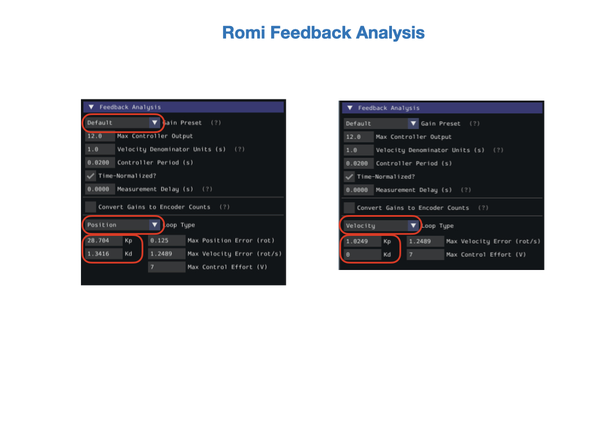
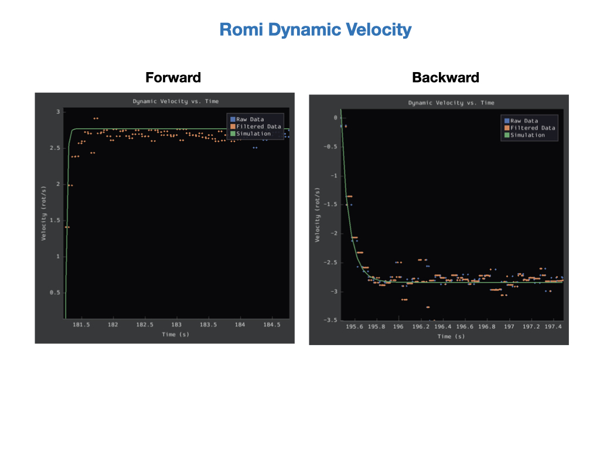
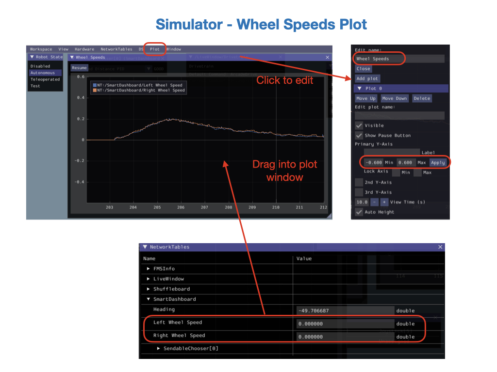
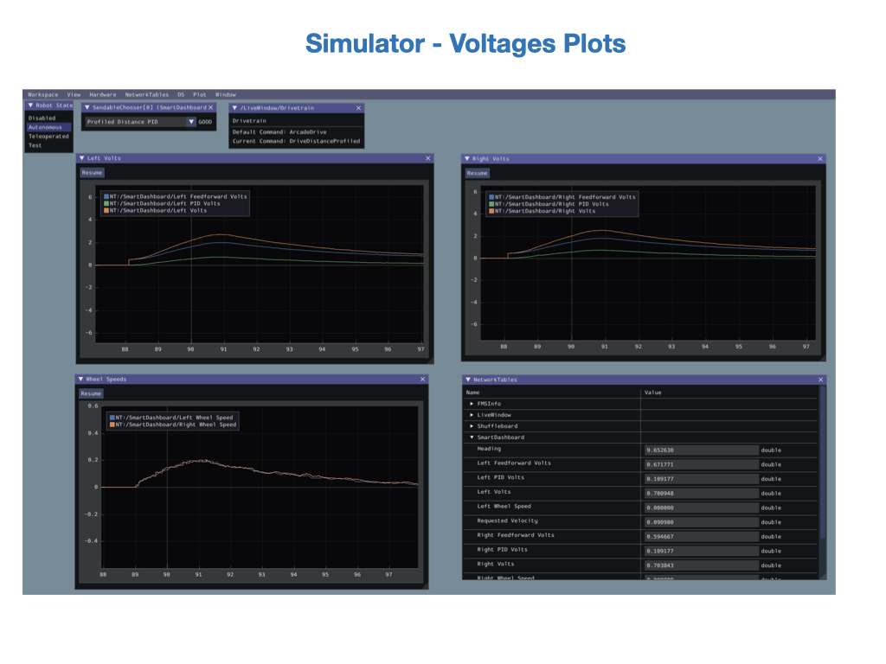

# System Identification
*System Identification* is the process of determining a mathematical model for the behavior of a system through statistical analysis of its inputs and outputs.  A mathematical model is a simplified representation of the real system. It's important to model only those features of the system that are required to control it.  The features that are important depend upon the application.

There are two ways to create a mathematical model of a system. If you know the system well enough then you can create the model using its underlying physics.  This is referred to as *first principals*. This is often done in the case where a physical system is not yet available for testing. If you do have a physical system to test on and you don't know the system very well then you can use data to create the model. This is where *System Identification* techniques are required. What you do is send control inputs into the system and take a look how the it reacts.  You'll be able to determine a relationship between the input and the output. You can then use that data to create a mathematical model of the observed relationship.  

For more informataion view the [System Identification](https://www.youtube.com/playlist?list=PLlmlmzye-q9gC7DwJ0xObASeOWUeADxJW) videos by Brian Douglas.

## System Identification Tool

The WPILib [System Identification Tool](https://docs.wpilib.org/en/stable/docs/software/pathplanning/robot-characterization/introduction.html#introduction-to-robot-characterization) (SysID) aids in identifying the characterics of our robot systems.  The tool consists of an application that runs on the user’s PC and matching robot code that runs on the user’s robot. The PC application will send control signals to the robot over NetworkTables, while the robot sends data back to the application.  On the Romi the robot code will run on the Simulator.  The Simulator communicates with the SysID Tool over the NetworkTables. The application then processes the data and determines model parameters for the user’s robot mechanism, as well as producing diagnostic plots. 

## Running the System Identification Tool
The *System Identification Tool* (SysId) can be opened from the **Start Tool** option in VS Code.

> On MacOS you may need to start it from the terminal. Type `python3 ~/wpilib/2023/tools/SysID.py` in the terminal.  If the SysID Tool is not there then you can run `python3 ToolsUpdater.py` from the `~/wpilib/2023/tools/` directory.

The *SysID Tool* display should look like this:

<!-- Starting the tool creates a directory under your project called `.SysId`. -->

## Configuring the Project
The first step is to [Configuring the Project](https://docs.wpilib.org/en/stable/docs/software/pathplanning/robot-characterization/configuring-project.html#configuring-a-project) for your specific mechanism. You'll need to know some details about your system, such as the motors, encoders, and gyro.  You can get most of this information from the electrical team.

## Creating the Identification Routine
See [Creating an Identification Routine](https://docs.wpilib.org/en/stable/docs/software/advanced-controls/system-identification/creating-routine.html) 

<!-- Once your project has been configured, you can deploy the robot project that gathers the data for System Identification. See [Deploying the Project](https://docs.wpilib.org/en/stable/docs/software/pathplanning/robot-characterization/configuring-project.html#deploying-project) in the FRC Documentation.  If you're deploying to the RoboRIO the data gathering project code is uploaded and ran directly on the RoboRIO.  For the Romi, the code is executed from VSCode and communicates with the Romi via the Simulator. -->

There are four tests that you run to gather the data.  The first two gradually accelerate the robot up to its maximum speed in both the forward and backward directions.  This is designed to access voltage verses speed.  The second two tests abuptly accelerate the robot up to full speed in the forward and backward directions.

## Analysing the Data
The analysis will tell us how much Feedforward voltage is required to move the robot. It'll also tell us the maximum speed of the robot and suggest some starting PID values that we can try for our Feedback loops.  See [Analysing Data](https://docs.wpilib.org/en/stable/docs/software/pathplanning/robot-characterization/analyzing-data.html) in the FRC documentation.

## Lab - System Identification
In this lab we're going to run System Identification on the Romi.  We'll analyze the data and use it to create a cascaded PID loop to drive the robot in a straight line.

In this lab you'll learn about the following Java programming concepts:

- Java example of returning an object from a method and extracting its attributes.

There are four tasks for this lab:

- Calibrate the gyro.

- Configure and run the *System Identification* Tool for the Romi.

- Log telemetry data on wheel speeds using the WPILib *DifferentialDriveWheelSpeeds* class.

- Use [Cascade Control](../../Concepts/Control/classicalControl.md#cascadeLoops) and the data that you get from *System Identification* to drive the Romi in a straight line.

### Calibrate the Gyro
Ensure that the gyro has been [calibrated using the web UI](https://docs.wpilib.org/en/stable/docs/romi-robot/web-ui.html#imu-calibration).  Gyros usually have some sort of zero-offset error that causes them to drift even when the robot is standing still.  With the Romi this is quite significant.  Calibrating the gyro will prevent most of the drifting. 

Once the calibration has been done this task is complete!

### Use the System Identification Tool
For this task we're going to run system identification for the Romi.  As noted above, the data gathering code will be executed from VSCode, and the Simulator will be used to communicate with the Romi.  Open the *romi-characterization-sysid* project from [RomiExamples](https://github.com/FRC-2928/RomiExamples).  Connect to a Romi and execute the code.

Next, start the **SysID Tool**, see [Starting SysID](romiSystemId.md#startSysid).  We'll first need to configure the tool for the Romi, which is done from the **Generator** window.  Select Romi for the **Analysis Type**.  You'll notice that all of the other sections in the **Generator** window will go away.  This is because all of the components on the Romi are already known to the tool.  Consequently, there's no *Save* button for the configuration.

We're now ready to run the tests that gather the data.  In the **Logger** window, change mode from *Disabled* to *Client* and type `localhost` into *Team/IP* field. In our case, the client is the Simulator that's running on the same PC as the SysId tool. Click on *Apply* and the status field will change from **NT Disconnected** to **NT Connected**.  

The encoder data that gets sent to *SysId* is in terms of wheel rotations (and not distance traveled), so you would need to change *Unit* in *Project Parameters* section to *Rotations*. Leave the Units per Rotation at `1.0` meters, since that is accounted for in the *romi-characterization-sysid* code. 

Before running the tests, it's best to get the Simulator and SysID tool displays onto one screen of your laptop, since you'll need to switch quickly between them.  Also, place the Romi on the floor and make sure that you have at least 10 feet of space.  Start with the *Quasistatic forward* test and follow the instructions.  Switch to the Simulator and put the Romi in **Autonomous** mode.  Click **Disabled** before the Romi runs out of space.  Go back to the SysID Tool and click **End**.  Run the other three tests in a similar manner.  Read the [Instructions](https://docs.wpilib.org/en/stable/docs/software/pathplanning/system-identification/identification-routine.html#running-tests) in the FRC documentation for more information.  

After running the tests, save the results into the *FRCProjects* folder that you created to keep your projects.

Let's examine the data starting with the **Feedforward** analysis.  The Feedforward analysis gives you the `Ks`, `Kv`, and `Ka` voltage values required to drive the Romi forward.  You'll use these values in your project (see the next task for this lab). These values will be called `ksVolts`, `kvVoltSecondsPerMeter`, and `kaVoltSecondsSquaredPerMeter` respectively in our project.  These values are explained in the [Feedforward Control](../../Concepts/Control/classicalControl.md#feedforward) module of the training guide. 

The analysis gives you the readout for each wheel. This will be useful in getting the Romi to go straight, since the wheels are commonly not going to be exactly the same leading to the Romi curving either left or right.

Prior to viewing the data you may need to change the "*Velocity Threashold*" value. Changing this value excludes data that is below a certain velocity. See [Improperly set Motion Threashold](https://docs.wpilib.org/en/stable/docs/software/pathplanning/system-identification/viewing-diagnostics.html#improperly-set-motion-threshold) in the FRC documetation.

Now we'll look at the **Feedback** analysis, which will give us the **P** and **D** gain values for the system. The **I** gain cannot be assessed with System Identification. The *Gain Preset* represents how the feedback gains are calculated for your specific controller.  Since we're using the WPILib PIDController for the Romi you can leave the *Gain Preset* at `Default`.  There are **P** and **D** gain values available for both a Position and Velocity loop. These values will be put into the *Constants* file of your project.

Another interesting chart is the "*Dynamic Velocity vs. Time*" analysis.  This tells us the maximum velocity of the Romi.  On a smooth surface, like a desktop, you'll find the maximum velocity to be approximately `0.6` meters per second.  On a carpet that has more resistance the maximum velocity could be as low as `0.4` meters per second. How do we get that number?  The chart shows that there are approximately `2.7` wheel rotations per second. The Romi's wheel diameter is `0.07` meters, so to get the distance travelled per wheel rotation do the following calculation:

        Meters per wheel rotation = 0.07 * Pi = 0.22 meters

Now multiple meters per wheel rotation by the number of wheel rotations per second shown in the graph to get meters per second:

        "Meters per second" = "Velocity (rot p/s)" * "Meters per wheel rotation (0.22)"

So in this example the maximum speed of the Romi is approximately `0.59` meters per second.  Create a variable in the *Constants* file called  `kMaxSpeedMetersPerSecond` and set it equal to that value.  We'll use that as a speed constraint in some of our projects.

Record all of the feedback values `Ks`, `Kv`, and `Ka` for the **Combined**, **Left**, and **Right** wheel.  Also record the PID values `kP`, `kD`.  You'll need all of these values for the next task.  

That's all for this task! 

### Log Wheel Speeds
It's sometimes useful to have a single data structure that includes both the left and right wheel speeds of a differential drive robot.  There's a WPILib data structure called *DifferentialDriveWheelSpeeds* that can be used for that purpose. See [Robot Kinematics](../../Concepts/Dynamics/kinematics.md) for more information. Create a method called `getWheelSpeeds()` that returns the left and right encoder rates in a single data structure.

    /**
    * Returns the current wheel speeds of the robot.
    *
    * @return The current wheel speeds
    */
    public DifferentialDriveWheelSpeeds getWheelSpeeds() {
        return new DifferentialDriveWheelSpeeds(m_leftEncoder.getRate(), m_rightEncoder.getRate());
    }

In the [Telemetry](../SC/romiTelemetry.md) lab we had already logged output values for the wheel speeds.  Replace these with the *DifferentialDriveWheelSpeeds* object returned from `getWheelSpeeds()`.

        DifferentialDriveWheelSpeeds wheel_speeds = getWheelSpeeds();
        SmartDashboard.putNumber("Left Wheel Speed", wheel_speeds.leftMetersPerSecond);
        SmartDashboard.putNumber("Right Wheel Speed", wheel_speeds.rightMetersPerSecond);

Start the Simulator and create a plot to view the wheel speeds.  Edit the plot by clicking on its window topbar and call it "*Wheel Speeds*".  Set the Y axis range between `-0.6` to `0.6`, since our maximum velocity was assessed at around 0.6 meters per second during System Identification.  Click on "*Add Plot*" and drag the *Left* and *Right Wheel Speed* telemetry values into the window.  Run one of the Autonomous commands to test the plot output.

You're now done with this task!

### Use Cascade Control
One problem with the *DriveDistanceProfiled* command that you created in the [Drive Robot a Specified Distance](romiProfiledPID.md#driveDistanceProfiled) lab is that the robot may not drive straight. One way we can fix this is to use *Cascade Control*, where we nest one PID controller inside another.  For a more detailed explaination of this process see [Cascade Control](../../Concepts/Control/classicalControl.md#cascadeLoops) in this training guide.

Instead of using a percent output value with `arcadeDrive()` to drive the motors, we're going to need a method that accepts a voltage value.  Create the method called `tankDriveVolts()` to send voltages to each of the motors.  Log the voltage values to SmartDashboard so as we can debug our code.

    /**
    * Controls the left and right sides of the drive directly with voltages.
    * 
    * @param leftVolts the commanded left output
    * @param rightVolts the commanded right output
    */
    public void tankDriveVolts(double leftVolts, double rightVolts) {
        SmartDashboard.putNumber("Volts left", leftVolts);
        SmartDashboard.putNumber("Volts right", rightVolts);

        // Apply the voltage to the wheels
        m_leftMotor.setVoltage(leftVolts);
        m_rightMotor.setVoltage(rightVolts); 
        m_diffDrive.feed();
    }

When we ran the SysId tool in the previous task we calculated the *Feedforward Gains* `kV`, `kS`, and `kA`.  We'll be using these gains to create a *SimpleMotorFeedforward* object.  The *SimpleMotorFeedforward* class calculates the amount of power required to drive the robot forward.  It takes into account factors like friction and inertia.  More information on the [SimpleMotorFeedforward](https://docs.wpilib.org/en/stable/docs/software/advanced-controls/controllers/feedforward.html#simplemotorfeedforward) class can be found in the FRC documentation. Add the feedforward gains and *SimpleMotorFeedforward* object to the *Constants* file. Use the values that you recorded during System Identification.  These will differ from the example below for your robot. Create three *SimpleMotorFeedforward* objects, using the parameters shown below.

        // The linear inertia gain, volts
        public static final double ksVolts = 0.5;
        public static final double ksVoltsLeft = 0.50;
        public static final double ksVoltsRight = 0.44;

        // The linear velocity gain, volts per (meter per second)
        public static final double kvVoltSecondsPerMeter = 1.888;
        public static final double kvVoltSecondsPerMeterLeft = 1.888;
        public static final double kvVoltSecondsPerMeterRight = 1.892;

        // The linear acceleration gain, volts per (meter per second squared).
        public static final double kaVoltSecondsSquaredPerMeter = 0.46138;
        
        // Combined left and right volts feedforward
        public static final SimpleMotorFeedforward kFeedForward = 
            new SimpleMotorFeedforward(ksVolts, 
                                        kvVoltSecondsPerMeter, 
                                        kaVoltSecondsSquaredPerMeter);

        // Left and Right motors are very different, so each has its own FF.
        public static final SimpleMotorFeedforward kLeftFeedForward = 
            new SimpleMotorFeedforward(ksVoltsLeft, 
                                        kvVoltSecondsPerMeterLeft, 
                                        kaVoltSecondsSquaredPerMeter);

        public static final SimpleMotorFeedforward kRightFeedForward = 
            new SimpleMotorFeedforward(ksVoltsRight, 
                                        kvVoltSecondsPerMeterRight, 
                                        kaVoltSecondsSquaredPerMeter);

We're going to need a PID controller for each wheel, so create them as attributes of the *Drivetrain* class by placing them above the constructor.  You had previously created PID controllers within a command.  This time they'll be used **Inline** within a new *Drivetrain* method that you're about to create.  For these controllers, place the PID gain values directly in the definition.  This will make things a little clearer during the tuning process. We'll be using different gain values for the outer PID loop that controls the travel distance. Since we'll be using feedforward, the **I** and **D** gain values can be set to zero.

    private final PIDController m_leftController =
        new PIDController(1.2, 0.0, 0.0);

    private final PIDController m_rightController =
        new PIDController(1.2, 0.0, 0.0); 

We now have all of the components needed to create our cascaded loops.  You may notice that there are multiple of ways to fine tune the control of our robot. There are several parameters that we can adjust to dial things in. To constuct the cascaded loops we'll need a new method that will accept a velocity and calculate a voltage value required for each motor.  It'll first calculate the feedforward power, which is our best estimate of how much voltage we need to obtain the required speed.  The PID controllers then look at the actual wheel speeds and adjusts accordingly.  These two voltage values are added together and sent to each wheel. Log all of the calculated values to the SmartDashboard for debugging.

    /**
    * Drives a straight line at the requested velocity by applying feedforward
    * and PID output to maintain the velocity. This method calculates a voltage
    * value for each wheel, which is sent to the motors setVoltage() method.
    * 
    * @param velocity The velocity at which to drive
    */
    public void setOutputMetersPerSecond(double velocity) {
      
        // Calculate feedforward voltage
        double leftFeedforward = Constants.kFeedForward.calculate(velocity);
        double rightFeedforward = Constants.kFeedForward.calculate(velocity);
        SmartDashboard.putNumber("Left Feedforward Volts", leftFeedforward);
        SmartDashboard.putNumber("Right Feedforward Volts", rightFeedforward);
  
        // Send it through a PID controller
        double leftPIDVolts = m_leftController.calculate(m_leftEncoder.getRate(), velocity);
        double rightPIDVolts = m_rightController.calculate(m_rightEncoder.getRate(), velocity);
        SmartDashboard.putNumber("Left PID Volts", leftPIDVolts);
        SmartDashboard.putNumber("Right PID Volts", rightPIDVolts);
        
        // Add the voltage values and send them to the motors
        tankDriveVolts(leftFeedforward + leftPIDVolts, rightFeedforward + rightPIDVolts);
    }

Now we have a cascaded PID loop.  The outer loop controls the distance and the inner loop controls the voltage that goes to each wheel motor. 

Try this out by changing the output method in the *DriveDistanceProfiled* command.  Comment out `arcadeDrive()`.

        // drivetrain.arcadeDrive(output, 0);

Use the new `setOutputMetersPerSecond()` method.

        drivetrain.setOutputMetersPerSecond(output);

#### Testing Cascade Control
<!-- Make the PID gain values visible as shown in [Changing the PID Gains from the Simulator](romiPID.md#pidGains) -->

Start the Simulator and run the *DriveDistanceProfiled* command one time to populate the voltage data into the SmartDashboard.  Create two plots to log the output from the command.  Call them *Left Volts* and *Right Volts*.  Set the Y axis range between `-7` to `7`, since 7 volts is the maximum value that the Romi puts out.  Drag the *Left* and *Right Feedforward Volts*, *PID Volts*, and *Volts* onto the each plot window.  Run the command again to see the results.  The plot windows should look like the following.

The reason we layed out the telemetry data in this way is so that we can see how the Feedforward and PID voltages contribute to the final voltage sent to each motor.  This helps us tune the control loops.  Try changing the PID values and the voltage values to get the robot running straight. 

You should also open the plot that you created in the last task that shows the left and right wheel speeds to aid in tuning.

Once you've got the Romi to go in a straight line you're done with this task!

## References
- Videos [System Identification](https://www.youtube.com/playlist?list=PLlmlmzye-q9gC7DwJ0xObASeOWUeADxJW) by Brian Douglas

- FRC Documentation - [Robot Charactization](https://docs.wpilib.org/en/stable/docs/software/wpilib-tools/robot-characterization/index.html)

- FRC Documentation - [Feedforward Control in WPILib](https://docs.wpilib.org/en/stable/docs/software/advanced-controls/controllers/feedforward.html#feedforward-control-in-wpilib)

- Code Example - [Romi Charaterization SysID](https://github.com/FRC-2928/RomiExamples/tree/main/romi-characterization-sysid)