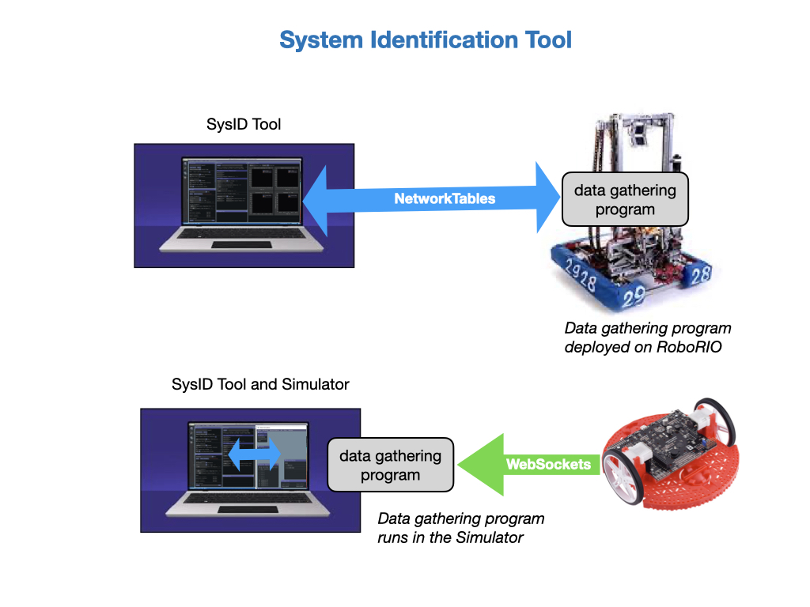
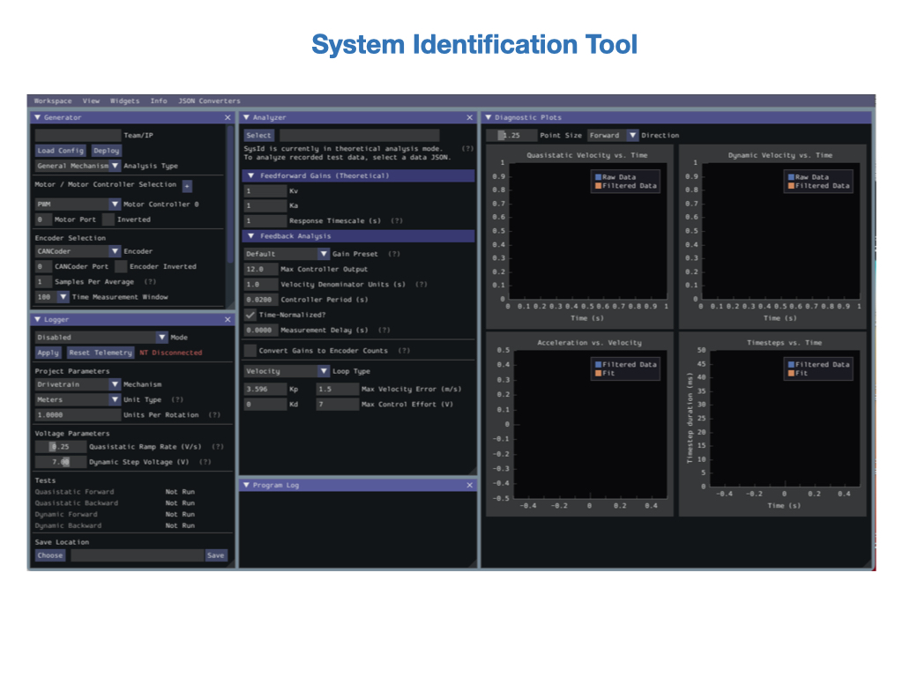
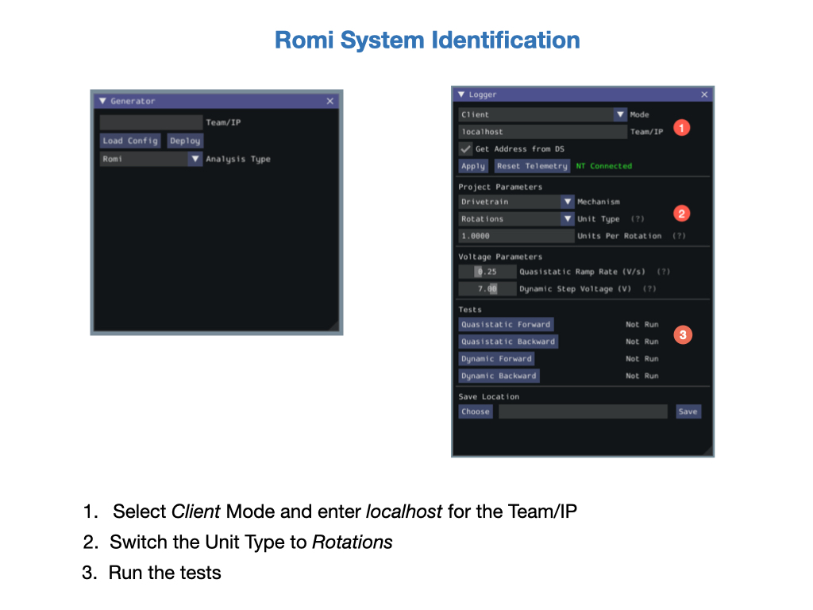
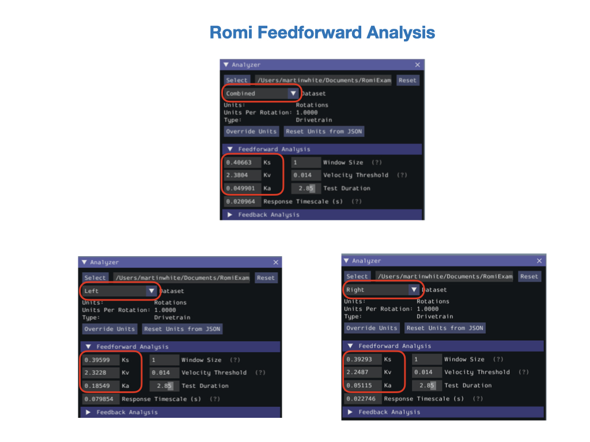
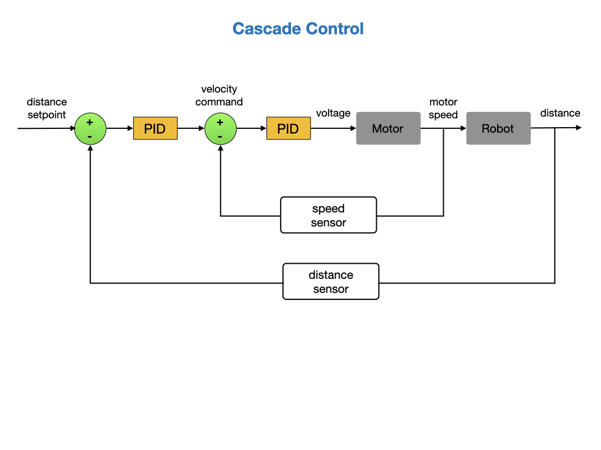

# System Identification
*System Identification* is the process of determining a mathematical model for the behavior of a system through statistical analysis of its inputs and outputs.  A mathematical model is a simplified representation of the real system. It's important to model only those features of the system that are required to control it.  The features that are important depend upon the application.

There are two ways to create a mathematical model of a system. If you know the system well enough then you can create the model using its underlying physics.  This is referred to as *first principals*. This is often done in the case where a physical system is not yet available for testing. If you do have a physical system to test on and you don't know the system very well then you can use data to create the model. This is where *System Identification* techniques are required. What you do is send control inputs into the system and take a look how the it reacts.  You'll be able to determine a relationship between the input and the output. You can then use that data to create a mathematical model of the observed relationship.  

For more informataion view the [System Identification](https://www.youtube.com/playlist?list=PLlmlmzye-q9gC7DwJ0xObASeOWUeADxJW) videos by Brian Douglas.

## System Identification Tool

The WPILib [System Identification Tool](https://docs.wpilib.org/en/stable/docs/software/pathplanning/robot-characterization/introduction.html#introduction-to-robot-characterization) (SysID) aids in identifying the characterics of our robot systems.  The tool consists of an application that runs on the user’s PC and matching robot code that runs on the user’s robot. The PC application will send control signals to the robot over NetworkTables, while the robot sends data back to the application.  On the Romi the robot code will run on the Simulator.  The Simulator communicates with the SysID Tool over the NetworkTables. The application then processes the data and determines model parameters for the user’s robot mechanism, as well as producing diagnostic plots. 

## Running the System Identification Tool
The *System Identification Tool* (SysId) can be opened from the **Start Tool** option in VS Code.

> On MacOS you'll need to start it from the terminal. Type `python3 ~/wpilib/2022/tools/SysID.py` in the terminal.

The *SysID Tool* display should look like this:

<!-- Starting the tool creates a directory under your project called `.SysId`. -->

## Configuring the Project
The first step is to [Configuring the Project](https://docs.wpilib.org/en/stable/docs/software/pathplanning/robot-characterization/configuring-project.html#configuring-a-project) for your specific mechanism. You'll need to know some details about your system, such as the motors, encoders, and gyro.  You can get most of this information from the electrical team.

## Deploying the Project
Once your project has been configured, you can deploy the robot project that gathers the data for System Identification. See [Deploying the Project](https://docs.wpilib.org/en/stable/docs/software/pathplanning/robot-characterization/configuring-project.html#deploying-project) in the FRC Documentation.  If you're deploying to the RoboRIO the data gathering project code is uploaded and ran directly on the RoboRIO.  For the Romi, the code is executed from VSCode and which communicates with the Romi via the Simulator.

## Analysis the Data
[Analysing Data](https://docs.wpilib.org/en/stable/docs/software/pathplanning/robot-characterization/analyzing-data.html)

## Lab - System Identification
There are three tasks for this lab:

- Calibrate the gyro.

- Configure and run the System Identification Tool for the Romi.

- Use *Cascade Control* to drive the Romi in a straight line.

### Calibrate the Gyro
Ensure that the gyro has been [calibrated using the web UI](https://docs.wpilib.org/en/stable/docs/romi-robot/web-ui.html#imu-calibration)

### Use the System Identification Tool
For this task we're going to run system identification for the Romi.  As noted above, the data gathering code will be executed from VSCode and the Simulator will be used to communicate with the Romi.  Open the *romi-characterization-sysid* project from [RomiExamples](https://github.com/FRC-2928/RomiExamples).  Connect to a Romi and execute the code.

Next, start the **SysID Tool**, see [Starting SysID](romiSystemId.md#startSysid).  We'll first need to configure the tool for the Romi, which is done from the **Generator** window.  Select Romi for the **Analysis Type**.  You'll notice that all of the other sections in the **Generator** window will go away.  This is because all of the components on the Romi are already known to the tool.  Consequently, there's no *Save* button for the configuration.

We're now ready to run the tests that gather the data.  In the **Logger** window, change mode from *Disabled* to *Client* and type `localhost` into *Team/IP* field. Click on *Apply* and the status field will change from **NT Disconnected** to **NT Connected**.  

The encoder data that gets sent to *SysId* is in terms of wheel rotations (and not distance traveled), so you would need to change *Unit* in *Project Parameters* section to *Rotations*. Leave the Units per Rotation at `1.0` meters, since that is accounted for in the *romi-characterization-sysid* code. 

Before running the tests, it's best to get the Simulator and SysID tool displays onto one screen of your laptop, since you'll need to switch quickly between them.  Also, place the Romi on the floor and make sure that you have at least 10 feet of space.  Start with the *Quasistatic forward* test and follow the instructions.  Switch to the Simulator and put the Romi in **Autonomous** mode.  Click **Disabled** before the Romi runs out of space.  Go back to the SysID Tool and click **End**.  Run the other three tests in a similar manner.  Read the [Instructions](https://docs.wpilib.org/en/stable/docs/software/pathplanning/system-identification/identification-routine.html#running-tests) in the FRC documentation for more information.  

After running the tests, save the results into the *romi-characterization-sysid* project folder.

Let's analyze the data.  The Feedforward analysis gives you the `Ks`, `Ks`, and `Ka` voltage values required to drive the Romi forward. These values are explained in the [Feedforward Control](../../Concepts/Dynamics/geometry.md#feedforward) module of the training guide.

### Use Cascade Control
One problem with the *DriveDistanceProfiled* command that you created in the last lab is that the robot may not drive straight. One way we can fix this is to use *Cascade Control*, where we nest one PID controller inside another.  The outer PID controller will control the distance and the inner PID controller will control the motor speeds. For a more detailed explaination of this process see [Cascade Control](../../Concepts/Control/classicalControl.md#cascadeLoops) in this training guide.

Create the method `tankDriveVolts()` to send a voltage to each of the motors.

    /**
    * Controls the left and right sides of the drive directly with voltages.
    * 
    * @param leftVolts the commanded left output
    * @param rightVolts the commanded right output
    */
    public void tankDriveVolts(double leftVolts, double rightVolts) {

      // Apply the voltage to the wheels
      m_leftMotor.setVoltage(leftVolts);
      m_rightMotor.setVoltage(rightVolts); 
      m_diffDrive.feed();
    }

When we ran the SysId tool in the previous task we calculated the *Feedforward Gains* `kV`, `kS`, and `kA`.  We'll be using these gains to create a *SimpleMotorFeedforward* object.  The *SimpleMotorFeedforward* class calculates the amount of power required to drive the robot forward.  It takes into account factors like friction and inertia.  More information on the [SimpleMotorFeedforward](https://docs.wpilib.org/en/stable/docs/software/advanced-controls/controllers/feedforward.html#simplemotorfeedforward) class can be found in the FRC documentation. Add the feedforward gains and *SimpleMotorFeedforward* object to the *Constants* file.  

    // The linear inertia gain, volts
    public static final double ksVolts = 0.461;

    // The linear velocity gain, volts per (meter per second)
    // Increase this if you drive short
    public static final double kvVoltSecondsPerMeter = 6.93;

    // The linear acceleration gain, volts per (meter per second squared).
    public static final double kaVoltSecondsSquaredPerMeter = 0.0737;

    public static final SimpleMotorFeedforward kFeedForward = 
        new SimpleMotorFeedforward(ksVolts, 
                                    kvVoltSecondsPerMeter, 
                                    kaVoltSecondsSquaredPerMeter);

We're going to need a PID controller for each wheel, so create them as attributes of the *Drivetrain* class by placing them above the constructor.  You had previously created PID controllers within a command.  This time they'll be used inline within our new *Drivetrain* method.

    private final PIDController m_leftController =
      new PIDController(Constants.kPDriveProfiled, 
                        Constants.kIDriveProfiled, 
                        Constants.kDDriveProfiled);

    private final PIDController m_rightController =
      new PIDController(Constants.kPDriveProfiled, 
                        Constants.kIDriveProfiled, 
                        Constants.kDDriveProfiled);   

Now we have all of the components to create a new method that will accept a velocity and calculate a voltage value required for each motor.  It will first calculate the feedforward power and then adjust the power to get to the required velocity.  The feedforward is our best estimate of how much power we need to obtain the required velocity.  The PID controller looks at the actual velocity and adjusts accordingly.  These two values are added together to send the voltage to each wheel. 

    /**
    * Drives a straight line at the requested velocity by applying feedforward
    * and PID output to maintain the velocity. This method calculates a voltage
    * value for each wheel, which is sent to the motors setVoltage() method.
    * 
    * @param velocity The velocity at which to drive
    */
    public void setOutputMetersPerSecond(double velocity) {
      
      // Calculate feedforward voltage
      double leftFeedforward = Constants.kFeedForward.calculate(velocity);
      double rightFeedforward = Constants.kFeedForward.calculate(velocity);
    
      // Send it through a PID controller
      double leftVelocity = m_leftController.calculate(m_leftEncoder.getRate(), velocity);
      double rightVelocity = m_rightController.calculate(m_rightEncoder.getRate(), velocity);
      
      // double calibratedRightSpeed = output * Constants.rightVoltsGain;
      tankDriveVolts(leftFeedforward + leftVelocity, rightFeedforward + rightVelocity);
    }

So now we have a cascaded PID loops 

Try this out by changing the output method in the *DriveDistanceProfiled* command from `arcadeDrive()` to `setOutputMetersPerSecond()`.

        drivetrain.arcadeDrive(output, 0);

Use the new method.

        drivetrain.setOutputMetersPerSecond(output, 0);

#### Testing Cascade Control

## References
- Videos [System Identification](https://www.youtube.com/playlist?list=PLlmlmzye-q9gC7DwJ0xObASeOWUeADxJW) by Brian Douglas

- FRC Documentation - [Robot Charactization](https://docs.wpilib.org/en/stable/docs/software/wpilib-tools/robot-characterization/index.html)

- FRC Documentation - [Feedforward Control in WPILib](https://docs.wpilib.org/en/stable/docs/software/advanced-controls/controllers/feedforward.html#feedforward-control-in-wpilib)

- Code Example - [Romi Charaterization SysID](https://github.com/FRC-2928/RomiExamples/tree/main/romi-characterization-sysid)