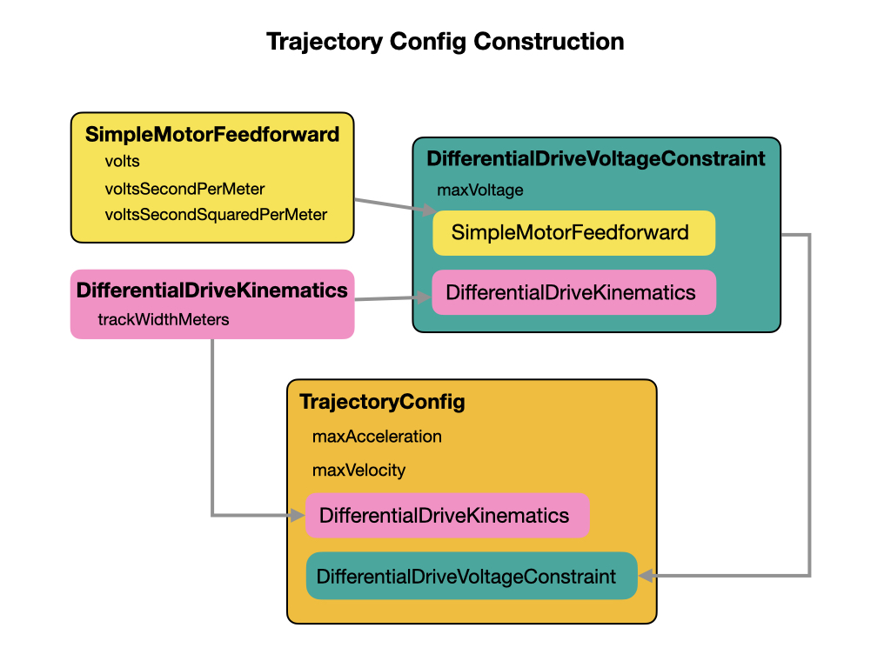
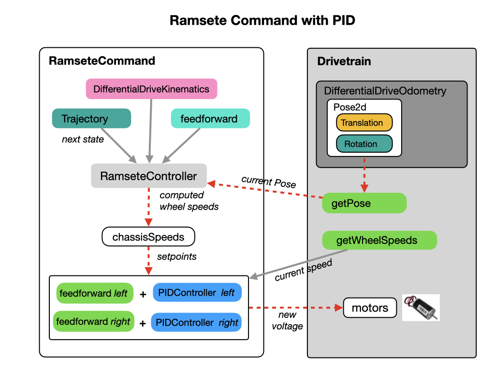

# Trajectory Following
Up until this point we've been doing straight line paths and point turns to get to our destination.  Ideally, we would want to follow a smooth curved path, which is more direct and efficient.  The methods used to do this is expained in this section.  The [Trajectory Tutorial](https://docs.wpilib.org/en/latest/docs/software/pathplanning/trajectory-tutorial/index.html) FRC documentation provides the outline for this module.  There are four steps to getting trajectory following working. You'll implement these steps in the lab for this module.

1. Add the parameters that were obtained from robot system identification

2. Configure a drive subsystem to track the robot’s pose using WPILib’s odometry library.

3. Generate a simple trajectory through a set of waypoints using WPILib’s TrajectoryGenerator class.

4. Create a command to follow the generated trajectory.

## Step 1. Add System Identification Parameters
The trajectory following routine needs several parameters, some of which were obtained from doing System Identification.

The robot needs to know about how many volts are required to move the drivetrain forward. It uses the *SimpleMotorFeedforward* class to compute the feedforward voltage.  The *Ramsete* command uses [Feedforward](../../Concepts/Control/classicalControl.md#feedforward) control to maintain its trajectory. Since we already know information about the computed trajectory the feedforward handles the control actions that we already know must be applied to make the system track its reference trajectory.  
 
We need to set the nominal max acceleration and max velocity for the robot during path-following. The maximum velocity value should be set somewhat below the nominal free-speed of the robot. The following parameter values were obtained from System Identification on the Romi.

      // Max speed and acceleration of the robot
      public static final double kMaxSpeedMetersPerSecond = 0.5;
      public static final double kMaxAccelMetersPerSecondSquared = 0.5;

The *Ramsete* controller requires two parameters to compute its trajectory waypoints.  These are tuning parameters for the trajectory following algorithm and assume all distances have been measured in meters  Do NOT change these parameters from the following values.  For more information see [Constructing the Ramsete Controller Object](https://docs.wpilib.org/en/latest/docs/software/advanced-controls/trajectories/ramsete.html#constructing-the-ramsete-controller-object) in the FRC documentation.

      // Reasonable baseline values for a RAMSETE follower in units of meters and seconds
      public static final double kRamseteB = 2;
      public static final double kRamseteZeta = 0.7;

See [Entering the Calculated Constants](https://docs.wpilib.org/en/latest/docs/software/pathplanning/trajectory-tutorial/entering-constants.html#step-2-entering-the-calculated-constants) from the FRC documentation for more information.

## Step 2. Setting up the Drivetrain Subsystem Pose
There are two additions that need to be made to the Drivetrain class in order to implement trajectory following.  

The *DifferentialDriveKinematics* class allows us to use the trackwidth (horizontal distance between the wheels) to convert from chassis speeds to wheel speeds.  The following example can be used for the Romi.      

    public static final double kTrackwidthMeters = 0.142072613;
    public static final DifferentialDriveKinematics kDriveKinematics =
        new DifferentialDriveKinematics(kTrackwidthMeters);

We setup *DifferentialDriveKinematics* in the [Kinematics and Odometry](../SC/romiOdometry.md#kinematicsTask) module.

The Drivetrain needs to keep track of the current Pose of the robot.  This is done in the *DifferentialDriveOdometry* class that continuously updates the current Pose via the Drivetrain's `periodic()` loop.  The odometry must be initiated with a starting Pose.  For more information on the WPI libraries see [Differential Drive Odometry](https://docs.wpilib.org/en/stable/docs/software/kinematics-and-odometry/differential-drive-odometry.html#differential-drive-odometry) in the FRC documetation.  

 

We can view the odometry data in the Simulator or Shuffleboard by using the [Field2d Widget](https://docs.wpilib.org/en/stable/docs/software/wpilib-tools/glass/field2d-widget.html).  We setup odometry and the *Field2d* widget in the [Kinematics and Odometry](../SC/romiOdometry.md#odometryTask) module. 

    public void periodic() {
      // Update the odometry in the periodic block
      m_odometry.update(m_gyro.getRotation2d(), m_leftEncoder.getDistance(), m_rightEncoder.getDistance());
      
      // Also update the Field2D object (so that we can visualize this in sim)
      m_field2d.setRobotPose(getPose());
    }

The class *DifferentialDriveWheelSpeeds* is used the `getWheelSpeeds()` method to return the current speed of each wheel.  The `getWheelSpeeds()` method serves as the measurement input to our trajectory controller and is just a wrapper for each wheel speed. More information can be found in [Setting up the Drive System](https://docs.wpilib.org/en/latest/docs/software/pathplanning/trajectory-tutorial/creating-drive-subsystem.html) FRC documentation.

    public DifferentialDriveWheelSpeeds getWheelSpeeds() {
        return new DifferentialDriveWheelSpeeds(m_leftEncoder.getRate(), m_rightEncoder.getRate());
    }

Finally, a method called `tankDriveVolts()` needs to be implemented so as to drive each wheel individually.  This function will be the output of the trajectory-following command.

    public void tankDriveVolts(double leftVolts, double rightVolts) {
      m_leftMotor.setVoltage(leftVolts);
      m_rightMotor.setVoltage(-rightVolts); // We invert this to maintain +ve = forward
      m_diffDrive.feed();
    }

## Step 3. Generating the Trajectory
In order to compute the trajectory the WPILib uses a class called the *TrajectoryGenerator*.  The *TrajectoryGenerator* needs to know about the characteristics of the robot.  This is done by passing in the robot's constraints and kinematics. The constraints will include the robot's maximum speed and acceleration. 

These constraints are passed into the *TrajectoryGenerator* that generates our required trajectory. The *TrajectoryGenerator* takes in an initial and final Pose and outputs a smooth curve with velocities and accelerations at each point along the curve connecting two endpoints. Read the [Trajectory Generation](https://docs.wpilib.org/en/latest/docs/software/advanced-controls/trajectories/trajectory-generation.html) section of the FRC documentation for more details.

 

Conceptually, the trajectory generation looks like the following diagram.

 

## Step 4. Create the Ramsete Command
The *RamseteCommand* pulls in all of the components needed to create a trajectory. It uses the *RamseteController* that takes in the current robot Pose and compares it to the next Pose required to carry out the trajectory. The outputs from the controller are **chassis speeds** that the robot should follow to complete the next step of the trajectory. 

 

The chassis speeds become the next setpoint for the PID controllers that get their measurement input from the `getWheelSpeeds()` method of the Drivetrain. There's a PID controller for each wheel.  Note that the PID controller is tracking on wheel **velocity** in this case, not position as in our previous encounters with PID control.  See [Create the Ramsete Command](https://docs.wpilib.org/en/latest/docs/software/pathplanning/trajectory-tutorial/creating-following-trajectory.html#creating-the-ramsetecommand) FRC documentation for more information. 

## Lab - Trajectory Following
In this lab we'll go through the four steps that are required to run a trajectory-following command.  We have mostly completed the first two steps in previous labs so most of the work will done for steps 3 and 4.

**Step 1**. Add the parameters that were obtained from robot system identification

**Step 2**. Configure a drive subsystem to track the robot’s pose using WPILib’s odometry library.

**Step 3**. Generate a simple trajectory through a set of waypoints using WPILib’s *TrajectoryGenerator* class.

**Step 4**. Create a command called *RunRamseteTrajectory* to follow the generated trajectory.

### Step 1. Add Parameters from System Identification
Before setting up the trajectory-following command we need to add a new subclass to the *Constants* file. These two constants are used as tuning parameters by the *Ramsete* command.  They should not be changed.

    public static final class ControlConstants {    
        public static final double kRamseteB = 2;
        public static final double kRamseteZeta = 0.7;
    }   

Ensure that you have added the *DifferentialDriveKinematics*, voltage requirements, and speed constraints to the *Constants* file.

    public static final double kTrackwidthMeters = 0.142072613;    
    public static final DifferentialDriveKinematics kDriveKinematics =
        new DifferentialDriveKinematics(kTrackwidthMeters);

    // Max speed and acceleration of the robot
    public static final double kMaxSpeedMetersPerSecond = 0.5;
    public static final double kMaxAccelMetersPerSecondSquared = 0.5;

    // The linear inertia gain, volts
    public static final double ksVolts = 0.461;
    // The linear velocity gain, volts per (meter per second)
    public static final double kvVoltSecondsPerMeter = 6.93;
    // The linear acceleration gain, volts per (meter per second squared).
    public static final double kaVoltSecondsSquaredPerMeter = 0.0737;

    // Setup constraints for feedforward and kinematics
    public static final SimpleMotorFeedforward kFeedForward = 
      new SimpleMotorFeedforward(ksVolts, 
                                kvVoltSecondsPerMeter, 
                                kaVoltSecondsSquaredPerMeter);    

That's all for step 1.

### Step 2. Setup Robot Odometry
In this task we'll check that we have all of the odometry components in order to track the robot's position on the field and report it out to the dashboards.  We setup odometry and the *Field2d* widget in the [Kinematics and Odometry](../SC/romiOdometry.md#odometryTask) module. 

When you have confirmed that you have the methods in your code you're done with step 2.

### Step 3. Create a Trajectory
To create the trajectory first add the voltage constraints to the *Constants* file.    
        
    // Voltage constraints
    public static final DifferentialDriveVoltageConstraint kAutoVoltageConstraint =
      new DifferentialDriveVoltageConstraint(
          kFeedForward,
          kDriveKinematics,
          10);

    // Setup trajectory constraints
    public static final TrajectoryConfig kTrajectoryConfig =
      new TrajectoryConfig(kMaxSpeedMetersPerSecond, 
                           kMaxAccelMetersPerSecondSquared)
          .setKinematics(kDriveKinematics)
          .addConstraint(kAutoVoltageConstraint);

Now we can create our trajectory. The example below will drive a curved path and then stop.

    /**
    * Drives a curved path
    */
    public Trajectory curvedTrajectory() {
        // Note that all coordinates are in meters, and follow NWU conventions.
        Trajectory trajectory = TrajectoryGenerator.generateTrajectory(
            // Start at the origin facing the +X direction
            new Pose2d(0, 0, new Rotation2d(0)),
            List.of(
                new Translation2d(0.5, 0.25), // 1 Left
                new Translation2d(1.0, -0.25), // 2 Right
                new Translation2d(1.5, 0.25)  // 3 Left           
            ),
            new Pose2d(-0.0, -0.2, new Rotation2d(Math.PI)),
            DrivetrainConstants.kTrajectoryConfig);

        return trajectory;
    }

You're done with step 3.

### Step 4. Create the *RunRamseteTrajectory* Command

## References

- FRC Documentation - [A Video Walkthrough of Model Based Validation of Autonomous in FRC](https://docs.wpilib.org/en/stable/docs/software/advanced-controls/video-walkthrough.html)

- FRC Documentation - [Path Planning](https://docs.wpilib.org/en/latest/docs/software/pathplanning/index.html)

- FRC Documentation - [Trajectory Following](https://docs.wpilib.org/en/latest/docs/software/advanced-controls/trajectories/index.html)

- FRC Documentation - [Robot Characterization](https://docs.wpilib.org/en/stable/docs/software/wpilib-tools/robot-characterization/index.html)

- FRC Documentation - [PathWeaver](https://docs.wpilib.org/en/stable/docs/software/wpilib-tools/pathweaver/index.html)

- Github - [Romi Trajectory Follower](https://github.com/bb-frc-workshops/romi-examples/tree/main/romi-trajectory-ramsete)

- Tyler Veness - [Controls Engineering in the FIRST Robotics Competition](https://file.tavsys.net/control/controls-engineering-in-frc.pdf)

- QUT Robot Academy [Paths & Trajectories](https://robotacademy.net.au/masterclass/paths-and-trajectories/)

- Code Example - [Trajectory Following - Ramsete](https://github.com/FRC-2928/RomiExamples/tree/main/RomiTrajectoryRamsete)

- Declan Freeman-Gleason - [WPILib Trajectories Presentation](https://pietroglyph.github.io/trajectory-presentation/#/)
<!-- <h3>
<a href="romiPID">Previous</a>

<a href="romiNetworkTables">Next</a></h3> -->