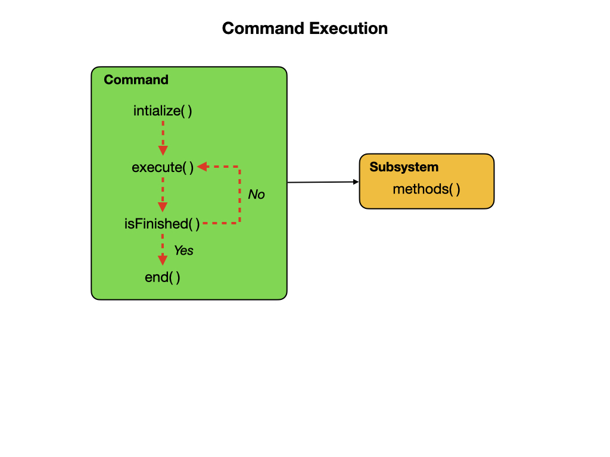

# Commands
Commands define high-level robot actions or behaviors that utilize the methods defined by the subsystems. Before looking at the commands that are implemented on the Romi you should be very familiar with [Procedures](../../Programming/procedures.md) and [State Machines](../../Programming/stateMachines.md) from the programming sections.  You should also review the FRC Documentation on [Commands](https://docs.wpilib.org/en/latest/docs/software/commandbased/commands.html) before continuing.

A command is a simple state machine that is either *Initializing*, *Executing*, *Ending*, or *Idle*. Users write code specifying which action should be taken in each state.  Commands run when scheduled or in response to buttons being pressed on a gamepad or from [Shuffleboard](../../Tools/shuffleboard.md). Each command has code in its `execute()` method to move it further along towards its goal and a method `isFinished()` that determines if the command has reached the goal. The `execute()` and `isFinished()` methods are called repeatedly.

## The DriveDistance Command
Let's take a look at the *DriveDistance* command to see how this all works. This command is used to drive the robot for a specified distance.  This is where [Parameters](https://www.w3schools.com/java/java_methods_param.asp) are very useful since we can decide how far to drive when the program runs.  This command demonstrates the classic [State Machine](../../Programming/stateMachines.md) programming paradigm where we have an **Initialization Step** `initialize()` followed the **Next Step** `execute()` and an **Input Update** that repeatedly calls `execute()` until a threshold is met.  The `isFinished()` method transititions it to the next major state `end()`, at which time the command moves to the *Idle* state.

        public DriveDistance(double speed, double inches, Drivetrain drive) {
            m_distance = inches;
            m_speed = speed;
            m_drive = drive;
            addRequirements(drive);
        }

        // Called when the command is initially scheduled.
        public void initialize() {
            m_drive.arcadeDrive(0, 0);
            m_drive.resetEncoders();
        }

        // Called every time the scheduler runs while the command is scheduled.
        public void execute() {
            m_drive.arcadeDrive(m_speed, 0);
        }

        // Called once the command ends or is interrupted.
        public void end(boolean interrupted) {
            m_drive.arcadeDrive(0, 0);
        }

        // Returns true when the command should end.
        public boolean isFinished() {
            // Compare distance travelled from start to desired distance
            return Math.abs(m_drive.getAverageDistanceInch()) >= m_distance;
        }

## ArcadeDrive Command
The *ArcadeDrive* command is a simple command that will drive the robot using  values provided by the joysticks. The values are passed in as parameters with a variable type is called a *Supplier*, which is an interface used for [Functional Programming Paradigm](https://en.wikipedia.org/wiki/Functional_programming).  This is a more complex programming concept that we won't cover here.  This parameter type needs to be imported and defined before use.

    import java.util.function.Supplier;

    private final Supplier<Double> m_xaxisSpeedSupplier;
    private final Supplier<Double> m_zaxisRotateSupplier;

The constructor looks like this with the values for linear and angular speed together with the Drivetrain subsystem.

    public ArcadeDrive(
      Drivetrain subsystem,
      Supplier<Double> xaxisSpeedSupplier,
      Supplier<Double> zaxisRotateSupplier) {
        m_drivetrain = subsystem;
        m_xaxisSpeedSupplier = xaxisSpeedSupplier;
        m_zaxisRotateSupplier = zaxisRotateSuppplier;
        addRequirements(subsystem);
    }

The `execute()` method calls the Drivetrain subsystem to activate the motors.

    public void execute() {
      m_drivetrain.arcadeDrive(m_xaxisSpeedSupplier.get(),m_zaxisRotateSupplier.get());
    }

The `isFinished()` method always returns false meaning this command never
completes on it's own. The reason we do this is that this command will be set as the default command for the subsystem. This means that whenever the subsystem is not running another command, it will run this command. If any other command is scheduled it will interrupt this command, then return to this command when the other command completes. 

    public boolean isFinished() {
        return false;
    }

The `setDefaultCommand()` method sets the default Command of the subsystem. The default command will be automatically scheduled when no other commands are scheduled that require the subsystem.  The following statement is called in the *RobotContainer* class.

    m_drivetrain.setDefaultCommand(getArcadeDriveCommand());

## Instant Commands
An *Instant Command* works similarly to a regular command except that there is no `execute()` method and the `isFinished()` method always returns TRUE.  The purpose of Instant Commands commands is to quickly alter some robot state such as activating, deactivating, resetting, or initializing a subsystem.  Instant Commands are used quite often.

## Command Groups
Simple commands can be composed into [Command Groups](https://docs.wpilib.org/en/latest/docs/software/commandbased/command-groups.html) to accomplish more-complicated tasks. There are several ways in which Command Groups can be composed, as shown the documentation.  We'll look at a full example of a **Sequential** Command Group from the Romi sample code.

### The AutonomousDistance Command
The **AutonomousDistance** command is used to drive forward, turn 180 degrees, drive back, and turn another 180 degrees, hopefully ending up exactly where we started.  That's four commands executed one after another and is a prime candidate for a **SequentialCommandGroup**.
We'll be using the **Drivetrain** subsystem in this command so that needs to be imported together with the SequentialCommandGroup library.

The four commands are composed in the class constructor using the `addCommands()` method.  The four command are specified using just two procedures since these procedures were parameterized.  The commands are listed in the order in which we would like them to run.

    package frc.robot.commands;
    import frc.robot.subsystems.Drivetrain;
    import edu.wpi.first.wpilibj2.command.SequentialCommandGroup;

    public class AutonomousDistance extends SequentialCommandGroup {
      /**
      * Creates a new Autonomous Drive based on distance. This will drive out for a specified distance,
      * turn around and drive back.
      *
      * @param drivetrain The drivetrain subsystem on which this command will run
      */
      public AutonomousDistance(Drivetrain drivetrain) {
        addCommands(
            new DriveDistance(-0.5, 10, drivetrain),
            new TurnDegrees(-0.5, 180, drivetrain),
            new DriveDistance(-0.5, 10, drivetrain),
            new TurnDegrees(0.5, 180, drivetrain));
      }
    }

### Change Motor Direction
We'd like our Romi going in a different direction from that specified in the *romiReference* example.  So switch the first `DriveDistance()` parameter from -0.5 to 0.5.

## Viewing the Robot Pose
As the robot drives around it might be useful to view its position and orientation on in the Simulator.  We looked at that module previously so you ready're to go onto the [Pose Estimation](../../Concepts/OptimalEstimation/poseEstimation.md) module.  There are a couple of classes that need to be implemented to do this so review that module next.

## Commands Lab
There are two objectives for this lab:

- Add a command to reset the Odometry.
- Implement a slew rate filter.

### Add Reset Odometry Command
For testing purposes it's useful to have a command that resets the odometry back to zero.  This command should be executable from the dropdown menu in the Simulator and Shuffleboard.  Create an Instant Command to do this add it the *SendableChooser* menu in *RobotContainer*.

[Reset Odometry solution](solutionResetOdometry.md)

### Implement Slew Rate Limiter Filter
You may have noticed that the movements of the robot are very sudden.  So much so that the tyres may even skid a little at the start of each motion.  In order to reduce that we can add a SkewRateLimiter filter.  Refer to the FRC [Slew Rate Limiter](https://docs.wpilib.org/en/latest/docs/software/advanced-controls/filters/slew-rate-limiter.html) documentation to learn more about these filters.  In this lab we'll create a slew rate filter to give more control over the speed of the robot.

You'll need a separate filter for the forward and backwards driving and for the turns.  These are defined as member variables in the *Drivetrain* class.  

We don't want to use this filter unless we're very specific about it so create a new method in the *Drivetrain* class called `rateLimitedArcadeDrive()` to use the filters.  You'll also need to update the *ArcadeDrive* command to use the new `rateLimitedArcadeDrive()` method of the Drivetrain.

[Slew Rate Filter solution](solutionSlewRateFilter.md)

## References

- FRC Documentation - [Command Based Programming](https://docs.wpilib.org/en/latest/docs/software/commandbased/index.html)

- FRC Documentation - [The Command Scheduler](https://docs.wpilib.org/en/latest/docs/software/commandbased/command-scheduler.html)

- FRC Documentation - [Command Groups](https://docs.wpilib.org/en/latest/docs/software/commandbased/command-groups.html)

- Java Tutorial on [W3Schools](https://www.w3schools.com/java/default.asp)

- [Amazon Example](https://s3.amazonaws.com/screensteps_live/exported/Wpilib/2078/2286/Command_based_programming.pdf?1478686718)
