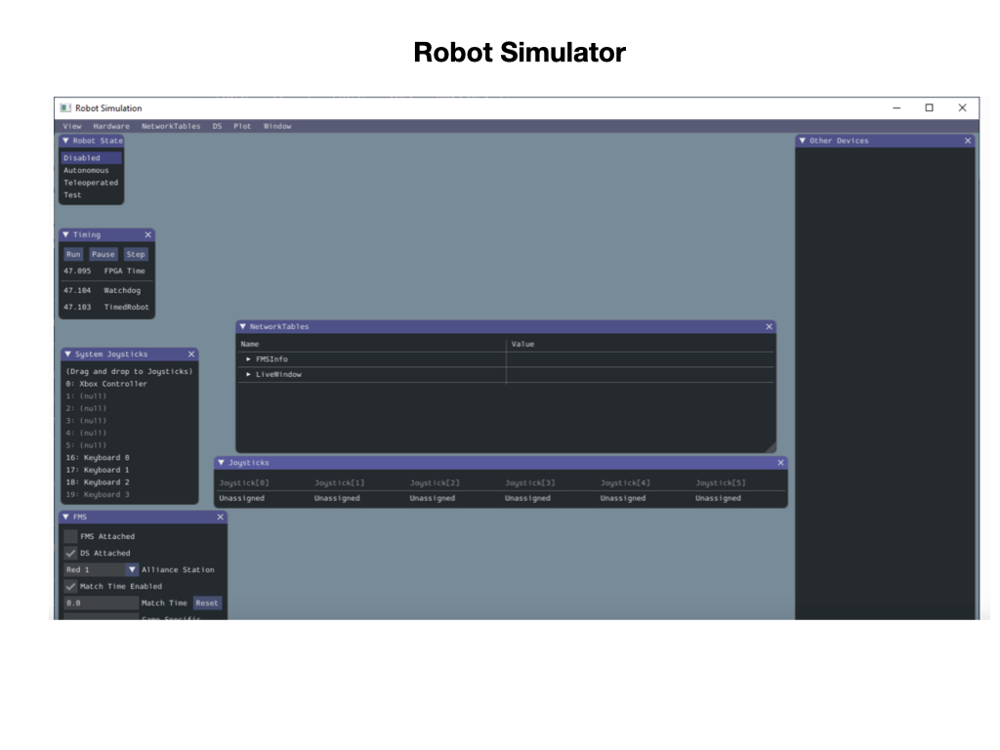
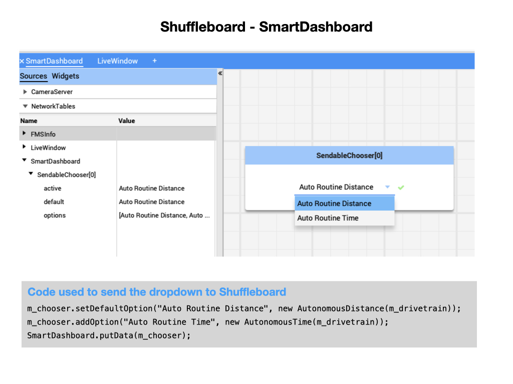
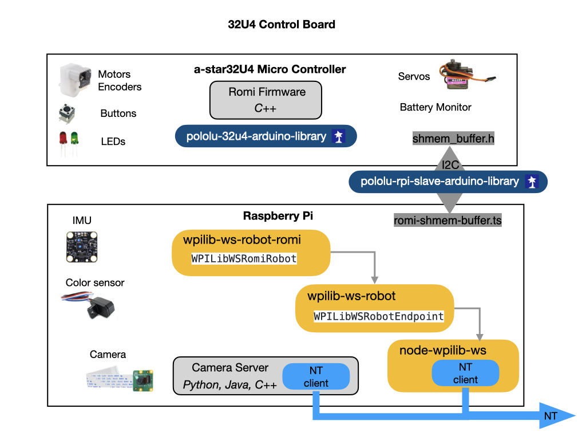

# Romi Testing Environment
This section explains the testing environment that we'll be using for the Romi programming tutorials.

## Hardware Platforms
We'll be using two hardware platforms for our training.  During training we are likely to make some mistakes so we need a platform that will not cause any damage, for this we will be using the *Romi Robot Kit*.  

<!-- After testing things out on the Romi we'll move to the RoboRIO robot that is very similar to the one used in competition. -->

### Romi Robot Kit
The [Romi Robot Kit for FIRST](https://www.pololu.com/product/4022).  The Romi robot is a robot base that can be used by FRC teams preparing for competitions. The kit includes an Arduino compatible 32U4 Control Board and a Raspberry Pi together with software that is maintained by WPILib.

The control board has two H-bridge motor drivers and is designed to connect to the encoders on the motors to allow closed-loop motor control. It also includes a 5 volt switching step-down regulator that can supply up to 2 Amps continuously, along with a power switching and distribution circuit. A 3-axis accelerometer and gyro enable a Romi 32U4 robot to make inertial measurements, estimate its orientation, and detect external forces. Three on-board pushbuttons offer an interface for user input, while indicator LEDs, a buzzer, and a connector for an optional LCD allow the robot to provide feedback.

When we move onto the Vision section of the tutorials we'll also make use of a Raspberry Pi camera.

<!-- ### RoboRIO Robot
The RobiRIO robot is very similar to that used in competition. -->

## Software Development IDE

In order to develop programs for the Romi you have to use and IDE. An Integrated Development Environment (IDE) is a piece of software that is used to make writing code easier. Some of the main things IDEs will help with include: 

- Check the syntax of your code to ensure you don’t have any errors.
- Organize your files and give you a convenient way to view them.
- Allow you to navigate through your code easily.
- Applies colour schemes to your code so it’s easier to interpret.
- Some will have code completion, which will actually fill in some code for you. 

Visual Studio Code is the supported IDE for programming an FRC robot. If you don't have VSCode installed on your computer refer to [VSCode and WPILib Install](../../SoftwareInstall/vscodeSoftware.md) section.

## Robot Simulator
 Communication with the Romi is done via the [WPILib Simulation](https://docs.wpilib.org/en/latest/docs/software/wpilib-tools/robot-simulation/index.html) framework to communicate with the Romi robot.  We'll learn a lot more about the Robot Simulator shortly.

You'll need to make sure that desktop support is enabled to use the Simulator.  This is normally done when you first create your project although it can also be enabled later.

## Shuffleboard
[Shuffleboard](https://docs.wpilib.org/en/stable/docs/software/wpilib-tools/shuffleboard/index.html) is a dashboard that allows you to interact with a robot and display data that is being generated by that robot.

More information about Shuffleboard as it relates to the Romi can be found in this [Shuffleboard with Romi](../../Tools/shuffleboard.md) link.

## Version Control
We'll need a version control system to keep our development code safe and have the ability to revert back to previous versions if necessary. For this we'll be using [Git and Github](../../Tools/git.md).

## Raspberry Pi Software
The Raspberry Pi software is developed by WPI and provides an interface between your development program and the Raspberry Pi. When the Romi starts it puts up the [Romi Web UI](https://docs.wpilib.org/en/stable/docs/romi-robot/web-ui.html) which you can use to view the status of the Romi as well as change configuration parameters to customize the robot. The Raspberry Pi software communcates with firmware that is installed on the microcontroller that is used to directly control motors, encoders, buttons, and LEDs.

## References
- FRC Documentation - [Shuffleboard](https://docs.wpilib.org/en/stable/docs/software/wpilib-tools/shuffleboard/index.html)

- FRC Documentation -[WPILib Simulation](https://docs.wpilib.org/en/latest/docs/software/wpilib-tools/robot-simulation/index.html) 

- FRC Documentation - [Getting Started with Romi](https://docs.wpilib.org/en/stable/docs/romi-robot/index.html)

- [Romi WPILibPi - github](https://github.com/wpilibsuite/WPILibPi/releases)

<!-- <h3>
<a href="romi">Home</a>
<h3>

<a href="romiExample">Next</a></h3> -->