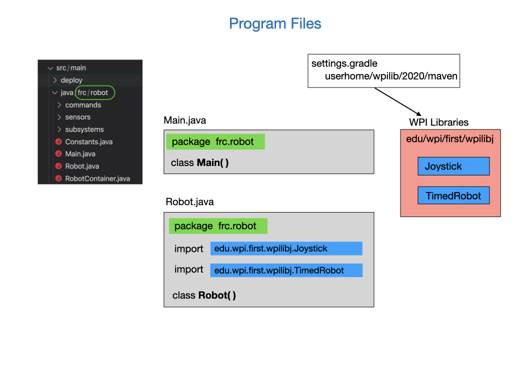

# Example Code
The WPILib development team have provided an extensive library of example code. We're going to start by loading the example code that comes with the WPI libraries.  The example code project will be the base of all of our training lessons and lets you drive the Romi around using a gamepad. To create a project using the example follow the [Programming the Romi](https://docs.wpilib.org/en/stable/docs/romi-robot/programming-romi.html) documentation.

The example code does not run on the Raspberry Pi.  It runs on your development laptop computer and uses the WPILib Simulation framework to communicate with the Romi robot.  The joystick controller will therefore have to connected to your laptop in order to work with the Romi. A joystick can be connected to your laptop via a USB port or Bluetooth.  We'll learn more later about how joysticks are used in our code.

## Robot Simulator
In order to communicate with the Romi we'll be using the [Robot Simulator](https://docs.wpilib.org/en/stable/docs/software/wpilib-tools/robot-simulation/introduction.html).  The Robot Simulator was developed to enable teams to test their code without having an actual robot available.  To remain consistent with that development process the WPI team also now uses it for the Romi training environment.

## Lab - Example Code
This lab has two tasks:

- Operate the Romi robot from your laptop.
- Learn about the files that make up the *RomiReference* project.

### Operating the Romi Robot.
To start the Robot Simulator press the **F5** key.  This will compile and run your program and start the Robot Simulator on your laptop. Once the Robot Simulator comes up the first thing you'll need to do is drag the joystick controller from the **System Joysticks** panel over to the **Joysticks** panel. This associates it with a port so as your program can recognize it.

As is the case with the real robots that are used for competition, the Romi operates in two modes; **Autonomous** and **Teleoperated**.  You put the Romi in Autonomous mode by clicking the link in the **Robot State** panel.  Make sure that your robot is on the ground since this will start up the motors and the robot will move.  It'll move forward 10 inches, turn 180 degrees and move back again. 

Next, place the robot in Teleoperated mode and drive it around using the joystick.

### Example Code Files
Let's look at the files that make up the *RomiReference* project.
Most programs will be composed of multiple files that separate the various components of the program.  This makes it much easier to work on specific parts of the program without scrolling through a single large file.  It also allows the project to be worked on by programming teams, since you would not all be working on the same file. When the program is compiled all of the files are combined, or linked, together to form a single executable file.  In order to associate all of the files that are part of the same project we use an `import` statement. 

Open up the `src/main/java` directory to see the source code files.  The shorted word `src` is often used in Linux to indicate the directory where source code files are stored.  You'll see four files (`Constants.java`, `Main.java`, `Robot.java`, and `RobotContainer.java`) that create the main structure of the robot, you'll learn about these files in the next tutorial section.  

Open up the `subsystems` folder to find the classes that will represent the robot's Subsystems. There's another subsystem under the `sensors` folder.  Sometimes we may separate out subsystems into categories if we have a lot of them.

Open the `commands` folder to find the Commands that we'll be using.

Look at some of these files in the editor by double-clicking on them.  If you know some Java already then the code will look familiar.  If not, then don't worry, we'll learn a lot about Java programming and robots in the upcoming tutorial sections.

## References
- Youtube Video - [Romi WPILib Example Project Walkthrough](https://www.youtube.com/watch?v=j5g4nHV3FaY&ab_channel=Spectrum3847) from Team Spectrum3847 

- Code Example - [RomiReference](https://github.com/FRC-2928/RomiExamples2024/tree/main/RomiSubsystems)

- FRC Documentation - [Robot Simulator](https://docs.wpilib.org/en/stable/docs/software/wpilib-tools/robot-simulation/introduction.html)
