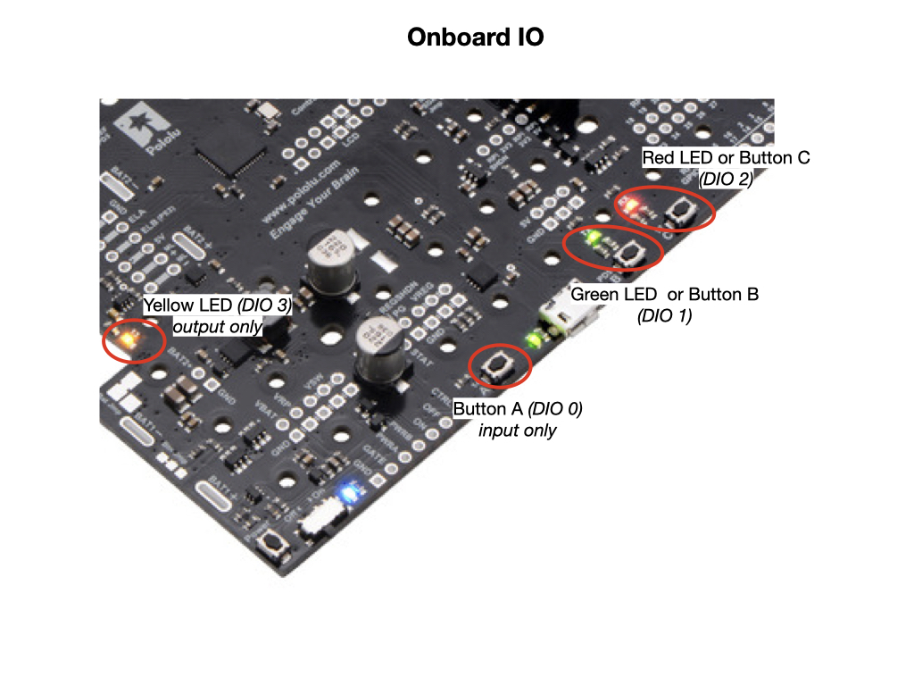
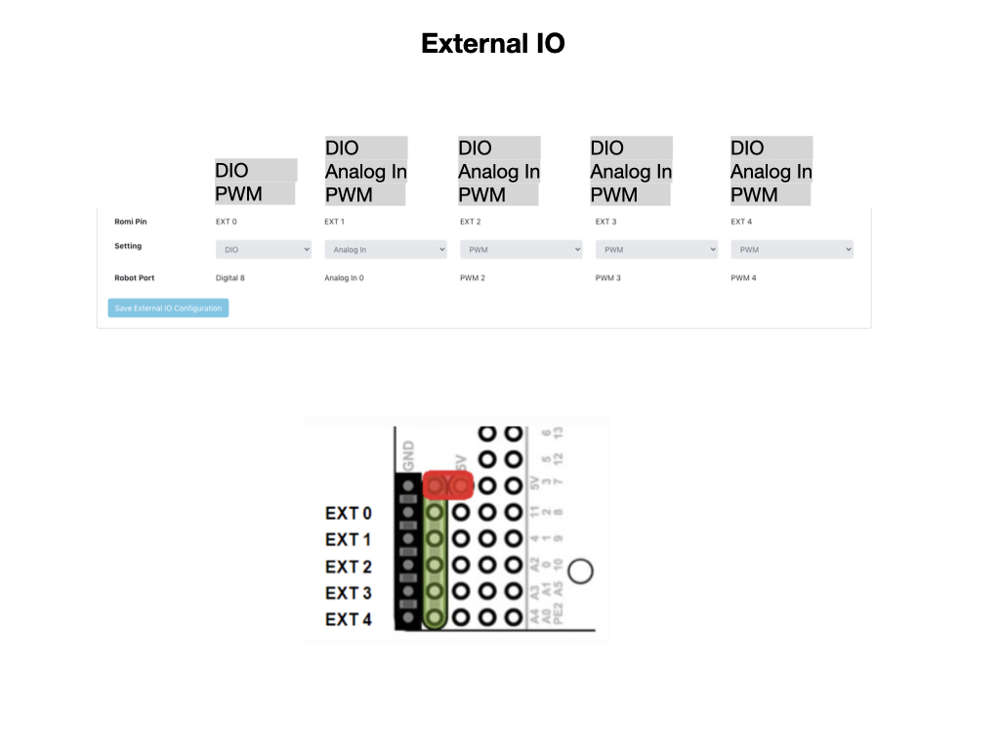

# Romi GPIO
As is the case with most microcontrollers, the Romi has GPIO pins that allow it to communicate with its sensors and actuators. GPIO stands for General Purpose Input/Output is an uncommitted digital signal pin on an integrated circuit or electronic circuit board which may be used as an input or output, or both, and is controllable by the user at runtime. GPIOs have no predefined purpose and are unused by default. 

## Onboard IO
Some of the GPIO pins on the Romi are already connected to input/output devices. In the code these pins are addressed by digital input/output ports *DIOs*.  The address to pin mapping is shown below. 

In the *romiReference* project comes with the subsystem [OnboardIO](https://github.com/mjwhite8119/romi-examples/blob/main/DrivetrainBase/src/main/java/frc/robot/subsystems/OnBoardIO.java) to control the IO ports for the onboard components.

## External IO
There are additional GPIO pins available for general purpose use that can be utilized via header pins. These can be configured via the Romi UI as detailed by the [External IO Configuration](https://docs.wpilib.org/en/latest/docs/romi-robot/web-ui.html#external-io-configuration) FRC documentation.

## References

- Wikipedia - [GPIO](https://en.wikipedia.org/wiki/General-purpose_input/output)

- FRC Documentain - [External IO Configuration](https://docs.wpilib.org/en/latest/docs/romi-robot/web-ui.html#external-io-configuration)