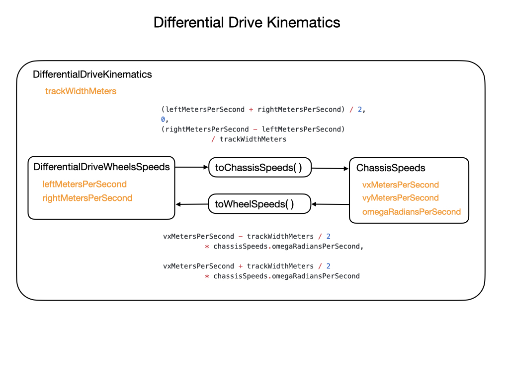
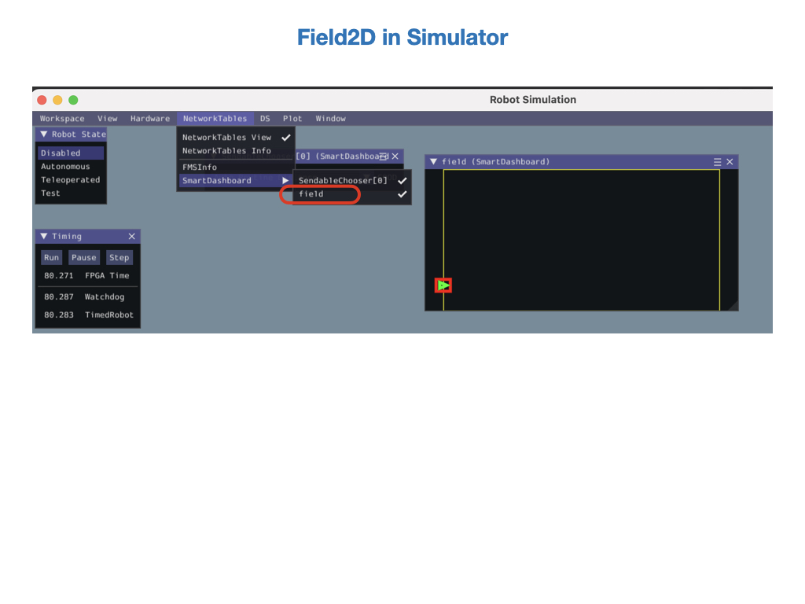

# Kinematics and Odometry
The *DifferentialDriveKinematics* class allows us to use the trackwidth to convert from chassis speeds to wheel speeds.  The trackwidth is the horizontal distance between the wheels. Internally, it uses the *DifferentialDriveWheelSpeeds* and *ChassisSpeeds* classes.  The following diagram shows how this is structured.

*ChassisSpeeds*. See [The Chassis Speeds Class](https://docs.wpilib.org/en/latest/docs/software/kinematics-and-odometry/intro-and-chassis-speeds.html#the-chassis-speeds-class)

For more information on differential drive kinematics see the [Kinematics](../../Concepts/Dynamics/kinematics.md) section of this training guide.     

To learn more about Pose Estimation and Odometry see the [Pose Estimation](../../../Concepts/OptimalEstimation/poseEstimation) module of this training guide.

## Lab - Kinematics and Odometry
There are two tasks for this lab:

- Setup Robot Kinematics

- Setup Robot Odometry

### Setup Robot Kinematics
The trackwidth is a physical attribute of the robot so it can be represented as a constant value.  The trackwidth is the only parameter needed to create the *DifferentialDriveKinematics* object, so it can be placed in the *Contants* file.

    public static final double kTrackwidthMeters = 0.142072613;
    public static final DifferentialDriveKinematics kDriveKinematics =
        new DifferentialDriveKinematics(kTrackwidthMeters);

Create the following method in the *Drivetrain* class.  We'll need to wrap the measured encoder values in a *DifferentialDriveWheelSpeeds* object for easier integration with the *RamseteCommand* class, which we'll look at later in the course.  Since `getWheelSpeeds()` tells you the current state of the system, it should go in the **System State** section of the *DriveTrain* class.

    public DifferentialDriveWheelSpeeds getWheelSpeeds() {
        return new DifferentialDriveWheelSpeeds(m_leftEncoder.getRate(), 
                                                m_rightEncoder.getRate());
    }

We can now make use of this class to publish telemetry.  So place the following code in the `publishTelemetry()` function.

    DifferentialDriveWheelSpeeds wheelSpeeds = getWheelSpeeds();

In our previous [Telemetry](../romiTelemetry) lab we had created two commands in the `publishTelemetry()` function to output the wheel speeds of the drivetrain.  Now we'll replace those commands with the following code that gets the wheel speeds from the *DifferentialDriveWheelSpeeds* class instead of the left and right encoders.
    
    SmartDashboard.putNumber("Left wheel speed", wheelSpeeds.leftMetersPerSecond);
    SmartDashboard.putNumber("Right wheel speed", wheelSpeeds.leftMetersPerSecond); 

We have now completed the task of setting up kinematics!

### Setup Robot Odometry
In this task we'll setup the odometry in order to track the robot's position and orientation on the field and show it on the dashboards.  The dashboards will show a diagram of the field with the current position and orientation of the robot within it.  We'll use the [DifferentialDriveOdometry](https://docs.wpilib.org/en/latest/docs/software/kinematics-and-odometry/differential-drive-odometry.html#differential-drive-odometry) and [Field2d](https://docs.wpilib.org/en/latest/docs/software/dashboards/glass/field2d-widget.html#the-field2d-widget) classes of WPILib to accomplish this.

Add the following class members to the *Drivetrain*.  The *DifferentialDriveOdometry* object is used to keep track of the robot's position and orientation (Pose), and the *Field2d* object will display the pose to the dashboards.

    // Odometry class for tracking robot pose
    private final DifferentialDriveOdometry m_odometry;

    // Show a field diagram for tracking odometry
    private final Field2d m_field2d = new Field2d();

You'll notice that the *Drivetrain* constructor is now underlined in red.  This is because the odometry has not been initialized.  Place the following code in the *Drivetrain*'s contructor to initialize the robot's pose and odometry.

    Pose2d initialPose = new Pose2d(0, 0, m_gyro.getRotation2d()); 
    m_field2d.setRobotPose(initialPose);

    m_odometry = new DifferentialDriveOdometry(m_gyro.getRotation2d(), 
                   getLeftDistanceMeters(), getRightDistanceMeters(), 
                   initialPose);

Also in the contructor, let's place the odometry onto the *SmartDashboard*.

    SmartDashboard.putData("field", m_field2d);

In order to update the odometry we place the following code in the `periodic()` method of the *Drivetrain*.

    // Update the odometry in the periodic block
    m_odometry.update(m_gyro.getRotation2d(), 
                      m_leftEncoder.getDistance(), 
                      m_rightEncoder.getDistance());

Now output the pose of the robot to the dashboards.  Place this code into the `publicTelemetry()` method, which gets called from `periodic()`. 

    m_field2d.setRobotPose(m_odometry.getPoseMeters());

Finally, there needs to be a method to reset the odometry back to the starting point.  This method will also reset the encoders and zero the heading of the gyro.  Place this in the **Control Input** section of the *Drivetrain* class.

    public void resetOdometry(Pose2d pose) {
        resetEncoders();
        resetGyro();
        m_odometry.resetPosition(m_gyro.getRotation2d(),
                            getLeftDistanceMeters(), 
                            getRightDistanceMeters(),
                            pose);        
    }

That's all the additions, let's test the changes!

#### Testing the Odometry    

Start the simulator and select *Network Tables->SmartDashboard->field* at the top bar. A *Field2d* object will appear showing the robot's initial position.  Run one of the automous routines to see the robot move.

 

## References
- FRC documentation - [Kinematics and Odometry](https://docs.wpilib.org/en/latest/docs/software/kinematics-and-odometry/index.html)
