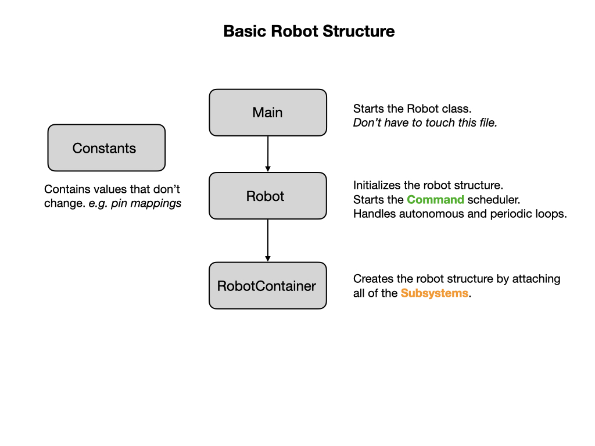
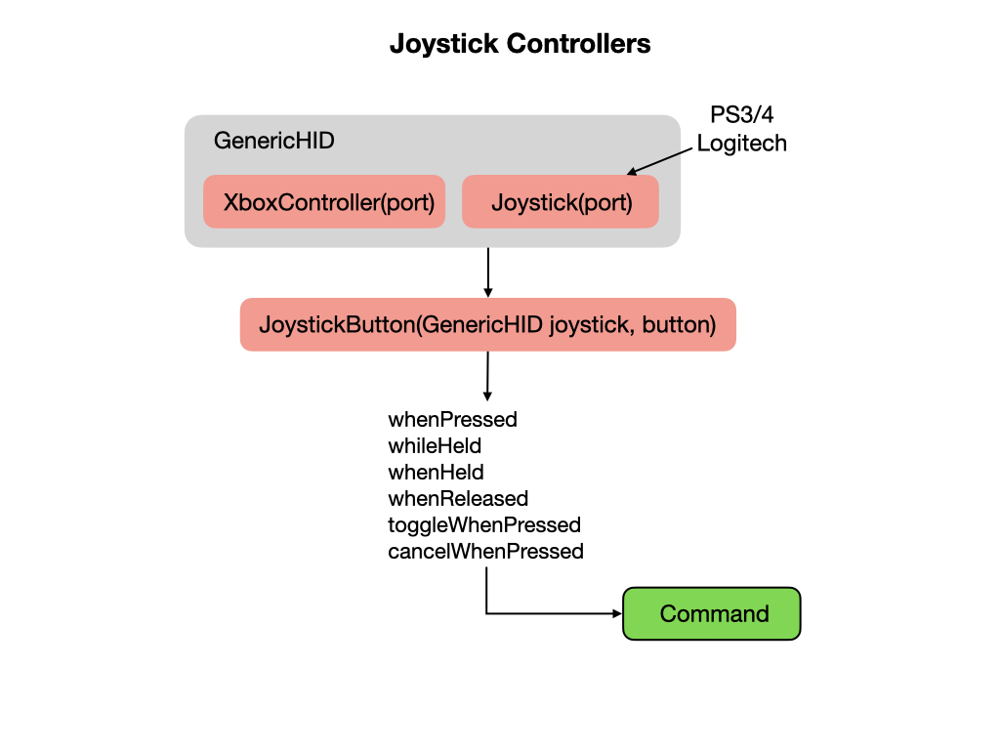

# Basic Robot Structure
By this point you should have your development environment setup and have ensured that you can communicate with the Romi robot by running the [example program](romiExample.md).  It's now time to get down the serious work of learning how to program the robot.  We're going to start with an [Introduction to Programming](../../Programming/introProgramming.md) where you'll get a high level overview of programming concepts.  Then we'll learn a little bit about [Robot Systems](../../Concepts/RobotSystem/intro.md) so as you can understand what it is that you're programming. This will prepare you to understand how the code of an FRC robot is constructed.  

Programs based on the WPILib library are organized around two fundamental concepts: **Subsystems** and **Commands**. Subsystems and Commands run within the context of an FRC Robot program that is built using four basic components.  Each component is kept in separate java files called `Main.java, Robot.java, RobotContainer.java`, and `Constants.java`.  

## The Main Class
The `Main.java` file is the starting point for the entire program and calls the Robot class to start building the robot. To learn more about the `Main` class refer to the [W3 Schools](https://www.w3schools.com/java/java_syntax.asp) tutorial.  In our code you should never need to change this file.

## Robot Class
The `Robot.java` file defines the Robot class and its purpose is to maintain the overall state of the robot.  It is implemented as a **State Machine** that represents the state of the robot at various points in time.  We touched on State Machines in [Introduction to Programming](../../Programming/introProgramming.md) but we'll learn a lot more about them later.

During a competition a robot will first **Initialize** and then go into **Autonomous** mode (state) for the first 15 seconds.  In this mode it will run **Autonomous Commands** which tell it what to do during this time period.  We'll be looking at Autonomous Commands in a later turorial.  After 15 seconds, the robot will switch into **Teleoperated** mode.  During this time the driver will operate the robot using a joystick controller.  At the end of the competition the robot will go into **Disabled** mode.  During each of these modes a [Command Scheduler](https://docs.wpilib.org/en/latest/docs/software/commandbased/command-scheduler.html) will run that is responsible for running commands.

## RobotContainer Class

The `RobotContainer.java` file is where the main structure of the robot is built.  It defines Subsystems and their Default Commands.  It sets up Autonomous Commands that are run during the Autonomous mode of the competition.  The RobotContainer is also where mappings between the Joystick and various Commands are defined.  In our Romi example project this class will also define Shuffleboard options that allow you to control what happens during the Autonomous mode of the competition.  We'll learn a lot more about Shuffleboard later.

## The Constants File

The `Constants.java` file provides a central location for defining constants.  Constants are values assigned to variables that do not change throughout the execution of the program.  

## Joystick Controllers
A joystick/gamepad can be connected to your laptop via a USB port or Bluetooth.  The WPI Library provides all of the necessary software to interface with XBox, PS3/4, or Logitech game controllers. Detailed information on [Joysticks](https://docs.wpilib.org/en/latest/docs/software/basic-programming/joystick.html) can be found in the FRC Documentation.

The Joystick object is created in the *RobotContainer* class.

    private final Joystick m_joystick = new Joystick(0);

To use the Xbox controller use this initialization:

    private final XboxController m_joystick = new XboxController(0);

A method is created in the class that uses the joystick to control the robot:

    public Command getArcadeDriveCommand() {
        return new ArcadeDrive(
            m_drivetrain, () -> -m_joystick.getRawAxis(1), () -> m_controller.getRawAxis(2));
    }

You may need to change the second `getRawAxis()` to suit your controller.    

## Lab - Robot Structure.
There are three tasks for this lab:

- Move constants to the *Constants* file.
- Modify the *Drivetrain* class to change inches to meters.
- Rename the Joystick variable.

### Move constants to Constants File
The *Constants* file is where we keep variables that don't change during the execution of the program.  There are two such variables in the *Drivetrain* class that really should be in the *Constants* file.  You'll find these variables on lines 15 and 16:

    private static final double kCountsPerRevolution = 1440.0;
    private static final double kWheelDiameterInch = 2.75591; // 70 mm

Move the two variables into the *Constants* file placing them between the two brackets. Notice that there are four keywords before these two variables:

- The [private](https://www.w3schools.com/java/ref_keyword_private.asp) keyword makes the variable accessible only within the declared class.  Since we want to make them accessible by all classes, we're going to change the keyword to [public](https://www.w3schools.com/java/ref_keyword_public.asp).

-  The [static](https://www.w3schools.com/java/ref_keyword_static.asp) keyword creates attributes that can be accessed without creating an object of a class.  In the *Constants* file we're not going to create any objects so we need to define the variables as `static`.  This was also the case when the variables were in the *Drivetrain* file.  They were defined as class variables and not object variables.

- The [final](https://www.w3schools.com/java/ref_keyword_final.asp) keyword in Java means that the variable doesn't change it's value during the execution of the program.

- [double](https://www.w3schools.com/java/ref_keyword_double.asp) is a variable data type that can store large fractional numbers.

In the next lab we're going to measure the distance that the robot travels from inches to meters, so change the name of the variable `kWheelDiameterInch` to `kWheelDiameterMeters`.  Also change its value from `2.75591` to `0.07`.  The wheel diameter on the Romi is 7 centimeters, which is 0.07 meters.

Now, if you look at the tab for the *Drivetrain* you'll notice that it has turned red.  This means that there's an error in the code that will prevent it from compiling.  This is because you have moved the definitions for the two variables out of the Drivetrain file and it can no longer find them.  To fix this, go to lines `44` and `45` and type the class name *Constants* followed by a period in front of the four variables that are underlined in red.  The word Constants will now be underlined, so mouseover the word and select "Quick Fix" to import the *Constants* class into the *Drivetrain* file.  When you're done it should look like the following:

    m_leftEncoder.setDistancePerPulse((Math.PI * Constants.kWheelDiameterMeters) / Constants.kCountsPerRevolution);
    m_rightEncoder.setDistancePerPulse((Math.PI * Constants.kWheelDiameterMeters) / Constants.kCountsPerRevolution);

So what's happening in the these two lines?  On lines `24` and `25` of our *Drivetrain* class you'll find two encoder objects created from the *Encoder* class.  These are called [Inner Classes](https://www.w3schools.com/java/java_inner_classes.asp), sometimes referred to as **Nested Classes**, and are used to group together functionality. Since we have two motor encoders attached to our drivetrain, it makes sense that they're nested within the *Drivetrain* class.  Here's how we create the encoder objects.  The number parameters tells us what GPIO pins the encoders are connected to.  

    private final Encoder m_leftEncoder = new Encoder(4, 5);
    private final Encoder m_rightEncoder = new Encoder(6, 7);

One of the methods of the Encoder class is `setDistancePerPulse()`, which tells us how far we've travelled for each encoder pulse. We set it with one very long parameter that does all the math to work out what this value is.    

<!-- [Move constants solution](solutionMoveConstants.md) -->

### Change Inches to Meters
In robotics it's better to do things in meters instead of feet and inches, so we're going to change some methods in the *Drivetrain* class to return the distance travelled from inches to meters.  A [method](https://www.w3schools.com/java/java_methods.asp) is a block of code that only runs when it's called. A method must be declared within a class, and are used to perform certain actions. They can only be accessed after you have created a class object. Methods are also known as functions, so we'll use the words method and function interchangeably. 

In the *Drivetrain* class, go to line `66` where you'll find three methods that will need to be renamed.  Change `Inch` to `Meters` at the end of the method names.  We've already changed the variable `kWheelDiameterMeters` in the last lab, which means that the `getDistance()` function will be returning meters instead of inches.  A key skill of a good programmer is to name variables and functions in a way that makes your code easy to read.  If you choose good names then you'll need to have far fewer comments in your code, since it'll be clear what's going on.  When you're done making the changes the methods should look like this:

    public double getLeftDistanceMeters() {
      return m_leftEncoder.getDistance();
    }

    public double getRightDistanceMeters() {
      return m_rightEncoder.getDistance();
    }

    public double getAverageDistanceMeters() {
      return (getLeftDistanceMeters() + getRightDistanceMeters()) / 2.0;
    }

Now look at the files `TurnDegrees.java` and `DriveDistance.java` under the `commands` subfolder and you'll see that you have errors.  This is because it references our original functions, which we have just renamed.  Change the name to match our renamed functions.  You can also use the mouseover trick and select "Quick Fix" to reconcile the name, but be careful to select the correct choice from the dropdown list.  

Another change to make is on line `58` of the *TurnDegrees* class.   Change `inchPerDegree` to `metersPerDegree`, and also change it's value from `5.551` to `0.141`.  The line should now look like this:

    double metersPerDegree = Math.PI * 0.141 / 360;

Finally, since we're using meters now instead of inches we need to change the values passed in the *AutonomousDistance* command from `10` to `1`. 

<!-- [Inches to meters solution](solutionInchMeters.md) -->

### Rename Joystick Variable
Also, we should change the name of the Joystick variable name to `m_joystick` instead of `m_controller`.  In later lessons a *Controller* is a class that manages the movement of the robot.  Renaming this variable to `m_joystick` will avoid future confusion.

## References
- FRC Documentation - [Structuring a Command-Based Robot Project](https://docs.wpilib.org/en/latest/docs/software/commandbased/structuring-command-based-project.html?highlight=RobotContainer)

- FRC Documentation - [Joysticks](https://docs.wpilib.org/en/latest/docs/software/basic-programming/joystick.html)

- FRC Documentation - [Shuffleboard](https://docs.wpilib.org/en/stable/docs/software/wpilib-tools/shuffleboard/index.html)

- Java Tutorial on [W3Schools](https://www.w3schools.com/java/default.asp)

- Code Example - [RomiRobotStructure](https://github.com/FRC-2928/RomiExamples/tree/main/RomiRobotStructure)

