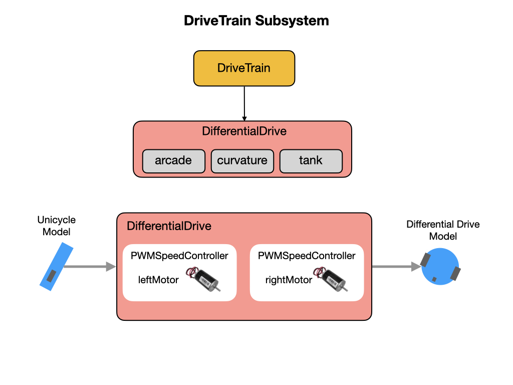

# Subsystems

Subsystems are the basic units of functionally for our robot, such as drive trains and mechanical arms.  They encapsulate low-level hardware objects (motor controllers, sensors, etc) and provide methods that can be used by Commands.  We represent subsystems in code by using [Objects](../../Programming/objects.md). Objects are composed of [Data Structures](../../Programming/dataStructures.md) and [Procedures](../../Programming/procedures.md), as explained in [Introduction to Programming](../../Programming/introProgramming.md). You should learn those concepts before we look at the subsystems that are on the Romi.  

 For this module the majority of the code implementation can be found in the [Subsystems](https://docs.wpilib.org/en/latest/docs/software/commandbased/subsystems.html) section of the FRC Documentation.  

## DriveTrain Subsystem
The Romi uses a drive train called a [Differential Drive](https://docs.wpilib.org/en/stable/docs/software/actuators/wpi-drive-classes.html#using-the-differentialdrive-class-to-control-differential-drive-robots). There are three types of Differential [Drive Train Modes](https://docs.wpilib.org/en/stable/docs/software/actuators/wpi-drive-classes.html#drive-modes) that can be implemented. The Romi will make use of at least two of them. To understand what type of maneuvers are possible using a Differential Drive robots you can look at the [Robot Kinematics](../../Concepts/Dynamics/kinematics.md) module. The *DifferentialDrive* class takes the left and right motors as parameters that are wrapped in the *PWMSpeedController* class.  The primary task of the *DifferentialDrive* class is to convert a single speed (unicycle model) into speed for the left and right side of the chassis.

The primary job of the *Drivetrain* subsystem is to send speed commands to its motors.  This is done in the `arcadeDrive()` method where we pass in the required translational and rotational speed.  The *DifferentialDrive* object will take care of controlling the speed to the left and right motors based on the kinematics of the drivetrain type. 

    public void arcadeDrive(double xaxisSpeed, double zaxisRotate) {
        m_diffDrive.arcadeDrive(xaxisSpeed, zaxisRotate);
      }

Other procedures in the Drivetrain class will take care of resetting and reading the wheel encoders.  It'll also translate the wheel encoder values into distances, as explained in the [Pose Estimation](../../Concepts/OptimalEstimation/poseEstimation.md) module.  Also checkout [Using the WPILib Classes to Drive your Robot](https://docs.wpilib.org/en/stable/docs/software/actuators/wpi-drive-classes.html?highlight=speedcontroller#multi-motor-differentialdrive-with-speedcontrollergroups) for more information on implementing a drive train in FRC.

## RomiGyro Subsystem
The RomiGyro subsystem reads values from its gyro in order to perform [Pose Estimation](../../Concepts/OptimalEstimation/poseEstimation.md). The raw data that comes from gyros is very complex and difficult to intepret.  The RomiGyro subsystem translates the data into simple angles and rates-of-turn that are much easier to understand.

## Lab - Subsystems
This lab builds on the lab that you did in the [Basic Robot Structure](romiStructure.md) section of the training guide.  You'll learn about the following Java programming concepts:

- [Java Objects](../../Programming/objects.md) are programming constructs used to represent physical objects and ideas in the real world.

- [Java Constructors](https://www.w3schools.com/java/java_constructors.asp) special methods that are used to initialize objects.

- [Java Methods](https://www.w3schools.com/java/java_methods.asp), are declared within a class, and are used to perform certain actions.

- [Abstract Classes](https://www.w3schools.com/java/java_abstract.asp) that show only essential things to the user and hides the internal details.  Abstraction lets you focus on what the object does instead of how it does it.

- [Interfaces](https://www.w3schools.com/java/java_interface.asp), which are used to group together related methods that specify the behavior of a class.

There are three updates for this lab:

- Update the *RomiGyro* to make use of an Interface.
- Create a method to get the current heading of the robot.
- Add comments to divide the *Drivetrain* class into subsections.

### Add an Interface to RomiGyro
For this update we're going to have the *RomiGyro* class implement WPILib's *Gyro* interface.  An [interface](https://www.w3schools.com/java/java_interface.asp) is an [abstract class](https://www.w3schools.com/java/java_abstract.asp) used to group together related methods that specify the behavior of a class.  You can think of an interface as a contract for a class that uses it. Any class that uses the interface must implement all of the methods and variables that are in that interface.   Like a class, an *interface* can have methods and variables, but the methods declared are by default abstract. This means that it only defines the method's name and not the code required to implement it.  The code gets implemented by the class that `implements` the interface.

Why would we want the *RomiGyro* class to implement this interface?  The *Gyro* interface defines methods that we're going to use later as we build out our robot project, and we want to make sure that these methods are available to us.

Open the *RomiGyro* class, which you'll find in the `sensors` folder. On line `12` you'll find the definition for this class.  After the word RomiGyro type in the keyword `implements` followed by the class name `Gyro`.  The Gyro interface class will need to be imported.  You can do this by mousing over the word Gyro and selecting "Quick Fix".  When you're done the class definition should look like this:  

    public class RomiGyro implements Gyro {

Now the class name RomiGyro will show an error.  This is because it hasn't implemented the methods defined in the Gyro interface.  You can see what methods need to be implemented by mousing over the error.  

Let's start with `getAngle()` and `getRate()`.  Since our wheeled robot only operates on a 2D plane there's only one angle coming from the real gyro that we're concerned about, the angle around the Z axis.  So we can just name the method `getAngle()` since we know what the angle means in the context of our wheeled robot.  It will return the Z angle from the gyro.  The same applies for `getRate()`. If you want to know why we're using the Z angle you can look at the [Robot Geometry](../../Concepts/Dynamics/geometry.md) section of the training guide.  When you've implemented the methods, they should look like the following.  Place these methods at the end of the *RomiGyro* class file.

    @Override
    public double getAngle() {
      return getAngleZ();
    }

    @Override
    public double getRate() {
      return getRateZ();
    }

In order to implement an interface method you must override it. To do this, place the directive `@Override` immediatelly before the method.  

We're not going to implement any code for the `calibrate()` method, but we must still include it in our RomiGyro class like so:

    @Override
    public void calibrate() {
      // no-op
    }

As far as the `close()` method goes, just add the following for now.  It implements functionality for simulation, which we'll learn about later.  

    @Override
    public void close() throws Exception {
      if (m_gyroSimDevice != null) {
        m_gyroSimDevice.close();
      }
    }

One last thing, place the following code after line `23` of the *RomiGyro* class.  This is also used for simulation.

    private SimDevice m_gyroSimDevice;

We're now done with this update!

<!-- [RomiGyro Interface solution](solutionRomiGyro.md) -->

### Create Heading Method
In later programs we're going to need to get the current heading of our robot.  The heading is obtained from the *RomiGyro* class that we modified in the previous lab.  The *RomiGyro* is defined as a subsystem of the *Drivetrain* class.

Update the *Drivetrain* class with a new method called `getHeading()` that will be used to get the current heading of the robot.  You can place this method at around line `132` of the *Drivetrain* class just after the `getGyroAngleZ()` method.  The method will return a `double` value and be defined as `public`.  The return value will be whatever we get from the `getRotation2d().getDegrees()` method that was defined in the *Gyro* interface.  That's why we implemented that interface in the *RomiGyro* class.  When you're done it should look like this:

    public double getHeading() {
      return m_gyro.getRotation2d().getDegrees();
    }

We also may need to reset the heading, so create another method named `zeroHeading()` to accomplish this.  Notice that the name "zeroHeading" describes exactly **what** we want the method to do and not **how** we want it to be done.  The **how** part is hidden within the function. This is an example of [Declarative Programming](https://en.wikipedia.org/wiki/Declarative_programming).

The function has a return type of `void`, which means that it does **not** return any value.  Our function should call the `reset()` method of the gyro object, like so:

    public void zeroHeading() {
      m_gyro.reset();
    }

We're now done creating our new heading method!

<!-- [Add heading solution](solutionCreateHeading.md) -->

### Add Comments
As you add functionality to your code some of the files may get quite long, so it's a good idea to divide them into sections by using comment separators.  In the *Drivetrain* class we'll add the following comment separators to group together methods that are logically related.  This will make them easier to find.  The comment sections will be:

- **Initialization** - Includes everything required to construct and initialize the *Drivetrain* object.
- **Control Input** - Any method that causes the robot, or subsystem, to react in some way.
- **System State** - Methods that give information on what the current state of the *Drivetrain*  object is.
- **Process Logic** - Mostly logic that occurs during the `periodic()` loop, or processes/interprets incoming data before performing some kind of *Control Input* to the robot.  Incoming data will normally be provided by methods found in the *System State* subsection.

The comments will span most of the line width to form a separator and will look like this:

    // -----------------------------------------------------------
    // Control Input
    // -----------------------------------------------------------

Think about where these file separators will go and what code will go in each section.  Here are a couple tips:

- If a method is returning a value, such as `double`, then it's most likely describing the System's State.

- If a method return type is declared as `void` then it's probably some kind of Control Input.

That's all for this update!

## References
- FRC Documentation - [Subsystems](https://docs.wpilib.org/en/latest/docs/software/commandbased/subsystems.html)

- FRC Documentation - [Differential Drive Robots](https://docs.wpilib.org/en/stable/docs/software/actuators/wpi-drive-classes.html)

- FRC Documentation - [Using the WPILib Classes to Drive your Robot](https://docs.wpilib.org/en/stable/docs/software/actuators/wpi-drive-classes.html?highlight=speedcontroller#multi-motor-differentialdrive-with-speedcontrollergroups)

- Java Tutorial on [W3Schools](https://www.w3schools.com/java/default.asp)

- QUT Robot Academy [Measuring Motion](https://robotacademy.net.au/masterclass/measuring-motion/)

- Code Example - [RomiSubsystems](https://github.com/FRC-2928/RomiExamples/tree/main/RomiSubsystems)