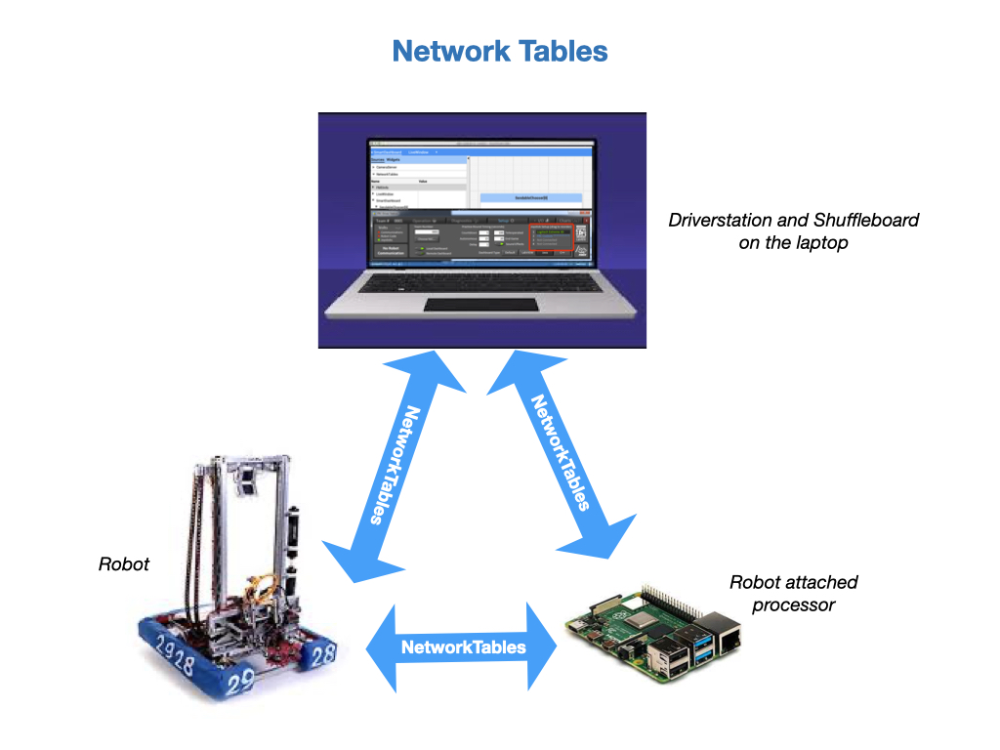
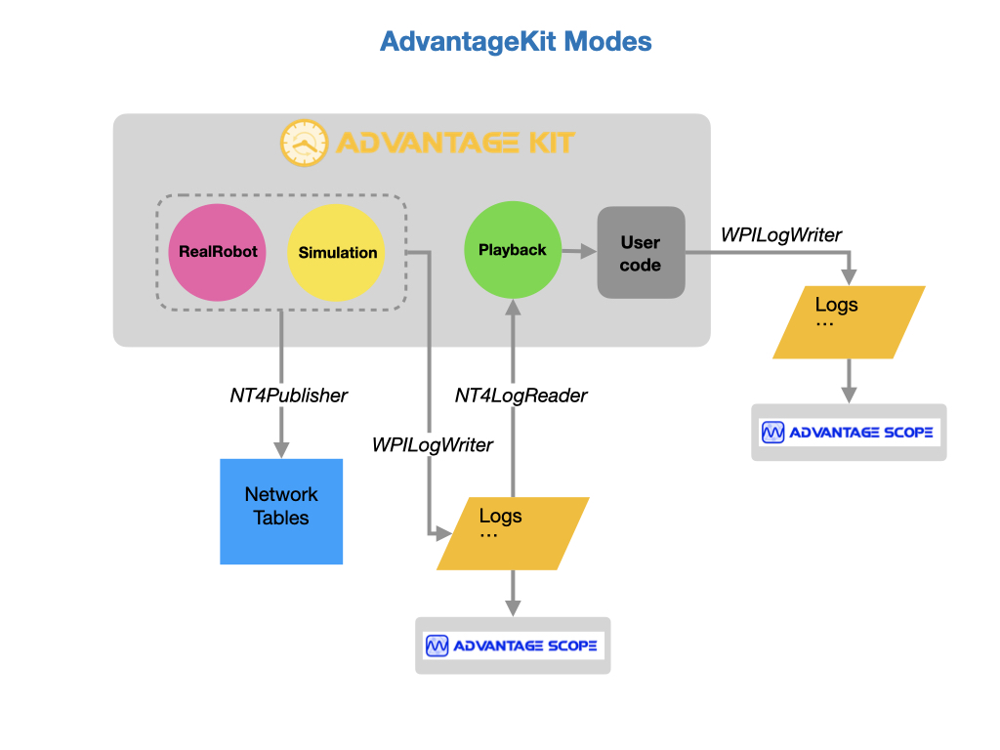
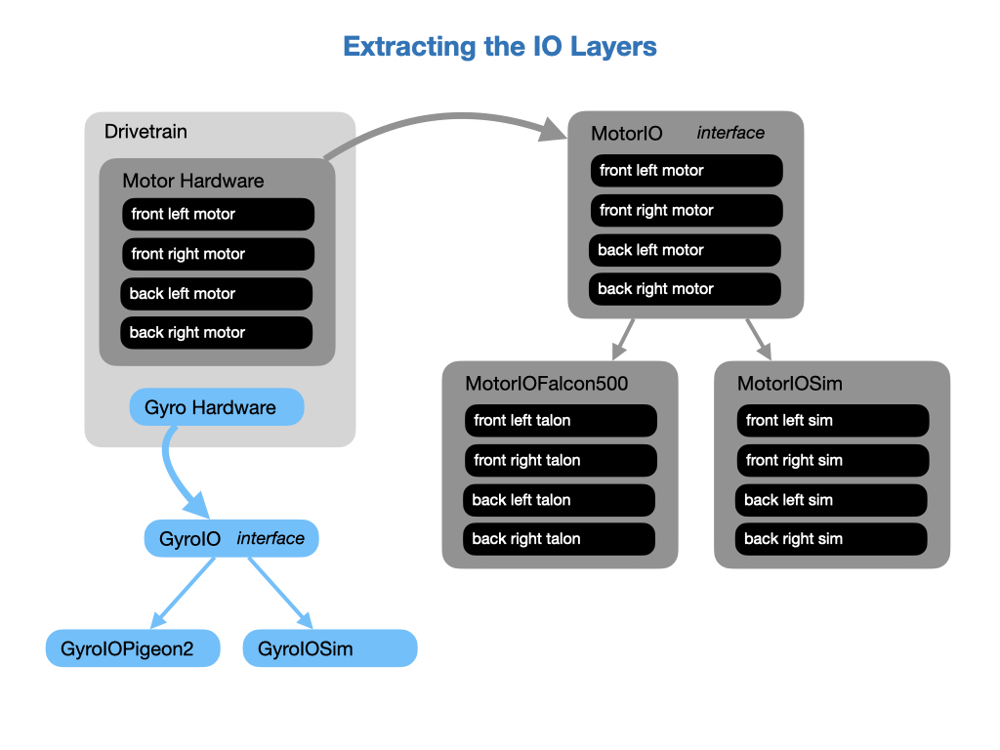
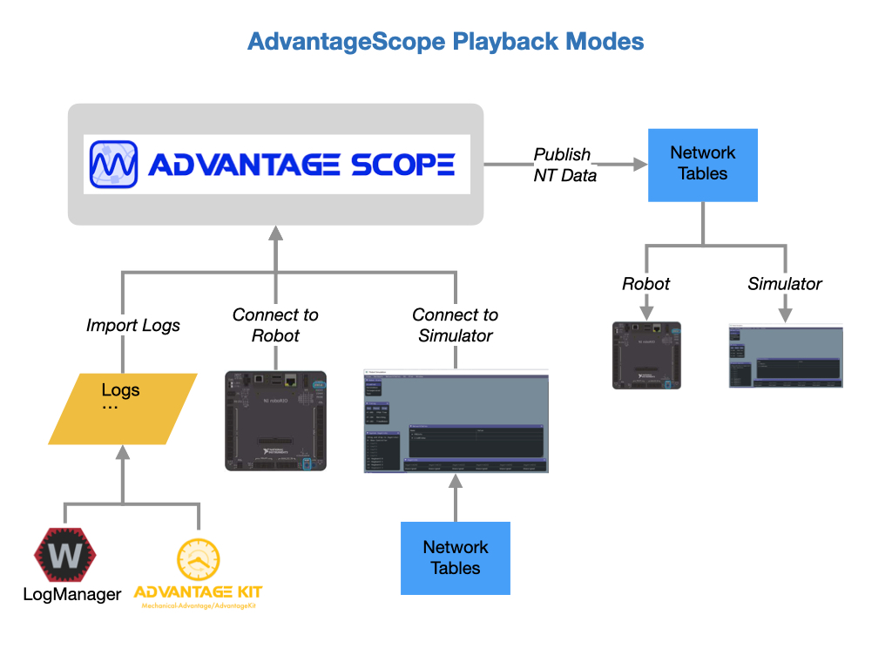

# Telemetry & AdvantageKit
When you are running code on a robot it's very useful to track how data is passing through the system as it operates.  This is referred to as *Telemetry*, which is the science of automatically collecting measurements and transmitting them to a receiving station.  Telemetry is a critical tool for fine tuning a system and figuring out why a system isn't operating the way it should. Remember, that robots are data driven machines, so in order to test our code we'll need to see the data.  

When creating Commands and Subsystems for our robot it's important to build in telemetry functions right from the start.  When testing your code on the robot things often do not go as expected at first.  In order to solve the problem quickly it's good to have the diagnostic data readily at hand.  For simple data structures you can directly output values to the *SmartDashboard* from the `periodic()` loop. More detailed logging can be done with AdvantageKit, which we'll cover in this section.

## Network Tables

[Network Tables](https://docs.wpilib.org/en/stable/docs/software/networktables/index.html) are used to communicate between the robot, driver station, and any attached coprocessors, such as a Raspberry Pi.  Network Table values are automatically distributed to all of the systems that are connected to them.  They're a core technology used for transmitting telemetry data between the robot and dashboards.

NetworkTables classes are instantiated automatically when your program starts. There are some default tables that are created automatically at start up. As you add telemetry to your robot you'll be placing data values into these NetworkTables.

## Shuffleboard
FRC has developed a tool called *Shuffleboard*, which allows you to view all of the data that's generated from the robot in Real-Time.  It also enables you to send data to the robot in order to make commands more flexible and change the behaviour of the robot.

The documentation explains how to [Start Shuffleboard](https://docs.wpilib.org/en/stable/docs/software/wpilib-tools/shuffleboard/getting-started/shuffleboard-tour.html#starting-shuffleboard) depending on your development laptop.  

Prior to the release of the *Shuffleboard* tool FRC used an application called [SmartDashboard](https://docs.wpilib.org/en/stable/docs/software/dashboards/smartdashboard/index.html).  To maintain backwards compatibilty *SmartDashboard* has been incorporated into *Shuffleboard*.  From the robot code *SmartDashboard* is still the easiest way to output telemetry data and we'll use that in the next labs.

### The Sendable Interface
The FRC documentaton has instructions on [Adding Telemetry to Robot Code](https://docs.wpilib.org/en/stable/docs/software/telemetry/telemetry.html#adding-telemetry-to-robot-code). Most of this is done using the *Sendable* interface provided by WPILib that's documented in [Robot Telemetry with Sendable](https://docs.wpilib.org/en/stable/docs/software/telemetry/robot-telemetry-with-sendable.html#robot-telemetry-with-sendable). The *Sendable* interface automatically sends telemetry values every robot loop, removing the need to handle the periodic logic of sending and receiving values from the dashboard.  

For simple data structures however, you can directly output values to the *SmartDashboard* from the `periodic()` loop, which is how we'll be doing it in the first lab.  

## Advantage Kit
AdvantageKit is a logging framework that records all of the data flowing into the robot code. After a match, these values can be replayed to the robot code in a simulator. The log needs to be replayed using the same version of code that generated the log. See [What is Advantage Kit](https://github.com/Mechanical-Advantage/AdvantageKit/blob/main/docs/WHAT-IS-ADVANTAGEKIT.md) for more information.

### Installation
To install the *Advantage Kit* libraries into your project go to [Advantage Kit Installation Page](https://github.com/Mechanical-Advantage/AdvantageKit/blob/main/docs/INSTALLATION.md#new-projects).  Follow the instructions on that page for setting up a project. Commands need to be added to the `build.gradle` file, and to the *Robot* class. You can also add the *Gversion Plugin (Git Metadata)*, as documented on the installation page. This ensures that you can match the logfiles with the correct version of the code that generated them. 

### AdvantageKit Modes
*AdvantageKit* runs in two modes, **Record** or **Playback**. 

Record mode happens by running the real robot or by running a *WPI Robot Simulator*.  While running on the real robot it's set to write out to log files on the RoboRio and can also publish to the Network Tables.  It's recommended that you use a thumb drive on the RoboRio to hold the log files. When running the WPI Simulator the log files are written to the project directory under the top level `logs` folder. Data can also be written to the Network Tables and viewed live in *AdvantageScope*.

Once you have a log file you can simply play it back in *AdvantageScope*.  If you want to make changes, such as collecting more data, then you can use *AdvantageKit*'s playback mode to create a new logfile containing the additional data.

In playback mode it reads the log file previously written during a match or in simulation and plays it back to the robot code. You start the playback by running the **Simulate Robot Code** option in VSCode. When the playback runs it can create a new logfile that includes any new data that was collected.  Note that the code will run as fast as possible in the WPI Simulator and then exit, so the review must be done from *AdvantageScope*.

## Lab - Telemetry
This lab builds on the code that you wrote in the [Commands](romiCommands.md) section of the training guide.  You'll learn about the following Java programming concepts:

- [static](https://www.w3schools.com/java/ref_keyword_static.asp) methods that can be accessed without creating an object of the class first.

This lab has one task:

- Track the current position and heading of the robot using *SmartDashboard*. 

## Tracking Robot Velocity and Heading
In this task you'll use telemetry to track the current position and heading of the robot. The data will be output to the SmartDashboard, which is now part of Shuffleboard.  As you put data onto SmartDashboard it will automatically place it into the Network Tables.  As stated above, Network Tables are a key enabling technology for implementing telemetry.
 
 It's preferrable to keep all of the telemetry data in one place, so create a function named `publishTelemetry()` at the bottom of the *Drivetrain* file.  The function should be `public void`, since it will return no data when it's invoked by the calling function. We'll use the *SmartDashboard* class to output details for the left and right encoders together with the robot heading.  

 If you examine the *SmartDashboard* class you'll notice that all of the methods are defined as `public static`.  This means that its methods can be accessed without creating an object of the class first.  This allows us to convenienty use the SmartDashboard functionality anywhere in our code.  Use SmartDashboard's `putNumber()` method to output the left encoder rate.  The encoder rate tells us the wheel speed.  Here's an example of the syntax:

    SmartDashboard.putNumber("Left Wheel Speed", this.leftEncoder.getRate());
 
Remember that we're putting this in the `publishTelemetry()` method. Also publish the right encoder rate and the heading.  The robot heading can be obtained from the `getHeading()` method of the *Drivetrain*. When you're done the code should look like this:

    public void publishTelemetry() {
        
        // Display the meters per/second for each wheel and the heading
        SmartDashboard.putNumber("Left Wheel Speed", this.leftEncoder.getRate());
        SmartDashboard.putNumber("Right Wheel Speed", this.rightEncoder.getRate());
        SmartDashboard.putNumber("Heading", getHeading().getDegrees());
    }

This function can now be called from the `periodic()` method, which will place it in the robot's process loop.  Since the process loop runs 50 times per/second we'll see a continuous stream of changing data as the robot moves.

    public void periodic() {
        publishTelemetry();
    }

To test, start the Simulator and view the SmartDashboard output.

You're now done with this task!

### Install AdvantageKit
Install the *Advantage Kit* libraries into your project. Go to Advantage Kit Installation Page [Existing Projects](https://github.com/Mechanical-Advantage/AdvantageKit/blob/main/docs/INSTALLATION.md#existing-projects) and follow the instructions in that section for installing the libraries and setting up the `build.gradle` file.  Only complete the tasks in that section of the documentation, we'll go step by step through the rest of the setup. 

Your now done with this task!

### Configure the Robot
After installing *AdvantageKit* you need to configure the robot code in order to use the framework.  See [Configuring the Robot](https://github.com/Mechanical-Advantage/AdvantageKit/blob/main/docs/INSTALLATION.md#robot-configuration) in the *AdvantageKit* documentation.  There are two steps to this:

- Open the *Robot* class and extend *LoggedRobot*.

- Add code into `robotInit()` in the *Robot* class.  Make sure that you import the *AdvantageKit* logger NOT the system logger.

### Setup the AdvantageKit Mode
Place the following code into your *Constants* file.  On the Romi the mode will always be SIM.  The REAL mode will only get set on the competition robot.

	public static final Mode mode = SIM;

    public static enum Mode {
		/** Running on a real robot. */
		REAL,

		/** Running a physics simulator. */
		SIM,

		/** Replaying from a log file. */
		REPLAY
	}

Then put the following code in the `robotInit()` of the *Robot* class.

    switch(Constants.mode) {
		case REAL -> {
			Logger.addDataReceiver(new WPILOGWriter("/U/logs"));
			Logger.addDataReceiver(new NT4Publisher());
		}

		case SIM -> {
			Logger.addDataReceiver(new NT4Publisher());
		}

		case REPLAY -> {
			this.setUseTiming(false); // Run as fast as possible
			final String logPath = LogFileUtil.findReplayLog();
			Logger.setReplaySource(new WPILOGReader(logPath));
			Logger.addDataReceiver(new WPILOGWriter(LogFileUtil.addPathSuffix(logPath, "_sim")));
		}

### Setting up the IO Layers
By necessity, any interaction with external hardware must be isolated such that all input data is logged and can be replayed in *AdvantageScope* where that hardware is not present. It's recommended to restructure the subsystem such that hardware interfacing occurs in a separate object called the *IO Layer*. The IO layer includes an interface defining all methods used for interacting with the hardware along with one or more implementations that make use of vendor libraries to carry out commands and read data.

The following section shows how to set up an IO Layer for the gyro and implement it in the *Drivetrain* subsystem.

### Setting up the GyroIO Interface
Each hardware system should have an interface class that defines the input/output data that should be logged, and methods used to control the hardware. Specific hardware classes can then be created that implement the IO interface.  The example diagram the real Pigeon2 hardware and a simulation of it.

Create an `interface` class that can use to implement different types of hardware. In our case we'll implement the *Pideon2* gyro, but we can also implement simulation class.

Inside of this interface we define a class to to get the inputs from the hardware. This class implements *LoggableInputs*, which is a set of values which can be logged and replayed (for example, the hardware inputs for a subsystem). The data is stored in *LogTable* objects.  We'll only get the gyro yaw data in this example.

Finally, we update the set of loggable inputs in the `updateInputs()` method.

    public interface GyroIO { }

        public static class GyroIOInputs implements LoggableInputs {

            public double gyroYawPosition;

            public void toLog(LogTable table) {
                table.put("GyroYawPosition", gyroYawPosition);
            }

            public void fromLog(LogTable table) {
                gyroYawPosition = table.getDouble("GyroYawPosition", gyroYawPosition);
            }

        } 

        public default void updateInputs(GyroIOInputs inputs) {}

    }

### Implementing the GyroIO Interface
We're going to use the *Pigeon2* hardware so create a class called *GyroIOPigeon2*.  We can name the hardware that's being implemented.  This is where the actual hardware is accessed so we define the *Pigeon2* with its port ID.  

    public class GyroIOPigeon2 implements GyroIO {

        public Pigeon2 pigeon = new Pigeon2(Constants.CANBusIDs.kPigeonIMU);
        
        public GyroIOPideon2() {            
        }
            // Updates the set of loggable inputs. 
            public void updateInputs(GyroIOInputs inputs) {
                inputs.gyroYawPosition = this.pigeon.getAccumGyroZ().getValue();
        }
    }

### Implementing Control Inputs
Since any interaction with the hardware now goes through the IO Layer, any control inputs must be defined in the interface class and implemented in the hardware specific class.  To define in the interface class:

    public default void resetGyro() {}
    
And to implement in the hardware specific *GyroIOPigeon2* class:

    @Override
    public void resetGyro() {
        this.pigeon.reset();
    }

See [Recording Inputs](https://github.com/Mechanical-Advantage/AdvantageKit/blob/main/docs/RECORDING-INPUTS.md) in the AdvantageKit documentation for more information.

### Subsystem Setup
With the IO layers created they can now be used by the subsystem.  The example Gyro IO Layer can be used by the Drivetrain class.  We would also define an IO layer for the drive train motors so the example below shows how they would both be used.

    private final DrivetrainIO io;
    private final DrivetrainIOInputs inputs = new DrivetrainIOInputs();
    private final GyroIO gyroIO; 
    private final GyroIOInputs gyroInputs = new GyroIOInputs();

The hardware interface gets passed into the *Drivetrain*'s constructor.

    public Drivetrain(GyroIO gyroIO,
                    DrivetrainIO drivetrainIO) {
        this.io = drivetrainIO;
        this.gyroIO = gyroIO;
    }

In the `periodic()` routine the input data gets updated from the IO layer, and then get sent to the logging framework (or updates from the log during replay).

    periodic() {
        io.updateInputs(inputs);
        Logger.getInstance().processInputs("Drive/" + name + "Module", inputs);
    }    

In the subsystem methods the data from the IO layer is used.

    public Rotation2d getHeading() {
        return gyroInputs.gyroYaw;
    }

The logging framework supports recording this output data on the real robot and during replay. 

    Logger.getInstance().recordOutput("Drive/Angle", getHeading());   

See [Recording Outputs](https://github.com/Mechanical-Advantage/AdvantageKit/blob/main/docs/RECORDING-OUTPUTS.md) in the AdvantageKit documentation for more information.

### Passing the IO Layer to the Subsystem
Here's an example of how the IO Layer would get passed to the subsystem during its creation.  This code would go into the constructor of the *RobotContainer* class.  On the real robot we would use the actual hardware, otherwise the simulation IO layer would be used.  In playback mode we want to disable the IO layer since the data is coming from the previously generated log files.

    if (Robot.isReal()) {
      // Instantiate IO implementations to talk to real hardware
      m_drivetrain = new Drivetrain(new GyroIOPideon2(),
                                    new DrivetrainIOFalcon500(), 
                                    m_transmission::getGearState);
    } else {
      
      switch (Constants.currentMode) {     
        case SIM:
          // Use anonymous classes to create "dummy" IO implementations
          DrivetrainIOSim drivetrainSim = new DrivetrainIOSim();
          m_drivetrain = new Drivetrain(new GyroIOSim(drivetrainSim),
                                        drivetrainSim, 
                                        m_transmission::getGearState);
          break;

        default:
          // Replayed robot, disable IO implementations
          m_drivetrain = new Drivetrain(new GyroIOSim(null) {},
                                        new DrivetrainIOSim() {}, 
                                        null);
          break;
      }
    }

See the [Differential Drive example project](https://github.com/Mechanical-Advantage/AdvantageKit/tree/main/example_projects/diff_drive/src/main) for a full implementation.  For an example of a swerve drive implementation see the [Swerve Drive example](https://github.com/Mechanical-Advantage/AdvantageKit/tree/main/example_projects/swerve_drive/src/main).

## Advantage Scope
AdvantageScope is a robot diagnostics, log review/analysis, and data visualization application for FIRST Robotics Competition teams. It reads logs in WPILOG, DS log, and RLOG file formats, plus live robot data viewing using NT4 or RLOG streaming. AdvantageScope can be used with any WPILib project, but is also optimized for use with our AdvantageKit logging framework. Here's the online documentation of [AdvantageScope](https://github.com/Mechanical-Advantage/AdvantageScope/blob/main/docs/INDEX.md).

To install *Advantage Scope* go to the [releases page](https://github.com/Mechanical-Advantage/AdvantageScope/releases/tag/v3.0.0-beta-5) and download the package for you operation system.  

Standard WPILib data logging can be used with *AdvantageScope*.  This provides a lot of data and may be sufficient without using *AdvantageKit*.  See [On-Robot Telemetry Recording Into Data Logs](https://docs.wpilib.org/en/stable/docs/software/telemetry/datalog.html) in the FRC documentation.

### Running Live Simulator Streams
If you run your robot code in simulator mode using **Simulate Robot Code** from VSCode, then you can connect it to a running simulator in *AdvantageScope* via **File->Connect to Simulator**.  In the example below the robot pose has been dropped into the *Odometry* tab.  As you move the robot in the WPI Simulator it should also move in the AdvantageScope view.

<!-- ### Put Data onto Shuffleboard
We can configure how Shuffleboard displays data from our robot code.  Shuffleboard enables you create multiple tabs that lets you view data in a logical fashion.  This lab task shows you how to create a new Shuffleboard tab and add telemetry data to it.  The tab will be called **Drivetrain**, which will be used to see data coming from that subsystem.  

First, we should again setup a function to keep all of the code together, so create a function called `setupShuffleboard()` and place it right after the *Drivetrain*'s constructor.  The Shuffleboard layout is going to get setup when the *Drivetrain* is initialized, which is why we're putting it right after the constructor.

The syntax for adding data to a tab is quite complex.  Essentially, we have to define what data to display, how to display it, and where on the screen to place it.  See the [Shuffleboard](https://docs.wpilib.org/en/stable/docs/software/wpilib-tools/shuffleboard/index.html) documentation for details on the code syntax.  Unlike SmartDashboard, you will have to explicitly create a NetworkTable entry to hold your data value.  This is done by creating the following attribute:

    GenericEntry this.headingEntry;

The next step is to create the Shuffleboard tab to show the data.  Place this in the `setupShuffleboard()` method.  You'll need to import a couple of classes.

    ShuffleboardTab this.driveTab = Shuffleboard.getTab("Drivetrain");

After creating the tab you can start adding data components to it.  Here's the full code for creating the Shuffleboard tab and adding the robot heading:

    private void setupShuffleboard() {
        // Create a tab for the Drivetrain
        ShuffleboardTab this.driveTab = Shuffleboard.getTab("Drivetrain");

        // Add telemetry data to the tab
        this.headingEntry = this.driveTab.add("Heading Deg.", getHeading())
            .withWidget(BuiltInWidgets.kGraph)      
            .withSize(3,3)
            .withPosition(0, 0)
            .getEntry();  
    }

Our `setupShuffleboard()` method gets called from the *Drivetrain*'s constructor to make it visible in Shuffleboard as soon as the robot starts up.

    public Drivetrain() {
        ...
        setupShuffleboard();
    }

Telemetry data needs to be put into the NetworkTables to become visible in Shuffleboard.  The following code is placed in the `publishTelemetry()` method using the table entry that you defined earlier.  Data types for NetworkTables are either boolean, numeric, or string. Numeric values are written as `double` precision values. 

    this.headingEntry.setDouble(getHeading());

Since `publishTelemetry()` is called from the `periodic()` function, this statement will populate the NetworkTable entry every 50 milliseconds giving you a Real-Time view of the data. 

Continue on and add some more telemetry data to the **Drivetrain** tab.  Add three variables `this.leftWheelPositionEntry`, `this.rightWheelPositionEntry`, and `this.avgDistanceEntry` to track how far we've travelled.  Use the methods `getLeftDistanceMeters()`, `getRightDistanceMeters()`, and `getAverageDistanceMeters()` to populate the data entries.  Follow the example above to add the entries to the **Drivetrain** tab.

Here's how the entries should look once you've added them.  

    this.leftWheelPositionEntry = this.driveTab.add("Left Wheel Pos.", getLeftDistanceMeters())
        .withWidget(BuiltInWidgets.kGraph)      
        .withSize(3,3)  
        .withPosition(4, 0)
        .getEntry();  
    this.rightWheelPositionEntry = this.driveTab.add("Right Wheel Pos.", getRightDistanceMeters())
        .withWidget(BuiltInWidgets.kGraph)      
        .withSize(3,3)
        .withPosition(7, 0)
        .getEntry(); 
    this.avgDistanceEntry = this.driveTab.add("Average Distance", getAverageDistanceMeters())
        .withWidget(BuiltInWidgets.kGraph)      
        .withSize(3,3)
        .withPosition(10, 0)
        .getEntry();     

Once again, the entries are of type GenericEntry, which need to be defined as attributes of the *Drivetrain* class. 

Place the following statements in the `publishTelemetry()` method to put the data into the NetworkTables and see them in Shuffleboard.

    // Display the distance travelled for each wheel
    this.leftWheelPositionEntry.setDouble(getLeftDistanceMeters());
    this.rightWheelPositionEntry.setDouble(getRightDistanceMeters()); 
    this.avgDistanceEntry.setDouble(getAverageDistanceMeters());

You can now check out the telemetry data by running the Romi robot. 

You're now done with this task! -->

## References
- FRC Documentation - [Telemetry](https://docs.wpilib.org/en/stable/docs/software/telemetry/index.html)

- FRC Documentation - [Shuffleboard](https://docs.wpilib.org/en/stable/docs/software/wpilib-tools/shuffleboard/index.html)

- FRC Documentation - [SmartDashboard](https://docs.wpilib.org/en/stable/docs/software/dashboards/smartdashboard/index.html)

- FRC Documentation - [Network Tables](https://docs.wpilib.org/en/stable/docs/software/networktables/index.html)

- Code Example - [RomiTelemetry](https://github.com/FRC-2928/RomiExamples/tree/main/RomiTelemetry)