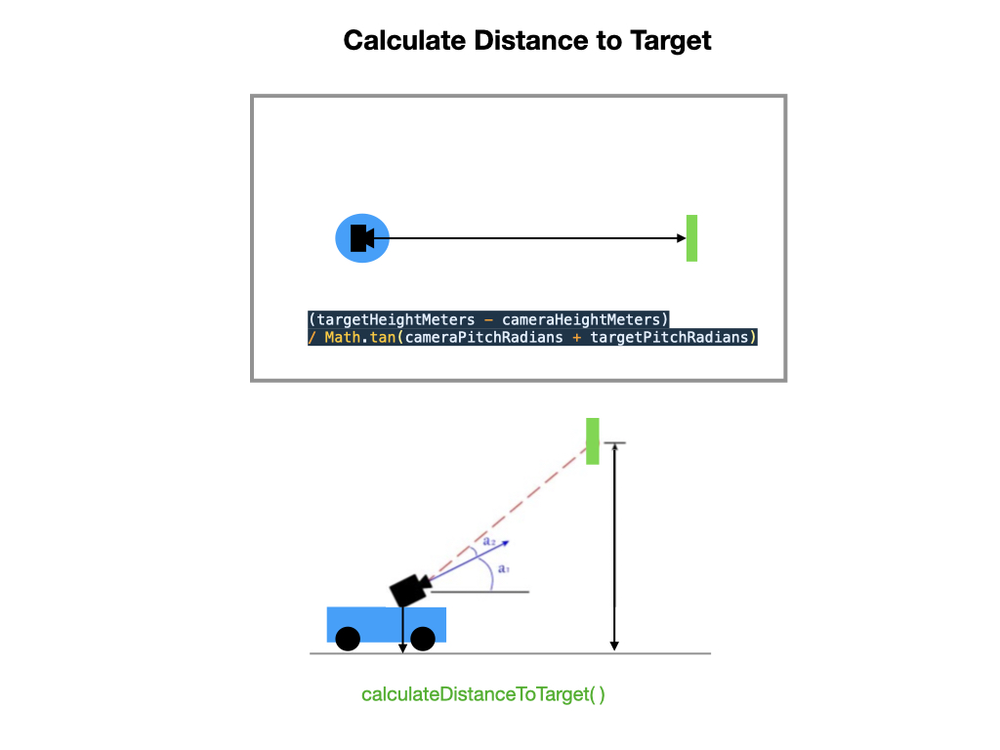
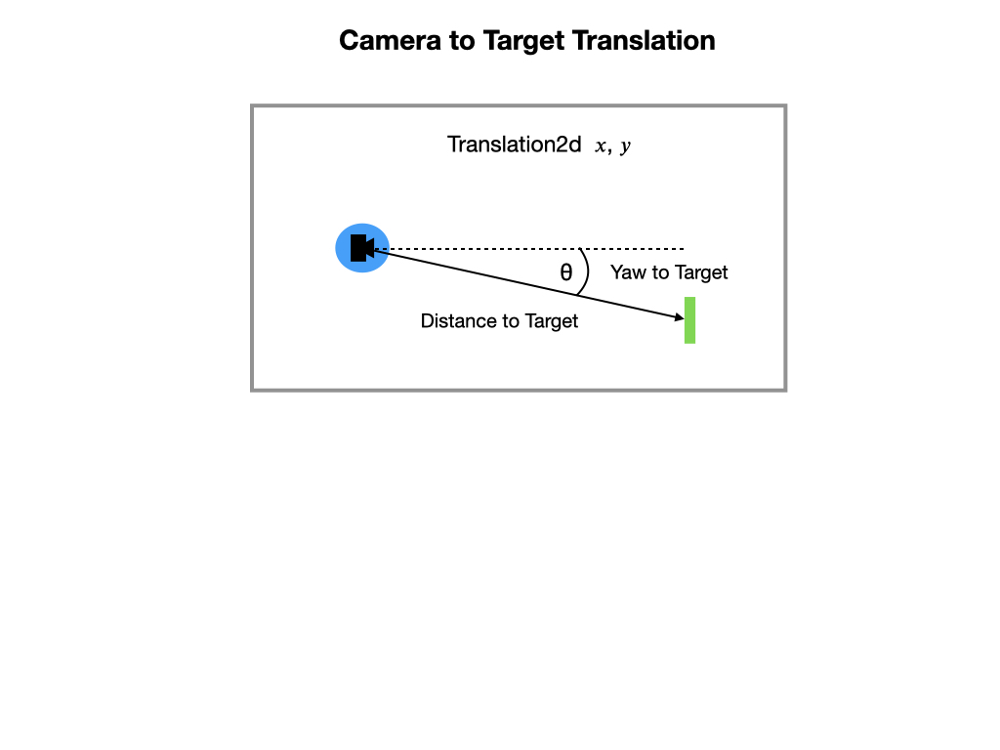
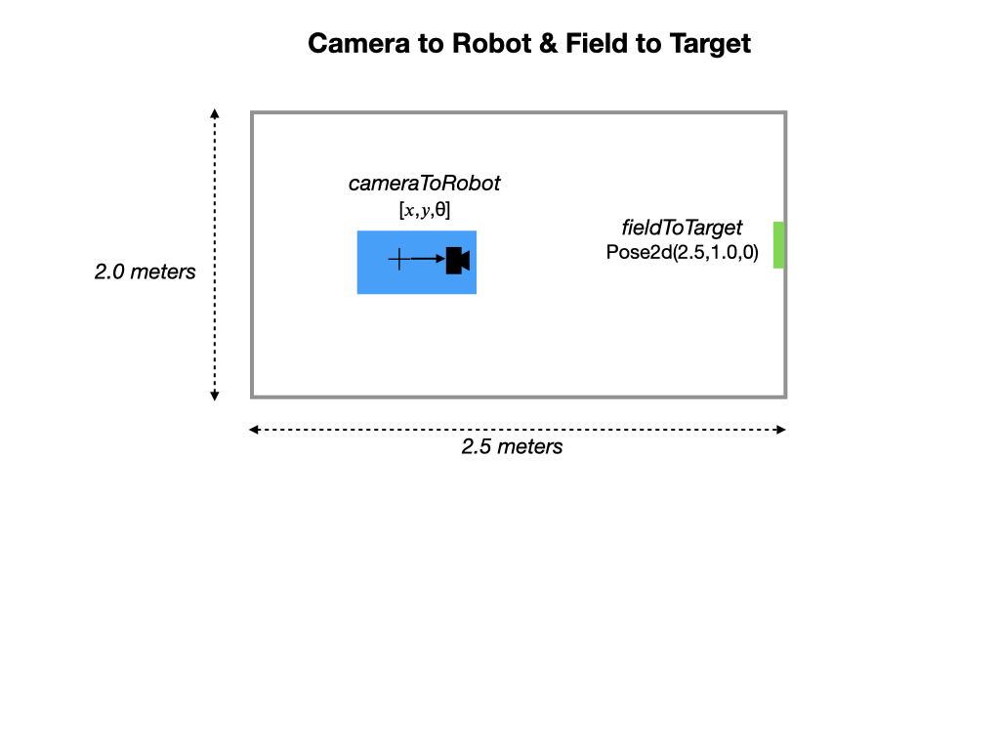
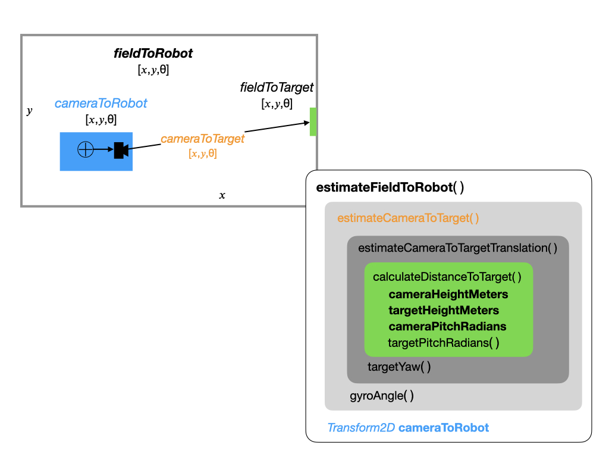

# Using PhotoVision with Romi
PhotonVision will be replacing GRIP going forward.  It has many advantages over GRIP and makes it much more streamlined to do vision processing on the Romi.  Refer to the [PhotonVision](https://docs.photonvision.org/en/latest/docs/getting-started/index.html) documentation for full details.

## Installation on the Romi
First refer to [Installing PhotonVision on the Romi](https://github.com/PhotonVision/photonvision-docs/blob/ec29ff49e4a03f8d06e00818885efa774126c24c/source/docs/getting-started/installation/romi.rst). Also refer to [Debian-based install](https://docs.photonvision.org/en/latest/docs/getting-started/installation/coprocessor-image.html#other-debian-based-co-processor-installation) for the command line steps. To update an existing install read [Advanced Command Line Usage](https://docs.photonvision.org/en/latest/docs/getting-started/installation/advanced-cmd.html).

Most of the documentation is there but a few things to emphasize are:

- If Romi is setup as an access point you must plug in an ethernet cable before running the install.
- Set the Romi to **Writable** mode before installing.
- After editing the CameraServer `runCamera` script remember to put it back into **Read-Only** mode before rebooting.
- The install on the Romi sets up the `photonvision.service` file in `/lib/systemd/system` to start PhotonVision on reboot.  You can also start it manually: `systemctl stop/start photonvision.service`
- Make sure that you follow the [Update Steps](https://docs.photonvision.org/en/latest/docs/getting-started/installation/advanced-cmd.html) if you already have PhotonVision installed. Otherwise, you end up with a bad `photonvision.service` file and PhotonVision won't start.

## Creating a Pipeline
A pipeline is created using the Web interface at `http://10.0.0.2:5800/`.  Here are a few notes on using the interface:

- Team number can be set to 2928 and it still communicates with the Simulator even though we're using 10.0.0.2.
- The Raspberry Pi must be in **Writable** mode to create a new pipeline.  I believe it can go back into **Read-Only** mode after the pipeline is created and you are executing your java program.
- While creating the pipeline you must adjust the filtering controls until you've aquired one or more targets, otherwise you won't get anything in the Network Tables.
- *Pipeline Type* must be **Reflective** mode otherwise there's no data.
Try setting output mode to right (camera is offset)
- If the stream is blank then try doing a browser reload.

Documentation for [Creating a Pipeline](https://docs.photonvision.org/en/latest/docs/getting-started/pipeline-tuning/index.html)

## PhotonLib Programming
In this section we're going to attempt to determine the position of the robot on the game field based only on what is viewed from its camera.  I say attempt because this will involve some estimation, so our results may not be acceptable without a lot tuning. The plan is to use visual targets on the field to estimate the position of the robot. There are a several pieces that must come together to make this work so this section may be a little complex.

In order to pull this off we need to get data on the following things:
- The distance of the target from the camera.
- The position and orientation (Pose) of the target on the game field
- The Pose of the camera relative to the robot.
- The translation of the camera from the target.
- The transform of the camera to the target using the robot's gyro.

Before we start here're some housekeeping notes: 
- It's important to know that *PhotonCamera* constructor is expecting the name of the camera as listed on the UI.  

    PhotonCamera m_camera = new PhotonCamera("mmal_service_16.1");

- Here's the documentation for [PhotonLib](https://docs.photonvision.org/en/latest/docs/programming/index.html)

### Distance from Camera to Target
The return value from `calculateDistanceToTargetMeters()` is shown below.  There must be a height differential between goal and camera. The larger this differential, the more accurate the distance estimate will be.

    public static double calculateDistanceToTargetMeters(
            double cameraHeightMeters,
            double targetHeightMeters,
            double cameraPitchRadians,
            double targetPitchRadians) {
        return (targetHeightMeters - cameraHeightMeters)
                / Math.tan(cameraPitchRadians + targetPitchRadians);
    }

See [estimating distance](https://docs.limelightvision.io/en/latest/cs_estimating_distance.html) from the Limelight documentation for details on how this distance is derived.

### Camera to Target Translation

### Camera to Robot and Field to Target

### The Pose2d of the Robot on the Field

## References

- PhotonVision - [Install on the Romi](https://github.com/PhotonVision/photonvision-docs/blob/ec29ff49e4a03f8d06e00818885efa774126c24c/source/docs/getting-started/installation/romi.rst)

- PhotonVision - [Documentation](https://docs.photonvision.org/en/latest/)

- Limelight - [Documentation](https://docs.limelightvision.io/en/latest/index.html)
