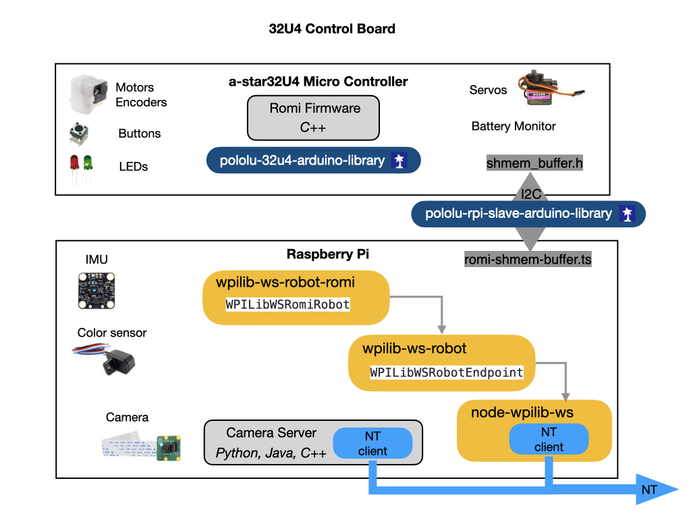

# Romi Software
The following diagram and describes how the software is structured on the Romi.  The Romi uses a Raspberry Pi and an Arduino based 32U4 microcontroller.  The Raspberry Pi and Romi 32U4 boards are connected via the 40-pin connector, and communicate over I2C. The Romi firmware uses the [Pololu Raspberry Pi interface library for Arduino](https://github.com/pololu/pololu-rpi-slave-arduino-library) to facilitate board-to-board communication. Communication takes place over a [shared memory buffer](https://github.com/wpilibsuite/wpilib-ws-robot-romi/blob/main/sharedmem.json) which both boards use to read and write to. 

The package [wpilib-ws-robot-romi](https://github.com/wpilibsuite/wpilib-ws-robot-romi) contains the main entry point for the application, which is [src/index.ts](https://github.com/wpilibsuite/wpilib-ws-robot-romi/blob/main/src/index.ts). The file is fairly small and serves as a binding layer for the *WPILibWSRomiRobot* class (which is defined in [src/robot/romi-robot.ts](https://github.com/wpilibsuite/wpilib-ws-robot-romi/blob/main/src/robot/romi-robot.ts)) and the *WPILibWSRobotEndpoint* class (which is defined in the [wpilib-ws-robot](https://github.com/wpilibsuite/wpilib-ws-robot-romi/blob/main/src/robot/romi-robot.ts) NPM package).

The [wpilib-ws-robot](https://github.com/wpilibsuite/wpilib-ws-robot) package provides a wrapper around the guts of the WPILib WebSocket protocol, and allows developers to easily interface with other kinds of robots, simply by extending from the *WPILibWSRobotBase* class (also exposed by wpilib-ws-robot).

In the [romi-robot.ts](https://github.com/wpilibsuite/wpilib-ws-robot-romi/blob/main/src/robot/romi-robot.ts) file, you can see how the defined class interacts with the Romi firmware over I2C.

The [wpilib-ws-robot-romi](https://github.com/wpilibsuite/wpilib-ws-robot-romi) package depends on [wpilib-ws-robot](https://github.com/wpilibsuite/wpilib-ws-robot), which in turn depends on [node-wpilib-ws](https://github.com/wpilibsuite/node-wpilib-ws). The `node-wpilib-ws` package contains the core classes that implement the WPILib WebSocket protocol.

## Software Install
The Romi Robots that you'll be using for training will already have a software image installed on an SD card.  If you purchase a new Romi or the SD card gets corrupted then refer to [Imaging your Romi](https://docs.wpilib.org/en/stable/docs/romi-robot/imaging-romi.html) to create a new image.

You will have to upgrade the software as new releases come available.  This can be done via the [The Romi Web UI](https://docs.wpilib.org/en/stable/docs/romi-robot/web-ui.html#romi-status).  You first have to download the latest release from the [Romi Web Service Release](https://github.com/wpilibsuite/wpilib-ws-robot-romi/releases) page.  Download the `romi-service-x.x.x.tgz` file to your PC.  Then connect to the Romi and click on the **Romi** tab and scroll down to the **Web Service Update** section.  Put the Romi in *Writable* mode, choose the file, and click *Save*.  

Note: When downloading the file from the releases page the extension may get renamed to `.tar`.  You will need to rename it back to `.tgz` in order to choose the file in the Web UI.

## External IO Configuration

### Data Communications
Only send the heartbeat if we have an active WS connection, the robot is in enabled state AND we have a recent-ish DS packet

For PWM, we get the value in the range 0-255 but the romi expects -400 to 400. Positive values here correspond to forward motion.

# Romi Micro Controller Firmware
The micro controller firmware is run on an 32U4 development board, which is an embedded Arduino based microcontroller with built-in WiFi.  For the development environment (IDE) we'll be using VSCode.  This is the IDE most commonly used by <i>First Robotics</i> teams.  In order to install code onto the 32U4 microcontoller you have to install the PlatformIO plugin for VSCode. Information about the PlatformIO plugin can be found here:

[Getting Started with PlatformIO](https://dronebotworkshop.com/platformio/)

[How To Install PlatformIO ](https://www.youtube.com/watch?v=5edPOlQQKmo)

Once PlatformIO has been installed you can use the following steps to download the firmware and flash it to the 32U4 development board:

1. Connect a USB cable between your laptop and the Romi.

2. Open a Terminal.

3. Download the [Romi Firmware](https://github.com/wpilibsuite/wpilib-ws-robot-romi) using the following command:

    `git clone https://github.com/wpilibsuite/wpilib-ws-robot-romi.git`

4. Change into the `wpilib-ws-robot-romi` folder and drag the `Firmware` folder into VSCode.  

5. Compile the software by clicking the compile (checkmark) icon in the bottom taskbar.

6. Flash the software to the Romi using the upload (right arrow) icon in the bottom taskbar.

7. While connected to the Romi via the USB cable you can see any `Serial.print` statements by opening the serial port monitor (plug icon).

If button A or B is pressed during powerup then the 32U4 enters test mode.

## References 
- [Romi Raspberry Pi](https://github.com/wpilibsuite/WPILibPi) - Github

- [Romi WPILib Suite](https://github.com/wpilibsuite/wpilib-ws-robot-romi) - Github

- [RaspberryPi/Arduino Interface](https://github.com/pololu/pololu-rpi-slave-arduino-library) - Github

- [Romi Firmware](https://github.com/pololu/romi-32u4-arduino-library) - GitHub
- [Romi Firmware README](https://github.com/wpilibsuite/wpilib-ws-robot-romi/blob/main/firmware/README.md) - GitHub
