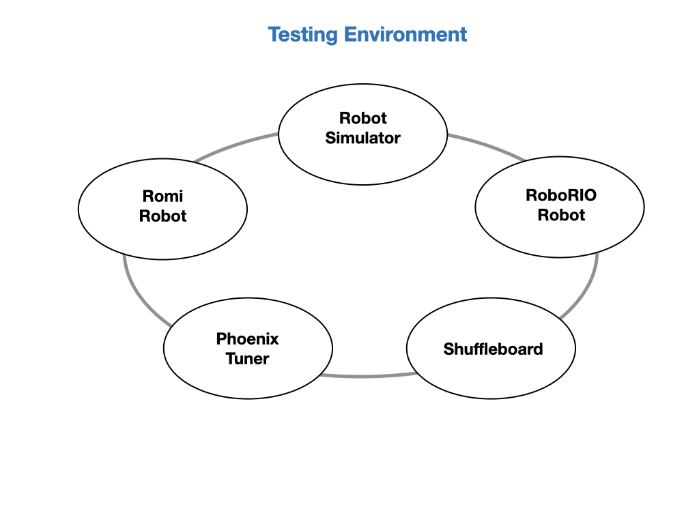

# Introduction

Once you have written some code and you are ready to test there are several platforms and software tools on which to test.  

- **Robot Simulator**    
The Robot Simulator allows you to test your code without a physical robot. Simulators are used extensively in the robotics industry to work out issues before deploying code that could severely damage expensive robots.  They are also useful for detecting code bugs, since an issue such as a divide-by-zero that will crash the code on a robot will also crash the code in the simulator. Detailed information about the [Robot Simulator](https://docs.wpilib.org/en/stable/docs/software/wpilib-tools/robot-simulation/introduction.html) can be found in the FRC documentation.

- **Romi Robot**   
The [Romi Robot Kit for FIRST](https://www.pololu.com/product/4022) is a robot platform that can be used by FRC teams preparing for competitions. You can run most of the software code that you would run on the competition robot, which allows you to try out new ideas and practice your programming skills without causing too much damage. 
    
- **RoboRIO Robot**  
Once you have your code working in the simulator and Romi robot you can start *porting* it to the RoboRIO competition robot.  In software the word *Porting* generally means to adapt code to a different hardware platform.  Code used on the Romi would need to have some changes since the motors and other hardware will require different libraries.  However the structure of your code will remain the same it's just the way that your code interacts with the hardware is different.

- **Shuffleboard**  
When you are running code on a robot it's very useful to view how data is passing through the system as it operates.  This is referred to as *Telemetry*.  Telemetry is the science of using automatic equipment to make measurements and transmit them to a receiving station.  Telemetry is critical to fine tuning a system and figuring out what went wrong in the event of a crash.  The main FRC tool for visualizing telemetry is [Shuffleboard](https://docs.wpilib.org/en/stable/docs/software/dashboards/shuffleboard/index.html).

- **Phoenix Tuner**   

- [Romi Testing Environment](../Romi/SC/romiDev.md)
- [Romi RaspberryPi Software](romiPiSoftware.md)
- [Romi Micro Controller Firmware](romiFirmware.md)
- [Install RoboRIO & Radio Software](rioSoftware.md)
- [Install Third-Party Libraries](vendorSoftware.md)
- [Install Vision Software](visionSoftware.md)