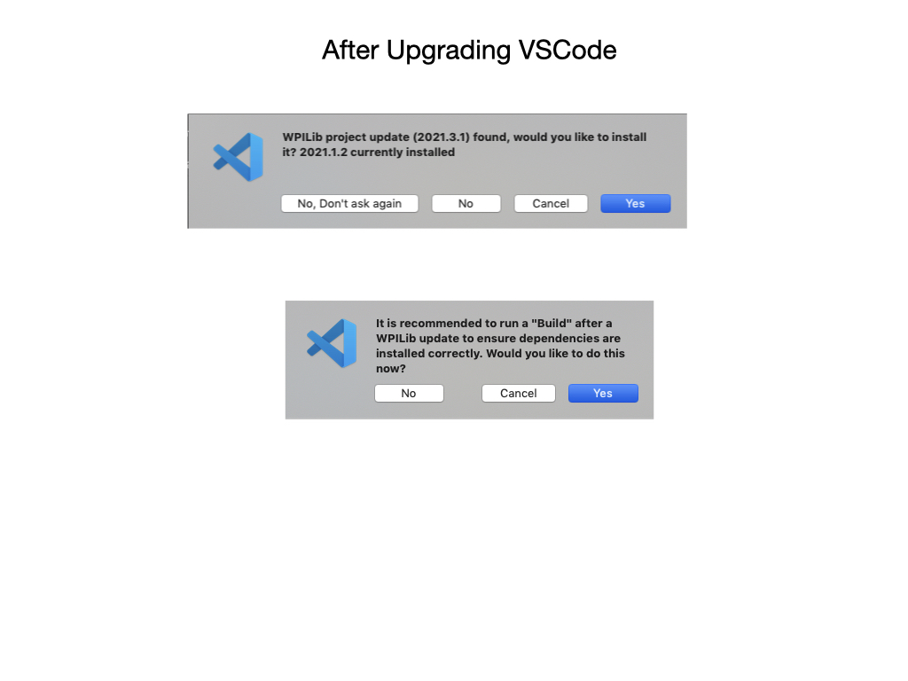

# VSCode and WPILib Install

An Integrated Development Environment (IDE) is a piece of software that is used to make writing code easier. Some of the main things IDEs will help with include: 

- Check the syntax of your code to ensure you don’t have any errors.
- Organize your files and give you a convenient way to view them.
- Allow you to navigate through your code easily.
- Applies colour schemes to your code so it’s easier to interpret.
- Some will have code completion, which will actually fill in some code for you. 

Visual Studio Code is the supported IDE for programming an FRC robot. If you don't have VSCode installed on your computer the best way of doing this is to follow the instructions on the [FRC Documentation Website](https://docs.wpilib.org/en/latest/docs/zero-to-robot/step-2/wpilib-setup.html). These instructions will also install the WPI Library which is used for programming the FRC robot. Additional information is also found at [FRC Documentation VSCode Overview](https://docs.wpilib.org/en/latest/docs/software/vscode-overview/index.html). The link to download the latest software is somewhat hidden, you can find it under [Prerequisites](https://docs.wpilib.org/en/latest/docs/zero-to-robot/step-2/wpilib-setup.html#prerequisites) and click on the Github link.  Scroll all the way down to the bottom of the Github release page to find the downloads.

## Upgrading Software
A new version of the WPILib is released each year on the same day that the new competition is announced. It's important that everyone has the latest software.  Upgrading to the new version is essentially the same as doing a new install.  Here's a direct link to the latest  [Release down load page](https://github.com/wpilibsuite/allwpilib/releases/tag/v2022.1.1).  Follow the instructions for [Running the Installer](https://docs.wpilib.org/en/latest/docs/zero-to-robot/step-2/wpilib-setup.html#running-the-installer).

After upgrading VSCode will import each project to the latest version.  Answer *Yes* to each prompt.

As soon as you open the upgraded project VSCode will start to run a compile.  This will often produce build errors that you need to resolve. You will probably have to import 3rd party software like *Pheonix* and *REVLib*.  Instructions on installing and configuring these libraries is detailed in the next section. Also see [Importing a Gradle Project](https://docs.wpilib.org/en/stable/docs/software/vscode-overview/importing-gradle-project.html) for more details on importing projects from previous season.

<!-- #### Upgrading VSCode
It's important that everyone has the latest software otherwise you won't be able to work on other team mates code.  After upgrading VSCode will import each project to the latest version.  Answer *Yes* to each prompt.

 -->
