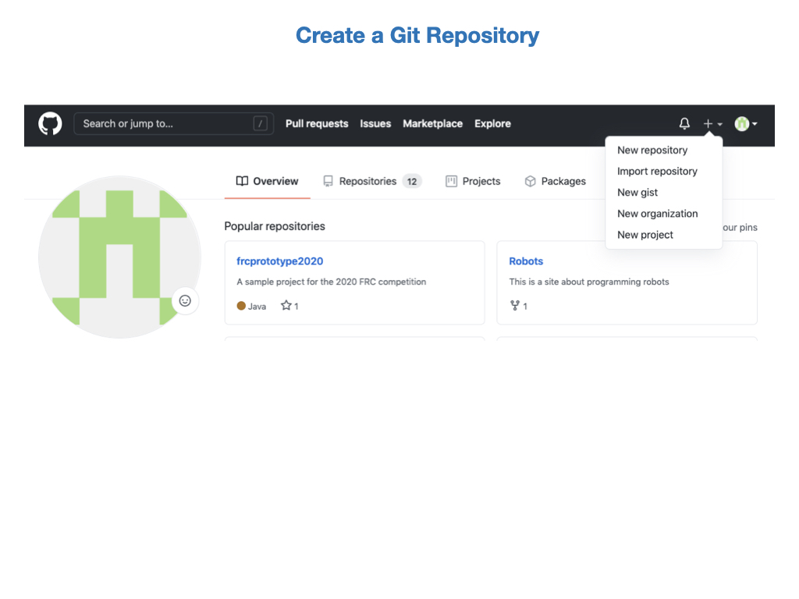
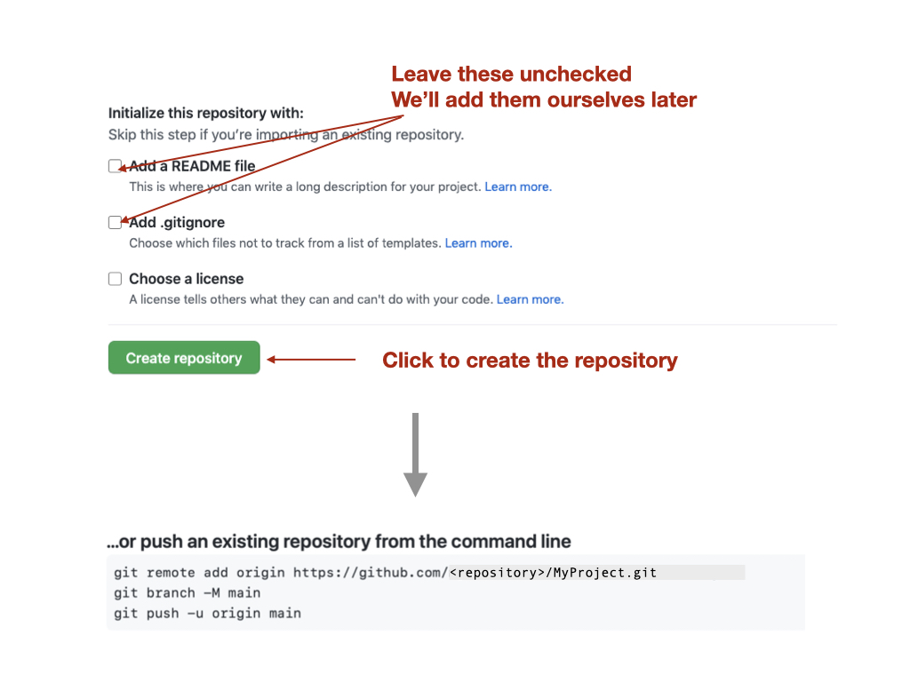
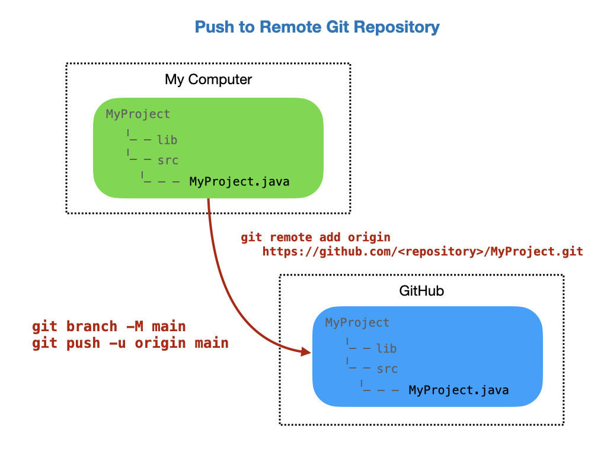
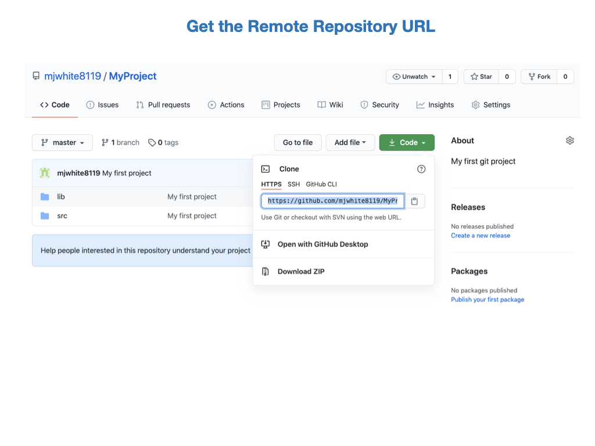

# The Git Repository and GitHub
Git is a <i>Version Control System (VCS)</i> for keeping track of changes in files.  

- You can take snapshots, or versions, of your files at any time by creating a commit.

- File changes can be reverted back to previous versions.

- It's a distributed system meaning that that the repository exists on multiple computers. You can therefore have both local and remote versions of your files.  

- Other users can clone the repository, which gives them a local version of it that they can work on independently.  Therefore, you can have an entire development team working on the same project.

If you are on Windows you may need to download git bash from the following URL:

[Git for Windows](https://gitforwindows.org)

The following sections will step through the process of creating an repository, committing code and pushing it to a remote repository on GitHub.  We'll look at how to do this at the command line and within VSCode.

## Initializing the Repository
To start a new project at the command line:

`$ mkdir MyProject`

`$ cd MyProject`

`$ mkdir lib src`

`$ cd src`

Create your first project file using a command line editor and enter the following lines:

`$ vi MyProject.java`

      class MyProject {
        public static void main(String[] args) { 
          System.out.println("Hello from MyProject");
        }
      }

We now want to initialize it for use with git:

`$ git init`

You should see the following response:

      Initialized empty Git repository in /Users/martinwhite/Documents/FRCProjects/MyProject/.git/

You will see a new directory under the project folder.

You can also initialize a repository in VSCode.  This is usually done after you have created a new project as detailed in [Creating a New WPILib Project](https://docs.wpilib.org/en/stable/docs/software/vscode-overview/creating-robot-program.html#creating-a-new-wpilib-project). Click on **Initialize Repository** then *Stage* and *Commit* your changes. You now have a local repostitory on your PC.  See a more detailed overview of **Staging and Committing** below.

## Configuring Username and Email
Before continuing with Git you’ll want to do a few things to customize your Git environment. You should only have to do these things only once on any given computer. You can also change them at any time by running through the commands again.

Git comes with a tool called `git config` that lets you get and set configuration variables that control all aspects of how Git looks and operates. 

The first thing you should do when you install Git is to set your user name and email address. This is important because every Git commit uses this information, and it’s immutably baked into the commits you start creating:

`$ git config --global user.name 'John Doe'` 

`$ git config --global user.email johndoe@example.com`

To view your configuration you can use:

`git config --list`

These configuration variables are stored in the `.gitconfig` file that can be found in your HOME directory.

If you don’t want to expose your GitHub email address in the commit logs you can hide your email address. In GitHub go to **Settings – Email – Keep my email address private**.

<!--  -->

You’ll notice a new email address `<nnn>-username@users.noreply.github.com` for you to use for your Git commits.

Next, you’ll need to update Git to use this new noreply email instead of your real one. From the command line, type:

      git config –global user.email “<nnn>-username@users.noreply.github.com”

This will change your email address globally across all repositories.

To verify, type

      git config --global user.email

<!-- > Note: If you still get the message "Failed to authenticate to get remote" in VSCode you can try the following: Go to *Settings -> Authentification -> Git: Terminal Authentification* and uncheck it.       -->

## Staging and Committing
Now that we have initialized and configured the repository we can now stage and commit our files.  We're going to move our files to a staging area in preparation for a commit to the repository.

First, let's get a status from Git by typing the following command and reviewing the output:

`$ git status`

      On branch master

      No commits yet

      Untracked files:
        (use "git add <file>..." to include in what will be committed)

        src/

      nothing added to commit but untracked files present (use "git add" to track)

The output is telling us that we are on the main branch, we'll look at branches later, and that there have been no commits. It also lists the untracked files.  These are files that have not yet been added to Gits' staging area. Let's do that now:

`$ git add .`

      On branch master

      No commits yet

      Changes to be committed:
        (use "git rm --cached <file>..." to unstage)

        new file:   src/MyProject.java

Our files are now in the staging area and are ready to be committed to the repository:

`$ git commit -m "Initial commit"`

        [master (root-commit) 8877fba] Initial commit
        1 file changed, 5 insertions(+)
        create mode 100644 src/MyProject.java

The output tells us that this is the initial commit to the repository and lists the files that have been committed.  The value `8877fba` is the last few characters of a unique commit tag.

We can always see what status the Git repository is in by typing:

`$ git status`

      On branch master
      nothing to commit, working tree clean

We now have no new files to commit. It's telling us that our working directory is clean.   

The previous process can be done in VSCode by carrying out the steps in the following diagram.

## Pushing to the Remote Repository
Before we can push code to our GitHub account we need to login and create a repository.  Click on the + (plus) icon at the top of the your Github home page and select "Create a Repository".

Enter the repository name and a description.  Select a Public repository.

Leave the add README and .gitignore unchecked.  We'll add these later.  Click on "Create repository".

We now have to connect our local Git repository with the remote GitHub repository.  After the repository is created is displays the commands required to set your local repository to the remote.  Copy and paste these commands one at a time into a terminal on your laptop and execute them.  The `<repository>` part of the remote origin URL should be your Github account name.

Note: You may have to go to settings in VSCode and type `git enable` in the search bar.  Make sure that *git enable* is checked.

`$ git remote add origin https://github.com/FRC-2928/MyProject.git`

You can confirm the remote repository location by typing:

`git remote -v`

And now we can push our code to the remote GitHub repository:

`$ git push -u origin main`

      Enumerating objects: 4, done.
      Counting objects: 100% (4/4), done.
      Delta compression using up to 8 threads
      Compressing objects: 100% (2/2), done.
      Writing objects: 100% (4/4), 383 bytes | 383.00 KiB/s, done.
      Total 4 (delta 0), reused 0 (delta 0)
      To https://github.com/FRC-2928/MyProject.git
      * [new branch]      master -> master
      Branch 'master' set up to track remote branch 'master' from 'origin'.

You can setup VSCode to push to a remote repository using the following steps.  Click on options and select **Add Remote**.  Get the URL from your GitHub repository and paste it in, then press enter.  You'll be asked to name the remote, call it `origin`. You can then click on **Publish Branch** to update the remote repository.

## Cloning a Repository
The primary reason for creating repositories is so that other people can view and edit your code.  The way we do that is to `clone` the repository.  You first need to get the URL of the repository that you want to clone. 

Then in VSCode, select *File->New Window* and click on the Github icon.  Click Clone Repository and enter the repository URL that you just copied.  You'll be asked to select a local folder in which to save the cloned repository.  The repository will download from Github and you can now open it.

Conceptually, this looks like the following:    

### Cloning from the Command Line
You can do this from the command line if you prefer. Create a local directory in which to store the repository and change into that directory:

`$ mkdir MyClonedProject`

`$ cd MyClonedProject/`

Then clone the repository:

`$ git clone https://github.com/FRC-2928/MyProject.git`

      Cloning into 'MyProject'...
      remote: Enumerating objects: 6, done.
      remote: Counting objects: 100% (6/6), done.
      remote: Compressing objects: 100% (3/3), done.
      remote: Total 6 (delta 0), reused 6 (delta 0), pack-reused 0
      Unpacking objects: 100% (6/6), done.

The output will tell you how many file objects have been downloaded.  

<!-- ## Project Version Control Strategy

 -->

## Branching
When you want to add new features to the code base it's a good idea to create a new branch.  A new branch can be created from VSCode as shown in the following graphic. Once the branch is created you'll be switched over to that branch automatically and you can start making changes.  You can give the branch any name you want, but it should be somewhat descriptive of the new feature.

You'll be prompted to publish the branch to GitHub.  You can do this immediatelly or after you have made some changes.
<!-- To delete a remote branch use `git branch -d <branch name>` -->

## Forking a Repository
A fork is a new repository that shares code and visibility settings with the original “upstream” repository. The term "upstream" just means the original Github repository.  In most cases you may not have write access to the original repository, so this is useful if you want to update the code and try out ideas without effecting the original repository.  To fork a repository navigate to the Github repository that you want to fork and click the **Fork** button.  On the next screen, select your own Github account as the destination of the fork.  You can keep the same repository name or use a different name.  Click "Create Fork" to copy the repository.  You should now have a copy of the repository in your own account.

## Changing the Remote Repository Origin
In some cases you might want to change to remote origin of a repository.  To do this follow these steps:

1. From VSCode open a New Terminal and execute the following command.  Where `<repository>` is you own repository account name, and `<MyProject>` is the name of your local project.

        git remote set-url origin https://github.com/<repository>/<MyProject>.git

    
2. Type in `git remote -v` to check that the remote repository has changed to your account.       

3. Push the code to new Github repository origin by executing the following command in the terminal:

        git push -u origin main

4. Check your Github repository to ensure that the new code has been pushed.
<!-- ## Merging

## The README.md File

## The `.gitignore` File -->

## Pull Requests
Pull requests let you tell others about changes you've pushed to a branch in a repository on GitHub. Once a pull request is opened, you can discuss and review the potential changes with collaborators and add follow-up commits before your changes are merged into the base branch.  

In order to add new features to the code base you need to create a new branch. For our team the branch name will be `feature-<new-feature>`, where `new-feature` is somewhat descriptive of what needs to be added. You can now add your new feature and possibly test it out on the robot.  Since your branch was created from the `main` branch you should have the basic functionality to test is on a robot. 

Once you have created the branch and added your new feature you can merge it back into the `main` branch by creating a *Pull Request*. See [Creating a pull request](https://docs.github.com/en/pull-requests/collaborating-with-pull-requests/proposing-changes-to-your-work-with-pull-requests/creating-a-pull-request) in the GitHub documentation.

The Pull Request will be reviewed by the lead developer, and if everything looks good it will be merged into the `main` branch of the code.  See [Merging a pull request](https://docs.github.com/en/pull-requests/collaborating-with-pull-requests/incorporating-changes-from-a-pull-request/merging-a-pull-request) in the GitHub documentation. The Pull Request process is shown below.

You can link a pull request to an issue.

When thinking about branches, remember that the base branch is where changes should be applied, the head branch contains what you would like to be applied.

<!-- Project maintainers can add a pull request template for a repository. Templates include prompts for information in the body of a pull request. For more information, see "About issue and pull request templates." -->

## Lab - Git Repository and GitHub

- Clone a repository.

- Create a feature branch and commit some changes.

- Create a pull request.

- Merge the pull request.

### Create a Branch
In this task you'll create a new branch from the `Main` branch in order to add new features.  This is 

### Create a Pull Request

See [Creating a pull request](https://docs.github.com/en/pull-requests/collaborating-with-pull-requests/proposing-changes-to-your-work-with-pull-requests/creating-a-pull-request)

### Merging a pull request

See [Merging a pull request](https://docs.github.com/en/pull-requests/collaborating-with-pull-requests/incorporating-changes-from-a-pull-request/merging-a-pull-request)

## References 

- FRC Documentation - [Git Version Control](https://docs.wpilib.org/en/latest/docs/software/basic-programming/git-getting-started.html)

- GitHub [Creating a pull request](https://docs.github.com/en/pull-requests/collaborating-with-pull-requests/proposing-changes-to-your-work-with-pull-requests/creating-a-pull-request)

- YouTube video - [VSCode and Github](https://www.youtube.com/watch?v=Fk12ELJ9Bww)