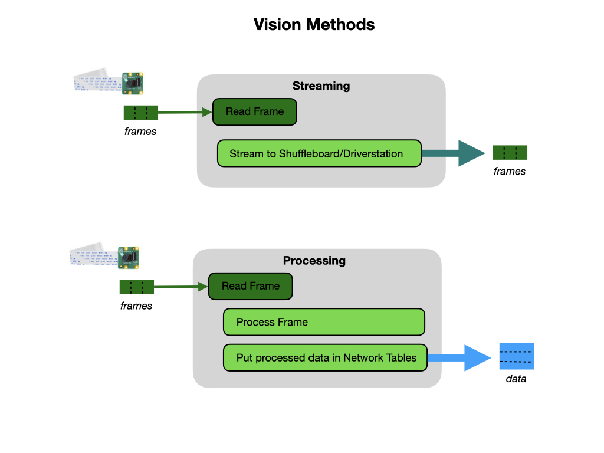

# Introduction to Robot Vision
There are various [Strategies for Vision Programming](https://docs.wpilib.org/en/stable/docs/software/vision-processing/introduction/strategies-for-vision-programming.html) that we can use.  The strategy that we'll make use of is the Raspberry Pi as a co-processor which uses the [WPILibPi](https://docs.wpilib.org/en/stable/docs/software/vision-processing/wpilibpi/index.html) library for vision processing.

We will use the camera for two purposes:

- **Streaming** - This method involves streaming the camera to the Driver Station so that the driver and manipulator can get visual information from the robot’s point of view.

- **Processing** - Instead of only streaming the camera to the Driver Station, this method involves using the frames captured by the camera to compute information, such as a game piece’s or target’s angle and distance from the camera. 

On the FRC game field they will use [Retroflective](https://docs.wpilib.org/en/stable/docs/software/vision-processing/introduction/target-info-and-retroreflection.html) tape to identify targets. We'll use [Image Processing](imageProcessing.md) to determine the location and distance of the target and act accordingly.  Image processing can be done using either [Limelight](https://docs.limelightvision.io/en/latest/index.html) or [PhotonVision](https://docs.photonvision.org).  PhotonVision is open-source and can be used with the RaspberryPi camera on the Romi, or with the Limelight.  The Limelight image processing software can only be used on the Limelight.

## Using PhotonVision
[PhotonVision](https://docs.photonvision.org) can be [Installed on the LimeLight](https://docs.photonvision.org/en/latest/docs/getting-started/installation/limelight.html) for use with the competition robot and can also be [Installed on the Romi](https://github.com/PhotonVision/photonvision-docs/blob/ec29ff49e4a03f8d06e00818885efa774126c24c/source/docs/getting-started/installation/romi.rst) for training purposes.  

## Using the Limelight
Refer to the Limelight [Documentation](https://docs.limelightvision.io/en/latest/index.html), which is very comprehensive.  Our interface can be reached at `http://10.TE.AM.33:5801/` after connecting to the robot's access point.  Where `TE.AM` is replaced with the team number, e.g. `29.28`.

- [Install Vision Software](../SoftwareInstall/visionSoftware.md)

## References
- FRC Documentation - [Introduction to Vision](https://docs.wpilib.org/en/stable/docs/software/vision-processing/introduction/what-is-vision.html)

- FRC Documentation - [Strategies for Vision Programming](https://docs.wpilib.org/en/stable/docs/software/vision-processing/introduction/strategies-for-vision-programming.html)

- QUT Robot Academy [Robot Vision](https://robotacademy.net.au/masterclass/robotic-vision/)

- Peter Corke Lecture - [Introduction to Robot Vision](https://www.youtube.com/watch?v=N_a6IP6KUSE&list=PL1pxneANaikCO1-Z0XTaljLR3SE8tgRXY)

- PhotonVision - [Documentation](https://docs.photonvision.org/en/latest/)

- Limelight - [Documentation](https://docs.limelightvision.io/en/latest/index.html)

- Simon Prince - [Computer Vision](http://www.computervisionmodels.com)
