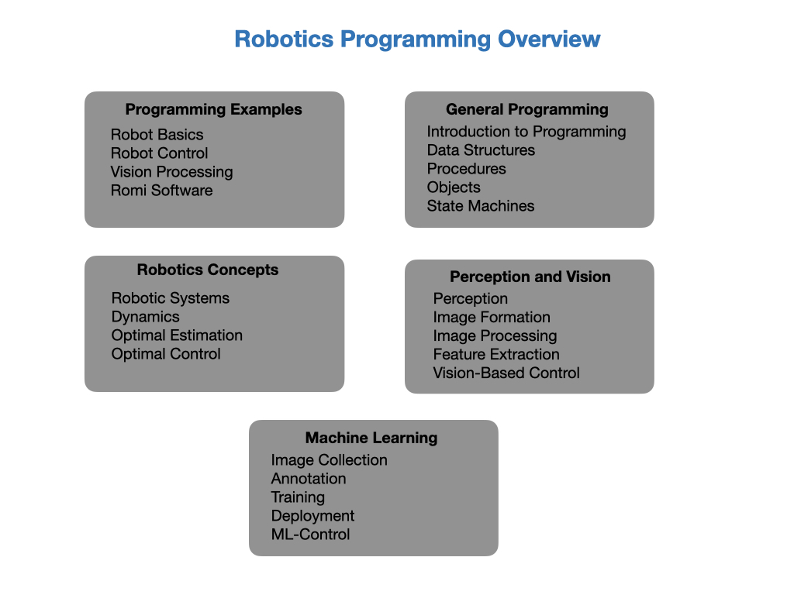

# Team 2928 FRC Training
This site hosts training resources for programming teams involved in the First Robotics Competition (FRC). The aim is to give student a good grounding in both robotics and programming.    The purpose of the training is to take you step-by-step through the process of becoming an FRC programmer.  This will prepare you to write code for the competition robot that your mechanical and electrical engineering teams will build. In order not to duplicate information that already exists there are plenty of references to the [FIRST Robotic Competition](https://docs.wpilib.org/en/latest/index.html) documentation.

The subjects that will be covered in this course will include:

The main learning path is the **Romi Training Robot**.  From there we'll link to other parts of the training resources.

## References
- [FIRST Robotic Competition Website](https://docs.wpilib.org/en/latest/index.html)

- [Controls Engineering in the
FIRST Robotics Competition](https://file.tavsys.net/control/controls-engineering-in-frc.pdf) - Tyler Veness 

- [Robotics, Vision and Control](https://petercorke.com/rvc/home/) - Peter Corke

- [Mobile Robotics](https://www.cambridge.org/core/books/mobile-robotics/5BF238489F9BC337C0736432C87B3091) Alonzo Kelly

- [W3Schools](https://www.w3schools.com/java/default.asp) - Java Tutorial 

- [Romi Example Code](https://github.com/FRC-2928/RomiExamples.git) Github 